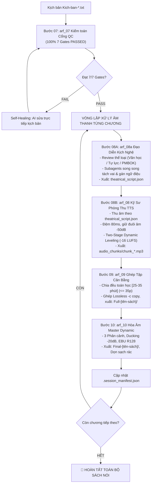

# 🎧 WORKFLOW: SẢN XUẤT ÂM THANH SÁCH NÓI & HÒA ÂM MASTER (BƯỚC 07 - 10)
## Universal Audio Production, Theatrical Voice Casting & Dynamic BGM Mastering Playbook (Steps 07 to 10)

## 1. Đặc Tả Quy Trình Thao Tác Chuẩn (Specification - SOP)

Quy trình `Make-audio-bgm-process` điều phối khép kín 4 công đoạn kỹ thuật âm thanh từ kịch bản sạch đến bản Master thương mại. Nguyên tắc cốt lõi: Phân định dứt điểm giữa Đạo diễn nghệ thuật (08A) và Kỹ sư phòng thu (08B), khóa cứng thời lượng [25 – 35 phút] (09) và hòa âm đa phân cảnh (10).

### 1.1 Năm Cột Mốc Nghiệm Thu Chuyển Giao (Sequential Phased Handshake)
| Bước | Mã Module Thực Thi | Trọng Tâm Nghiệp Vụ | Điểm Chốt Nghiệm Thu (Checkpoint) |
| :---: | :--- | :--- | :--- |
| **07** | `arf_07_audiobook_qc_auditor` | Kiểm toán 7 Quality Gates, kích hoạt Self-Healing nếu lỗi. | `QC_Report.md` (100% 7/7 Gates PASSED) |
| **08A** | `arf_08a_theatrical_voice_director` | Thẩm định thể loại, bóc tách vai, tuổi tác 5 giai đoạn, 10 khí chất, 12 cảm xúc. | `theatrical_script.json` & `.theatrical_bible.json` |
| **08B** | `arf_08_tts_neural_bgm_mixer` | Thu âm song thanh NamMinh x Brian, đệm 80ms, Two-Stage Leveling (-16 LUFS). | `audio_chunks/*.mp3` & `.chunks_duration.json` |
| **09** | `arf_09_audio_smart_aggregator` | Chia đều toán học các Part [25 - 35 phút] ($\le 35$p), ghép Lossless stream. | `Full-[tên-sách]/Full_*.mp3` (không nhạc) |
| **10** | `arf_10_bgm_dynamic_mixer` | Đạo diễn 3 phân cảnh, Auto-ducking -20dB, Seamless Part Cut, Master EBU R128. | `Final-[tên-sách]/Final_Audio_*.mp3` (Master BGM) |

---

## 2. Điều Kiện Kích Hoạt & Cụm Từ Khóa (When to Use & Triggers)

### 2.1 Bối Cảnh Sử Dụng
- Khi các tệp `kich-ban/Kich-ban-*.txt` đã hoàn thành và sẵn sàng để thu âm sách nói.
- Khi người dùng muốn sản xuất âm thanh, phân vai diễn đọc và hòa âm nhạc nền cho một chương hoặc toàn bộ cuốn sách.

### 2.2 Câu Lệnh Người Dùng Điển Hình (User Prompt Triggers)
- *"Sản xuất âm thanh và lồng nhạc nền từ Bước 7 đến Bước 10 cho chương này: `01-chuong-1`"*
- *"Chạy quy trình Make-audio-bgm-process cho toàn bộ các chương"*
- *"Thu âm TTS và hòa âm BGM hoàn chỉnh cho cuốn sách"*
- *"Tạo file Final Master có nhạc nền từ kịch bản đã có"*

---

## 3. Trình Tự Thực Thi Từng Bước (Step-by-Step Execution)



### Pha 1: Kiểm toán Cổng QC & Đạo diễn tiền kỳ (Steps 07 - 08A)
1. Chạy `arf_07`: Xác nhận 100% 7 Quality Gates PASSED. Nếu lỗi, kích hoạt Self-Healing Loop sửa trực tiếp.
2. Chạy `arf_08a`: BẮT BUỘC phát tool call `invoke_subagent` kích hoạt Hội đồng tối thiểu 4 - 5 Sub-agents song song (Speaker Attribution, Character Bible, Emotional Dynamics, Poetic Recitation, Continuity QC) xuất bản `theatrical_script.json` và `.theatrical_bible.json`.

### Pha 2: Thu âm phòng thu studio (Step 08B)
1. Chạy `arf_08`: Kỹ sư phòng thu tiếp nhận `theatrical_script.json`, thu âm song thanh 100% VN NamMinh/HoaiMy x 100% EN Brian/Emma.
2. Đệm khẩu hình 80ms, cắt silence an toàn -50dB, Two-Stage Leveling (-16 LUFS), lưu vào `audio_chunks/chunk_*.mp3`.

### Pha 3: Ghép tập cân bằng & Hòa âm Master (Steps 09 - 10)
1. Chạy `arf_09`: Chia đều toán học theo khung [25 – 35 phút] ($\le 35$p), ghép Lossless stream vào `Full-[tên-sách]/Full_*.mp3`.
2. Chạy `arf_10`: Dynamic Scene-Scoring 3 phân cảnh, Auto-ducking -20dB, True Seamless Part Cut, Master EBU R128, xuất vào `Final-[tên-sách]/Final_Audio_*.mp3`.
3. Tự động xóa file trung gian (`concat_list.txt`, `.raw_part*.txt`, `.chunk_*.txt`) và cập nhật manifest.

---

## 4. Ràng Buộc Đầu Ra (Output Contract)

Kỷ luật lưu trữ tập trung: toàn bộ sản phẩm xuất xưởng đặt tại thư mục cấp sách, **CẤM** lưu vào thư mục con của chương:
```text
[book_dir]/
├── .session_manifest.json          # pipeline_stage: "10_bgm_mastered"
├── Full-[tên-sách]/                # TOÀN BỘ FILE FULL MỘC ([25-35 PHÚT])
│   ├── Full_01-chuong-1_Part1.mp3
│   └── ...
├── Final-[tên-sách]/               # TOÀN BỘ FILE FINAL MASTER ([25-35 PHÚT])
│   ├── Final_Audio_01-chuong-1_Part1.mp3
│   └── ...
└── [Tên-Chương]/                   # DỮ LIỆU TỪNG CHƯƠNG GỌN GÀNG, SẠCH RÁC
    ├── QC_Report.md                # 100% 7 Gates PASSED
    ├── kich-ban/                   # Kich-ban-N.txt
    ├── theatrical_script.json      # Kịch bản phân vai Bước 08A
    ├── .theatrical_bible.json      # Hồ sơ nhân vật Bước 08A
    └── audio_chunks/               # chunk_*.mp3 & .chunks_duration.json
```

---

## 5. Cơ Chế Phủ Định & Điều Cấm Kỵ (Negative Triggers & Constraints)

- **CẤM AI CHÍNH TỰ SINH THEATRICAL_SCRIPT ĐƠN LẺ (ZERO-SOLO VIOLATION):** Bắt buộc phải phát lệnh gọi `invoke_subagent` kích hoạt Hội đồng 4-5 Subagents tại Bước 08A. Cấm AI chính tự viết file JSON hoặc dùng Python regex làm tắt.
- **TUYỆT ĐỐI CẤM THU ÂM KHI CHƯA QUA CỔNG QC BƯỚC 07:** Chỉ cấp quyền thu âm khi `QC_Report.md` xác nhận 100% 7/7 Gates PASSED.
- **TUYỆT ĐỐI CẤM TẠO FILE FULL HOẶC FINAL > 35 PHÚT:** Giới hạn thời lượng [25 – 35 phút] là kỷ luật thép; cấm tạo file vượt quá 35 phút.
- **CẤM PHÂN TÍCH LẠI KỊCH NGHỆ TẠI BƯỚC 08B:** Khâu đạo diễn hoàn tất 100% ở Bước 08A; phòng thu Bước 08B chỉ đọc kịch bản và thu âm, triệt tiêu xung đột.
- **CẤM LƯU FILE FULL HOẶC FINAL VÀO THƯ MỤC CON CỦA CHƯƠNG:** Toàn bộ file Full phải gom về `Full-[tên-sách]/` và Final về `Final-[tên-sách]/`.
- **CẤM CHÈN FADE-IN/OUT Ở ĐIỂM TIẾP GIÁP GIỮA CÁC PART:** Seam giữa các Part kế tiếp bắt buộc phải là Raw cut để nghe liên tục không bị hẫng.
