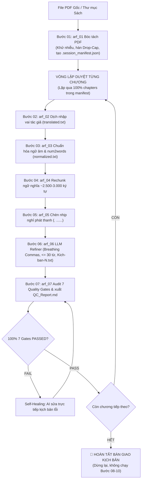

# 🎙️ WORKFLOW: SẢN XUẤT KỊCH BẢN SÁCH NÓI PHÁT THANH (BƯỚC 01 - 07)
## Universal Script Production & Quality Audit Playbook (Steps 01 to 07)

## 1. Đặc Tả Quy Trình Thao Tác Chuẩn (Specification - SOP)

Quy trình `Make-audio-script-process` điều phối dây chuyền 7 bước khép kín từ văn bản thô/PDF ban đầu đến khi xuất xưởng bộ kịch bản hoàn hảo được kiểm toán 100% 7 Quality Gates. Mục tiêu là bàn giao dữ liệu kịch bản chuẩn phát thanh cho đạo diễn và phòng thu.

### 1.1 Bảng Phân Vai Điều Phối & Công Nghệ Thực Thi
| Bước | Mã Kỹ Năng / Module | Vai Trò & Phương Thức Thực Thi | File Đầu Ra Nghiệm Thu |
| :---: | :--- | :--- | :--- |
| **01** | `arf_01_pdf_structure_extractor` | **AI Chính:** Python tool bóc tách PDF, khử Header/Footer, hàn Drop-Cap. | `raw_original.txt` & `.session_manifest.json` |
| **02** | `arf_02_author_style_translator` | **Sub-agents song song:** Dịch thuật Dual-Engine (2A Phi hư cấu / 2B Văn học), $R \ge 0.85$. | `translated.txt` |
| **03** | `arf_03_text_phonetics_normalizer` | **AI Chính:** Python tool số hóa 100% Zero-digit, tách âm *P-M-I*, regex ký tự cấm. | `normalized.txt` |
| **04** | `arf_04_smart_audiobook_rechunker` | **AI Chính:** Python tool phân rã ngữ nghĩa thành các chunk 2.200 - 2.800 ký tự. | `kich-ban/Kich-ban-raw-*.txt` |
| **05** | `arf_05_script_structure_formatter` | **Sub-agents song song:** Tiêu đề IN HOA độc lập, chèn nhịp thở `. ......` (1.5-2s). | Kịch bản có nhịp thở |
| **06** | `arf_06_llm_script_refiner` | **Sub-agents song song:** Câu $\le 30$ từ, breathing commas, $|\Delta W| / W \le 3\%$. | `kich-ban/Kich-ban-*.txt` (xóa raw) |
| **07** | `arf_07_audiobook_qc_auditor` | **AI Chính:** Python audit 7 Quality Gates cứng, Self-Healing sửa lỗi tự động. | `QC_Report.md` (100% 7/7 PASSED) |

---

## 2. Điều Kiện Kích Hoạt & Cụm Từ Khóa (When to Use & Triggers)

### 2.1 Bối Cảnh Sử Dụng
- Khi người dùng muốn tạo kịch bản sách nói từ file PDF hoặc file văn bản thô.
- Khi người dùng muốn chuẩn bị kịch bản phát thanh hoàn chỉnh trước khi đưa vào phòng thu hoặc Clipchamp.
- Khi chỉ muốn xử lý văn bản kịch bản, **chưa cần** thu âm TTS hay lồng nhạc nền.

### 2.2 Câu Lệnh Người Dùng Điển Hình (User Prompt Triggers)
- *"Tạo kịch bản sách nói cho cuốn sách này từ Bước 1 đến Bước 7"*
- *"Chạy quy trình Make-audio-script-process cho file PDF `sach.pdf`"*
- *"Dịch và làm sạch kịch bản sách nói, kiểm toán QC 7 Gates giúp tôi"*
- *"Chuẩn bị kịch bản phát thanh hoàn chỉnh, dừng lại trước khi thu âm"*

---

## 3. Trình Tự Thực Thi Từng Bước (Step-by-Step Execution)



### Pha 1: Tiền kiểm tra & Bóc tách cấu trúc (Steps 01 - 02)
1. Bóc tách PDF bằng Python script, khử Header/Footer/số trang, lập `.session_manifest.json`.
2. Dịch thuật Dual-Engine (Profile 2A hoặc 2B), bảo toàn nguyên tác với tỷ lệ $R \ge 0.85$. Nếu $W > 1.200$ từ, BẮT BUỘC gọi `invoke_subagent` phân rã 2 - 3 Sub-agents dịch song song.

### Pha 2: Chuẩn hóa, Phân đoạn & Tinh chỉnh song song (Steps 03 - 06)
1. Chạy `arf_03`: số hóa 100% `num2words`, tách âm *P-M-I*, regex sạch ký tự cấm trong 1 giây.
2. Chạy `arf_04`: phân rã khối kịch bản 2.200 - 2.800 ký tự (max 3.000) tại cuối câu trọn nghĩa.
3. BẮT BUỘC kích hoạt ĐỒNG THỜI mảng Sub-agents song song qua `invoke_subagent` cho Bước 05 & 06: định dạng tiêu đề IN HOA + nhịp thở `. ......` (1.5-2s), phân tách thi ca caesura, bẻ câu $\le 30$ từ, chèn breathing commas, xóa file thô tạm.

### Pha 3: Kiểm toán Cổng QC & Vòng lặp Self-Healing (Step 07)
1. Chạy `arf_07`: kiểm toán 7 Quality Gates tự động bằng Python script.
2. Nếu có lỗi: tự động mở file kịch bản, sửa triệt để và audit lại cho đến khi **100% 7/7 Gates PASSED**.
3. Cập nhật manifest và dừng lại bàn giao.

---

## 4. Ràng Buộc Đầu Ra (Output Contract)

Toàn bộ kịch bản hoàn thành được bàn giao ngăn nắp trong thư mục sách:
```text
Kich-ban-clipchamp/[book_slug]/
├── .session_manifest.json          # pipeline_stage: "07_qc_audited"
└── [Tên-Chương]/
    ├── raw_original.txt            # Bước 01: Văn bản gốc bất biến
    ├── translated.txt              # Bước 02: Bản dịch nhập vai
    ├── normalized.txt              # Bước 03: Bản chuẩn hóa ngữ âm
    ├── QC_Report.md                # Bước 07: Báo cáo đạt 100% 7 Gates PASSED
    └── kich-ban/                   # THƯ MỤC KỊCH BẢN CHÍNH THỨC
        ├── Kich-ban-1.txt          # Câu <= 30 từ, có breathing commas
        ├── Kich-ban-2.txt
        └── ...
```

---

## 5. Cơ Chế Phủ Định & Điều Cấm Kỵ (Negative Triggers & Constraints)

- **CẤM AI CHÍNH TỰ LÀM ĐƠN LẺ TẠI BƯỚC 02, 05, 06 (ZERO-SOLO VIOLATION):** Bắt buộc phải phát lệnh gọi `invoke_subagent` điều phối mảng Subagents song song. Cấm tự sửa file một mình trong phiên chính hoặc dùng Python regex làm tắt.
- **TUYỆT ĐỐI KHÔNG THU ÂM TTS HAY GHÉP BGM (BƯỚC 08 - 10):** Quy trình này khóa cứng phạm vi tại Bước 07; nghiêm cấm tự ý gọi API thu âm hoặc tạo file mp3.
- **CẤM DỪNG DỞ DANG SAU VÀI CHƯƠNG MẪU:** Phải duyệt qua 100% các chương có trong manifest.
- **CẤM BỎ QUA CỔNG KIỂM TOÁN BƯỚC 07:** Mọi chương phải có `QC_Report.md` với kết luận 100% PASSED mới được coi là hoàn thành.
- **CẤM GIỮ LẠI FILE TẠM KICH-BAN-RAW-*.TXT:** Bắt buộc xóa sạch file raw sau Bước 06.
- **CẤM TẠO FILE TẠM Ở THƯ MỤC GỐC:** Mọi dữ liệu phải nằm trong thư mục sách quy định.
