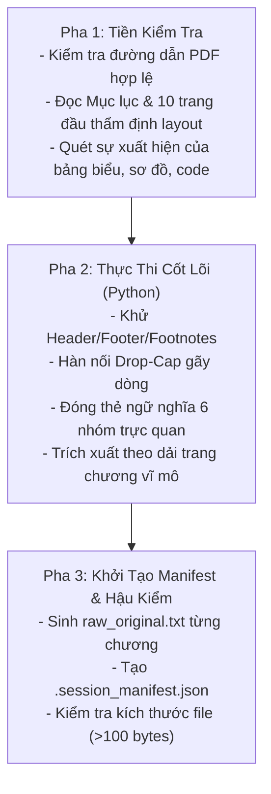

# Kỹ năng 01: Bóc Tách Cấu Trúc PDF (PDF Structure Extractor)

## 1. Đặc Tả Quy Trình Thao Tác Chuẩn (Specification - SOP)

Kỹ năng `arf_01_pdf_structure_extractor` là khâu tiếp nhận đầu vào nguyên bản của hệ thống ARF. Nhiệm vụ tối thượng là trích xuất dữ liệu chữ sạch từ file PDF, giữ nguyên tính chân thực 100% của tác giả, nhận diện cấu trúc phi văn bản và loại bỏ mọi tạp âm định dạng trước khi chuyển sang các bước xử lý ngôn ngữ.

### 1.1 Ma Trận Phân Loại Thể Loại Tiền Kỳ (Pre-Review Layout Matrix)
| Nhóm Thể Loại | Đặc Điểm Bố Cục Nhận Diện | Quy Chuẩn Xử Lý SOP |
| :--- | :--- | :--- |
| **Khoa học / Quản trị / PMBOK** | Mục lục số học (1.1, 1.2), bảng biểu, sơ đồ, footnote chân trang. | Khử sạch footnote và số trang; bọc thẻ cấu trúc bảng biểu và sơ đồ; giữ ranh giới chương vĩ mô. |
| **Tự lực / Phát triển bản thân** | Khung ghi chú (Callout boxes), câu hỏi đúc kết, bài tập thực hành. | Giữ trọn vẹn nội dung callout box đưa vào mạch văn chính; không nhầm lẫn callout với Header/Footer lặp lại. |
| **Văn học / Kịch nghệ / Sử thi** | Drop-Cap hoa mỹ rớt dòng, câu đối biền ngẫu, thơ đề từ đầu hồi. | Hàn gắn Drop-Cap 100%; bảo vệ tuyệt đối các khổ thơ cổ và câu đối biền ngẫu, nghiêm cấm cắt xén. |

### 1.2 Quy Chuẩn Nhận Diện & Đóng Thẻ Ngữ Nghĩa 6 Nhóm Trực Quan (Structural Tagging Matrix)
Áp dụng quy chuẩn từ `Docs/HUONG_DAN_THUYET_MINH_NOI_DUNG_TRUC_QUAN_AUDIOBOOK.md` để không làm mất thông tin tác giả và không làm vỡ mạch câu khi bóc tách:

| Nhóm Phần Tử | Dấu Hiệu Nhận Diện Trong PDF | Cú Pháp Đóng Thẻ Ngữ Nghĩa Chuẩn | Mục Đích Cho Bước Sau |
| :--- | :--- | :--- | :--- |
| **1. Bảng biểu (Tables)** | Khung lưới ô, bảng Markdown, bảng text cách tab/khoảng trắng. | `[TABLE: <tiêu đề bảng nếu có>]` ... `[END_TABLE]` | Bảo toàn tiêu đề hàng/cột và số liệu; ngăn đứt câu văn xuôi xung quanh. |
| **2. Biểu đồ (Charts/Diagrams)** | Khối sơ đồ dòng chảy, cây phân cấp, đồ thị trục X-Y kèm caption. | `[CHART_DIAGRAM: <loại sơ đồ, tiêu đề>]` ... `[END_CHART]` | Giữ nguyên các thông số trục, xu hướng và chú giải để B02 thuyết minh. |
| **3. Minh họa (Illustrations)** | Hình vẽ, tranh minh họa, ảnh chụp tư liệu có kèm caption/chú thích. | `[ILLUSTRATION: <caption ảnh>]` | Lọc bỏ ảnh trang trí trống nghĩa; giữ lại caption ảnh ngụ ngôn/tri thức. |
| **4. Công thức (Math)** | Biểu thức toán học ký hiệu đặc biệt, phân số, tích phân, LaTeX. | `[MATH_FORMULA: <công thức raw/LaTeX>]` | Giữ nguyên công thức gốc để B02 chuyển thể Spoken Math. |
| **5. Mã nguồn (Code/Algorithms)** | Khối thụt lề code, font chữ đơn cách (Monospace), hàm và biến. | `[CODE_BLOCK: <ngôn ngữ>]` ... `[END_CODE]` | Bảo toàn luồng lệnh và định danh tiếng Anh, ngăn xáo trộn ký tự. |
| **6. Ma trận (Matrices)** | Bảng số ma trận nhiều chiều, mảng ngoặc vuông chứa hệ số. | `[MATRIX: <kích thước, tiêu đề>]` ... `[END_MATRIX]` | Giữ nguyên giá trị các chiều để B02 thuyết minh đặc tính toán học. |

### 1.3 Quy Chuẩn Kỹ Thuật Bất Biến
- **Hàn gắn chữ cái Drop-Cap (Drop-Cap Healer):** Bắt buộc nối liền các chữ cái đơn lẻ rớt dòng: `T\nrong` $\to$ `Trong`, `B\nạn` $\to$ `Bạn`, `C\non` $\to$ `Con`, `Đ\niều` $\to$ `Điều`, `M\nột` $\to$ `Một`.
- **Thứ tự đọc đa cột (Multi-column Reading Order):** Với layout 2 cột, đọc hết cột bên trái từ trên xuống dưới trước khi chuyển sang cột bên phải.
- **Tính Bất Biến Của Văn Bản Gốc (Ground Truth Invariance):** Tệp `raw_original.txt` là dữ liệu nguồn cố định, dùng làm căn cứ tính tỷ lệ giãn nở từ vựng $R = W_{vi} / W_{en}$ ở Bước 02 ($R \ge 0.85$) và Bước 07 ($R \ge 0.75$).

---

## 2. Điều Kiện Kích Hoạt & Cụm Từ Khóa (When to Use & Triggers)

### 2.1 Bối Cảnh Sử Dụng
- Khi người dùng cung cấp một file PDF sách nguồn và muốn bắt đầu dự án sản xuất sách nói.
- Khi sách chứa nhiều bảng biểu, đồ thị, công thức hoặc đoạn code cần bóc tách bảo toàn thông tin.
- Khi cần bóc tách lại một chương cụ thể từ tệp PDF gốc để làm lại dữ liệu thô.

### 2.2 Câu Lệnh Người Dùng Điển Hình (User Prompt Triggers)
- *"Bóc tách cuốn sách PDF này: `path/to/book.pdf`"*
- *"Trích xuất cấu trúc các chương từ file PDF vào dự án"*
- *"Khởi tạo dự án sách nói từ file PDF `tailieu.pdf`"*
- *"Bóc tách sách kỹ thuật có nhiều bảng biểu, code và sơ đồ"*
- *"Chạy bước 1 cho cuốn sách PDF mới"*

---

## 3. Trình Tự Thực Thi Từng Bước (Step-by-Step Execution)



### Pha 1: Tiền kiểm tra & Khảo sát cấu trúc (Pre-checks)
1. Xác thực sự tồn tại của file PDF đầu vào và quyền đọc.
2. Quét mục lục (Table of Contents) và dải trang (Page Ranges) để lập danh sách chương vĩ mô (00-Preface, 01-Intro, 02-Chuong-01...).
3. Khảo sát sơ bộ xem tài liệu có chứa bảng biểu, sơ đồ, công thức toán hoặc mã nguồn để kích hoạt chế độ đóng thẻ cấu trúc.

### Pha 2: Thao tác bóc tách kỹ thuật (Core Processing)
1. AI Chính trực tiếp chạy script Python bóc tách (không qua sub-agent trung gian để đảm bảo tốc độ < 2 giây):
   ```bash
   python core/antigravity_audiobook_pipeline.py --pdf "<PATH_TO_PDF>" --book_slug "<BOOK_SLUG>"
   ```
   hoặc chạy module trực tiếp:
   ```bash
   python core/extract_pdf_structure.py "<PATH_TO_PDF>" "Kich-ban-clipchamp/<BOOK_SLUG>"
   ```
2. Bộ lọc regex tự động quét và loại bỏ số trang, tiêu đề lặp lại ở đầu và cuối trang.
3. Nối các đoạn văn bị ngắt dòng do giới hạn trang in (`\n` giữa câu chưa kết thúc dấu chấm).
4. Áp dụng các thẻ ngữ nghĩa `[TABLE: ...]`, `[CHART_DIAGRAM: ...]`, `[ILLUSTRATION: ...]`, `[MATH_FORMULA: ...]`, `[CODE_BLOCK: ...]`, `[MATRIX: ...]` cho các khối phần tử trực quan tương ứng.

### Pha 3: Khởi tạo Manifest & Hậu kiểm (Post-Processing & Verification)
1. Lưu nội dung thô nguyên bản vào `raw_original.txt` trong từng thư mục chương.
2. Khởi tạo hoặc cập nhật `.session_manifest.json` ghi nhận số từ, dải trang, và gán `step_1_status: "completed"`.
3. Kiểm tra kiểm toán: Xác nhận mọi file `raw_original.txt` có kích thước $> 100$ bytes và các thẻ cấu trúc đóng mở đầy đủ.

---

## 4. Ràng Buộc Đầu Ra (Output Contract)

Mọi lần chạy thành công của kỹ năng `arf_01` phải đảm bảo cấu trúc thư mục chuẩn xác:

```text
Kich-ban-clipchamp/[book_slug]/
├── .session_manifest.json          # Ghi nhận session_id, pipeline_stage: "01_pdf_extracted"
├── 00-Preface/
│   └── raw_original.txt           # Văn bản thô phần Mở đầu (Bất biến, chứa thẻ cấu trúc nếu có)
├── 01-Intro/
│   └── raw_original.txt           # Văn bản thô phần Dẫn nhập (Bất biến)
├── 02-Chuong-01/
│   └── raw_original.txt           # Văn bản thô Chương 1 (Bất biến)
└── ...
```

### Cấu Trúc Tệp `.session_manifest.json` Tối Thiểu:
```json
{
  "book_slug": "Ten-Sach",
  "pipeline_stage": "01_pdf_extracted",
  "chapters": [
    {
      "index": 1,
      "folder": "01-chuong-1",
      "title": "Chương 1: Khởi Đầu",
      "step_1_status": "completed",
      "word_count_raw": 3450
    }
  ]
}
```

---

## 5. Cơ Chế Phủ Định & Điều Cấm Kỵ (Negative Triggers & Constraints)

- **TUYỆT ĐỐI KHÔNG TỰ Ý DỊCH THUẬT:** Kỹ năng này chỉ bóc tách ngôn ngữ gốc nguyên bản của tác giả. Cấm gọi API dịch thuật tại Bước 01.
- **TUYỆT ĐỐI KHÔNG TÓM TẮT HOẶC BIÊN TẬP:** Không được lược bỏ ví dụ, bảng biểu, sơ đồ, công thức hay code thuật toán của tác giả. Bắt buộc giữ nguyên vẹn trong các thẻ cấu trúc tương ứng.
- **TUYỆT ĐỐI KHÔNG BĂM NHỎ CHƯƠNG VĨ MÔ:** Cấm tạo thư mục con theo tiểu mục nhỏ (H2, H3). Chỉ chia theo Chương/Hồi lớn.
- **KHÔNG SỬ DỤNG KHI ĐẦU VÀO ĐÃ LÀ FILE TEXT SẴN CÓ:** Nếu người dùng đã cung cấp file text sạch (`raw_original.txt`), bỏ qua Bước 01 và chuyển thẳng sang Bước 02.
- **CẤM TẠO FILE TẠM Ở THƯ MỤC GỐC (ROOT):** Mọi tệp xử lý trung gian phải nằm trong thư mục sách hoặc `scratch/`.
