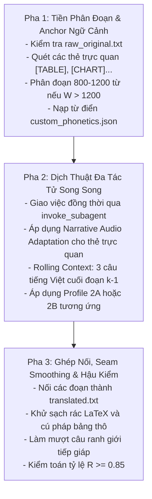

# Kỹ năng 02: Dịch Thuật Nhập Vai Tác Giả (Author Style Translator)

## 1. Đặc Tả Quy Trình Thao Tác Chuẩn (Specification - SOP)

Kỹ năng `arf_02_author_style_translator` thực hiện chuyển thể ngôn ngữ có chiều sâu, giữ trọn vẹn 100% nội dung, số liệu, ví dụ và văn phong của tác giả. Tích hợp năng lực chuyển hóa các khối trực quan và phi văn bản thành lời nói tự nhiên chuẩn phát thanh (Narrative Audio Adaptation).

### 1.1 Phân Định Dual-Engine Chuyên Biệt
| Tiêu Chí | Profile 2A: Phi Hư Cấu / Quản Trị / Kỹ Thuật | Profile 2B: Văn Học Kinh Điển / Sử Thi / Kịch Nghệ |
| :--- | :--- | :--- |
| **Ngôi xưng tác giả** | Khóa cứng ngôi `Tôi - Bạn` truyền cảm hứng, gần gũi, chuyên nghiệp. | Đa thanh theo góc nhìn tác phẩm (ngôi thứ ba toàn tri hoặc độc thoại nhân vật). |
| **Thuật ngữ chuyên môn** | Giữ nguyên chữ quốc tế ở lần đầu giới thiệu (*Stakeholder*, *Project Charter*); thân bài dùng tiếng Việt tự nhiên hoặc viết tắt (*P-M-I*). | Giữ nguyên 100% âm Hán-Việt (chức danh, nhân vật, thành quách); số hóa cổ kính (*canh ba, ba vạn quân, hai mươi trượng*). |
| **Nhịp điệu câu cú** | Câu gãy gọn, liên từ rõ ràng (*tuy nhiên,*, *do đó,*), chuẩn bị lấy hơi cho TTS. | Giữ trọn khẩu khí nhân vật (*Chúa công, Quân sư*), bảo toàn thể thơ và câu đối biền ngẫu. |
| **Từ điển áp dụng** | Nạp `custom_phonetics.json` trong thư mục sách. | Nạp hệ thống xưng hô cổ phong và danh xưng nhân vật lịch sử. |

### 1.2 Quy Chuẩn Thuyết Minh Nội Dung Trực Quan & Phi Văn Bản (Visual Audio Adaptation)
Chuyển thể toàn diện 6 nhóm thẻ cấu trúc từ Bước 01 theo `Docs/HUONG_DAN_THUYET_MINH_NOI_DUNG_TRUC_QUAN_AUDIOBOOK.md`:

| Nhóm Phần Tử | Quy Chuẩn Chuyển Thể Phát Thanh (SOP) | Điều Tuyệt Đối Cấm (Negative Rules) |
| :--- | :--- | :--- |
| **1. Bảng biểu (`[TABLE]`)** | **Thuyết minh tổng hợp (Narrative Synthesis):** Nêu mục đích so sánh, xu hướng chính và các số liệu trọng yếu nhất. | Cấm đọc tọa độ ô lưới (`|---|---|` hoặc "Hàng một cột một là..."). |
| **2. Biểu đồ (`[CHART_DIAGRAM]`)** | Thuyết minh loại biểu đồ, 2 trục đo lường, xu hướng vận động chính (tăng, giảm, điểm uốn) và thông điệp tác giả chứng minh. | Cấm mô tả chi tiết pixel, màu sắc đường nét đồ họa. |
| **3. Minh họa (`[ILLUSTRATION]`)** | Lược bỏ ảnh trang trí; diễn giải ảnh mang tri thức/ẩn dụ ngụ ngôn thành 1 - 2 câu văn xuôi súc tích, giàu hình tượng. | Cấm đọc các câu tham chiếu giấy in (*"xem hình trang bên"*). |
| **4. Công thức (`[MATH_FORMULA]`)** | **Spoken Math:** Diễn ngôn bằng câu chữ ngữ âm tiếng Việt hoàn chỉnh, giữ tên biến Latinh chuẩn quốc tế. | Cấm để sót mã LaTeX thô (`$`, `$$`, `\frac`, `\sum`, `\sqrt`). |
| **5. Code & Thuật toán (`[CODE_BLOCK]`)** | Tường thuật **luồng logic và ý nghĩa thuật toán** (Input $\to$ Logic kiểm tra $\to$ Output), giữ nguyên định danh tiếng Anh. | Cấm đọc từng ký tự cú pháp gõ phím (ngoặc nhọn `{}`, thụt lề, `;`). |
| **6. Ma trận (`[MATRIX]`)** | Thuyết minh kích thước, ý nghĩa các hàng và cột, đặc tính toán học quan trọng (đường chéo chính, ma trận chuyển vị). | Cấm đọc danh sách dài các con số rời rạc không có ngữ cảnh. |
| **Khử tham chiếu in ấn** | Chuyển đổi linh hoạt: *"như hình dưới đây"* $\to$ *"qua sơ đồ phân tích"*, *"bảng trang bên"* $\to$ *"bảng so sánh sau đây"*. | Cấm giữ nguyên từ ngữ chỉ vị trí trang in vật lý. |

### 1.3 Khóa Cứng Tỷ Lệ Giãn Nở Từ Vựng (Zero-Summarization Formula)
$$R = \frac{\text{Số từ Tiếng Việt } (W_{vi})}{\text{Số từ Tiếng Anh Gốc } (W_{en})}$$
- **Quy chuẩn đánh giá:**
  - $0.85 \le R \le 1.50$: **ĐẠT CHUẨN (PASSED)**. Thuyết minh trực quan giúp mở rộng tự nhiên lượng từ vựng, bảo toàn trọn vẹn thông điệp gốc.
  - $R < 0.80$: **HARD FAIL (BỊ TÓM TẮT)** $\to$ Từ chối nghiệm thu, khóa quyền chuyển sang Bước 03, kích hoạt tự động dịch lại.

---

## 2. Điều Kiện Kích Hoạt & Cụm Từ Khóa (When to Use & Triggers)

### 2.1 Bối Cảnh Sử Dụng
- Khi thư mục chương đã có file `raw_original.txt` từ Bước 01 hoặc do người dùng cung cấp.
- Khi tài liệu kỹ thuật, quản trị chứa nhiều bảng biểu, công thức hoặc mã code cần chuyển thể thành lời nói tự nhiên.
- Khi người dùng muốn dịch một chương sách hoặc toàn bộ sách sang tiếng Việt chuẩn bị cho thu âm sách nói.

### 2.2 Câu Lệnh Người Dùng Điển Hình (User Prompt Triggers)
- *"Dịch chương này sang tiếng Việt: `01-chuong-1`"*
- *"Dịch nội dung cuốn sách từ tiếng Anh sang tiếng Việt chuẩn phát thanh"*
- *"Chuyển thể tài liệu kỹ thuật có nhiều công thức toán và code sang kịch bản sách nói"*
- *"Thuyết minh các bảng biểu và sơ đồ trong chương theo chuẩn audio"*
- *"Bản dịch này bị ngắn quá, hãy dịch lại đầy đủ không tóm tắt"*

---

## 3. Trình Tự Thực Thi Từng Bước (Step-by-Step Execution)



### Pha 1: Tiền phân đoạn & Khóa ngữ cảnh (Pre-checks)
1. Đọc `raw_original.txt`, đếm số từ tiếng Anh $W_{en}$.
2. Nhận diện các thẻ trực quan `[TABLE]`, `[CHART_DIAGRAM]`, `[ILLUSTRATION]`, `[MATH_FORMULA]`, `[CODE_BLOCK]`, `[MATRIX]` trong văn bản nguồn.
3. Nạp từ điển tùy biến `custom_phonetics.json` (nếu có trong thư mục sách).
4. **Phân đoạn tiền dịch thuật:** Nếu $W_{en} > 1.200$ từ, AI chia nhỏ thành các khối 800 – 1.200 từ theo tiêu đề hoặc ranh giới đoạn `\n\n` (không cắt giữa các khối thẻ trực quan).

### Pha 2: Dịch thuật đa tác tử song song (Mandatory Sub-agents Dispatch)
1. **Khóa cứng Sub-agents (Zero-Solo Enforcement):** Khi văn bản dài ($W_{en} > 1.200$ từ), AI Chính **BẮT BUỘC PHẢI GỌI `invoke_subagent`** chia nhỏ mảng 2 – 3 Subagents dịch song song. **TUYỆT ĐỐI CẤM** AI Chính tự dịch một mình trong phiên chính hoặc dùng công cụ sửa file đơn lẻ:
   ```python
   invoke_subagent(
       Subagents=[
           {
               "TypeName": "self",
               "Role": "Author Style Translator [Part 1]",
               "Prompt": (
                   "Dịch khối 1 (từ 1 đến 1200) của raw_original.txt sang tiếng Việt chuẩn phát thanh:\n"
                   "- Áp dụng Profile 2A (ngôi Tôi - Bạn) hoặc Profile 2B (văn học cổ phong) tương ứng.\n"
                   "- Thuyết minh đầy đủ nội dung trực quan ([TABLE], [CHART], [MATH_FORMULA]).\n"
                   "- Cam kết bảo toàn 100% nguyên tác, tỷ lệ giãn nở R >= 0.85.\n"
                   "- Trả về văn bản dịch hoàn chỉnh của Part 1."
               )
           },
           {
               "TypeName": "self",
               "Role": "Author Style Translator [Part 2]",
               "Prompt": (
                   "Dịch khối 2 (từ 1201 đến hết) của raw_original.txt sang tiếng Việt chuẩn phát thanh:\n"
                   "- Rolling Context: 3 câu tiếng Việt cuối của Part 1 để nối mạch liên từ tự nhiên.\n"
                   "- Thuyết minh trực quan theo SOP và bảo toàn nguyên tác R >= 0.85.\n"
                   "- Trả về văn bản dịch hoàn chỉnh của Part 2."
               )
           }
       ]
   )
   ```
2. **Rolling Context:** Mỗi Sub-agent phụ trách đoạn $k \ge 2$ bắt buộc nạp kèm 3 câu tiếng Việt cuối của đoạn $k-1$ để giữ liền mạch đại từ và liên từ.

### Pha 3: Ghép nối, Seam Smoothing & Hậu kiểm (Post-Processing & QC)
1. Nối các bản dịch con thành `translated.txt`.
2. **Khử rác định dạng:** Đảm bảo 100% không còn ký tự LaTeX thô (`$`), không còn ký tự bảng Markdown (`|---|`), không còn ký tự code gõ phím (`{}`).
3. **Seam Smoothing:** Rà soát và chỉnh sửa các câu ranh giới tiếp giáp giữa các đoạn con, đảm bảo liên từ tiếp nối tự nhiên không lộ vết cắt.
4. **Kiểm toán từ vựng:** Đếm $W_{vi}$, tính $R = W_{vi} / W_{en}$. Nếu $R < 0.80$, kích hoạt Self-Healing Loop dịch lại đoạn thiếu ý.
5. Cập nhật `.session_manifest.json` ghi nhận `step_2_status: "completed"`, `word_count_translated: W_vi`, `expansion_ratio: R`.

---

## 4. Ràng Buộc Đầu Ra (Output Contract)

File đầu ra bắt buộc nằm tại thư mục gốc của chương:
- Đường dẫn: `[book_dir]/[chapter_folder]/translated.txt`
- Tiêu chí nghiệm thu:
  - File tồn tại, định dạng UTF-8, không rỗng.
  - Tỷ lệ giãn nở đạt $R \ge 0.85$.
  - Tiêu đề chương hồi giữ nguyên phân cấp.
  - Bảng biểu, sơ đồ, công thức, code được chuyển thể thành văn xuôi tường thuật tự nhiên hoàn chỉnh.
  - Không chứa dấu vết dịch máy thô thiển hoặc câu bị cắt cụt.

### Mẫu Cập Nhật Manifest:
```json
{
  "folder": "01-chuong-1",
  "step_2_status": "completed",
  "word_count_raw": 2400,
  "word_count_translated": 2520,
  "expansion_ratio": 1.05
}
```

---

## 5. Cơ Chế Phủ Định & Điều Cấm Kỵ (Negative Triggers & Constraints)

- **CẤM AI CHÍNH TỰ DỊCH ĐƠN LẺ KHI VĂN BẢN DÀI (ZERO-SOLO TRANSLATION VIOLATION):** Khi văn bản > 1.200 từ, bắt buộc gọi `invoke_subagent` kích hoạt mảng Subagents song song. Cấm tự dịch một mình trong phiên chính.
- **TUYỆT ĐỐI CẤM TÓM TẮT (ZERO-SUMMARIZATION):** Không được lược bỏ bất kỳ ví dụ, số liệu, luận điểm, bảng biểu hay công thức nào của tác giả. Nếu phát hiện $R < 0.80$, coi là vi phạm nghiêm trọng.
- **CẤM ĐỌC CÚ PHÁP GÕ PHÍM HOẶC TỌA ĐỘ BẢNG:** Tuyệt đối cấm đọc "Hàng một cột một", "Dấu ngoặc nhọn", "Chấm phẩy", hoặc để nguyên bảng markdown `|---|---|`.
- **CẤM ĐỂ SÓT KÝ TỰ LATEX:** Không để sót `$`, `$$`, `\frac`, `\sum` trong `translated.txt`.
- **CẤM ĐỔI NGÔI XƯNG BẤT NHẤT:** Không được đoạn trước xưng `Tôi - Bạn`, đoạn sau lại đổi thành `Chúng ta` hoặc `Tác giả`.
- **KHÔNG SỬ DỤNG KHI CHƯA CÓ RAW_ORIGINAL.TXT:** Phải hoàn tất Bước 01 hoặc có file thô sạch trước khi chạy Bước 02.
- **CẤM LƯU FILE DỊCH VÀO THƯ MỤC GỐC DỰ ÁN (ROOT):** Tệp `translated.txt` phải nằm đúng trong thư mục chương.
