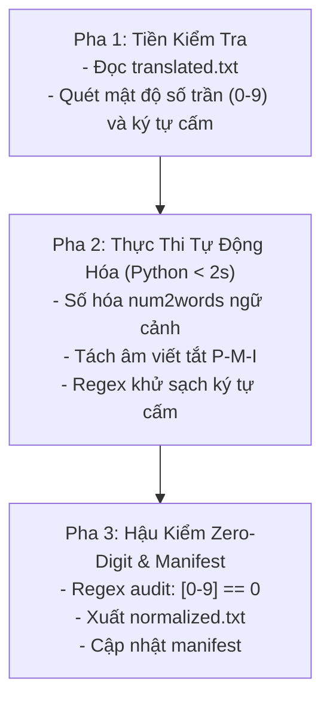

# Kỹ năng 03: Chuẩn Hóa Ngữ Âm & Số Học (Text & Phonetics Normalizer)

## 1. Đặc Tả Quy Trình Thao Tác Chuẩn (Specification - SOP)

Kỹ năng `arf_03_text_phonetics_normalizer` là chốt chặn kỹ thuật tất định, đảm bảo văn bản sạch 100% tạp âm và không còn bất kỳ chữ số nào trước khi chuyển sang khâu phân đoạn và tinh chỉnh giọng đọc.

### 1.1 Quy Chuẩn Zero-Digit (100% Số Hóa Thành Chữ)
Mọi ký tự `0-9` phải được chuyển hóa thành chữ tiếng Việt:
- **Số đếm & Thập phân:** `15` $\to$ `mười lăm`; `3.5` $\to$ `ba phẩy năm`.
- **Tỷ lệ phần trăm:** `50%` $\to$ `năm mươi phần trăm`; `0.2%` $\to$ `không phẩy hai phần trăm`.
- **Mốc thời gian & Năm:** `năm 2026` $\to$ `năm hai nghìn không trăm hai mươi sáu`; `thập niên 90` $\to$ `thập niên chín mươi`.
- **Tiền tệ:** `$100` $\to$ `một trăm đô la`; `50.000đ` $\to$ `năm mươi nghìn đồng`.
- **Số cổ phong (Văn học kinh điển):** Bảo tồn nguyên vẹn: *canh ba*, *năm Kiến An thứ năm*, *ba vạn quân*, *hai mươi trượng*, cấm chuyển đổi thành số trần rồi lại chuyển ngược gây méo mó ngữ cảnh.

### 1.2 Quy Chuẩn Tách Âm Viết Tắt Quốc Tế (Hyphenated Acronyms)
Các từ viết tắt chữ hoa được tự động chèn gạch nối để giọng quốc tế Brian phát âm rõ ràng từng âm tiết:
- `PMI` $\to$ `P-M-I`
- `PMBOK` $\to$ `P-M-B-O-K`
- `WBS` $\to$ `W-B-S`
- `KPI` $\to$ `K-P-I`
- `AI` $\to$ `A-I` | `IT` $\to$ `I-T`

### 1.3 Quy Chuẩn Khử Ký Tự Cấm TTS
Quét và thay thế triệt để các ký tự gây khựng âm hoặc lỗi engine đọc:
- Ngoặc kép `""“”` và ngoặc đơn `()[]`: Thay bằng `, ` hoặc khoảng trắng.
- Dấu hai chấm `:` và chấm phẩy `;`: Thay bằng dấu phẩy `, ` hoặc chấm `. `.
- Dấu gạch dài `—` hoặc `–`: Thay bằng dấu phẩy `, `.
- Ký tự markdown `#`, `*`, `_`, `~`, `|`, `/`, `\`: Xóa sạch.
- Bullet points và icons (`▶`, `●`, `★`, `✓`, `•`): Xóa sạch.

---

## 2. Điều Kiện Kích Hoạt & Cụm Từ Khóa (When to Use & Triggers)

### 2.1 Bối Cảnh Sử Dụng
- Khi đã có file `translated.txt` từ Bước 02 trong thư mục chương.
- Khi người dùng muốn số hóa văn bản, khử ký tự cấm TTS hoặc chuẩn hóa từ viết tắt tiếng Anh.

### 2.2 Câu Lệnh Người Dùng Điển Hình (User Prompt Triggers)
- *"Chuẩn hóa số và ngữ âm cho chương này: `01-chuong-1`"*
- *"Chuyển toàn bộ số sang chữ tiếng Việt và khử ký tự cấm"*
- *"Tách âm các từ viết tắt PMI, WBS và làm sạch kịch bản"*
- *"Chạy Bước 03 chuẩn hóa ngữ âm cho các chương đã dịch"*

---

## 3. Trình Tự Thực Thi Từng Bước (Step-by-Step Execution)



### Pha 1: Tiền kiểm tra (Pre-checks)
1. Xác nhận tệp `translated.txt` tồn tại và không rỗng.
2. Quét thống kê ban đầu: số lượng chữ số `0-9`, các từ viết tắt và ký tự cấm cần xử lý.

### Pha 2: Thao tác cốt lõi bằng Python (Core Processing)
AI Chính trực tiếp thực thi script Python nội tại (< 2 giây), không ủy quyền cho sub-agent:
```bash
python core/audiobook_script_processor.py --chap_dir "<CHAPTER_DIR>" --step 3
```
Hoặc chạy lệnh Python một dòng chuẩn:
```python
from core.audiobook_script_processor import normalize_text_phonetics
normalize_text_phonetics("<PATH_TO_TRANSLATED_TXT>", "<PATH_TO_NORMALIZED_TXT>")
```

### Pha 3: Hậu kiểm tra & Cập nhật Manifest (Verification)
1. **Kiểm tra Zero-Digit:** Chạy regex `\d+` trên `normalized.txt`. Số lượng match bắt buộc phải bằng `0` (với văn học kinh điển chấp nhận chữ cổ phong).
2. Lưu file hoàn tất tại `[chapter_folder]/normalized.txt`.
3. Cập nhật `.session_manifest.json` ghi nhận `step_3_status: "completed"`.

---

## 4. Ràng Buộc Đầu Ra (Output Contract)

File đầu ra bắt buộc nằm tại thư mục gốc của chương:
- Đường dẫn: `[book_dir]/[chapter_folder]/normalized.txt`
- Tiêu chí nghiệm thu kỹ thuật:
  - 100% không sót chữ số `0-9` (trừ trường hợp đặc tả cổ phong).
  - 100% sạch ký tự cấm: không chứa `""`, `()`, `:`, `—`, markdown.
  - Thuật ngữ Latinh gốc được bảo toàn chữ cái quốc tế, không bị phiên âm bồi thô thiển.
  - Các từ viết tắt chuyên môn được gạch nối chuẩn xác: `P-M-I`, `W-B-S`.

### Mẫu Cập Nhật Manifest:
```json
{
  "folder": "01-chuong-1",
  "step_3_status": "completed",
  "zero_digit_verified": true,
  "forbidden_chars_count": 0
}
```

---

## 5. Cơ Chế Phủ Định & Điều Cấm Kỵ (Negative Triggers & Constraints)

- **TUYỆT ĐỐI KHÔNG ĐỂ SÓT CHỮ SỐ (ZERO-DIGIT VIOLATION):** Để sót dù chỉ một chữ số `0-9` trong `normalized.txt` đều bị coi là lỗi nặng và bị Cổng QC Bước 07 từ chối.
- **CẤM PHIÊN ÂM NGOẠI NGỮ THÔ THIỂN:** Tuyệt đối không phiên âm bồi kiểu "Pờ-mờ-i", "Sờ-tếch-hâu-đơ". Phải giữ chữ cái gốc để giọng đọc Brian phát âm chuẩn.
- **CẤM SỬ DỤNG SUB-AGENT CHO TÁC VỤ REGEX ĐƠN GIẢN:** Không tạo sub-agent LLM chỉ để thay thế số và regex ký tự; AI Chính phải chạy code Python trực tiếp để hoàn thành trong 1 giây.
- **CẤM XÓA BỎ CÂU CHỮ CỦA NỘI DUNG:** Chuẩn hóa ký tự chỉ là phép biến đổi thay thế hình thức, không được xóa cụm từ hay làm biến dạng nghĩa của câu.
- **CẤM GHI ĐÈ TRỰC TIẾP LÊN TRANSLATED.TXT:** Phải lưu sang file riêng biệt `normalized.txt`.
