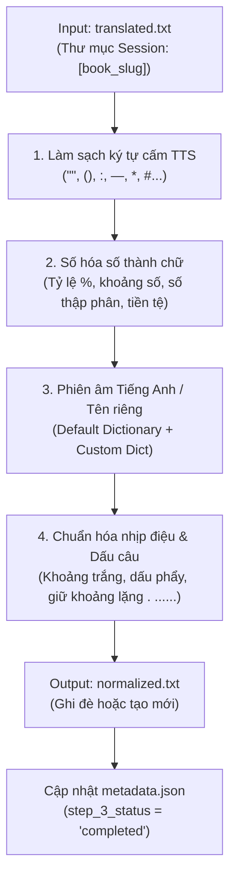

# Kỹ năng 03: Text Phonetics Normalizer (Chuẩn Hóa Ngôn Ngữ Học & Phiên Âm TTS)

## 1. Tổng Quan & Mục Tiêu

Kỹ năng `03_text_phonetics_normalizer` chịu trách nhiệm tiếp nhận bản dịch thô tiếng Việt (`translated.txt`) từ Bước 2, thực hiện các bước xử lý ngôn ngữ học chuyên sâu để văn bản đạt độ tương thích và tự nhiên tối đa khi đưa vào bộ đọc giọng nhân tạo (TTS Engine như Clipchamp, Edge TTS, Azure Speech, ElevenLabs):

1. **Phiên âm danh từ riêng & thuật ngữ ngoại lai:** Chuyển đổi tên người, địa danh, thuật ngữ tiếng Anh/quốc tế sang phiên âm tiếng Việt gần gũi, giúp giọng đọc TTS đọc trôi chảy không bị vấp hoặc sai âm (Ví dụ: `Peter Drucker` -> `Pi-tờ Đrắc-kờ`, `Carl Jung` -> `Các Giung`, `Marketing` -> `Mác-két-tinh`).
2. **Số hóa toàn diện số thành chữ (`num2words`):** Chuyển đổi mọi định dạng số (số nguyên, số thập phân, phần trăm `50%` -> `năm mươi phần trăm`, khoảng số `5-10 phút` -> `năm đến mười phút`, tiền tệ, năm, số thứ tự) thành chữ viết đầy đủ.
3. **Làm sạch ký tự cấm TTS:** Loại bỏ hoặc thay thế các ký tự gây lỗi phát âm hoặc làm đứt gãy giọng đọc như dấu ngoặc kép (`" "`, `“”`), dấu ngoặc đơn/vuông (`( )`, `[ ]`), dấu hai chấm (`:`), dấu gạch ngang/gạch dài (`—`, `–`, `-`), dấu thăng (`#`), hoa thị (`*`), v.v. thành dấu phẩy (`,`) hoặc khoảng trắng thích hợp nhằm giữ nhịp thở tự nhiên.
4. **Quản lý trạng thái Session:** Tự động định vị thư mục session theo `book_slug`, đọc `translated.txt`, xuất ra `normalized.txt` và cập nhật `step_3_status: "completed"` trong `metadata.json`.

---

## 2. Luồng Xử Lý (Workflow Pipeline)



---

## 3. Quy Tắc Chuẩn Hóa Chi Tiết

### 3.1. Phiên Âm Danh Từ Riêng & Thuật Ngữ (Phonetic Mapping)
- **Tác giả & Nhân vật:**
  - `Robert Greene` $\rightarrow$ `Rô-bớt Gờ-rin`
  - `Peter Drucker` $\rightarrow$ `Pi-tờ Đrắc-kờ`
  - `Carl Jung` $\rightarrow$ `Các Giung`
  - `Sigmund Freud` $\rightarrow$ `Xích-mun Phơ-rớt`
  - `Friedrich Nietzsche` $\rightarrow$ `Phri-đờ-rích Nít-chơ`
  - `Napoleon Bonaparte` $\rightarrow$ `Na-pô-lê-ông Bô-na-pác`
  - `Machiavelli` $\rightarrow$ `Ma-ki-a-ve-li`
  - `Steve Jobs` $\rightarrow$ `Xti-vơ Dốp`
  - `Warren Buffett` $\rightarrow$ `Oa-ren Báp-phét`
  - `Elon Musk` $\rightarrow$ `I-lon Mớt`
- **Địa danh & Tổ chức:**
  - `New York` $\rightarrow$ `Niu Oóc`
  - `Washington` $\rightarrow$ `Oa-sing-tơn`
  - `London` $\rightarrow$ `Luân Đôn`
  - `Silicon Valley` $\rightarrow$ `Thung lũng Si-li-con`
- **Thuật ngữ chuyên ngành:**
  - `CEO` $\rightarrow$ `C-E-O` hoặc `Giám đốc điều hành`
  - `AI` $\rightarrow$ `A-I` hoặc `Trí tuệ nhân tạo`
  - `TTS` $\rightarrow$ `T-T-S`
  - `Audiobook` / `Audio Book` $\rightarrow$ `Sách nói`
  - `Podcast` $\rightarrow$ `Pót-cát`
  - `Mindset` $\rightarrow$ `Mân-xét` (hoặc `Tư duy`)
  - `Feedback` $\rightarrow$ `Phít-bách` (hoặc `Phản hồi`)
  - `Marketing` $\rightarrow$ `Mác-két-tinh`
  - `Online` $\rightarrow$ `On-lai`
  - `Offline` $\rightarrow$ `Ốp-lai`
  - `Smartphone` $\rightarrow$ `Xmát-phôn`

> [!TIP]
> Người dùng có thể cung cấp thêm từ điển tùy biến thông qua cờ `--custom_dict <path/to/dict.json>`. Hệ thống sẽ tự động hợp nhất và ưu tiên từ điển của người dùng.

### 3.2. Số Hóa Số Thành Chữ (Number Normalization)
- **Khoảng số:** `5-10 phút` $\rightarrow$ `năm đến mười phút`; `100 - 200 trang` $\rightarrow$ `một trăm đến hai trăm trang`.
- **Phần trăm:** `50%` $\rightarrow$ `năm mươi phần trăm`; `0.5%` $\rightarrow$ `không phẩy năm phần trăm`.
- **Số thập phân:** `3.14` $\rightarrow$ `ba phẩy mười bốn`; `1,5 triệu` $\rightarrow$ `một phẩy năm triệu`.
- **Tiền tệ & Ký hiệu:** `$100` $\rightarrow$ `một trăm đô la`; `50k` $\rightarrow$ `năm mươi nghìn`; `500.000đ` $\rightarrow$ `năm trăm nghìn đồng`.
- **Số nguyên thông thường:** `1945` $\rightarrow$ `một nghìn chín trăm bốn mươi lăm` (hoặc năm tương ứng theo ngữ cảnh).

### 3.3. Xử Lý Ký Tự Cấm & Tinh Chỉnh Dấu Câu
- **Ký tự cấm xóa/thay thế:**
  - **Khử sạch biểu tượng icon/bullet (BẮT BUỘC):** Loại bỏ toàn bộ icon và bullet điểm gạch đầu dòng (`▶`, `►`, `▪`, `●`, `★`, `▲`, `◆`, `■`, `✓`, `•`, `–`, `—`, `…` v.v.) bằng Regex `re.sub(r'[▶►▪●★▲◆■✓•–—…|/\\\\]', ' ', text)` trước khi đưa kịch bản vào TTS để tránh làm hỏng âm thanh hoặc sinh ra các đoạn âm thanh rỗng/câm.
  - Dấu ngoặc kép `"` `“` `”` `«` `»` $\rightarrow$ Loại bỏ hoặc thay bằng khoảng trắng.
  - Dấu ngoặc tròn `(` `)` và ngoặc vuông `[` `]` $\rightarrow$ Thay bằng dấu phẩy `, ` để tạo nhịp nghỉ nhẹ.
  - Dấu hai chấm `:` và chấm phẩy `;` $\rightarrow$ Thay bằng dấu phẩy `, ` hoặc chấm `. `.
  - Dấu gạch ngang dài `—`, gạch ngang trung bình `–` $\rightarrow$ Thay bằng dấu phẩy `, `.
  - Các ký tự markdown `#`, `*`, `_`, `~`, `|`, `\`, `/`, `@`, `^` $\rightarrow$ Loại bỏ.
- **Giữ nhịp điệu TTS:**
  - Giữ lại dấu ngắt câu chuẩn: `.`, `,`, `?`, `!`.
  - Giữ khoảng lặng chuyển đoạn đặc thù nếu có: `. ......`
  - Loại bỏ dấu ba chấm lửng chèn giữa từ (ví dụ: `... con ếch ...` $\rightarrow$ `con ếch`).
  - Chuẩn hóa khoảng trắng: Xóa khoảng trắng trước dấu câu, đảm bảo sau dấu câu có đúng 1 khoảng trắng, không để tồn tại dấu phẩy liên tiếp `, ,` $\rightarrow$ `,`.

### 3.4. Chiến Lược Chuẩn Hóa & Biên Tập Thuật Ngữ Ngoại Lai 3 Tầng (3-Tier Terminology Editorial Strategy)
Để giải quyết triệt để vấn đề "Mệt mỏi thính giác" (Auditory Fatigue) khi người nghe phải nghe đi nghe lại các từ tiếng Anh/thuật ngữ chuyên ngành quá nhiều lần, hoặc khi hệ thống TTS song thanh phải chuyển đổi giọng đọc (Voice Switching) liên tục gây gián đoạn mạch cảm xúc:

1. **Tầng 1: Định danh ban đầu (First Introduction / Concept Grounding)**
   - Khi một thuật ngữ ngoại lai, khái niệm cốt lõi xuất hiện lần đầu tiên trong chương: **BẮT BUỘC giữ nguyên ký tự quốc tế** để giọng tiếng Anh chuẩn (`en-US-BrianMultilingualNeural`) phát âm chính xác, đồng thời đi kèm ngay tên gọi hoặc diễn giải tiếng Việt tự nhiên.
   - *Ví dụ*: *"Các bên liên quan, hay Stakeholder, đóng vai trò sống còn..."*, *"Bản điều lệ dự án, tiếng Anh gọi là Project Charter..."*.

2. **Tầng 2: Nhắc lại có chọn lọc tại đề mục mới (Contextual Anchor at Major Headings)**
   - Khi chuyển sang một đề mục lớn mới (Tiêu đề Chương, Tiêu đề Phần H1/H2, hoặc sau nhịp nghỉ `. ......` dài): Được phép nhắc lại thuật ngữ gốc 1 lần để tái định vị ngữ cảnh thính giác cho người nghe.
   - *Ví dụ*: *"Quy trình tiếp theo liên quan mật thiết đến việc quản trị Stakeholder..."*.

3. **Tầng 3: Tinh giản & Việt hóa linh hoạt trong thân bài (In-Body Streamlining & Naturalization)**
   - Trong toàn bộ các câu văn diễn giải, phân tích, kể chuyện tiếp theo trong đoạn: **AI Biên tập viên chủ động chuyển đổi linh hoạt**, tuyệt đối không để nguyên thuật ngữ tiếng Anh lặp đi lặp lại máy móc:
     - **Việt hóa tự nhiên:** Thay bằng từ tiếng Việt chuẩn xác (`Stakeholder` $\to$ `các bên liên quan`, `Project Charter` $\to$ `bản điều lệ dự án`, `Scope Creep` $\to$ `phình to phạm vi`).
     - **Viết tắt tách âm phát thanh:** Sử dụng dạng viết tắt chuẩn âm đọc (`P-M-I`, `W-B-S`, `K-P-I`, `P-M-O`).
     - **Dùng từ ngữ gần gũi, đại từ thay thế:** Dùng *"nhóm này"*, *"đối tác này"*, *"tài liệu này"*, *"kết quả này"* để câu văn xuôi tai, mềm mại và tự nhiên như lời tâm sự của một chuyên gia.

> [!IMPORTANT]
> **Quy tắc AI-Native (Cấm dùng Script/Regex cứng thay thế mù quáng):**
> Việc quyết định khi nào giữ nguyên thuật ngữ, khi nào dịch tiếng Việt và khi nào dùng đại từ thay thế đòi hỏi sự cảm thụ ngữ cảnh thính giác sâu sắc. Phải do AI (LLM / Sub-agent) trực tiếp thẩm định và biên tập. Tuyệt đối không dùng các script `replace()` cứng toàn văn gây phá vỡ ngữ pháp và mất tự nhiên.

---

## 4. Giao Diện Dòng Lệnh (CLI Usage)

Chạy script chuẩn hóa trực tiếp từ terminal:

```bash
# Chạy với thư mục session cụ thể
python .agy/skills/03_text_phonetics_normalizer/scripts/normalize_phonetics.py --input_dir "sessions/nhung-quy-luat-ve-ban-chat-con-nguoi"

# Chạy với custom dictionary và session_id
python .agy/skills/03_text_phonetics_normalizer/scripts/normalize_phonetics.py --session_id "nhung-quy-luat-ve-ban-chat-con-nguoi" --custom_dict "config/custom_phonetics.json"

# Chỉ định rõ ràng file input và output
python .agy/skills/03_text_phonetics_normalizer/scripts/normalize_phonetics.py --input_dir "sessions/book_sample" --input_file "translated.txt" --output_file "normalized.txt"
```

### Các Tham Số CLI:
- `--input_dir`: Đường dẫn tới thư mục session (ví dụ: `sessions/ten-sach`).
- `--session_id`: Tên mã định danh của cuốn sách/session (nếu không truyền `--input_dir`, script sẽ tìm trong `sessions/<session_id>`).
- `--custom_dict`: Đường dẫn tới file JSON chứa từ điển phiên âm bổ sung của người dùng.
- `--input_file`: Tên file đầu vào (mặc định: `translated.txt`).
- `--output_file`: Tên file đầu ra (mặc định: `normalized.txt`).

---

## 5. Hướng Dẫn Kích Hoạt Sub-Agent Chuẩn Hóa Ngữ Âm & Biên Tập Thuật Ngữ Cho Tài Liệu Dài

Khi tài liệu/chương sách dài (> 5.000 ký tự) hoặc chứa mật độ thuật ngữ học thuật, chuyên ngành dày đặc, AI Orchestrator kích hoạt Sub-agent chuyên trách ngôn ngữ học và biên tập thính giác:

```python
invoke_subagent(
    Subagents=[
        {
            "TypeName": "self",
            "Role": "Contextual Phonetic & Terminology Editor [01-quy-luat-01]",
            "Prompt": (
                "Bạn là Chuyên gia Ngôn ngữ học & Biên tập Kịch bản Phát thanh cho chương '01-quy-luat-01'.\n"
                "Nhiệm vụ: Đọc văn bản 'translated.txt', chuyển thành 'normalized.txt' và thực hiện:\n"
                "1. Áp dụng Chiến lược Thuật ngữ 3 Tầng: Giữ nguyên thuật ngữ tiếng Anh/Latinh ở phần giới thiệu ban đầu hoặc đề mục mới; trong thân bài, linh hoạt chuyển ngữ sang tiếng Việt tự nhiên hoặc viết tắt tách âm phát thanh (P-M-I, W-B-S) để tránh lặp từ ngoại ngữ gây mỏi tai người nghe.\n"
                "2. Phiên âm tên riêng quốc tế và số hóa toàn diện (num2words) các con số/đơn vị đo lường.\n"
                "3. Khử sạch ký tự cấm TTS (ngoặc, nháy, icon gạch đầu dòng), bảo toàn marker nhịp nghỉ '. ......'.\n"
                "LƯU Ý: Phân tích ngữ cảnh thông minh, tuyệt đối không dùng lệnh thay thế cứng làm gãy câu."
            )
        }
    ]
)
```

---

## 6. Cấu Trúc Session & Trạng Thái Metadata

Khi kết thúc xử lý thành công, script sẽ tự động cập nhật hoặc tạo mới file `.session_manifest.json` trong thư mục session:

```json
{
  "book_slug": "nhung-quy-luat-ve-ban-chat-con-nguoi",
  "step_1_status": "completed",
  "step_2_status": "completed",
  "step_3_status": "completed"
}
```
