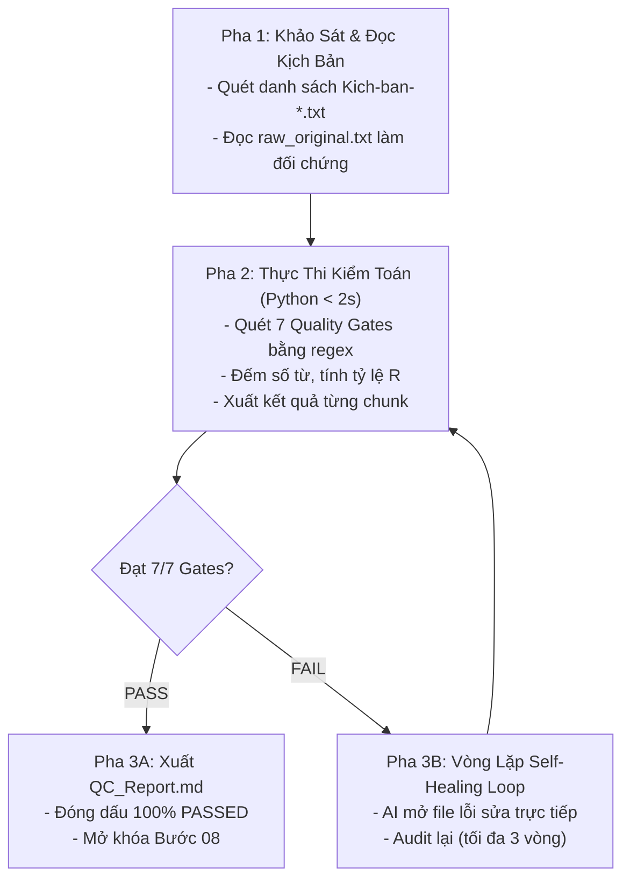

# Kỹ năng 07: Kiểm Toán Đối Soát 7 Cổng Chất Lượng (Audiobook QC Auditor)

## 1. Đặc Tả Quy Trình Thao Tác Chuẩn (Specification - SOP)

Kỹ năng `arf_07_audiobook_qc_auditor` là "Cổng Kiểm Soát Cứng (Hard QC Gate)" duy nhất quyết định quyền mở khóa sang khâu đạo diễn và thu âm TTS (Bước 08A/08B). Nếu có bất kỳ Gate nào thất bại, hệ thống tự động khóa quyền thu âm và kích hoạt quy trình tự sửa lỗi.

### 1.1 Ma Trận 7 Cổng Kiểm Toán Thép (The 7 Quality Gates)
| Gate | Tên Cổng Kiểm Soát | Quy Chuẩn Kỹ Thuật Định Lượng | Trạng Thái Bắt Buộc |
| :---: | :--- | :--- | :---: |
| **G1** | **Cấu trúc Thư mục & Tệp** | Đường dẫn chuẩn `^[a-zA-Z0-9\-]+$`; tệp kịch bản: `kich-ban/Kich-ban-{N}.txt`. | **PASSED** |
| **G2** | **Giới hạn Độ dài Chunk** | Không file rỗng (0 bytes); độ dài mỗi chunk: **$C \le 3.000$ ký tự**. | **PASSED** |
| **G3** | **Sạch Ký Tự Cấm TTS** | 0 ký tự cấm: không chứa `""`, `“”`, `()`, `[]`, `:`, `;`, `—`, `–`, bullet points, markdown. | **PASSED** |
| **G4** | **Chính sách Zero-Digit** | 100% không sót chữ số `0-9` (chấp nhận số cổ phong *canh ba, ba vạn quân* với văn học kinh điển). | **PASSED** |
| **G5** | **Cú pháp Nhịp Thở Phát Thanh** | Đúng cú pháp `. ......` (chấm, cách, 6 chấm). Cấm tuyệt đối `...` hoặc `....`. | **PASSED** |
| **G6** | **Chống Tóm Tắt (Expansion Ratio)** | Tỷ lệ từ vựng kịch bản so với bản gốc tiếng Anh: **$R = W_{vi} / W_{en} \ge 0.75$**. | **PASSED** |
| **G7** | **Chiến Lược Biên Tập & Thuật Ngữ** | Tuân thủ Chiến lược 3 tầng (không lặp ngoại ngữ $\ge 3$ lần/đoạn) hoặc bảo tồn 100% âm Hán-Việt cổ. | **PASSED** |

---

## 2. Điều Kiện Kích Hoạt & Cụm Từ Khóa (When to Use & Triggers)

### 2.1 Bối Cảnh Sử Dụng
- Khi các tệp `Kich-ban-*.txt` vừa hoàn thành tại Bước 06 và cần được nghiệm thu trước khi thu âm.
- Khi người dùng muốn kiểm tra chất lượng của một chương sách hoặc toàn bộ dự án.

### 2.2 Câu Lệnh Người Dùng Điển Hình (User Prompt Triggers)
- *"Kiểm tra QC kịch bản chương này: `01-chuong-1`"*
- *"Chạy Bước 07 audit chất lượng kịch bản"*
- *"Xuất báo cáo QC_Report.md xem có đạt 7/7 Gates không"*
- *"Kịch bản này có bị sót số trần hay ký tự cấm không, audit lại giúp tôi"*

---

## 3. Trình Tự Thực Thi Từng Bước (Step-by-Step Execution)



### Pha 1: Tiền kiểm tra (Pre-checks)
1. Xác nhận sự hiện diện của thư mục `kich-ban/` và các tệp `Kich-ban-*.txt`.
2. Kiểm tra tệp gốc `raw_original.txt` để lấy số từ tiếng Anh $W_{en}$ làm đối chứng.

### Pha 2: Thực thi kiểm toán tự động (Core Python Audit)
AI Chính trực tiếp thực thi script kiểm toán (< 2 giây):
```bash
python .agent/skills/arf_07_audiobook_qc_auditor/scripts/qc_pipeline_v2.py --input_dir "Kich-ban-clipchamp/<BOOK_SLUG>"
```
Hoặc kiểm tra độc lập từng chương:
```python
from qc_pipeline_v2 import audit_chapter
all_passed, report_md, stats = audit_chapter("<CHAPTER_DIR>", "<CHAPTER_FOLDER>")
```

### Pha 3: Hậu kiểm & Vòng lặp tự chữa lành (Self-Healing Loop)
1. **Trường hợp 100% PASSED:**
   - Ghi báo cáo `QC_Report.md` tại thư mục chương.
   - Cập nhật `.session_manifest.json` ghi nhận `step_7_status: "completed"`, `qc_status: "passed"`.
   - Cấp quyền mở khóa sang Bước 08A/08B.
2. **Trường hợp CÓ GATE FAILED (Self-Healing):**
   - AI đọc danh sách lỗi cụ thể trong `QC_Report.md` (ví dụ: dòng chứa số trần `15`, ký tự `""`, hoặc câu $> 30$ từ).
   - AI mở trực tiếp file kịch bản bị lỗi, tiến hành sửa triệt để (số hóa bằng chữ, thay thế dấu phẩy, bẻ ngắn câu).
   - Chạy lại kiểm toán. Lặp lại tối đa 3 lần cho đến khi đạt **100% 7/7 Gates PASSED**.

---

## 4. Ràng Buộc Đầu Ra (Output Contract)

File báo cáo kiểm toán bắt buộc nằm tại thư mục gốc của chương:
- Đường dẫn: `[chapter_folder]/QC_Report.md`
- Tiêu chí nghiệm thu:
  - Báo cáo định dạng Markdown chi tiết cho từng chunk kịch bản.
  - Phải có Badge kết luận chính thức: `[✓] 100% 7/7 Quality Gates PASSED`.

### Mẫu Tóm Tắt Trong `QC_Report.md`:
```markdown
# BÁO CÁO KIỂM TOÁN CHẤT LƯỢNG KỊCH BẢN (QC REPORT)
- Thư mục: 01-chuong-1
- Tổng số chunks: 4
- Tỷ lệ dãn nở từ vựng R: 0.92 (PASSED >= 0.75)
- Zero-digit: 0 số trần còn sót (PASSED)
- Ký tự cấm: 0 ký tự vi phạm (PASSED)
- Kết luận chung: 100% 7/7 Quality Gates PASSED [MỞ KHÓA THU ÂM BƯỚC 08]
```

---

## 5. Cơ Chế Phủ Định & Điều Cấm Kỵ (Negative Triggers & Constraints)

- **TUYỆT ĐỐI CẤM BYPASS BƯỚC 07:** Nghiêm cấm mọi hành vi chuyển sang Bước 08A hoặc 08B khi `QC_Report.md` chưa đạt 100% PASSED.
- **CẤM THAY ĐỔI TIÊU CHUẨN ĐỂ VƯỢT QUA KIỂM TOÁN:** Không được nới lỏng regex hoặc hạ thấp ngưỡng để che giấu lỗi sót số hay câu dài. Phải sửa kịch bản, không sửa luật.
- **CẤM ĐỂ LẠI FILE LỖI DANG DỞ:** Nếu phát hiện Gate Fail, phải kích hoạt Self-Healing Loop sửa dứt điểm ngay lập tức.
- **CẤM CHẠY KIỂM TOÁN QUA SUB-AGENT LLM CHẬM CHẠP:** Kiểm toán 7 Gates là tác vụ kỹ thuật tất định, bắt buộc AI Chính chạy script Python để có kết quả chính xác 100% sau 1 giây.
