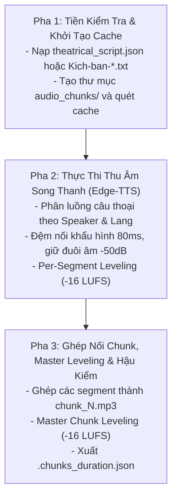

# Kỹ năng 08B: Thu Âm Phòng Thu & Cân Bằng Âm Học Hai Tầng (Neural TTS Synthesizer)

## 1. Đặc Tả Quy Trình Thao Tác Chuẩn (Specification - SOP)

Kỹ năng `arf_08_tts_neural_bgm_mixer` (Bước 08B) đóng vai trò **Kỹ Sư Phòng Thu Âm Thanh Chuẩn Mực (Master Recording Sound Engineer)**. Nhiệm vụ tối thượng là tiếp nhận kịch bản phân vai đã hoàn chỉnh từ Bước 08A, vận hành động cơ song thanh Dual-Voice 4 tầng, hiện thực hóa các tham số kịch nghệ và làm chủ chất lượng âm thanh phát thanh quốc tế.

### 1.1 Ma Trận Giọng Đọc Đồng Nhất Giới Tính (Gender-Consistent Profiles)
| Hồ Sơ Giới Tính | Giọng Tiếng Việt Chính | Giọng Tiếng Anh / Latinh | Ngoại Ngữ Khác | Quy Chuẩn Equalizer (EQ) |
| :--- | :--- | :--- | :--- | :--- |
| **Nam (Male Profile)** | `vi-VN-NamMinhNeural`<br>(Rate: `-10%`) | `en-US-BrianMultilingualNeural`<br>(Adaptive Rate: `-24%` $\to$ `-15%`) | Pháp: `Henri`<br>Đức: `Conrad`<br>TBN: `Alvaro` | `+2.5dB` tại 300Hz (trầm ấm lồng ngực); `-2.0dB` tại 4.000Hz (dịu chói gắt). |
| **Nữ (Female Profile)** | `vi-VN-HoaiMyNeural`<br>(Rate: `-10%`) | `en-US-EmmaMultilingual`<br>(Adaptive Rate: `-24%` $\to$ `-15%`) | Pháp: `Denise`<br>Đức: `Katja`<br>TBN: `Elvira` | `+2.0dB` tại 300Hz (ấm mượt); `-2.0dB` tại 4.500Hz (khử sibilance sắc nhọn). |

### 1.2 Thang Tốc Độ Ngoại Ngữ Thích Ứng (Dynamic Foreign Speed Ladder)
- **1 từ hoặc từ viết tắt (`P-M-I`, `W-B-S`, `scope`, `bar`):** Tốc độ **`-24%`** $\to$ tròn vành rõ chữ, không nuốt âm.
- **2 – 3 từ (`Project Manager`, `Sprint Backlog`):** Tốc độ **`-18%`** $\to$ nhịp đĩnh đạc, chuyển ngữ thanh thoát.
- **$\ge 4$ từ (mệnh đề/tiêu đề tiếng Anh dài):** Tốc độ **`-15%`** $\to$ giữ vững dòng chảy hứng khởi, không trì trệ.

### 1.3 Quy Chuẩn Cân Bằng Âm Học Hai Tầng & Đồng Nhất Chuẩn 48kHz
$$\text{Loudness Target} = -16 \text{ LUFS} \quad (\text{True Peak } \le -1.5 \text{ dBTP}, \text{ LRA } 5 - 6)$$
1. **Tầng 1 (Per-Segment Leveling & DSP Formant EQ):** Áp dụng bộ lọc cân bằng và định hình formant trên từng câu thoại riêng lẻ trước khi nối:
   `-af "areverse,silenceremove=start_periods=1:start_duration=0.05:start_threshold=-50dB,areverse,{timbre_eq},loudnorm=I=-16:TP=-1.5:LRA=5,apad=pad_dur={pad_sec}"`.
2. **Tầng 2 (Master Chunk Leveling):** Toàn bộ file chunk sau khi nối được nén chuẩn đồng nhất:
   `-af "loudnorm=I=-16:TP=-1.5:LRA=6"`.
3. **Đồng nhất tần số lấy mẫu 48.000 Hz tuyệt đối:** Cả giọng đọc, các câu thoại và các khoảng lặng phát thanh (`. ......`) đều được xuất chuẩn `-ar 48000`, triệt tiêu hoàn toàn hiện tượng lệch mẫu (sample rate mismatch) gây tiếng nổ lách tách.
4. **Bảo tồn đuôi âm khẽ `-50dB`:** Ngưỡng cắt silence an toàn `start_threshold=-50dB`, bảo toàn 100% âm tàn tiếng Việt.

### 1.4 Cơ Chế Chuyển Giao Khẩu Hình & Đệm Thở Thích Ứng (Adaptive Dynamic Handoff)
- **Tiếp nhận tham số `lead_in_pause` linh hoạt:** Phòng thu đọc trực tiếp giá trị đệm thở từ `theatrical_script.json` khóa cứng trong dải chuẩn từ thấp nhất 0.45s đến cao nhất 1.20s **[0.45s – 1.20s]**:
  * *Cắt lời tức thì:* `0.45s – 0.52s` (nhịp ngắt dứt khoát nhưng có đệm tối thiểu 450ms chống giật cụt, bảo toàn trọn vẹn hơi thở người nói trước).
  * *Dẫn nhập thúc giục:* `0.48s – 0.58s`.
  * *Tự nhiên / Đàm đạo:* `0.55s – 0.68s` (nhịp thở sinh học êm dịu).
  * *Ngân rung thoại:* `0.65s – 0.80s` (lời thoại ngân sâu trước khi dẫn tiếp).
  * *Trầm ngâm / Buông tiếng:* `0.75s – 0.95s`.
  * *Trang nghiêm triều đình:* `0.80s – 1.00s`.
  * *Khoảng lặng kịch tính:* `1.00s – 1.20s` (chấn động tâm lý).
  * *Đệm thở ngâm thơ 3 tầng:* `0.52s – 1.20s` (Lead-in 0.52s - 0.98s, Inter-verse 0.55s, Coda kết bài 1.00s - 1.20s).
- **Micro-fade 25ms:** Tự động làm mượt 25ms ở hai đầu ranh giới tiếp giáp, đảm bảo chuyển đổi giữa các sắc thái EQ không bị giật cục.

---

## 2. Điều Kiện Kích Hoạt & Cụm Từ Khóa (When to Use & Triggers)

### 2.1 Bối Cảnh Sử Dụng
- Khi đã có file `theatrical_script.json` từ Bước 08A (với văn học) hoặc các file `Kich-ban-*.txt` đã đạt QC Bước 07 (với phi hư cấu).
- Khi người dùng yêu cầu thu âm giọng đọc hoặc sinh các file audio chunk cho chương sách.

### 2.2 Câu Lệnh Người Dùng Điển Hình (User Prompt Triggers)
- *"Thu âm giọng đọc cho chương này: `01-chuong-1`"*
- *"Chạy Bước 08 TTS sinh các chunk âm thanh"*
- *"Thu âm song thanh Nam Minh và Brian cho kịch bản"*
- *"Render audio_chunks bằng Edge-TTS"*

---

## 3. Trình Tự Thực Thi Từng Bước (Step-by-Step Execution)



### Pha 1: Tiền kiểm tra & Caching (Pre-checks)
1. Xác nhận sự tồn tại của kịch bản đầu vào: ưu tiên `theatrical_script.json` (từ Bước 08A) hoặc `kich-ban/Kich-ban-*.txt`.
2. Tạo thư mục `[chapter_dir]/audio_chunks/`.
3. Quét tệp cache cũ: nếu chunk đã tồn tại và thời lượng đạt chuẩn thì bỏ qua (Part-Level Caching).

### Pha 2: Tổng hợp giọng đọc song thanh (Core TTS Synthesis)
AI thực thi lệnh tổng hợp qua pipeline:
```bash
python core/antigravity_audiobook_pipeline.py --book_dir "<BOOK_DIR>" --chapter "<CHAPTER_FOLDER>"
```
Hoặc gọi trực tiếp module:
```python
import asyncio
from core.seamless_dual_voice_splicer import synthesize_chapter_tts
asyncio.run(synthesize_chapter_tts("<CHAPTER_DIR>", "<CHAPTER_NAME>"))
```
- Cơ chế Exponential Backoff: nếu API Microsoft Edge TTS báo bận, tự động chờ `3.0s * attempt` (tối đa 7 lần), tuyệt đối không đổi sang giọng khác giới tính.

### Pha 3: Hậu kiểm tra & Đo đạc thời lượng (Post-Processing & Manifest)
1. Đo thời lượng từng chunk âm thanh bằng FFmpeg.
2. Xuất tệp metadata: `[chapter_dir]/.chunks_duration.json`.
3. Cập nhật `.session_manifest.json` ghi nhận `step_8_status: "completed"`, `total_audio_chunks: N`, `total_duration_minutes`.

---

## 4. Ràng Buộc Đầu Ra (Output Contract)

Mọi chương hoàn tất Bước 08B phải có đầy đủ các tệp âm thanh trong `audio_chunks/`:
```text
[chapter_folder]/
├── .chunks_duration.json           # Danh sách thời lượng từng chunk
└── audio_chunks/
    ├── chunk_1.mp3                 # Audio chunk 1 chuẩn -16 LUFS
    ├── chunk_2.mp3                 # Audio chunk 2 chuẩn -16 LUFS
    └── ...
```

### Mẫu Tệp `.chunks_duration.json`:
```json
{
  "chunk_1.mp3": 178.45,
  "chunk_2.mp3": 192.10,
  "chunk_3.mp3": 185.60
}
```

---

## 5. Cơ Chế Phủ Định & Điều Cấm Kỵ (Negative Triggers & Constraints)

- **TUYỆT ĐỐI KHÔNG PHÂN TÍCH LẠI KỊCH NGHỆ Ở BƯỚC 08B:** Toàn bộ việc bóc tách nhân vật, tuổi tác và khí chất đã hoàn thành ở Bước 08A. Phòng thu Bước 08B chỉ đọc kịch bản và thu âm, không phỏng đoán lại vai.
- **CẤM ĐỔI GIỚI TÍNH GIỌNG ĐỌC KHI GẶP LỖI (GENDER INVARIANCE):** Hồ sơ Nam Minh thì 100% tiếng Việt phải là Nam Minh; khi retry mạng tuyệt đối không được chuyển sang giọng nữ Hoài My làm méo mó sản phẩm.
- **CẤM GỘP CÁC CHUNK THÀNH FILE DÀI TẠI BƯỚC 08B:** Khâu gộp thành tập 25-35 phút là nghiệp vụ riêng của Bước 09 (`arf_09`).
- **CẤM LỒNG NHẠC NỀN BGM TẠI BƯỚC 08B:** Hòa âm BGM thuộc Bước 10 (`arf_10`).
- **CẤM LƯU FILE MP3 RA THƯ MỤC GỐC CHƯƠNG:** Bắt buộc lưu tập trung vào `audio_chunks/`.
