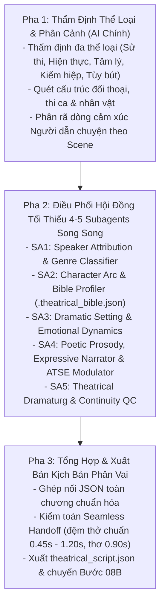

# Kỹ năng 08A: Đạo Diễn Kịch Nghệ & Phân Vai Đa Thanh (Theatrical Voice Director)

## 1. Đặc Tả Quy Trình Thao Tác Chuẩn (Specification - SOP)

Kỹ năng `arf_08a_theatrical_voice_director` giữ vai trò **Tổng Đạo Diễn Nghệ Thuật Tiền Kỳ (Chief Dramaturg & Casting Master)**. Để kịch bản audio truyền tải sâu sắc linh hồn tác phẩm, phân hóa sắc nét từng nhân vật (dù cùng chung giọng nền `vi-VN-NamMinhNeural`) và chuyển giao mượt mà không giật cục, kỹ năng áp dụng **Bộ Best Practices 5 Trụ Cột Đột Phá** kết hợp **Khung Dẫn Chuyện Đa Sắc Thái Thích Ứng**, **Động Cơ Thẩm Định Thi Ca & Ngâm Vịnh Chuyên Sâu**, **Động Cơ Tổng Hợp Âm Sắc Thích Ứng (ATSE)** và **Hội Đồng Đạo Diễn $\ge 4-5$ Subagents Chuyên Môn Song Song**.

### 1.1 Thẩm Định Thể Loại Đa Nền Tảng (Universal Multi-Genre Taxonomy)
AI trực tiếp thẩm định chiều sâu văn học của tác phẩm, phân loại chiến lược diễn đọc theo ma trận thể loại mở:
| Thể Loại Tác Phẩm | Đại Diện Tiêu Biểu | Bản Chất Kịch Nghệ & Dòng Cảm Xúc | Chiến Lược Đạo Diễn & Thiết Lập Âm Học |
| :--- | :--- | :--- | :--- |
| **Hiện thực phê phán / Văn học xã hội** | Nam Cao, Vũ Trọng Phụng, Ngô Tất Tố, Balzac, Victor Hugo | Cơ cực bần hàn, bi kịch uất nghẹn, trào phúng châm biếm, thói đời kệch cỡm. | Dẫn truyện: `melancholic_social` (-3Hz, -12%) hoặc `satirical_ironic` (+2Hz, -6%). Thoại: mở rộng pitch, gằn mép hoặc chua chát cay đắng. |
| **Tâm lý / Hiện sinh / Noir trinh thám** | Dostoevsky, Camus, Kafka, Arthur Conan Doyle, Higashino | Giằng xé nội tâm sâu kín, vực thẳm hư vô, logic phá án sắc lạnh, suy luận điềm tĩnh. | Dẫn truyện: `existential_interior` (-2Hz, -10%) hoặc `analytical_noir` (0Hz, -5%). Thoại độc thoại thì thào vi mô, ngưng nghỉ nặng trĩu. |
| **Tùy bút / Hồi ký / Tản văn trữ tình** | Thạch Lam, Vũ Bằng, Nguyễn Tuân, Hoàng Phủ Ngọc Tường | Hoài niệm man mác, êm đềm sâu lắng, tiếng thở dài của thời gian, bâng khuâng ký ức. | Dẫn truyện: `nostalgic_memoir` (-1Hz, -10%) hoặc `contemplative` (-2Hz, -12%). Nhịp buông lơi êm dịu, đệm thở mềm mại. |
| **Kiếm hiệp / Huyền huyễn / Sử thi anh hùng** | Kim Dung, Cổ Long, *Tam Quốc*, *Thủy Hử*, *Iliad* | Giang hồ tiêu sái, hào sảng trượng nghĩa, chiến trận long trời lở đất, hưng suy thế sự. | Dẫn truyện: `wuxia_heroic` (+1Hz, -4%), `epic` (+1Hz, 0%), `elegiac` (-3Hz, -10%). Thoại: vang rền lồng ngực hoặc the lạnh thâm hiểm. |
| **Tự lực / Phát triển bản thân** | Dale Carnegie, James Clear, Stephen Covey | Đối thoại 1-1 chân thành giữa Tác giả và Độc giả (`Tôi - Bạn`). | Dẫn truyện Cố vấn (`Pitch -2Hz`, `Rate -3%`), nhấn sâu đúc kết triết lý (`. ......` 1.8s). Khóa cứng 1 giới tính. |
| **Khoa học / Quản trị dự án** | PMBOK, Agile Practice Guide, Sách chuyên khảo | Phân tích học thuật khách quan, chuẩn xác cấu trúc H1/H2. | Phát thanh chuyên gia (`Pitch 0Hz`, `Rate 0%`), tách âm viết tắt (*P-M-I*), Brian đọc ngoại ngữ chuẩn. |

### 1.2 Động Cơ Phân Vai Kịch Nghệ: Dải Tương Phản Âm Học Mở Rộng (Deep Persona Polarizer)
$$\text{Tone Thoại Cuối} = \text{Cốt Giọng Theo Tuổi} + \Delta_{\text{Khí Chất}} + \Delta_{\text{Cảm Xúc Phân Cảnh}}$$
Triệt tiêu triệt để hiện tượng "nghe như một người nói" bằng cách mở rộng biên độ Pitch tương phản và tốc độ phát thanh:
- **5 Giai đoạn tuổi tác cuộc đời:** Ấu thơ (`+10Hz`, `+10%`), Vỡ giọng/Thiếu niên (`+6Hz`, `+6%`), Thanh xuân (`+1Hz`, `+2%`), Trung niên (`-4Hz`, `-8%`), Lão hóa (`-8Hz`, `-18%`).
- **10 Khí chất bản thể:** Anh hùng hào sảng (`-2Hz`, `0%`), Trầm uất dằn vặt (`-3Hz`, `-6%`), Giảo hoạt nham hiểm (`+1Hz`, `-4%`), Hách dịch bạo ngược (`+3Hz`, `+6%`), Xun xoe đớn hèn (`+6Hz`, `+8%`), Trong sáng thánh thiện (`+3Hz`, `+2%`), Bi kịch uất nghẹn (`-4Hz`, `-8%`), Lãng mạn bay bổng (`+1Hz`, `-3%`), Khắc khổ lạnh lùng (`-3Hz`, `-6%`), Tếu táo hóm hỉnh (`+3Hz`, `+4%`).
- **12 Cung bậc cảm xúc phân cảnh:** Cuồng nộ (`+6Hz`, `+8%`), Đau đớn trăng trối (`-5Hz`, `-10%`), Đe dọa thâm hiểm (`-5Hz`, `-6%`), Nịnh bợ van xin (`+6Hz`, `+6%`), Hồi hộp thì thào (`-1Hz`, `-6%`), Độc thoại dằn vặt (`-3Hz`, `-5%`), Ghen tuông cay đắng (`+2Hz`, `0%`), Ngượng ngùng tình đầu (`+3Hz`, `-2%`), Bàng hoàng chết lặng (`0Hz`, `-10%`), Hoan ca đắc thắng (`+4Hz`, `+5%`), Mỉa mai châm biếm (`+2Hz`, `-3%`), Mệt mỏi buông xuôi (`-5Hz`, `-8%`).

> **⚠️ QUY TẮC PHÂN HÓA GIỌNG DŨNG TƯỚNG (Heroic Warrior Casting Invariant):**
> Dũng tướng thô mộc uy dũng (Trương Phi, Hứa Chử, Hậu Thoát Hổ, Lữ Bố khi chiến trận, Trương Lâm...) thuộc khí chất "Anh hùng hào sảng" PHẢI được gán `base_pitch ≤ -2Hz` (giọng trầm, vang như sấm) kết hợp `timbre_eq: "chest_resonance"` và `rate: +4% đến +8%` (oai vệ, dứt khoát). TUYỆT ĐỐI KHÔNG gán pitch dương cao (+3Hz trở lên) cho dũng tướng — kết quả sẽ nghe như thiếu niên nóng nảy thay vì uy dũng khí thế. Riêng khi dũng tướng CỰC KỲ phẫn nộ ("cuong_no" đỉnh điểm), pitch có thể đẩy lên tối đa +2Hz — nhưng vẫn phải kết hợp `rate: +10% đến +15%` và `timbre_eq: "chest_resonance"` để giữ vẻ hung hãn thô mộc, không được mỏng thé.

### 1.3 Động Cơ Tổng Hợp Âm Sắc Thích Ứng (Adaptive Timbre Synthesis Engine - ATSE)
Thay thế ma trận EQ tĩnh cố định bằng **Khung Điêu Khắc Âm Học 4 Trục (4-Axis Acoustic Sculpture Framework)**. AI được trao toàn quyền kết hợp các trục hoặc tự do truyền chuỗi bộ lọc FFmpeg DSP parametric:
- **Trục 1 (Body / Thân giọng - Low-end depth, 150 – 300 Hz):** Tăng cường độ dày, ấm áp hoặc gọt mỏng tạo vẻ mảnh khảnh.
- **Trục 2 (Nasal / Hộp âm - Low-mid clarity, 400 – 800 Hz):** Điều biến độ vang đục của tuổi già, tiếng khóc nghẹn hoặc độ trải đời.
- **Trục 3 (Presence / Gai góc - Mid bite, 1.5k – 4 kHz):** Điêu khắc độ đanh thép xung trận, tiếng quát thị uy hoặc sự sắc lạnh giảo hoạt.
- **Trục 4 (Air / Thoát khí - High patina, 5k – 10 kHz):** Tạo độ bàng bạc thi ca, tiếng thì thào nội tâm hoặc màn sương hoài niệm.

| Nhãn `timbre_eq` / Chuỗi DSP | Nhân Vật & Phân Cảnh Thích Ứng | Cấu Hình Tần Số EQ Mục Tiêu | Hiệu Ứng Thính Giác |
| :--- | :--- | :--- | :--- |
| `chest_resonance` | Hảo hán xung trận, Trương Phi, Hứa Chử | Boost $160\text{Hz} (+5\text{dB})$, Boost $300\text{Hz} (+2.5\text{dB})$, Dip $3.5\text{kHz} (-3\text{dB})$ | Vang rền lồng ngực, đanh thép như tiếng lệnh sấm truyền. |
| `warm_authority` | Đại trượng phu, bậc quân sư, Lưu Bị, Gia Cát Lượng | Boost $280\text{Hz} (+3.5\text{dB})$, Boost $2.2\text{kHz} (+2\text{dB})$, Dip $4.5\text{kHz} (-2.5\text{dB})$ | Trầm ấm, đĩnh đạc, tròn vành rõ chữ của bậc danh gia. |
| `sharp_cunning` | Kẻ mưu mô giảo hoạt, gian hùng, Tào Tháo, Bá Kiến | High-pass $220\text{Hz}$, Boost $2.8\text{kHz} (+4.5\text{dB})$, Boost $5.5\text{kHz} (+3\text{dB})$ | The lạnh, gằn mép, hiểm hóc, giảo hoạt sắc bén. |
| `aged_gravel` | Trưởng lão, lão tướng già, Kiều Quốc Lão, Hoàng Trung | Boost $420\text{Hz} (+4.5\text{dB})$, Low-pass $4.2\text{kHz}$, Dip $1.2\text{kHz} (-3\text{dB})$ | Khàn đục, cũ kỹ, trải đời của kiếp người sương gió. |
| `youth_bright` | Thiếu niên, tiểu đồng, nữ cải trang | High-pass $280\text{Hz}$, Boost $3.8\text{kHz} (+4.5\text{dB})$, Boost $6.5\text{kHz} (+2.5\text{dB})$ | Sáng mảnh, thanh thoát, ngây thơ trong trẻo. |
| `servile_flatterer`| Kẻ xun xoe nịnh bợ, đớn hèn, quan lại tham lam | High-pass $320\text{Hz}$, Boost $2.6\text{kHz} (+4\text{dB})$, Boost $4.8\text{kHz} (+3.5\text{dB})$ | The thé, mỏng quẹt, đon đả, xun xoe nịnh hót. |
| `tyrant_arrogant` | Kẻ hách dịch, bạo chúa thị uy, Đổng Trác | Boost $190\text{Hz} (+4.5\text{dB})$, Boost $1.8\text{kHz} (+4\text{dB})$, Boost $4\text{kHz} (+2\text{dB})$ | Bạo ngược, ồm ồm gầm gừ, áp chế kẻ đối thoại. |
| `tragic_grief` | Bi kịch lầm than, đau đớn trăng trối, uất nghẹn | Boost $320\text{Hz} (+4\text{dB})$, Dip $1.6\text{kHz} (-3.5\text{dB})$, Low-pass $4.8\text{kHz}$ | Nghẹn ngào, run rẩy, đặc quánh nỗi đau uất nghẹn. |
| `poetic_recitation` | Ngâm vịnh thi ca cổ, khúc ngâm hoài niệm | Boost $250\text{Hz} (+3.5\text{dB})$, Dip $3.5\text{kHz} (-2\text{dB})$, Low-pass $7.5\text{kHz}$ | Trầm vang mênh mang, ngân nga ấm áp, triệt tiêu gắt chói. |
| `melancholic_social`| Bi kịch lầm than, khốn cùng, Chí Phèo, Chị Dậu | Boost $350\text{Hz} (+3\text{dB})$, Dip $2.5\text{kHz} (-2.5\text{dB})$ | Nghẹn ngào, u uất, đặc quánh nỗi đau kiếp lầm than. |
| `satirical_ironic` | Trào phúng, mỉa mai thế sự, Xuân Tóc Đỏ | High-pass $180\text{Hz}$, Boost $2.8\text{kHz} (+3\text{dB})$, Boost $5\text{kHz} (+2\text{dB})$ | Chua ngoa, châm biếm, sắc lẹm, bộc lộ sự kệch cỡm. |
| `existential_interior`| Độc thoại nội tâm, giằng xé hiện sinh | Boost $200\text{Hz} (+3\text{dB})$, Dip $4\text{kHz} (-3\text{dB})$ | Trầm lặng, sâu thẳm, tiếng dội vọng từ vực sâu tâm thức. |
| `wuxia_heroic` | Hiệp khách phiêu bạt, kiếm sĩ tiêu sái | Boost $220\text{Hz} (+3\text{dB})$, Boost $2.2\text{kHz} (+2.5\text{dB})$ | Tiêu sái giang hồ, khí phách ngang tàng, phóng khoáng. |
| `intimate_narrator` | Người kể chuyện bình nhật | Flat Studio EQ cân bằng phát thanh | Khách quan, tự nhiên, tạo vùng đệm êm ái tôn bật lời thoại. |
| `epic_narrator` | Người kể chuyện hào hùng chiến trận | Boost $2.5\text{kHz} (+3\text{dB})$, $200\text{Hz} (+2\text{dB})$ | Hào sảng, nhịp dồn dập, khí thế ngút trời. |
| `elegiac_narrator` | Người kể chuyện bi tráng, xót thương | Boost $400\text{Hz} (+2.5\text{dB})$, Dip $3\text{kHz} (-2\text{dB})$ | Chùng lắng, nghẹn ngào, nén sâu cảm xúc đau thương. |
| `suspense_narrator` | Người kể chuyện hồi hộp, rình rập | High-pass $150\text{Hz}$, Boost $3.5\text{kHz} (+3\text{dB})$ | Hạ giọng thì thào vi mô, ngắt nhịp sắc sảo rình rập. |
| `contemplative_narrator`| Người kể chuyện hoài cổ, triết lý thế sự | Boost $250\text{Hz} (+3\text{dB})$, Low-pass $6\text{kHz}$ | Trầm ấm đĩnh đạc, mênh mang như tiếng chuông chiều. |
| *Chuỗi DSP tùy biến* | AI tự do kiến tạo contour âm sắc mới | Cú pháp: `equalizer=f=F:t=q:w=W:g=G` | Linh hoạt 100%, không bị giới hạn trong danh mục cố định. |

### 1.4 Động Cơ Thẩm Định Thi Ca & Ngâm Vịnh Đa Thể Loại (Poetic Prosody Engine)
Xóa bỏ hoàn toàn tình trạng ngâm thơ vô hồn, đọc vội vã như bản tin thời sự bằng **Quy Chuẩn Âm Học Thi Ca 4 Lớp**:
1. **Phân rã dòng độc lập (Line-by-Line Decomposition):** 100% các câu thơ trong bài thơ bắt buộc phải được bóc tách thành từng entry riêng biệt với `type: "poem"`. Tuyệt đối cấm gộp nguyên cả bài thơ thành một đoạn văn xuôi duy nhất.
2. **Kỹ thuật ngắt nhịp vi mô theo thể thơ (Metrical Caesura Injection):** AI tự động nhận diện niêm luật và chèn breathing comma `, ` vào điểm ngắt nhịp tự nhiên:
   - *Song thất lục bát & Từ khúc Hán Việt:* Câu 7 chữ chuẩn ngắt **4/3** (không phải 2/2/3): *"Bạn đầu bạc, ngư tiều trên bãi,"* (ngắt sau chữ thứ 4 — "Bạn đầu bạc,"), *"Trường Giang cuồn cuộn, chảy về đông,"* (ngắt sau chữ thứ 4 — "Trường Giang cuồn cuộn,"). Tuyệt đối KHÔNG ngắt 2/2/3 kiểu "Trường Giang, cuồn cuộn, chảy về đông," — TTS sẽ đọc ngập ngừng từng đôi chữ gây cảm giác vấp váp, phá hỏng âm điệu Đường luật. Câu 6 chữ lục bát ngắt 3/3: *"Sóng vùi dập, hết anh hùng,"*. Câu 8 chữ ngắt 4/4.
   - *Thất ngôn Đường luật:* Ngắt $4/3$ hoặc $2/2/3$.
   - *Lục bát cổ truyền:* Ngắt $2/2/2$ hoặc $3/3$ (câu lục), ngắt $4/4$ hoặc $2/2/2/2$ (câu bát).
   - *Ngũ ngôn:* Ngắt $2/3$ (*Non xanh, / nguyên vẻ cũ,*).
3. **Cấu trúc đệm thở 3 tầng (Three-Tier Poetic Cushioning):**
   - *Tầng 1 (Lead-in Cushion):* Đệm **`0.52s – 0.98s`** sau câu dẫn thơ (*"Có bài từ rằng,"*, *"Thơ rằng:"*).
   - *Tầng 2 (Inter-Verse Cushion):* Đệm trang trọng **`0.52s – 0.65s`** (`lead_in_pause: 0.55s`) giữa các câu thơ để từng con chữ ngân vang lắng đọng, nhịp độ vừa vặn không lê thê.
   - *Tầng 3 (Ending Coda Cushion):* Đệm lắng sâu **`1.00s – 1.20s`** (`. ......`) sau khổ thơ hoặc khi kết bài thơ để người nghe chiêm nghiệm trọn vẹn.
4. **Quy chuẩn cao độ & nhịp độ thi ca:** Giọng ngâm đặt `pitch: -2Hz` (hoặc `-3Hz`), `rate: -18%` (chậm rãi, khoan thai, nhả chữ tròn vành) kết hợp bộ lọc âm sắc `timbre_eq: "poetic_recitation"`.

### 1.5 Khung Đạo Diễn Dẫn Truyện Đa Sắc Thái Thích Ứng (Adaptive Expressive Narrator)
Người kể chuyện (Narrator) là **Linh hồn dẫn dắt (The Narrative Soul)** của tác phẩm. AI không gán cứng duy nhất một thiết lập đơn điệu (`pitch: 0Hz`, `rate: -5%`) xuyên suốt, mà chủ động điều biến sắc thái dẫn chuyện thích ứng theo từng phân cảnh:
- **Hào hùng / Chiến trận (`epic_narrator`):** `pitch: +1Hz ~ +2Hz`, `rate: -2% ~ 0%`, `lead_in_pause: 0.45s ~ 0.50s`.
- **Bi tráng / Xót thương (`elegiac_narrator`):** `pitch: -2Hz ~ -3Hz`, `rate: -10% ~ -12%`, `lead_in_pause: 0.55s ~ 0.65s`.
- **Hồi hộp / Rình rập (`suspense_narrator`):** `pitch: 0Hz ~ +1Hz`, `rate: -8% ~ -10%`, `lead_in_pause: 0.45s ~ 0.52s`.
- **Chiêm nghiệm / Hoài cổ (`contemplative_narrator`):** `pitch: -2Hz`, `rate: -12% ~ -15%`, `lead_in_pause: 0.60s ~ 0.75s`.
- **U uất xã hội / Lầm than (`melancholic_social`):** `pitch: -3Hz`, `rate: -12%`, `lead_in_pause: 0.55s ~ 0.65s`.
- **Trào phúng / Mỉa mai (`satirical_ironic`):** `pitch: +2Hz`, `rate: -6%`, `lead_in_pause: 0.45s ~ 0.50s`.
- **Nội tâm / Giằng xé hiện sinh (`existential_interior`):** `pitch: -2Hz`, `rate: -10%`, `lead_in_pause: 0.50s ~ 0.60s`.
- **Bình nhật / Tự nhiên (`intimate_narrator`):** `pitch: 0Hz`, `rate: -5%`, `lead_in_pause: 0.45s ~ 0.50s`.

### 1.6 Ma Trận Chuyển Giao Âm Học Thích Ứng (Dynamic Context-Aware Handoff Matrix) & Ngắt Nhịp Kịch Nghệ
Triệt tiêu hoàn toàn sự gấp rút, thô cứng và máy móc bằng Ma trận Chuyển giao Đa nhịp điệu linh hoạt trong dải chuẩn tuyệt đối từ thấp nhất 0.45s đến cao nhất 1.20s **[0.45s – 1.20s]**:

| Loại Chuyển Giao | Khoảng Đệm (`lead_in_pause`) | Ngữ Cảnh Kịch Nghệ & Động Từ Chỉ Thoại Đi Kèm |
| :--- | :---: | :--- |
| **Cắt lời tức thì (`instant_interruption`)** | `0.45s – 0.52s` | Đấu khẩu nảy lửa, cướp lời, quát tháo (*"quát lớn", "chém đứt lời", "hét"*). Nhịp ngắt dứt khoát nhưng có đệm tối thiểu 450ms chống giật cụt, bảo toàn trọn vẹn hơi thở người nói trước. |
| **Dẫn nhập thúc giục (`urgent_lead_in`)** | `0.48s – 0.58s` | Người dẫn chuyển khẩn cấp sang quân lệnh, tiếng hò reo xung trận hoặc biến cố chớp nhoáng (*"quát to,", "thét lớn,", "kinh hãi hô,"*). |
| **Đối đáp thường nhật (`natural_dialogue_turn`)** | `0.55s – 0.68s` | Hội thoại tự nhiên giữa bạn bè, tri kỷ, trao đổi thế sự thông thường, đủ cho nhịp lấy hơi sinh học thoải mái. |
| **Ngân rung thoại (`dialogue_resonance`)** | `0.65s – 0.80s` | Khoảng đệm sau khi nhân vật dứt lời thoại trước khi Người dẫn chuyện tiếp tục dẫn giải, để câu thoại ngấm sâu vào người nghe. |
| **Trầm ngâm buông tiếng (`pensive_lead_in`)** | `0.75s – 0.95s` | Tiếng thở dài, tâm sự nặng trĩu, sầu muộn (*"thở dài", "trầm ngâm", "ngậm ngùi"*). |
| **Trang nghiêm triều đình (`regal_ceremony`)** | `0.80s – 1.00s` | Khấu đầu bẩm báo thiên tử, tuyên chỉ, đối đáp quân thần cung kính, trang trọng. |
| **Chết lặng kịch tính (`dramatic_silence`)** | `1.00s – 1.20s` | Khoảng lặng nín thở sau tin sét đánh, bàng hoàng chết lặng, hoặc đúc kết triết lý sống còn. |
| **Đệm thở thi ca 3 tầng (`poetic_cushion`)** | `0.52s – 1.20s` | `0.52s - 0.98s` (Lead-in nhập bài) $\to$ `0.52s - 0.65s` (`lead_in_pause: 0.55s` ngắt giữa các câu thơ) $\to$ `1.00s - 1.20s` (`. ......` Coda ngân vang kết bài). |

- **Kỹ thuật ngắt nhịp kịch nghệ thông minh trong câu thoại (Dramatic Caesura):** Trong các câu thoại dài $>10$ từ mang xung đột tâm lý, Subagents bắt buộc đặt breathing comma `, ` tại các bước ngoặt cảm xúc (*"Ngươi, ngươi dám trái lệnh ta sao!"*, *"Ta nghĩ, sự nghiệp lớn này, không thể vội vàng được đâu!"*) giúp TTS lấy hơi đúng cảm xúc, triệt tiêu cảm giác đọc vội vã.
- **Micro-fade 25ms & Hạ giọng dẫn tiếp giáp:** Tự động fade-in/out 25ms ở ranh giới câu thoại và đặt dấu phẩy `, ` sau động từ dẫn thoại để giọng dẫn hạ cao độ buông hơi êm ái trước khi nhân vật cất tiếng.
- **Kỹ Thuật Hợp Xướng Thiêng Liêng (Solemn Unison Vow Technique):** Với các dòng `type: "dialogue"` thuộc `emotion: "regal_ceremony"` mà speaker là nhiều người phát ngôn đồng thời (Lời thề kết nghĩa, Tuyên cáo xuất chinh, Lời đồng ca vọng...): gán thêm trường `"chorus_effect": true` và `"reverb": "hall_medium"`, đặt `rate: "-8%"` chậm rãi trang trọng, `pitch: "0Hz"` cân bằng (tránh nghe bị kéo sai chiều). SA4 (Poetic Prosody & Narrator Director) có thể tái hiệu ứng vang vọng bằng chuỗi DSP parametric ATSE tự do: ví dụ `timbre_eq: "equalizer=f=250:t=q:w=2:g=3,aecho=0.6:0.4:30:0.25"` (reverb hall nhẹ + boost mid ấm trung). Đây là kỹ thuật cho phép 1 giọng TTS gợi lên cảm giác đồng thanh thiêng liêng qua hiệu ứng không gian cộng hưởng.

### 1.7 Quy Chuẩn Bóc Tách Tư Thế & Sáp Nhập Thực Thể Cổ Phong (Action Stripping & Entity Unification)
- **Bóc tách động từ tư thế & phó từ (Action & Posture Stripping):** Trong văn học cổ điển, các cử chỉ/hành vi tư thế (*đứng dậy, quỳ xuống, bước ra, ngoảnh lại, chắp tay, rút gươm, vỗ bàn...*) và phó từ (*lại, bèn, liền, vội...*) đi kèm sau tên nhân vật (*Doãn đứng dậy, Biểu lại, Doãn lại*) thuộc về lời dẫn của Người dẫn chuyện (Narrator), TUYỆT ĐỐI KHÔNG được gộp vào tên nhân vật.
- **Sáp nhập thực thể đơn âm & danh xưng cổ (Classical Alias & Entity Unification):** Tên gọi đơn âm (*Doãn, Biểu, Trác, Bố, Thuyền, Lương, Tháo*) hoặc chức danh phong kiến (*Thái sư, Tư đồ, Châu mục, Thái thú, Thừa tướng*) BẮT BUỘC phải quy chuẩn về thực thể đầy đủ duy nhất trong `.theatrical_bible.json` (*Vuong_Doan, Luu_Bieu, Dong_Trac, La_Bo, Dieu_Thuyen, Khoai_Luong, Tao_Thao*). TUYỆT ĐỐI KHÔNG sinh ra các nhân vật dị bản rác (`Bieu_Lai`, `Doan_Dung_Day`, `Doan`, `Doan_Lai`, `Thuyen`, `Thai`...).
- **Định danh đại từ phiếm chỉ theo ngữ cảnh (Context-Aware Pronoun Resolution):** Khi gặp đại từ phiếm chỉ (*Một người, Người ấy, Người kia*), Sub-agents phải thẩm định ngữ cảnh đoạn trước: nếu xảy ra tại phủ tướng, buồng trong, quán rượu và liên quan đến kẻ hầu/lính gác $\to$ gán chuẩn xác cho `Nguoi_Hau` (khí chất `xun_xoe_don_hen`, `timbre_eq: servile_flatterer`) hoặc `Linh_Canh` (`anh_hung_hao_sang`). CẤM gán nhầm sang nhân vật chính hoặc default `anh_hung_hao_sang`.

### 1.8 Hội Đồng Đạo Diễn Kịch Nghệ $\ge 4-5$ Subagents Bắt Buộc $\ge 4-5$ Subagents Bắt Buộc
AI Chính **bắt buộc kích hoạt đồng thời mảng tối thiểu 4 - 5 Subagents chuyên môn song song**:
- **SA 1 (Speaker Attribution & Genre Classifier):** Thẩm định thể loại tác phẩm, bóc tách Lời dẫn vs Thoại vs Thơ, gán Speaker ID chuẩn xác.
- **SA 2 (Character Arc & Bible Profiler):** Thẩm định 5 giai đoạn tuổi tác, 10 khí chất, xuất bản `.theatrical_bible.json`.
- **SA 3 (Dramatic Setting & Emotional Dynamics):** Phân tích tương quan quyền lực, bối cảnh kịch tính, gán 1 trong 12 cảm xúc phân cảnh.
- **SA 4 (Poetic Prosody, Expressive Narrator & ATSE Modulator):** Thẩm định thể thơ, gán caesura, cấu trúc đệm thở 3 tầng thi ca, điều biến sắc thái Người dẫn chuyện và kiến tạo cấu hình âm sắc `timbre_eq` qua ATSE.
- **SA 5 (Theatrical Dramaturg & Continuity QC):** Kiểm toán toàn diện tính liền mạch handoff, đối soát thời lượng và chốt xuất bản `theatrical_script.json`.

---

## 2. Điều Kiện Kích Hoạt & Cụm Từ Khóa (When to Use & Triggers)

### 2.1 Bối Cảnh Sử Dụng
- Khi các tệp `Kich-ban-*.txt` đã đạt 100% 7 Quality Gates tại Bước 07.
- Khi tác phẩm thuộc bất kỳ thể loại văn học nào (sử thi, hiện thực, tâm lý, kiếm hiệp, tản văn, triết học) có nhiều nhân vật hoặc thơ ca ngâm vịnh.
- Khi cần phân hóa giọng đọc nhân vật sắc nét và thổi hồn cảm xúc đa sắc thái vào giọng Người kể chuyện.
- Trước khi chuyển giao sang phòng thu âm neural Bước 08B (`arf_08_tts_neural_bgm_mixer`).

### 2.2 Câu Lệnh Người Dùng Điển Hình (User Prompt Triggers)
- *"Phân vai kịch nghệ và tạo âm sắc rõ nét cho các nhân vật: `01-chuong-1`"*
- *"Tối ưu hóa độ mượt khi chuyển giọng và gán EQ âm sắc cho từng nhân vật"*
- *"Thổi hồn và tạo sự truyền cảm đa sắc thái cho giọng người kể chuyện"*
- *"Kích hoạt hội đồng đạo diễn đa tác tử để lên kịch bản thu âm đa nhân vật và ngâm thơ"*
- *"Tạo kịch bản phân vai theatrical_script.json với 5 subagents chuyên môn"*
- *"Chạy Bước 08A đạo diễn thính kịch đa thanh"*

---

## 3. Trình Tự Thực Thi Từng Bước (Step-by-Step Execution)



### Pha 1: Thẩm định thể loại & Phân cảnh (Pre-checks)
1. Xác nhận `QC_Report.md` đã đạt 100% 7/7 Gates PASSED.
2. AI Chính thẩm định thể loại văn học, phân rã kịch bản thành các phân cảnh cảm xúc, lập danh mục nhân vật và nhận diện các khổ thơ ca ngâm vịnh.

### Pha 2: Điều phối Hội đồng 4-5 Sub-agents chuyên môn song song (Mandatory Subagent Dispatch)
AI Chính **BẮT BUỘC PHẢI GỌI `invoke_subagent`** kích hoạt đồng thời **tối thiểu 4 - 5 Subagents** chuyên môn. **TUYỆT ĐỐI CẤM** AI Chính tự mình biên soạn file JSON đơn lẻ trong phiên chính hoặc gọi script Python regex (`core/theatrical_voice_director.py`) để làm tắt:
```python
invoke_subagent(
    Subagents=[
        {
            "TypeName": "self",
            "Role": "Speaker Attribution Director",
            "Prompt": (
                "Bóc tách ranh giới các câu trong [chapter]/kich-ban/:\n"
                "1. Phân định chính xác dòng nào là Thoại ('dialogue'), Dẫn chuyện ('narrator'), hay Thơ ca ('poem').\n"
                "2. Gán đúng tên speaker cho từng câu thoại dựa vào văn cảnh (Lưu Bị, Quan Vũ, Trương Phi...).\n"
                "3. Bàn giao danh sách cấu trúc phân loại kèm text sạch."
            )
        },
        {
            "TypeName": "self",
            "Role": "Character Arc & Bible Profiler",
            "Prompt": (
                "Thiết lập hồ sơ nhân vật toàn chương và ghi vào [chapter]/.theatrical_bible.json:\n"
                "1. Xác định 5 độ tuổi và 10 khí chất bản thể của từng nhân vật xuất hiện.\n"
                "2. Gán baseline pitch (dải mở rộng -8Hz đến +12Hz), rate và preset âm sắc ATSE ban đầu.\n"
                "3. Xuất hồ sơ bible JSON hoàn chỉnh."
            )
        },
        {
            "TypeName": "self",
            "Role": "Dramatic Setting & Emotional Dynamics",
            "Prompt": (
                "Phân tích bối cảnh kịch tính và tương quan quyền lực cho từng phân cảnh:\n"
                "1. Gán 1 trong 12 cảm xúc phân cảnh cho từng câu thoại.\n"
                "2. Điều chỉnh pitch delta (+/- 1-3Hz) và rate delta (+/- 5-10%) theo diễn biến tâm lý."
            )
        },
        {
            "TypeName": "self",
            "Role": "Poetic Prosody & Narrator Director",
            "Prompt": (
                "Đạo diễn Người dẫn chuyện và ngâm vịnh thi ca:\n"
                "1. Người dẫn chuyện: Điều biến linh hoạt giữa 8 sắc thái thích ứng (epic, elegiac, contemplative, melancholic, satirical, existential...).\n"
                "2. Thi ca ('type': 'poem'): Gán rate: '-18%', pitch: '-2Hz', lead_in_pause: '0.55s', timbre_eq: 'poetic_recitation'.\n"
                "3. Kiến tạo cấu hình âm sắc timbre_eq theo 4 trục ATSE hoặc chuỗi DSP parametric."
            )
        },
        {
            "TypeName": "self",
            "Role": "Theatrical Dramaturg & Continuity QC",
            "Prompt": (
                "Tổng hợp, kiểm toán tính liền mạch và xuất bản theatrical_script.json:\n"
                "1. Ghép nối kết quả từ 4 subagents thành tệp JSON hoàn chỉnh duy nhất.\n"
                "2. Đảm bảo đệm thở chuyển giọng khóa cứng trong dải chuẩn 0.45s - 1.20s theo Ma Trận Chuyển Giao Âm Học Thích Ứng, đệm 1.5s cho nhịp thở . .......\n"
                "3. Ghi file hoàn chỉnh vào [chapter]/theatrical_script.json."
            )
        }
    ]
)
```

### Pha 3: Nghiệm thu & Xuất bản tệp phân vai (Verification & Export)
1. AI Chính nghiệm thu và ghép nối kết quả thành tệp `theatrical_script.json` đồng nhất.
2. Lưu hồ sơ nhân vật toàn chương vào `.theatrical_bible.json`.
3. Cập nhật `.session_manifest.json` ghi nhận `step_8a_status: "completed"`.

---

## 4. Ràng Buộc Đầu Ra (Output Contract)

Mọi chương hoàn thành Bước 08A phải xuất xưởng 2 file kịch nghệ chuẩn mực tại thư mục chương:
```text
[chapter_folder]/
├── .theatrical_bible.json          # Hồ sơ nhân vật toàn chương
└── theatrical_script.json          # Danh sách câu thoại, dẫn chuyện & thơ kèm EQ và âm học
```

### Mẫu `theatrical_script.json` Chuẩn Hóa (Bao Gồm Thi Ca, Dẫn Truyện Đa Sắc Thái & Thoại):
```json
[
  {
    "line_id": 1,
    "chunk_id": 1,
    "type": "narrator",
    "speaker": "Narrator",
    "narrative_mode": "contemplative",
    "text": "Có bài từ rằng,",
    "voice": "vi-VN-NamMinhNeural",
    "pitch": "-2Hz",
    "rate": "-12%",
    "lead_in_pause": "0.48s",
    "timbre_eq": "contemplative_narrator"
  },
  {
    "line_id": 2,
    "chunk_id": 1,
    "type": "narrator",
    "speaker": "Narrator",
    "narrative_mode": "contemplative",
    "text": ". ......",
    "voice": "vi-VN-NamMinhNeural",
    "pitch": "-2Hz",
    "rate": "-12%",
    "lead_in_pause": "1.20s",
    "timbre_eq": "contemplative_narrator"
  },
  {
    "line_id": 3,
    "chunk_id": 1,
    "type": "poem",
    "speaker": "Narrator",
    "narrative_mode": "poetic_recitation",
    "text": "Trường Giang, cuồn cuộn, chảy về đông,",
    "voice": "vi-VN-NamMinhNeural",
    "pitch": "-2Hz",
    "rate": "-18%",
    "lead_in_pause": "0.85s",
    "timbre_eq": "poetic_recitation"
  },
  {
    "line_id": 4,
    "chunk_id": 1,
    "type": "poem",
    "speaker": "Narrator",
    "narrative_mode": "poetic_recitation",
    "text": "Sóng vùi dập, hết anh hùng,",
    "voice": "vi-VN-NamMinhNeural",
    "pitch": "-2Hz",
    "rate": "-18%",
    "lead_in_pause": "0.85s",
    "timbre_eq": "poetic_recitation"
  },
  {
    "line_id": 5,
    "chunk_id": 1,
    "type": "narrator",
    "speaker": "Narrator",
    "narrative_mode": "epic",
    "text": "Bấy giờ, Huyền Đức đọc bảng văn rồi thở dài. Có một người đứng phía sau nói lớn lên rằng,",
    "voice": "vi-VN-NamMinhNeural",
    "pitch": "+1Hz",
    "rate": "+0%",
    "lead_in_pause": "0.50s",
    "timbre_eq": "epic_narrator"
  },
  {
    "line_id": 6,
    "chunk_id": 1,
    "type": "dialogue",
    "speaker": "Truong_Phi",
    "character_name": "Trương Phi",
    "text": "Đại trượng phu không ra giúp nước, đứng thở dài đó làm gì!",
    "age_stage": "thanh_xuan",
    "temperament": "anh_hung_hao_sang",
    "emotion": "cuong_no",
    "voice": "vi-VN-NamMinhNeural",
    "pitch": "+5Hz",
    "rate": "+10%",
    "lead_in_pause": "0.48s",
    "timbre_eq": "chest_resonance"
  },
  {
    "line_id": 7,
    "chunk_id": 1,
    "type": "narrator",
    "speaker": "Narrator",
    "narrative_mode": "epic",
    "text": "Huyền Đức ngoảnh lại, thấy người ấy mình cao tám thước, hàm én, râu hùm, bèn chắp tay hỏi rằng,",
    "voice": "vi-VN-NamMinhNeural",
    "pitch": "+1Hz",
    "rate": "+0%",
    "lead_in_pause": "0.50s",
    "timbre_eq": "epic_narrator"
  },
  {
    "line_id": 8,
    "chunk_id": 1,
    "type": "dialogue",
    "speaker": "Luu_Bi",
    "character_name": "Lưu Bị",
    "text": "Tráng sĩ, hà tất phải nóng giận như vậy?",
    "age_stage": "thanh_xuan",
    "temperament": "trong_sang_thanh_thien",
    "emotion": "binh_than_tu_nhien",
    "voice": "vi-VN-NamMinhNeural",
    "pitch": "+1Hz",
    "rate": "-4%",
    "lead_in_pause": "0.45s",
    "timbre_eq": "warm_authority"
  }
]
```

---

## 5. Cơ Chế Phủ Định & Điều Cấm Kỵ (Negative Triggers & Constraints)

- **CẤM AI CHÍNH TỰ ĐẠO DIỄN ĐƠN LẺ HOẶC DÙNG SCRIPT PYTHON THAY THẾ (ZERO-SOLO & NO-BYPASS CASTING VIOLATION):** Tuyệt đối cấm AI chính tự sinh `theatrical_script.json` một mình trong phiên chính hoặc gọi script Python regex (`core/theatrical_voice_director.py`) để làm tắt. Bắt buộc kích hoạt Hội đồng tối thiểu 4 - 5 Subagents song song qua `invoke_subagent`. Mọi file JSON sinh ra đơn lẻ mà không có lượt gọi `invoke_subagent` đều bị Cổng QC từ chối xuất xưởng!
- **CẤM ĐỌC THƠ NHƯ VĂN XUÔI HOẶC BẢN TIN THỜI SỰ:** Tuyệt đối cấm gộp toàn bộ khổ thơ thành một đoạn văn xuôi duy nhất. Bắt buộc tách 100% câu thơ thành từng dòng `type: "poem"`, chèn nhịp caesura `, `, áp dụng tốc độ `-18%`, cao độ `-2Hz` và đệm thở 3 tầng.
- **CẤM DUY TRÌ DUY NHẤT MỘT SẮC THÁI DẪN CHUYỆN ĐƠN ĐIỆU:** Nghiêm cấm gán cứng duy nhất một thiết lập máy móc (pitch 0Hz, rate -5%) cho Người kể chuyện xuyên suốt toàn bộ tác phẩm. AI phải trực tiếp cảm thụ bối cảnh phân cảnh để biến hóa linh hoạt giữa 8 sắc thái thích ứng.
- **CẤM CỐ ĐỊNH TỐC ĐỘ CHUYỂN GIAO MÁY MÓC, THÔ CỨNG HOẶC GẤP RÚT:** Cấm gán một khoảng nghỉ duy nhất cho mọi trường hợp. Bắt buộc áp dụng Ma trận Chuyển giao Âm học Thích ứng khóa cứng trong dải [0.45s – 1.20s]: cướp lời 0.45s - 0.52s, tự nhiên 0.55s - 0.68s khi đàm đạo, trang nghiêm 0.80s - 1.00s khi triều hội, và lắng sâu 1.00s - 1.20s khi chấn động tâm lý hoặc đệm thơ.
- **CẤM ĐỌC THOẠI DỒN DẬP THIẾU BREATHING COMMAS:** Trong các câu thoại dài mang xung đột tâm lý, bắt buộc đặt breathing commas `, ` tại các điểm chuyển ý (Dramatic Caesura) giúp nhân vật lấy hơi tự nhiên và truyền tải sâu sắc khẩu khí kịch nghệ.
- **CẤM DẢI CAO ĐỘ CO CỤM DƯỚI 2HZ CHO NHÂN VẬT:** Không được gán pitch hời hợt $\pm 1\text{Hz} \sim \pm 2\text{Hz}$ cho các tuyến nhân vật đối lập; phải mở rộng dải tương phản rõ rệt theo 5 độ tuổi, 10 khí chất và điêu khắc Formant ATSE.
- **CẤM TUYỆT ĐỐI HÀNH VI CHỈ DÙNG 1 HOẶC 2 SUBAGENTS ĐỐI PHÓ:** Bắt buộc kích hoạt tối thiểu 4 – 5 Subagents chuyên môn song song.
- **TUYỆT ĐỐI KHÔNG THU ÂM TRONG BƯỚC 08A:** Bước này chỉ chịu trách nhiệm đạo diễn kịch nghệ và xuất kịch bản JSON.
- **CẤM PHÂN VỀ SAI KHÍ CHẤT DŨNG TƯỚNG (Inverted Warrior Casting):** Tuyệt đối không gán pitch dương (+3Hz hoặc cao hơn) cho nhân vật dũng tướng anh hùng hào sảng. Pitches cao gây giọng mỏng thé nghe như thiếu niên nóng nảy thay vì uy mãnh như sấm. Dũng tướng phải trầm uy (`pitch ≤ -2Hz`), dứt khoát (rate: 0% đến +2%) và dày lồng ngực (`chest_resonance`).
- **CẤM OVER-CAESURA LÀM VỠ NHỊP THI CA (Anti Over-Caesura Rule):** Không ngắt thơ thất ngôn bằng dấu phẩy sau mỗi 2 từ (2/2/3). Luôn dùng ngắt 4/3 tự nhiên theo âm điệu thi pháp — câu thơ phải ngân vang liền mạch trong từng vế, không vấp váp từng đôi chữ.
- **CẤM TỐC ĐỘ DỒN DẬP GÂY NUỐT ÂM & CẤM CHẬP GIỌNG / NGẮT CỤT HƠI (ZERO-OVERLAP & FULL-BREATH INVARIANT):** Tuyệt đối CẤM gán rate > +2% (như +4%, +6%, +8%) cho bất kỳ câu thoại kịch nghệ nào; phải thể hiện sự căm phẫn/quát tháo bằng Pitch và Formant EQ chứ không tăng tốc dồn dập làm nuốt âm tiết cuối. Bắt buộc để hơi thở và âm tàn của câu trước thoát ra 100% tự nhiên trước khi người tiếp theo cất lời (khoảng chuyển giao giữa 2 nhân vật tối thiểu 0.48s, dải chuẩn [0.45s – 1.20s]), triệt tiêu hoàn toàn cảm giác chập giọng hoặc hơi chưa ra hết đã bị ngắt.
- **CẤM SINH NHÂN VẬT DƯ THỪA TỪ TƯ THẾ, PHÓ TỪ HOẶC TÊN ĐƠN ÂM (ZERO-PHANTOM ENTITY INVARIANT):** Tuyệt đối CẤM tạo ra các thực thể rác do nuốt phó từ/tư thế (*Doan_Dung_Day, Doan_Lai, Bieu_Lai*) hoặc do tách rời tên đơn âm (*Doan, Bieu, Thuyen*). Toàn bộ phải được sáp nhập nhất quán 100% vào nhân vật chính chủ (*Vuong_Doan, Luu_Bieu, Dieu_Thuyen*).
- **CẤM GÁN SAI VAI CHO ĐẠI TỪ PHIẾM CHỈ (CONTEXT-AWARE PRONOUN INVARIANT):** Tuyệt đối CẤM gán mặc định "anh hùng hào sảng" cho đại từ phiếm chỉ (*Một người, Kẻ ấy*). Bắt buộc phân tích ngữ cảnh để gán đúng thân phận (người hầu, lính gác, thị nữ) với đúng khí chất (*xun_xoe_don_hen, servile_flatterer*).
