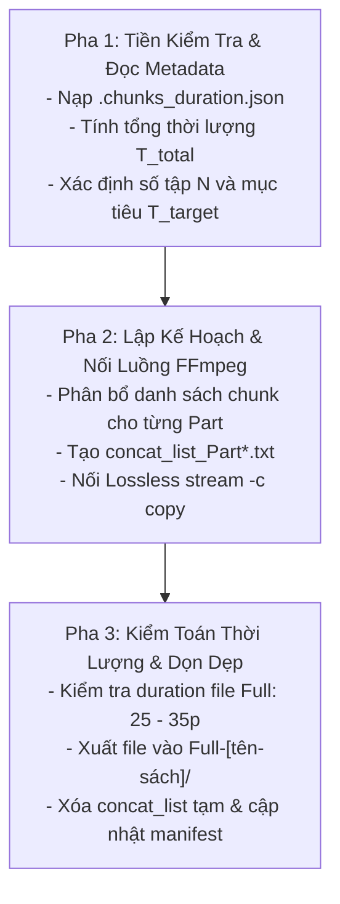

# Kỹ năng 09: Gom Ghép Tập Cân Bằng Thời Lượng (Audio Smart Aggregator)

## 1. Đặc Tả Quy Trình Thao Tác Chuẩn (Specification - SOP)

Kỹ năng `arf_09_audio_smart_aggregator` giải quyết bài toán tối ưu hóa thời lượng người nghe. Nhiệm vụ cốt lõi là gom các file audio chunk ngắn thành các tập hoàn chỉnh (Audio Full giọng mộc không nhạc), tuyệt đối khóa cứng trong khung chuẩn phát thanh **[25 – 35 phút]** ($\le 35$ phút).

### 1.1 Giải Thuật Chia Đều Toán Học (Equitable Partitioning)
$$N = \max\left(1, \operatorname{round}\left(\frac{T_{\text{total}}}{30 \text{ phút}}\right)\right), \quad T_{\text{target}} = \frac{T_{\text{total}}}{N}$$
- **Quy tắc thực thi:**
  - Nếu $T_{\text{total}} \le 35$ phút: Gom toàn bộ vào đúng **1 Part duy nhất**.
  - Nếu $T_{\text{total}} > 35$ phút: Chia đều thành $N$ Parts sao cho thời lượng mỗi tập tiệm cận $T_{\text{target}}$.
  - **TUYỆT ĐỐI CẤM THUẬT TOÁN THAM LAM (GREEDY):** Không được nhét đầy 35 phút vào Part 1 để lại Part 2 lẻ loi 4 phút. Ví dụ: Tổng 48 phút phải chia thành 2 Part cân bằng: 24 phút và 24 phút.

### 1.2 Quy Chuẩn Nối Luồng Không Suy Hao (Lossless Stream Concat)
- Nối trực tiếp luồng stream âm thanh bằng FFmpeg Demuxer qua cờ `-c copy`, không re-encode để giữ nguyên vẹn 100% chất lượng và độ nén EBU R128 đã xử lý từ Bước 08B.
- Sai số đối soát thời lượng: $|\Delta t| = |t_{\text{file\_full}} - \sum t_{\text{chunk}}| \le 2.0\text{ giây}$.

---

## 2. Điều Kiện Kích Hoạt & Cụm Từ Khóa (When to Use & Triggers)

### 2.1 Bối Cảnh Sử Dụng
- Khi các tệp `chunk_*.mp3` và `.chunks_duration.json` đã hoàn thành tại Bước 08B.
- Khi cần gộp các file âm thanh ngắn thành các tập dài chuẩn 25 – 35 phút cho người nghe podcast/audiobook.

### 2.2 Câu Lệnh Người Dùng Điển Hình (User Prompt Triggers)
- *"Gộp các file audio_chunks thành file Full cho chương này: `01-chuong-1`"*
- *"Chạy Bước 09 cân bằng thời lượng 25-35 phút"*
- *"Ghép các chunk âm thanh theo chia đều toán học"*
- *"Render file Full giọng mộc vào thư mục Full-[tên-sách]"*

---

## 3. Trình Tự Thực Thi Từng Bước (Step-by-Step Execution)



### Pha 1: Tiền kiểm tra & Tính toán phân vùng (Pre-checks)
1. Đọc tệp `.chunks_duration.json` trong thư mục chương.
2. Tính $T_{\text{total}} = \sum t_i$. Xác định số tập $N = \max(1, \operatorname{round}(T_{\text{total}} / 1.800\text{s}))$.
3. Tạo thư mục tập trung `[book_dir]/Full-[tên-sách]/` nếu chưa có.

### Pha 2: Ghép nối âm thanh Lossless (Core Concat Processing)
AI thực thi lệnh tổng hợp thông minh qua script hệ thống:
```bash
python core/audio_smart_aggregator_bgm.py --chap_dir "<CHAPTER_DIR>" --chap_name "<CHAPTER_NAME>" --step 9
```
Hoặc lệnh FFmpeg trực tiếp:
```bash
ffmpeg -f concat -safe 0 -i concat_list_Part1.txt -c copy "Full-[tên-sách]/Full_<chap_name>_Part1.mp3"
```

### Pha 3: Hậu kiểm tra & Cập nhật Manifest (Verification & Cleanup)
1. Đo thời lượng thực tế file Full: $T_{\text{actual}}$. Xác nhận $T_{\text{actual}} \le 2.100\text{s}$ (35 phút).
2. Kiểm tra độ lệch thời lượng: $|T_{\text{actual}} - T_{\text{expected}}| \le 2.0\text{s}$.
3. **Dọn rác:** Xóa toàn bộ file danh sách tạm `concat_list*.txt`.
4. Cập nhật `.session_manifest.json` ghi nhận `step_9_status: "completed"`, danh sách file `Full_*.mp3`.

---

## 4. Ràng Buộc Đầu Ra (Output Contract)

Kỷ luật lưu trữ tập trung: toàn bộ file Full xuất xưởng đặt tại thư mục cấp sách, **CẤM** lưu vào thư mục con của chương:
```text
[book_dir]/
└── Full-[tên-sách]/
    ├── Full_01-chuong-1_Part1.mp3   # [25 - 35 phút], không nhạc
    ├── Full_01-chuong-1_Part2.mp3   # [25 - 35 phút] (nếu chương dài > 35p)
    └── ...
```

### Tiêu Chuẩn Nghiệm Thu Bắt Buộc:
- Tên file chuẩn hóa: `Full_{chapter_folder}_Part{Y}.mp3`.
- 100% file có thời lượng $\le 35$ phút ($2.100$ giây).
- Tệp âm thanh mộc, âm lượng đồng đều -16 LUFS, không chứa nhạc nền.

---

## 5. Cơ Chế Phủ Định & Điều Cấm Kỵ (Negative Triggers & Constraints)

- **TUYỆT ĐỐI CẤM TẠO FILE > 35 PHÚT (HARD CAP VIOLATION):** Bất kỳ file nào vượt quá 35 phút đều bị coi là lỗi kỹ thuật nghiêm trọng.
- **CẤM ÁP DỤNG THUẬT TOÁN THAM LAM (GREEDY):** Không được tạo Part 1 sát nút 35 phút khiến Part 2 bị cụt (ví dụ 35p + 3p). Bắt buộc chia đều toán học.
- **CẤM LỒNG NHẠC NỀN TẠI BƯỚC 09:** Bước này chỉ tạo file giọng mộc nguyên bản; nhạc nền thuộc Bước 10 (`arf_10`).
- **CẤM LƯU FILE FULL VÀO THƯ MỤC CON CỦA CHƯƠNG:** Toàn bộ file Full phải gom tập trung tại `Full-[tên-sách]/`.
- **CẤM RE-ENCODE LÀM SUY GIẢM CHẤT LƯỢNG:** Phải sử dụng cờ `-c copy` khi ghép các chunk đã qua master.
