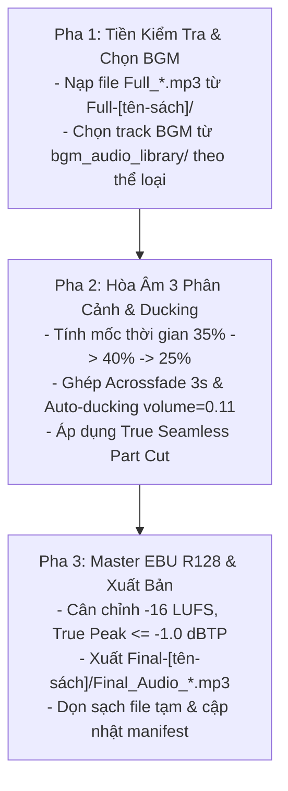

# Kỹ năng 10: Hòa Âm Đạo Diễn Âm Nhạc & Master Final (Dynamic BGM Mixer)

## 1. Đặc Tả Quy Trình Thao Tác Chuẩn (Specification - SOP)

Kỹ năng `arf_10_bgm_dynamic_mixer` là công đoạn hoàn thiện xuất xưởng cuối cùng của dây chuyền ARF. Hệ thống đóng vai trò là **Đạo Diễn Âm Nhạc & Kỹ Sư Mastering**, lồng ghép âm nhạc đa sắc thái, cân chỉnh loudness chuẩn phát thanh EBU R128 và đóng gói bản Master thương mại.

### 1.1 Cấu Trúc Đạo Diễn 3 Phân Cảnh (Dynamic Scene-Scoring)
Mỗi tập sách nói được phân bổ nhạc nền theo tỷ lệ 3 phân cảnh nghệ thuật:
| Phân Cảnh | Tỷ Lệ Thời Lượng | Chức Năng Cảm Xúc | Thể Loại Nhạc Tương Thích |
| :--- | :---: | :--- | :--- |
| **Scene 1: Mở đầu (Hook)** | **35% đầu** | Kích hoạt sự tập trung, khơi gợi tò mò, mở màn trang trọng. | Baroque 60 BPM (quản trị); Giao hưởng overture (văn học); Acoustic ấm (tự lực). |
| **Scene 2: Kể chuyện (Body)** | **40% giữa** | Đi sâu vào chi tiết, giữ nhịp đều đặn, không phân tán tâm trí. | Deep Focus Ambient / Minimalist Piano / Nhạc cụ thính phòng êm dịu. |
| **Scene 3: Đúc kết (Outro)** | **25% cuối** | Lắng đọng cảm xúc, neo giữ bài học, mở ra dư âm sâu lắng. | Warm Piano Outro / Giao hưởng trầm hùng / Giai điệu tri ân. |

### 1.2 Các Quy Chuẩn Âm Học Bắt Buộc
- **Auto-Ducking né giọng đọc:** Âm lượng BGM được giảm xuống mức $10\% - 12\%$ (`volume=0.10` - `0.12`, tương đương `-20dB` so với giọng đọc) để giọng phát thanh luôn nổi bật, sáng rõ 100%.
- **Quy tắc chuyển cảnh (Acrossfade):** Chuyển giữa Scene 1 $\to$ 2 và 2 $\to$ 3 dùng kỹ thuật `acrossfade` mượt mà trong 3.0 giây.
- **Quy tắc nối tập chân thực (True Seamless Part Cut):**
  - **Part 1:** Fade-in đúng 3 giây ở đầu file.
  - **Part cuối (Part N):** Fade-out đúng 5 giây ở cuối file.
  - **Giữa các Part kế tiếp (Part 1 $\to$ Part 2):** **CẮT THÔ TUYỆT ĐỐI (Raw Cut)**, cấm chèn Fade-in hay Fade-out làm đứt gãy trải nghiệm nghe liên tục của thính giả.
- **Mastering EBU R128:** Âm lượng tích hợp đạt chuẩn phát thanh quốc tế: $-16 \text{ LUFS}$, True Peak $\le -1.0 \text{ dBTP}$.

---

## 2. Điều Kiện Kích Hoạt & Cụm Từ Khóa (When to Use & Triggers)

### 2.1 Bối Cảnh Sử Dụng
- Khi các tệp Audio Full giọng mộc (`Full_*.mp3`) đã được xuất xưởng tại Bước 09.
- Khi người dùng muốn hòa âm nhạc nền, master EBU R128 và xuất bản file Final hoàn chỉnh.

### 2.2 Câu Lệnh Người Dùng Điển Hình (User Prompt Triggers)
- *"Lồng nhạc nền và master file Final cho chương này: `01-chuong-1`"*
- *"Chạy Bước 10 hòa âm BGM đa phân cảnh"*
- *"Hòa âm nhạc nền tự động ducking -20dB và xuất vào Final-[tên-sách]"*
- *"Render bản master cuối cùng có nhạc nền cho toàn bộ các tập"*

---

## 3. Trình Tự Thực Thi Từng Bước (Step-by-Step Execution)



### Pha 1: Tiền kiểm tra & Chọn nhạc nền (Pre-checks)
1. Xác nhận tệp `Full-[tên-sách]/Full_{chap}_{part}.mp3` tồn tại và thời lượng $\le 35$ phút.
2. Kiểm tra kho nhạc `bgm_audio_library/` và lựa chọn bản nhạc phù hợp với thể loại sách.

### Pha 2: Thực thi hòa âm đa phân cảnh (Core Mixing & Ducking)
AI thực thi lệnh hòa âm tự động:
```bash
python core/audio_smart_aggregator_bgm.py --chap_dir "<CHAPTER_DIR>" --chap_name "<CHAPTER_NAME>" --step all --bgm "<PATH_TO_BGM>"
```
Bộ lọc FFmpeg tích hợp thực thi:
- Phân đoạn timeline BGM thành 3 phân cảnh.
- Trộn âm thanh (amix) kèm volume ducking `volume=0.11`.
- Cắt gọt đầu/cuối theo quy tắc True Seamless Cut.

### Pha 3: Mastering, Dọn dẹp & Hoàn tất (Post-Processing & Manifest)
1. Xuất file master vào `Final-[tên-sách]/Final_Audio_{chap}_{part}.mp3`.
2. Kiểm tra thời lượng và độ lớn âm học file xuất xưởng.
3. **Tự động dọn rác:** Xóa sạch toàn bộ file trung gian (`concat_list.txt`, `.raw_part*.txt`, `.chunk_*.txt`).
4. Cập nhật `.session_manifest.json` ghi nhận `step_10_status: "completed"`, `final_master_path`. Khi hoàn tất toàn bộ các chương, cập nhật `pipeline_stage: "10_bgm_mastered"`.

---

## 4. Ràng Buộc Đầu Ra (Output Contract)

Kỷ luật lưu trữ tập trung: toàn bộ file Final Master xuất xưởng đặt tại thư mục cấp sách, **CẤM** lưu vào thư mục con của chương:
```text
[book_dir]/
├── .session_manifest.json          # pipeline_stage: "10_bgm_mastered"
├── Full-[tên-sách]/                # File Full mộc (không nhạc)
└── Final-[tên-sách]/               # KHO FILE FINAL MASTER CHÍNH THỨC
    ├── Final_Audio_01-chuong-1_Part1.mp3
    ├── Final_Audio_01-chuong-1_Part2.mp3
    └── ...
```

### Tiêu Chuẩn Nghiệm Thu Bắt Buộc:
- Tên file chuẩn hóa: `Final_Audio_{chapter_folder}_Part{Y}.mp3`.
- 100% file có thời lượng nằm trong dải chuẩn **[25 – 35 phút]** ($\le 35$ phút).
- Âm lượng giọng nói nổi bật, nhạc nền êm ái, đạt chuẩn phát thanh $-16 \text{ LUFS}$.
- Đã dọn sạch 100% file rác trung gian.

---

## 5. Cơ Chế Phủ Định & Điều Cấm Kỵ (Negative Triggers & Constraints)

- **TUYỆT ĐỐI CẤM TẠO FILE FINAL > 35 PHÚT:** Mọi file $> 35$ phút đều bị từ chối xuất xưởng.
- **CẤM CHÈN FADE-IN/OUT Ở ĐIỂM NỐI GIỮA CÁC PART:** Seam giữa Part 1 và Part 2 bắt buộc phải là Raw cut để nghe nối tiếp 100% liền mạch.
- **CẤM ĐỂ NHẠC NỀN QUÁ TO (DROWNING VOICE):** Âm lượng BGM vượt quá 15% là vi phạm nghiêm trọng; nhạc nền phải né giọng đọc ở mức volume 0.10 - 0.12.
- **CẤM CHỌN NHẠC U ÁM HOẶC CÓ TIẾNG LỜI HÁT:** Nhạc nền sách nói bắt buộc là nhạc không lời (instrumental), giai điệu tích cực hoặc thư giãn sâu.
- **CẤM LƯU FILE FINAL VÀO THƯ MỤC CON CỦA CHƯƠNG:** Toàn bộ file Final phải gom vào `Final-[tên-sách]/`.
