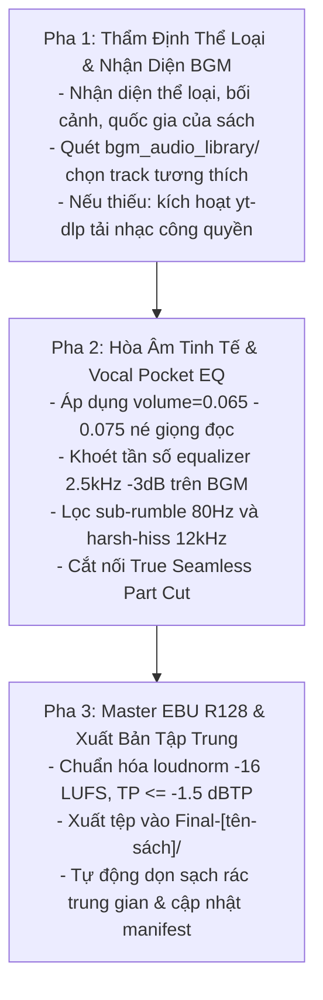

# Kỹ năng 10: Đạo Diễn Âm Nhạc, Tuyển Chọn BGM Thích Ứng & Master Final (Dynamic BGM Mixer)

## 1. Đặc Tả Quy Trình Thao Tác Chuẩn (Specification - SOP)

Kỹ năng `arf_10_bgm_dynamic_mixer` là khâu hoàn thiện phát thanh tối cao của dây chuyền Universal Audiobook Pipeline. Hệ thống đóng vai trò là **Tổng Đạo Diễn Âm Nhạc (Chief Music Director) & Kỹ Sư Master Phát Thanh**, chịu trách nhiệm thẩm định bối cảnh văn hóa, thể loại, chủ đề, nhân vật và quốc gia của tác phẩm để phối nhạc nền phù hợp, tải tự động nhạc công quyền khi thiếu, và hòa âm bảo toàn tuyệt đối độ trong trẻo, sắc nét của giọng đọc.

### 1.1 Ma Trận Tuyển Chọn BGM Thích Ứng Văn Hóa, Quốc Gia & Thể Loại (Thematic & Cultural BGM Matrix)
AI thẩm định sâu sắc linh hồn tác phẩm và tự động lựa chọn track nhạc chuẩn mực trong `bgm_audio_library/`:

| Thể Loại & Vùng Văn Hóa | Nhạc Cụ & Phong Cách Đặc Trưng | Ví Dụ Điển Hình | Tệp BGM Chuẩn & Khuyến Nghị |
| :--- | :--- | :--- | :--- |
| **Cổ phong / Sử thi Đông Á** | Cổ Cầm, Đàn Tranh (Guzheng), Đàn Tỳ Bà (Pipa), Tiêu Sáo êm dịu, không trống trận | *Tam Quốc Diễn Nghĩa, Thủy Hử, Đông Chu, Kiếm hiệp* | `05_dan_tranh_co_cam_truyen_thong.mp3`<br>(Hòa tấu cổ truyền tĩnh tại, thanh thoát) |
| **Văn học / Lịch sử Việt Nam** | Đàn Tranh, Đàn Bầu, Sáo Trúc nhẹ nhàng, acoustic mộc mạc hoài niệm sâu lắng | *Nam Cao, Vũ Trọng Phụng, Thạch Lam, Nguyễn Tuân* | `05_dan_tranh_co_cam_truyen_thong.mp3`<br>hoặc tải track Sáo trúc/Acoustic dân tộc |
| **Văn học phương Tây & Cổ điển** | Solo Piano (Satie, Chopin, Debussy), Solo Cello, String Quartet êm đềm | *Victor Hugo, Dostoevsky, Tolstoy, Kafka, Dickens* | `03_piano_outro.mp3` (Erik Satie Gymnopédie)<br>hoặc Solo Cello/String Quartet nhẹ |
| **Tự lực / Kỹ năng / Phát triển** | Warm Acoustic Guitar, Ambient Piano truyền cảm hứng, nhịp 60-70 BPM | *Đắc Nhân Tâm, Atomic Habits, Nghĩ Giàu Làm Giàu* | `02_deep_focus_ambient.mp3`<br>hoặc `03_piano_outro.mp3` |
| **Khoa học / Quản trị / Công nghệ** | Baroque 60 BPM (Bach, Vivaldi Largo), Deep Focus Ambient, sóng Alpha | *PMBOK, Agile, Clean Code, Sách kinh tế tài chính* | `01_baroque_focus.mp3`<br>(Brandenburg Concerto BWV 1048) |
| **Trinh thám / Tâm lý / Noir** | Minimalist Ambient Drone, Solo Piano quãng trầm, Cello u huyền tĩnh mịch | *Sherlock Holmes, Higashino Keigo, Camus, Noir* | `02_deep_focus_ambient.mp3`<br>(Drone tĩnh, bí ẩn không giật gân) |

### 1.2 Tối Giản Nhạc Cụ & Triệt Tiêu Nhạc Sôi Nổi / Lấn Tiếng (Minimalist Instrumentation Invariant)
Nhạc nền sách nói có chức năng phụng sự giọng đọc, nâng đỡ cảm xúc chứ không trình diễn nhạc khí:
- **Nguyên tắc tối giản (Minimalist Arrangement):** Ưu tiên nhạc cụ đơn độc tấu hoặc song tấu mộc (Solo Piano, Solo Guitar, Cổ Cầm/Đàn Tranh solo, Sáo Trúc nhẹ).
- **Tuyệt đối cấm nhạc quá sôi nổi:** Nghiêm cấm các bản nhạc có tiết tấu dồn dập, tiết tấu trống mạnh (heavy drums, drumkit, bass đập), kèn đồng chói gắt (brass crescendo), hoặc nhạc giao hưởng hợp xướng quá nhiều bè phái tạo thành một bức tường âm thanh (wall of sound) làm đục và nuốt trọn giọng đọc.
- **100% Không Lời (Pure Instrumental Only):** Tuyệt đối không chọn nhạc có giọng hát (vocal), giọng bè thì thầm hay âm thanh hiệu ứng hỗn tạp.

### 1.3 Quy Chuẩn Âm Lượng & Bộ Lọc Vocal Pocket Carving EQ (Vocal Foreground Priority)
- **Tỷ lệ âm lượng BGM tinh tế (`0.06` – `0.08`):** Mặc định hạ âm lượng BGM xuống mức **6.5% – 7.5%** (`volume=0.065` đến `0.075`, tương đương `-24dB` đến `-22dB` dưới giọng nói). Không bao giờ vượt quá `0.10` (`-20dB`).
- **Bộ lọc Vocal Pocket Carving EQ:** Tự động áp dụng bộ lọc khoét tần số trên BGM:
  ```text
  highpass=f=80,lowpass=f=12000,equalizer=f=2500:t=q:w=1.5:g=-3.0
  ```
  - `highpass=f=80`: Khử sạch tiếng ù rền âm trầm tần số thấp (sub-bass rumble).
  - `lowpass=f=12000`: Cắt dải tần quá cao tránh tiếng xì xào (high-frequency hiss).
  - `equalizer=f=2500:t=q:w=1.5:g=-3.0`: Khoét nhẹ 3dB tại dải 2.500Hz của nhạc nền để nhường trọn "túi tần số" cho phụ âm tiếng nói con người (vocal intelligibility pocket).
- **Mastering Chuẩn Phát Thanh EBU R128:** Toàn bộ bản mix được nén chuẩn hóa: `loudnorm=I=-16:TP=-1.5:LRA=6`.

### 1.4 Cơ Chế Tự Động Tải Nhạc Bản Quyền Mở & Công Quyền (Auto Public Domain Downloader)
Khi kho `bgm_audio_library/` chưa có bản nhạc phù hợp hoặc thiếu track theo chủ đề:
- Hệ thống kích hoạt module tự động `core/bgm_downloader.py` sử dụng công cụ tích hợp `tools/yt-dlp`.
- Sử dụng các cụm từ khóa tìm kiếm bản quyền an toàn tuyệt đối: `"royalty free"`, `"no copyright"`, `"public domain"`, `"calm instrumental reading background music"`.
- Tuyệt đối KHÔNG tải các bản nhạc thương mại có bản quyền (OST phim điện ảnh Hollywood, nhạc có gắn Content ID).
- Tự động chuẩn hóa tệp tải về thành định dạng chuẩn phát thanh `48.000 Hz Stereo 192kbps MP3` và lưu trữ tập trung tại `bgm_audio_library/`.

### 1.5 Cấu Trúc Đạo Diễn 3 Phân Cảnh & Quy Tắc Cắt Nối Chân Thực (True Seamless Part Cut)
1. **Scene 1 (Mở đầu - 35%):** Khơi gợi tập trung, mở màn trang trọng.
2. **Scene 2 (Kể chuyện - 40%):** Nhịp điệu êm dịu, giữ dòng chảy tư duy ổn định.
3. **Scene 3 (Đúc kết - 25%):** Dư âm lắng đọng, nâng tầm triết lý.
4. **Quy tắc Nối tập Chân thực (True Seamless Part Cut):**
   - **Part 1:** Fade-in đúng 3.0s ở đầu file.
   - **Part cuối (Part N):** Fade-out đúng 5.0s ở cuối file.
   - **Giữa các Part kế tiếp (Part 1 $\to$ Part 2):** **CẮT THÔ TUYỆT ĐỐI (Raw Cut)** khớp thời gian, cấm chèn Fade-in/out làm đứt gãy trải nghiệm nghe liên tục.

---

## 2. Điều Kiện Kích Hoạt & Cụm Từ Khóa (When to Use & Triggers)

### 2.1 Bối Cảnh Sử Dụng
- Khi các tệp Audio Full giọng mộc (`Full_*.mp3`) đã được xuất xưởng tại Bước 09.
- Khi cần chọn hoặc tải BGM phù hợp theo chủ đề, thể loại sách, bối cảnh lịch sử và văn hóa quốc gia.
- Khi thực hiện hòa âm BGM tự động ducking, khoét tần số giọng đọc và master xuất xưởng EBU R128.

### 2.2 Câu Lệnh Người Dùng Điển Hình (User Prompt Triggers)
- *"Hòa âm BGM đúng chủ đề và thể loại cho sách: `01-chuong-1`"*
- *"Tự động tải và chọn nhạc nền cổ phong phù hợp cho Tam Quốc Diễn Nghĩa"*
- *"Chạy Bước 10 hòa âm BGM, đảm bảo giọng đọc rõ ràng không bị nhạc đè"*
- *"Master Final audio có nhạc nền công quyền không đánh gậy bản quyền"*

---

## 3. Trình Tự Thực Thi Từng Bước (Step-by-Step Execution)



### Pha 1: Thẩm định thể loại & Chuẩn bị BGM (Pre-checks)
1. Xác nhận tệp `Full-[tên-sách]/Full_{chap}_{part}.mp3` tồn tại và thời lượng $\le 35$ phút.
2. AI tự động thẩm định thể loại qua `core/bgm_downloader.py` hoặc nhận tham số `--bgm`.
3. Nếu track nhạc yêu cầu chưa có trong `bgm_audio_library/`, tự động tải track an toàn qua `download_safe_bgm()`.

### Pha 2: Thực thi hòa âm đa phân cảnh (Core Mixing & Pocket Carving)
AI thực thi lệnh hòa âm tự động:
```bash
python core/audio_smart_aggregator_bgm.py --chap_dir "<CHAPTER_DIR>" --chap_name "<CHAPTER_NAME>" --step 10 --bgm "<PATH_OR_NAME_BGM>"
```
Hệ thống tự động:
- Phân đoạn timeline BGM theo dòng thời gian liên tục giữa các Part.
- Chèn bộ lọc Pocket Carving EQ và hạ âm lượng BGM tinh tế.
- Hòa âm và master chuẩn phát thanh EBU R128.

### Pha 3: Mastering, Dọn dẹp & Hoàn tất (Post-Processing & Manifest)
1. Xuất file master vào `Final-[tên-sách]/Final_Audio_{chap}_{part}.mp3`.
2. Kiểm tra thời lượng và độ lớn âm học file xuất xưởng.
3. Tự động dọn rác sạch sẽ (`concat_list.txt`, `.raw_part*.txt`, `.chunk_*.txt`).
4. Cập nhật `.session_manifest.json` ghi nhận `step_10_status: "completed"`, `final_master_path`.

---

## 4. Ràng Buộc Đầu Ra (Output Contract)

Kỷ luật lưu trữ tập trung: toàn bộ file Final Master xuất xưởng đặt tại thư mục cấp sách, **CẤM** lưu vào thư mục con của chương:
```text
[book_dir]/
├── .session_manifest.json          # pipeline_stage: "10_bgm_mastered"
├── Full-[tên-sách]/                # File Full mộc (không nhạc)
└── Final-[tên-sách]/               # KHO FILE FINAL MASTER CHÍNH THỨC
    ├── Final_Audio_01-chuong-1_Part1.mp3
    ├── Final_Audio_01-chuong-1_Part2.mp3
    └── ...
```

### Tiêu Chuẩn Nghiệm Thu Bắt Buộc:
- Tên file chuẩn hóa: `Final_Audio_{chapter_folder}_Part{Y}.mp3`.
- 100% file có thời lượng nằm trong dải chuẩn **[25 – 35 phút]** ($\le 35$ phút).
- Giọng phát thanh luôn đứng ở tiền cảnh (foreground), sáng rõ, sắc nét, nhạc nền êm đềm ở hậu cảnh.
- Đạt chuẩn phát thanh quốc tế: tích hợp $-16 \text{ LUFS}$, True Peak $\le -1.5 \text{ dBTP}$, LRA $5 - 6$.
- Đã dọn sạch 100% file rác trung gian.

---

## 5. Cơ Chế Phủ Định & Điều Cấm Kỵ (Negative Triggers & Constraints)

- **CẤM CHỌN NHẠC QUÁ SÔI NỔI, TIẾT TẤU DỒN DẬP HOẶC DÀY ĐẶC NHẠC CỤ:** Tuyệt đối cấm nhạc có trống dồn, kèn chói, tiết tấu hành khúc chiến trận kích động trong phần thân bài đọc sách; ưu tiên tối đa nhạc cụ mộc độc tấu/song tấu thanh thoát.
- **CẤM ĐỂ NHẠC NỀN QUÁ LỚN LẤN TIẾNG (VOICE DROWNING VIOLATION):** Nghiêm cấm đặt volume BGM $> 0.10$. Mức chuẩn bắt buộc là $0.06 - 0.08$ để giọng đọc luôn giữ vị thế trung tâm.
- **CẤM SỬ DỤNG NHẠC CÓ BẢN QUYỀN THƯƠNG MẠI HOẶC CÓ LỜI:** 100% BGM phải là nhạc không lời (instrumental) công quyền (Public Domain / CC0 / Royalty-Free).
- **CẤM CHỌN SAI VÙNG VĂN HÓA & THỂ LOẠI TÁC PHẨM:** Tác phẩm cổ trang/sử thi Đông Á không được lồng nhạc Baroque hay Pop acoustic; sách quản trị hiện đại không lồng nhạc ma mị kiếm hiệp.
- **TUYỆT ĐỐI CẤM TẠO FILE FINAL > 35 PHÚT:** Mọi file $> 35$ phút đều bị từ chối nghiệm thu.
- **CẤM CHÈN FADE-IN/OUT Ở ĐIỂM NỐI GIỮA CÁC PART:** Seam giữa các Part kế tiếp bắt buộc là Raw cut.
- **CẤM LƯU FILE FINAL VÀO THƯ MỤC CON CỦA CHƯƠNG:** Toàn bộ file Final phải gom vào `Final-[tên-sách]/`.
