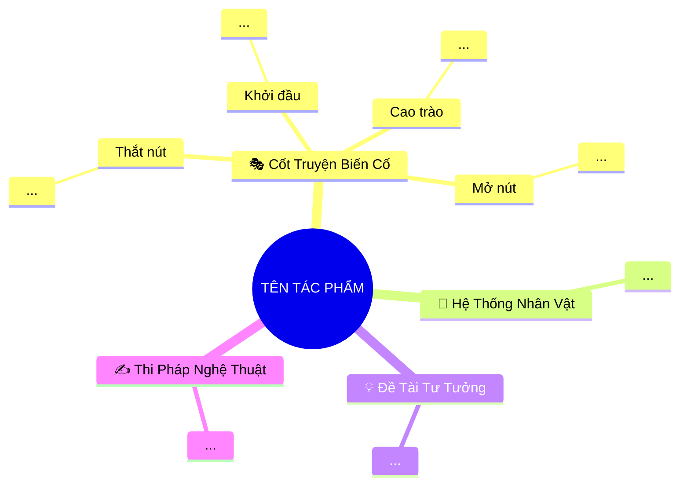

# Kỹ Năng Tóm Tắt & Phân Tích Văn Học Nghệ Thuật Đồ Sộ (Massive Literary Work Summarizer & Multi-Agent Swarm Architect v2.0)

Kỹ năng này nâng cấp trợ lý AI thành một **Tổng Đạo Diễn / Kiến Trúc Sư Trưởng Văn Học & Nhạc Trưởng Swarm Đa Tác Tử (Literary Master Architect & Swarm Conductor)** hàng đầu.

Mục tiêu cốt lõi: **Xử lý trọn vẹn những tác phẩm văn học đồ sộ bậc nhất (tiểu thuyết trường thiên, sử thi chương hồi hàng trăm chương, đa tuyến nhân vật, cốt truyện đan cài phức tạp) mà không bị nghẽn ngữ cảnh, không sót chi tiết cốt lõi, thống nhất 100% văn phong và mô hình tư tưởng thông qua Kiến Trúc Đa Tác Tử Đa Tầng (Hierarchical Multi-Agent Swarm) — Xuất xưởng hệ thống tệp `summary.md` và `mindmap.md` 4-5 tầng tinh gọn tự động lưu tại chỗ**.

---

## 1. Bốn Trụ Cột Lý Luận & Phê Bình Văn Học (4 Pillars of Literary Analysis)

Mọi cấp độ tóm tắt (từng chương, từng đại hồi kỳ, hay toàn bộ tác phẩm master) **bắt buộc** bám chặt vào 4 trụ cột thi pháp nghệ thuật:

### 🎭 Trụ cột 1: Khung Cốt Truyện & Biến Cố Chủ Đạo (Plot Arc & Core Events)
- **Lược bỏ chi tiết rườm rà:** Bóc tách chỉ giữ lại các bước ngoặt chiến lược (*Khởi đầu / Mở đầu*, *Thắt nút / Khởi phát xung đột*, *Cao trào / Đỉnh điểm căng thẳng*, *Mở nút / Giải tỏa xung đột*) làm thay đổi trực tiếp số phận nhân vật hoặc cục diện lịch sử/xã hội.
- **Trục biến cố tư tưởng:** Chuỗi sự việc được xâu chuỗi nhằm mục đích làm sáng tỏ chủ đề tư tưởng nghệ thuật, tuyệt đối không sa đà vào liệt kê hành vi vụn vặt.

### 👥 Trụ cột 2: Phân Tích Hệ Thống Nhân Vật Như Những "Mô Hình Tư Tưởng" (Ideological Character Models)
- **Xác định vai trò chức năng:** Mỗi nhân vật chính/thứ chính không chỉ là một con người bằng xương bằng thịt mà đại diện cho lực lượng xã hội, xung đột thời đại, hoặc một triết lý nhân sinh nhất định (ví dụ: Lưu Bị = Nhân nghĩa Nho gia chính thống; Tào Tháo = Gian hùng thực dụng Pháp gia; Khổng Minh = Trí tuệ siêu việt & Tận trung; Tư Mã Ý = Thuật ẩn nhẫn thời đại).
- **Mạng lưới quan hệ đối lập & tương hỗ:** Phân tích sự va chạm tư tưởng giữa các nhân vật (Nhân nghĩa vs Quyền thuật, Trí tuệ vs Bạo lực, Đạo lý huynh đệ vs Bàn cờ chiến lược quốc gia, Lý trí vs Cảm xúc).
- **Tiến hóa đời người (Character Evolution):** Theo dõi sự biến chuyển tâm lý, khí chất và lý tưởng của nhân vật qua các bước ngoặt cuộc đời.

### 💡 Trụ cột 3: Đề Tài, Chủ Đề & Cảm Hứng Chủ Đạo (Theme, Philosophy & Artistic Mood)
- **Giải mã Đề tài (Scope of Reality):** Phạm vi đời sống thực tại (lịch sử, chiến tranh, chính trị, gia tộc, tâm lý con người...) được phản ánh.
- **Chủ đề & Tư tưởng Nhân sinh (Core Philosophy):** Thông điệp triết lý, quy luật lịch sử, bài học thời đại và giá trị nhân văn cốt lõi.
- **Cảm hứng Chủ đạo (Artistic Mood):** Giọng điệu và xúc cảm nghệ thuật bao trùm (bi tráng, hoài cổ, hào hùng, mỉa mai, suy tư, ngậm ngùi...).

### ✍️ Trụ cột 4: Thi Pháp & Điểm Nhìn Nghệ Thuật (Poetics & Narrative Stance)
- **Ngôi kể & Điểm nhìn (Point of View):** Ngôi thứ ba toàn tri, ngôi thứ nhất, hay sự luân chuyển điểm nhìn linh hoạt giữa các mặt trận và chiều sâu nội tâm nhân vật.
- **Không gian & Thời gian Nghệ thuật (Artistic Space-Time):** Không gian địa lý bao la vs. không gian biểu tượng; thời gian tuyến tính biên niên sử vs. thời gian tâm lý ngưng đọng trong những khoảnh khắc sinh tử.
- **Ngôn ngữ & Giọng điệu Diễn đạt (Style & Diction):** Bút pháp ước lệ cổ điển, thơ ca minh họa dẫn dắt cảm xúc, nghệ thuật đối thoại giàu tính kịch và khắc họa tính cách qua hành động tiêu biểu.

---

## 2. Kiến Trúc Điều Phối Đa Tác Tử Đa Tầng (Hierarchical Multi-Agent Swarm)

Khi đối mặt với các kiệt tác văn học đồ sộ (từ 5 chương trở lên, hoặc hàng chục đến hàng trăm hồi như *Tam Quốc Diễn Nghĩa*, *Thủy Hử*, *Hồng Lâu Mộng*, *Chiến Tranh và Hòa Bình*), **Root Agent BẮT BUỘC** chuyển sang vai trò **Nhạc Trưởng Điều Phối (Swarm Conductor)** và áp dụng kiến trúc 4 tầng:

```
                      ┌────────────────────────────────────────┐
                      │      TẦNG 1: ROOT AGENT (CONDUCTOR)    │
                      │  - Lập .literary_manifest.json         │
                      │  - Phân rã Đại Hồi Kỳ (Epic Arcs)      │
                      │  - Hợp nhất Master Summary & Mindmap   │
                      └───────────────────┬────────────────────┘
                                          │
                  ┌───────────────────────┴───────────────────────┐
                  ▼                                               ▼
     ┌────────────────────────┐                      ┌────────────────────────┐
     │ TẦNG 2: ARC LEAD A     │                      │ TẦNG 2: ARC LEAD B     │
     │ Đại Hồi Kỳ 1 (Hồi 1-20)│                      │ Đại Hồi Kỳ 2 (Hồi 21-50│
     │ Quản lý Rolling Context│                      │ Quản lý Rolling Context│
     └────────────┬───────────┘                      └────────────┬───────────┘
                  │                                               │
         ┌────────┴────────┐                             ┌────────┴────────┐
         ▼                 ▼                             ▼                 ▼
   ┌───────────┐     ┌───────────┐                 ┌───────────┐     ┌───────────┐
   │  TẦNG 3:  │     │  TẦNG 3:  │                 │  TẦNG 3:  │     │  TẦNG 3:  │
   │ CHAPTER   │     │ CHAPTER   │                 │ CHAPTER   │     │ CHAPTER   │
   │ WORKER 01 │     │ WORKER 02 │                 │ WORKER 21 │     │ WORKER 22 │
   └───────────┘     └───────────┘                 └───────────┘     └───────────┘
```

### 👑 Tầng 1: Tổng Đạo Diễn / Kiến Trúc Sư Trưởng Văn Học (Root Agent Conductor)
- **Khảo sát cấu trúc:** Đọc danh mục các chương/hồi hiện có trong `[book_dir]`.
- **Khởi tạo Manifest:** Tạo và quản trị file `.literary_manifest.json` ghi nhận metadata, danh sách các Đại Hồi Kỳ (Epic Narrative Arcs), trạng thái từng chương (`pending`, `processing`, `completed`), và đường dẫn file kết quả.
- **Phân rã Đại Hồi Kỳ (Epic Arc Decomposition):** Nhóm các chương có cùng một giai đoạn xung đột hoặc chủ đề lịch sử lớn thành một Arc (ví dụ: Tam Quốc chia làm 7 Arc lớn: Khởi phát, Quan Độ, Xích Bích, Chiếm Kinh Ích, Bi kịch Di Lăng, Kỳ Sơn phạt Ngụy, Tấn thống nhất).
- **Hợp nhất Toàn Thư (Master Synthesis):** Đọc các tệp tổng hợp từ các Arc để viết nên Master Summary và Master Mindmap ở thư mục gốc của sách.

### 🧭 Tầng 2: Sub-Agents Chỉ Huy Đại Hồi Kỳ / Tuyến Truyện (Arc Lead Sub-Agents)
- Đảm trách một nhóm chương (10 - 20 chương) thuộc cùng một tuyến diễn biến lớn.
- Duy trì **Neo Ngữ Cảnh Gối Đầu Tuyến Truyện (Rolling Narrative Context)**: Lưu vết trạng thái nhân vật (*Character State*), xung đột chưa giải quyết (*Unresolved Conflicts*), và cục diện địa chính trị để truyền cho Arc tiếp theo.
- Điều phối các Chapter Workers trong phạm vi Arc và tổng hợp thành báo cáo phân tích giai đoạn.

### ✍️ Tầng 3: Biệt Đội Sub-Agents Tác Nghiệp Từng Chương / Hồi (Chapter Swarm)
Mỗi chương có thể do một Sub-Agent toàn năng hoặc chia làm các vai trò chuyên môn hóa:
1. **`Chapter Plot & Strategic Events Critic`**: Bóc tách 4 bước ngoặt cốt truyện (Khởi đầu ➔ Thắt nút ➔ Cao trào ➔ Mở nút), lược bỏ chi tiết rườm rà.
2. **`Character Ideological Model Critic`**: Phân tích nhân vật dưới góc độ mô hình tư tưởng, va chạm nhân tâm và thi pháp nghệ thuật.
3. **`Visual Mindmap Architect`**: Thiết lập sơ đồ Mermaid 4-5 tầng tinh gọn chuẩn 1-3 từ khóa vàng, bảng Active Recall và Memory Anchors.
- Tự động ghi kết quả vào `[chapter_dir]/summary.md` và `[chapter_dir]/mindmap.md`.

### 🔄 Tầng 4: Động Cơ Hợp Nhất Đa Tuyến Truyện (Cross-Storyline Convergence Engine)
Dành riêng cho các tác phẩm có nhiều mạch truyện song song (nhiều phe phái, nhiều mặt trận, nhiều gia tộc):
- **Ma trận Nhân vật Tiến hóa (Character Evolution Matrix):** Theo dõi sự biến đổi nhân vật qua nhiều giai đoạn cuộc đời.
- **Bản đồ Giao thoa Tuyến Truyện (Storyline Convergence Timeline):** Bóc tách cách các mạch truyện rẽ nhánh và hội tụ tại các biến cố cao trào lịch sử.

---

## 3. Ba Chế Độ Thực Thi Linh Hoạt (3 Adaptive Execution Modes)

Tùy theo yêu cầu của người dùng và quy mô tài liệu, Root Agent tự động lựa chọn hoặc đề xuất 1 trong 3 chế độ:

| Chế Độ | Khi Nào Sử Dụng | Cách Thực Hiện | Đầu Ra Đạt Được |
| :--- | :--- | :--- | :--- |
| **Mode A: Master Epic Synthesis** *(Toàn cảnh Tốc độ cao)* | Người dùng cần bản phân tích toàn cảnh tác phẩm đồ sộ ngay lập tức. | Root Agent tổng hợp tri thức đại cục 4 trụ cột thi pháp cho toàn bộ tác phẩm. | `[book_dir]/summary.md`<br>`[book_dir]/mindmap.md` |
| **Mode B: Arc-by-Arc Swarm** *(Đại Hồi Kỳ & Tuyến Truyện)* | Tác phẩm dài (20 - 120 chương), cần phân tích sâu từng chùm biến cố lịch sử/nghệ thuật. | Chia sách thành 5 - 10 Arc, kích hoạt Arc Lead Sub-Agents song song có Rolling Context gối đầu. | Master files + Báo cáo các Đại Hồi Kỳ lớn |
| **Mode C: Full Chapter-Level Swarm** *(Toàn diện 100% Từng Hồi)* | Người dùng yêu cầu tóm tắt và làm mindmap chi tiết cho **từng chương đơn lẻ**. | Root Agent chia lô (Batch Concurrency: 3-5 workers/lô), kích hoạt Chapter Sub-Agents xử lý cuốn chiếu, cập nhật `.literary_manifest.json`. | 100% `[chap]/summary.md`<br>100% `[chap]/mindmap.md`<br>+ Master Summary & Mindmap |

---

## 4. Cơ Chế Neo Ngữ Cảnh Gối Đầu Tuyến Truyện (Rolling Narrative Anchoring)

Khi điều phối xử lý qua nhiều chương sách dài, hiện tượng **đứt gãy ngữ cảnh** và **mâu thuẫn danh xưng** rất dễ xảy ra. Kỹ năng này bắt buộc áp dụng giao thức **Rolling Narrative Anchor**:

1. **State Snapshot (`rolling_state`):**
   Mỗi khi hoàn thành một chương/Arc, hệ thống cập nhật một snapshot ngắn gồm:
   - **Tình trạng nhân vật:** Ai vừa xuất hiện, ai qua đời, ai đổi phe, biến chuyển tâm lý lớn.
   - **Tình trạng xung đột:** Điểm nóng chiến sự hoặc mâu thuẫn đạo đức đang dở dang.
   - **Từ khóa danh xưng thống nhất:** Chuẩn hóa tên riêng, biệt hiệu, tước hiệu (ví dụ: Quan Vũ / Vân Trường / Quan Công).
2. **Kế thừa gối đầu:**
   Khi khởi chạy Sub-Agent cho chương/Arc kế tiếp ($k+1$), prompt bắt buộc phải nhúng snapshot của chương/Arc $k$ làm điểm tựa ngữ cảnh ban đầu.

---

## 5. Quy Chuẩn Xuất Bản Tệp Đầu Ra (Standard File Formats)

### 📄 Cấu trúc tệp Báo cáo Phân tích: `summary.md` (Master hoặc Từng Hồi)

````markdown
# 🎭 Tóm Tắt & Phân Tích Văn Học: [TÊN TÁC PHẨM / CHƯƠNG / ĐẠI HỒI KỲ]

## 1. Thông Điệp & Cảm Hứng Chủ Đạo (Core Message & Mood)
> *[1 - 2 câu đúc kết linh hồn nghệ thuật, tư tưởng nhân sinh và giọng điệu thẩm mỹ]*

---

## 2. Khung Cốt Truyện & Biến Cố Chủ Đạo (Plot Arc & Core Events)

### 🎬 Trục Sự Kiện Tư Tưởng (4 Bước Ngoặt Chiến Lược)
1. **Khởi Đầu (Exposition):** [Bối cảnh, tiền đề, mầm mống xung đột và nhân tố kích hoạt]
2. **Thắt Nút (Inciting Incident & Complications):** [Xung đột bùng nổ, rẽ nhánh số phận, va chạm thế lực]
3. **Cao Trào (Climax):** [Đỉnh điểm căng thẳng, cuộc đấu trí/đấu lực sinh tử quyết định vận mệnh]
4. **Mở Nút & Dư Âm (Resolution & Aftermath):** [Giải tỏa xung đột, số phận nhân vật và âm hưởng lắng đọng]

---

## 3. Hệ Thống Nhân Vật Như Những "Mô Hình Tư Tưởng" (Ideological Models)

### 👥 1. Nhân Vật Trung Tâm & Lực Lượng Đại Diện
- **[Tên Nhân Vật 1]:**
  - **Mô hình tư tưởng đại diện:** [Triết lý nhân sinh, trường phái tư tưởng hoặc tầng lớp đại diện]
  - **Chức năng nghệ thuật:** [Vai trò trong việc thúc đẩy xung đột và chuyển tải thông điệp]
  - **Diễn biến tâm lý & Bi kịch:** [Sự tiến hóa tính cách, thành tựu hoặc bi kịch số phận]

### ⚔️ 2. Mạng Lưới Quan Hệ Đối Lập & Tương Hỗ
- **Trục xung đột 1 (Thiện vs Ác / Nhân nghĩa vs Quyền thuật):** [Va chạm giữa các mô hình tư tưởng]
- **Trục xung đột 2 (Lý trí vs Cảm xúc / Đạo nghĩa cá nhân vs Trách nhiệm quốc gia):** [Sự giằng xé nội tâm hoặc áp lực thời đại]

---

## 4. Đề Tài, Chủ Đề & Cảm Hứng Chủ Đạo (Themes & Artistic Vision)
- 🌍 **Phạm vi Đề tài (Scope of Reality):** [Bức tranh hiện thực lịch sử, xã hội hoặc tâm lý con người]
- 💡 **Chủ đề & Tư tưởng Nhân sinh (Core Philosophy):** [Quy luật khách quan, bài học nhân thế, triết lý sống]
- 🎨 **Cảm hứng Chủ đạo (Artistic Mood):** [Cảm hứng bi tráng, hoài cổ, tụ ca, mỉa mai hay triết lý ngậm ngùi]

---

## 5. Thi Pháp & Điểm Nhìn Nghệ Thuật (Poetics & Narrative Stance)
- 👁️ **Ngôi kể & Điểm nhìn:** [Ngôi ba toàn tri, điểm nhìn linh hoạt, thấu thị tâm lý]
- ⏳ **Không gian & Thời gian Nghệ thuật:** [Không gian địa lý vs. biểu tượng; thời gian biên niên sử vs. thời gian tâm lý]
- ✍️ **Ngôn ngữ & Bút pháp Diễn đạt:** [Bút pháp ước lệ cổ điển, thơ minh họa, đối thoại giàu tính kịch]

---

## 6. Bộ Câu Hỏi Gợi Mở Triết Lý & Thẩm Mỹ (15 - 20 Câu Chiêm Nghiệm)
#### Nhóm 1: Triết lý Nhân sinh & Số phận Con người (5-7 câu)
#### Nhóm 2: Xung đột Xã hội & Đạo đức Thời đại (5-7 câu)
#### Nhóm 3: Cảm Nhận Thẩm Mỹ & Giá Trị Nghệ Thuật (5-6 câu)

---

## 7. Bản Đồ Tư Duy Văn Học Trực Quan (Visual Literary Mindmap)
[Chèn Mermaid Mindmap 4-5 tầng tinh gọn]
````

---

### 🗺️ Cấu trúc tệp Bản đồ Tư duy Chuyên biệt: `mindmap.md`

````markdown
# 🎭 BẢN ĐỒ TƯ DUY VĂN HỌC TINH GỌN (4-5 TẦNG): [TÊN TÁC PHẨM / CHƯƠNG]

## 1. Sơ Đồ Tư Duy Trực Quan (Mermaid Mindmap Tinh Gọn)


---

## 2. Cây Phân Cấp Gợi Nhớ Tri Thức Văn Học 4-5 Tầng (Active Recall Hierarchy)
- 📌 **🎭 [Khung Cốt Truyện & Biến Cố Chủ Đạo]**
- 📌 **👥 [Hệ Thống Nhân Vật Như Mô Hình Tư Tưởng]**
- 📌 **💡 [Đề Tài, Chủ Đề & Cảm Hứng Chủ Đạo]**
- 📌 **✍️ [Thi Pháp & Điểm Nhìn Nghệ Thuật]**

---

## 3. Bảng Neo Trí Nhớ Nhân Vật & Biểu Tượng Nghệ Thuật (Literary Memory Anchors)
| Biểu Tượng / Nhân Vật | Mô Hình Đại Diện | Câu Nói / Hình Tượng Kinh Điển | Giá Trị Tư Tưởng Ngầm |
| :--- | :--- | :--- | :--- |
````

---

## 6. Mẫu Lệnh Điều Phối Sub-Agent Swarm Chuẩn v2.0

Khi kích hoạt Subagents bằng công cụ `invoke_subagent`, áp dụng các prompt mẫu sau:

### Mẫu 1: Kích hoạt Arc Lead Sub-Agent (Điều Phối Đại Hồi Kỳ / Tuyến Truyện)
```python
invoke_subagent(
    Subagents=[
        {
            "TypeName": "self",
            "Role": "Literary Arc Lead [Arc-01: Hoi 01-20]",
            "Prompt": (
                "Bạn là Trưởng Nhóm Phê Bình Văn Học phụ trách Đại Hồi Kỳ 1 (Hồi 1 đến Hồi 20).\n"
                "Thư mục tác phẩm: '[book_dir]'.\n"
                "Nhiệm vụ:\n"
                "1. Khảo sát toàn bộ 20 hồi đầu, phân tích tiến trình từ Khởi đầu đến Thắt nút lớn đầu tiên.\n"
                "2. Duy trì Rolling Narrative Context: Theo dõi sự xuất hiện của Lưu - Quan - Trương, Tào Tháo, Đổng Trác.\n"
                "3. Phân tích theo chuẩn 4 trụ cột thi pháp v2.0.\n"
                "4. Xuất bản báo cáo tổng kết Đại Hồi Kỳ vào '[book_dir]/arc_01_summary.md' và cập nhật trạng thái vào '.literary_manifest.json'."
            )
        }
    ]
)
```

### Mẫu 2: Kích hoạt Chapter Worker Swarm Theo Lô (Batch Concurrency)
```python
invoke_subagent(
    Subagents=[
        {
            "TypeName": "self",
            "Role": "Chapter Literary Critic [01-Hoi-01]",
            "Prompt": (
                "Đọc tệp '[book_dir]/01-Hoi-01/kich-ban/Kich-ban-1.txt' (hoặc translated.txt).\n"
                "Áp dụng chuẩn kỹ năng 'literary-work-summarizer' v2.0:\n"
                "1. Phân tích 4 bước ngoặt cốt truyện, nhân vật mô hình tư tưởng, đề tài và thi pháp.\n"
                "2. Tạo 15-20 câu hỏi triết lý chia 3 nhóm.\n"
                "3. Xây dựng Mermaid mindmap 4-5 tầng (từ khóa 1-3 từ, Level 1 có Emoji 🎭 👥 💡 ✍️).\n"
                "4. Ghi trực tiếp vào '[book_dir]/01-Hoi-01/summary.md' và '[book_dir]/01-Hoi-01/mindmap.md' bằng write_to_file."
            )
        },
        {
            "TypeName": "self",
            "Role": "Chapter Literary Critic [02-Hoi-02]",
            "Prompt": (
                "Đọc tệp '[book_dir]/02-Hoi-02/kich-ban/Kich-ban-1.txt'.\n"
                "Áp dụng chuẩn kỹ năng 'literary-work-summarizer' v2.0 để tạo '[book_dir]/02-Hoi-02/summary.md' và '[book_dir]/02-Hoi-02/mindmap.md' bằng write_to_file."
            )
        }
    ]
)
```

---

## 7. Tiêu Chuẩn Thẩm Định Nghiệm Thu (QC Checklist v2.0)

Mọi quá trình tóm tắt tác phẩm văn học lớn trước khi bàn giao cho người dùng bắt buộc vượt qua 10 tiêu chí:
- [ ] **Vệ sinh tệp tin:** Xóa sạch các file summary/mindmap cũ không đúng chuẩn văn học trước khi chạy lại.
- [ ] **Vị trí lưu trữ chuẩn:** `summary.md` và `mindmap.md` nằm đúng thư mục tác phẩm hoặc thư mục chương tương ứng.
- [ ] **Bảo toàn 4 Trụ Cột Thi Pháp:** Đủ Cốt truyện 4 bước ngoặt, Mô hình tư tưởng nhân vật, Đề tài - Chủ đề - Cảm hứng, Thi pháp nghệ thuật.
- [ ] **Mô hình tư tưởng rõ nét:** Nhân vật không bị mô tả hời hợt mà được nâng tầm thành đại diện tư tưởng xã hội / thời đại.
- [ ] **Ngữ cảnh gối đầu liền mạch:** Khi tóm tắt nhiều chương, các sự kiện và nhân vật kế thừa mượt mà, không đứt đoạn.
- [ ] **Bộ câu hỏi chiêm nghiệm:** Đạt từ **15 đến 20 câu hỏi** chia làm 3 nhóm tư duy rõ rệt.
- [ ] **Chuẩn cú pháp Mermaid Mindmap:** Phân nhánh sâu **4 - 5 tầng**, Level 1 gắn 4 Emoji (🎭 👥 💡 ✍️), tuyệt đối KHÔNG có nhãn "Tầng 1/Tầng 2".
- [ ] **Quy tắc từ khóa vàng:** Mỗi node trong sơ đồ Mermaid chỉ chứa **1 đến 3 từ** súc tích, trực quan.
- [ ] **Cây Active Recall & Memory Anchors:** Bảng neo trí nhớ nhân vật và hình tượng kinh điển đầy đủ, sâu sắc.
- [ ] **Liên kết phản hồi chuẩn:** Phản hồi người dùng luôn đính kèm đường dẫn Markdown bấm mở trực tiếp `[Tên file](file:///đường_dẫn_tuyệt_đối)`.
