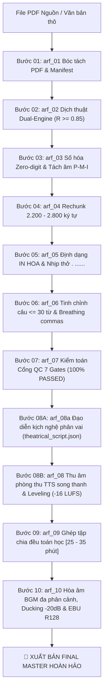

# 🎙️ WORKFLOW: DÂY CHUYỀN SẢN XUẤT SÁCH NÓI VẠN NĂNG (BƯỚC 01 - 10)
## Universal Audiobook Production & Dynamic BGM Mastering Playbook (ARF v3.0)

## 1. Đặc Tả Quy Trình Thao Tác Chuẩn (Specification - SOP)

Dây chuyền `universal-audiobook` là quy trình sản xuất sách nói chuẩn mực toàn cầu, vận hành xuyên suốt từ file nguồn PDF đến sản phẩm Master Final có lồng nhạc nền.

### 1.1 Sơ Đồ Dây Chuyền 10 Bước Kỹ Thuật Khép Kín
| Bước | Mã Kỹ Năng / Module | Nhiệm Vụ Kỹ Thuật Trọng Tâm | Sản Phẩm Đầu Ra Nghiệm Thu |
| :---: | :--- | :--- | :--- |
| **01** | `arf_01_pdf_structure_extractor` | Bóc tách cấu trúc PDF, khử Header/Footer, hàn nối Drop-Cap. | `raw_original.txt` & `.session_manifest.json` |
| **02** | `arf_02_author_style_translator` | Dịch thuật Dual-Engine (2A Phi hư cấu / 2B Văn học), $R \ge 0.85$. | `translated.txt` |
| **03** | `arf_03_text_phonetics_normalizer` | Số hóa 100% Zero-digit, tách âm *P-M-I*, regex sạch ký tự cấm. | `normalized.txt` |
| **04** | `arf_04_smart_audiobook_rechunker` | Phân rã khối kịch bản tối ưu 2.200 - 2.800 ký tự (max 3.000). | `kich-ban/Kich-ban-raw-*.txt` |
| **05** | `arf_05_script_structure_formatter` | Tiêu đề IN HOA độc lập, câu đối biền ngẫu, nhịp thở `. ......` (1.5-2s). | Kịch bản có nhịp thở phát thanh |
| **06** | `arf_06_llm_script_refiner` | Câu $\le 30$ từ, breathing commas, khóa độ lệch $|\Delta W| / W \le 3\%$. | `kich-ban/Kich-ban-*.txt` (xóa raw) |
| **07** | `arf_07_audiobook_qc_auditor` | Kiểm toán 7 Quality Gates cứng, Self-Healing tự sửa lỗi. | `QC_Report.md` (100% 7/7 PASSED) |
| **08A** | `arf_08a_theatrical_voice_director` | Đạo diễn kịch nghệ: thẩm định thể loại, bóc tách vai, 5 độ tuổi, 12 cảm xúc. | `theatrical_script.json` & `.theatrical_bible.json` |
| **08B** | `arf_08_tts_neural_bgm_mixer` | Thu âm song thanh NamMinh x Brian, đệm 80ms, Two-Stage Leveling (-16 LUFS). | `audio_chunks/chunk_*.mp3` & `.chunks_duration.json` |
| **09** | `arf_09_audio_smart_aggregator` | Chia đều toán học các tập trong dải [25 - 35 phút], Lossless stream. | `Full-[tên-sách]/Full_*.mp3` (giọng mộc) |
| **10** | `arf_10_bgm_dynamic_mixer` | Hòa âm 3 phân cảnh (Baroque 35% -> Focus 40% -> Outro 25%), Ducking -20dB. | `Final-[tên-sách]/Final_Audio_*.mp3` (Master BGM) |

---

## 2. Điều Kiện Kích Hoạt & Cụm Từ Khóa (When to Use & Triggers)

### 2.1 Bối Cảnh Sử Dụng
- Khi người dùng muốn thực hiện một dự án sách nói trọn gói từ đầu đến cuối (A to Z).
- Khi có tài liệu PDF hoặc văn bản thô và muốn xuất xưởng trực tiếp các file Final Master hoàn chỉnh có nhạc nền.

### 2.2 Câu Lệnh Người Dùng Điển Hình (User Prompt Triggers)
- *"Làm sách nói trọn gói từ file PDF này: `sach.pdf`"*
- *"Chạy toàn bộ quy trình universal-audiobook từ Bước 1 đến Bước 10"*
- *"Sản xuất toàn bộ cuốn sách thành các file audio hoàn chỉnh"*
- *"Chạy pipeline tự động cho cuốn sách `Ten-Sach`"*

---

## 3. Trình Tự Thực Thi Từng Bước (Step-by-Step Execution)



### Pha 1: Tiền kỳ bóc tách & Sản xuất kịch bản chuẩn (Steps 01 – 07)
1. Bóc tách PDF bằng Python script, loại bỏ Header/Footer, hàn Drop-Cap.
2. Chuyển ngữ nhập vai tác giả bảo toàn thông tin $R \ge 0.85$ (BẮT BUỘC kích hoạt mảng Sub-agents song song qua `invoke_subagent` khi $W > 1.200$ từ).
3. Số hóa 100% chữ số `0-9`, tách âm viết tắt quốc tế *P-M-I*, quét sạch ký tự cấm.
4. Chia khối kịch bản 2.200 - 2.800 ký tự; BẮT BUỘC kích hoạt mảng Sub-agents song song qua `invoke_subagent` cho Bước 05 & 06 tinh chỉnh câu $\le 30$ từ, ngắt nhịp thi ca và chèn nhịp thở `. ......`.
5. Kiểm toán 7 Quality Gates tại Cổng Bước 07: đạt 100% 7/7 PASSED mới mở khóa phòng thu.

### Pha 2: Đạo diễn nghệ thuật & Thu âm studio (Steps 08A – 08B)
1. `arf_08a` BẮT BUỘC phát lệnh `invoke_subagent` kích hoạt Hội đồng tối thiểu 4 - 5 Subagents song song thẩm định thể loại, phân vai đa thanh, ngâm thơ và xuất bản `theatrical_script.json` và `.theatrical_bible.json`.
2. `arf_08` tiếp nhận kịch bản, thu âm song thanh 100% bản ngữ (NamMinh x Brian), đệm khẩu hình 80ms, giữ đuôi âm -50dB, Two-Stage Leveling (-16 LUFS), xuất `audio_chunks/chunk_*.mp3`.

### Pha 3: Ghép tập cân bằng & Hòa âm Master (Steps 09 – 10)
1. `arf_09` phân bổ toán học chia đều các Part [25 – 35 phút] ($\le 35$p), ghép Lossless vào `Full-[tên-sách]/Full_*.mp3`.
2. `arf_10` hòa âm 3 phân cảnh (Baroque $\to$ Focus $\to$ Outro), Auto-ducking -20dB, True Seamless Cut, xuất vào `Final-[tên-sách]/Final_Audio_*.mp3`.
3. Tự động dọn sạch tệp trung gian, cập nhật `pipeline_stage: "10_bgm_mastered"`.

---

## 4. Ràng Buộc Đầu Ra (Output Contract)

Cấu trúc thư mục bàn giao toàn diện sau khi hoàn tất dây chuyền 10 bước:
```text
[Workspace-Root]/
├── .session_manifest.json          # pipeline_stage: "10_bgm_mastered"
├── Full-[Tên-Sách]/               # KHO CHỨA FILE FULL MỘC ([25-35 PHÚT])
│   ├── Full_01-chuong-1_Part1.mp3
│   └── ...
├── Final-[Tên-Sách]/              # KHO CHỨA BẢN MASTER FINAL HOÀN HẢO ([25-35 PHÚT])
│   ├── Final_Audio_01-chuong-1_Part1.mp3
│   └── ...
└── [Tên-Chương]/                   # DỮ LIỆU TỪNG CHƯƠNG GỌN GÀNG, SẠCH RÁC
    ├── raw_original.txt            # Bước 01: Văn bản gốc bất biến
    ├── translated.txt              # Bước 02: Bản dịch nhập vai
    ├── normalized.txt              # Bước 03: Bản chuẩn hóa ngữ âm
    ├── QC_Report.md                # Bước 07: Báo cáo 100% 7 Gates PASSED
    ├── theatrical_script.json      # Bước 08A: Kịch bản phân vai từng câu
    ├── .theatrical_bible.json      # Bước 08A: Hồ sơ nhân vật toàn chương
    ├── audio_chunks/               # Bước 08B: Các chunk audio lẻ chuẩn -16 LUFS
    │   ├── chunk_1.mp3
    │   └── ...
    └── kich-ban/                   # Thư mục chứa kịch bản chuẩn
        ├── Kich-ban-1.txt          # Bước 06: Kịch bản hoàn chỉnh
        └── ...
```

---

## 5. Cơ Chế Phủ Định & Điều Cấm Kỵ (Negative Triggers & Constraints)

- **CẤM AI CHÍNH THỰC THI ĐƠN LẺ TẠI CÁC BƯỚC NGHIỆP VỤ (ZERO-SOLO ENFORCEMENT):** Tại Bước 02 ($W > 1.200$), Bước 05-06 ($N$ chunks), Bước 08A (hội đồng $\ge 4-5$ subagents) và điều phối đa chương, bắt buộc gọi `invoke_subagent`. Cấm tự sửa file một mình trong phiên chính hoặc dùng Python regex làm tắt.
- **TUYỆT ĐỐI CẤM TẠO FILE > 35 PHÚT:** Mọi file Full (B09) và Final (B10) bắt buộc nằm trong dải [25 – 35 phút] ($\le 35$ phút). Cấm thuật toán tham lam chia lệch.
- **CẤM BYPASS CỔNG QC BƯỚC 07:** Phải có `QC_Report.md` xác nhận 100% 7/7 Gates PASSED mới được chuyển sang thu âm Bước 08.
- **CẤM TÓM TẮT HOẶC CẮT XÉN NGUYÊN TÁC:** Tỷ lệ từ vựng $R \ge 0.85$ ở Bước 02 và $R \ge 0.75$ ở Bước 07.
- **CẤM LƯU FILE FULL HOẶC FINAL VÀO THƯ MỤC CON CỦA CHƯƠNG:** Bắt buộc lưu tập trung vào `Full-[tên-sách]/` và `Final-[tên-sách]/`.
- **CẤM TẠO FILE TẠM Ở THƯ MỤC GỐC DỰ ÁN (ROOT):** Mọi file trung gian phải nằm trong thư mục sách hoặc `scratch/`.
