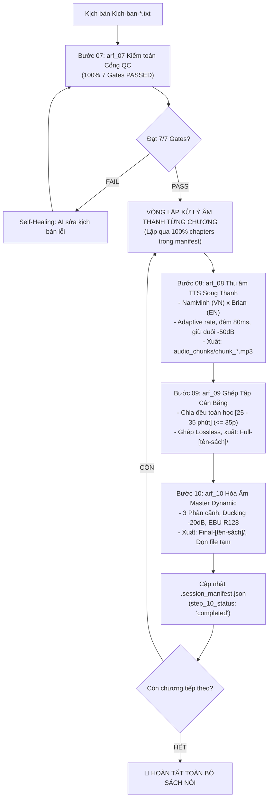

# 🎧 WORKFLOW: SẢN XUẤT ÂM THANH SÁCH NÓI & HÒA ÂM MASTER (BƯỚC 07 - 10)
## Universal Audio Production & Dynamic BGM Mastering Playbook (Steps 07 to 10)

> **QUY TẮC BẤT BIẾN (NON-NEGOTIABLE CONSTRAINTS):**
> 1. **Khóa Cứng Cổng QC Bước 07:** Chỉ cấp quyền thu âm Bước 08 khi `QC_Report.md` xác nhận **100% 7/7 Gates PASSED**. Nếu có lỗi, AI kích hoạt Self-Healing Loop sửa trực tiếp kịch bản.
> 2. **Khóa Cứng Thời Lượng [25 – 35 phút]:** 100% file Audio Full (Bước 09) và Final Master (Bước 10) phải trong dải **[25 – 35 phút]** ($\le 35$ phút). Áp dụng chia đều toán học, cấm thuật toán tham lam (Greedy).
> 3. **Nhất Quán Giới Tính Giọng Đọc:** 100% các chunk và các tập cùng chung một cặp giọng (Nam: Nam Minh x Brian; Nữ: Hoài My x Brian). Cấm đổi giọng khi retry.
> 4. **Kỷ Luật Lưu Trữ Tập Trung & Sạch Thư Mục Gốc:**
>    - File Full (giọng mộc) lưu tại: `Full-[tên-sách]/Full_{chap}_Part{Y}.mp3`.
>    - File Final Master (hòa âm) lưu tại: `Final-[tên-sách]/Final_Audio_{chap}_Part{Y}.mp3`.
>    - Cấm lưu file Full/Final vào thư mục con của chương. Tự động xóa file tạm (`concat_list.txt`, `.raw_part*.txt`).
> 5. **Duyệt Trọn Vẹn Toàn Sách:** AI Agent xử lý tuần tự 100% chapters trong `.session_manifest.json`, không dừng dở dang.

---

## 1. TỔNG QUAN LUỒNG THỰC THI (STEPS 07 - 10)



---

## 2. GIAO THỨC CHỐNG TRÀN NGỮ CẢNH (ANTI-CONTEXT OVERFLOW PROTOCOL)

Để quy trình chạy thông suốt mà **không bao giờ bị tràn ngữ cảnh (Context Overflow)**, Agent áp dụng giao thức nghiệm thu chuyển giao theo từng chặng (Sequential Phased Handshake):

1. **Khóa chốt nghiệm thu (Checkpoint Anchoring):** Xong bước nào chốt dứt điểm bước đó qua file báo cáo/chỉ số (Checkpoint artifact). Agent **chỉ nạp kết quả cô đọng của bước trước** vào bước sau. Tuyệt đối không nạp log command dài dòng hay nội dung văn bản thô vào context.
2. **Cô lập theo từng chương (Per-Chapter Isolation):** Xử lý trọn vẹn từng chương (Bước 07 $\to$ 10) trước khi sang chương tiếp theo. Xong chương nào, giải phóng dữ liệu tạm của chương đó.
3. **Bảng chuyển giao ngữ cảnh giữa các bước:**

| Bước | Đầu Vào Nhận | Điểm Chốt Nghiệm Thu (Checkpoint) | Payload Bàn Giao Sang Bước Kế Tiếp |
| :---: | :--- | :--- | :--- |
| **07** | Thư mục `kich-ban/` | `QC_Report.md` (100% PASSED) | Danh sách kịch bản hợp lệ |
| **08** | Danh sách kịch bản sạch | `audio_chunks/*.mp3` + `.chunks_duration.json` | Tổng thời lượng & duration từng chunk |
| **09** | Duration metadata từ B08 | File `Full_*.mp3` trong `Full-[sách]/` (25-35p) | Danh sách file Full |
| **10** | File Full từ B09 + BGM | `Final_Audio_*.mp3` trong `Final-[sách]/` | Trạng thái `step_10_status: 'completed'` |

---

## 3. CHI TIẾT QUY TRÌNH 4 BƯỚC HÀNH ĐỘNG (STEPS 07 - 10)

### BƯỚC 07: XÁC THỰC CỔNG KIỂM TOÁN CHẤT LƯỢNG (`arf_07_audiobook_qc_auditor`)
* **Mục tiêu:** Cổng kiểm soát bắt buộc, bảo đảm kịch bản sạch 100% lỗi trước khi ghi âm.
* **Lệnh thực thi:**
  ```bash
  python .agent/skills/arf_07_audiobook_qc_auditor/scripts/qc_pipeline_v2.py --input_dir "<BOOK_DIR>"
  ```
* **Self-Healing Loop:** Nếu phát hiện lỗi (sót số trần, câu dài $>30$ từ, ký tự cấm), Agent mở trực tiếp file kịch bản lỗi, sửa triệt để và chạy lại lệnh kiểm toán đến khi đạt **100% 7/7 Gates PASSED**.
* **Checkpoint 07:** File `QC_Report.md` xác nhận toàn bộ chunks đạt PASSED.
* **Chuyển giao sang B08:** Đường dẫn thư mục kịch bản hợp lệ.

---

### BƯỚC 08: THU ÂM SONG THANH NEURAL TTS & SPLICING (`arf_08_tts_neural_bgm_mixer`)
* **Mục tiêu:** Thu âm giọng đọc studio song thanh bản ngữ cho từng chunk kịch bản.
* **Lệnh thực thi:**
  ```bash
  python core/antigravity_audiobook_pipeline.py --book_dir "<BOOK_DIR>" --chapter "<CHAPTER_FOLDER>"
  ```
* **Tiêu chuẩn chất lượng cốt lõi:**
  - **Song thanh bản ngữ:** 100% tiếng Việt đọc bởi `vi-VN-NamMinhNeural`; 100% ngoại ngữ/từ viết tắt đọc bởi `en-US-BrianMultilingualNeural`.
  - **Tốc độ thích ứng ngoại ngữ:** 1 từ/viết tắt: `-18%`; 2-3 từ: `-15%`; $\ge 4$ từ: `-12%`.
  - **Đệm nối khẩu hình 80ms (`pad_dur=0.08`):** Nối êm mượt hai giọng đọc, không giật cục.
  - **Giữ đuôi âm -50dB:** Cắt dead-gap ở ngưỡng an toàn, giữ khoảng lặng tự nhiên 120-180ms giữa các câu.
  - **Loudness EBU R128:** Chuẩn hóa âm lượng đầu ra từng chunk (-16 LUFS).
* **Checkpoint 08:** Đầy đủ `audio_chunks/chunk_*.mp3` (không file rỗng), xuất `.chunks_duration.json`.
* **Chuyển giao sang B09:** Tổng thời lượng và danh sách duration. Giải phóng log TTS khỏi context.

---

### BƯỚC 09: GHÉP TẬP THỜI LƯỢNG CÂN BẰNG [25 - 35 PHÚT] (`arf_09_audio_smart_aggregator`)
* **Mục tiêu:** Ghép các chunk thành các tập Audio Full giọng mộc theo chia đều toán học.
* **Lệnh thực thi:**
  ```bash
  python core/audio_smart_aggregator_bgm.py --chap_dir "<CHAPTER_DIR>" --chap_name "<CHAPTER_NAME>" --step 9
  ```
* **Tiêu chuẩn chất lượng cốt lõi:**
  - **Chia đều toán học (Equitable Partitioning):** Tính số tập $N = \max(1, \operatorname{round}(\text{Tổng phút} / 30))$, phân bổ đều các chunk quanh mục tiêu, khóa cứng $\le 35$ phút ($2.100$s).
  - **Lossless Concat:** Nối trực tiếp luồng stream âm thanh, không re-encode làm suy hao chất lượng.
  - **Lưu trữ tập trung:** Xuất thẳng vào `Full-[tên-sách]/Full_{chap_name}_Part{Y}.mp3`.
* **Checkpoint 09:** 100% file Full xuất xưởng nằm trong khoảng $[25 - 35 \text{ phút}]$.
* **Chuyển giao sang B10:** Danh sách đường dẫn file `Full_*.mp3`.

---

### BƯỚC 10: HÒA ÂM NHẠC NỀN MASTERING (`arf_10_bgm_dynamic_mixer`)
* **Mục tiêu:** Hòa âm đa phân cảnh, cân chỉnh âm học EBU R128 và render file xuất bản.
* **Lệnh thực thi (chạy riêng hoặc gộp Bước 09 + 10):**
  ```bash
  python core/audio_smart_aggregator_bgm.py --chap_dir "<CHAPTER_DIR>" --chap_name "<CHAPTER_NAME>" --step all --bgm "<PATH_TO_BGM>"
  ```
* **Tiêu chuẩn chất lượng cốt lõi:**
  - **Đạo diễn 3 phân cảnh:** Baroque (35% đầu) $\to$ Deep Focus Ambient (40% giữa) $\to$ Piano Outro (25% cuối).
  - **Auto-ducking -20dB:** Nhạc nền tự động né giọng đọc (`volume=0.10` - `0.12`).
  - **Seamless Part Cut:** Fade-in 3s đầu Part 1, Fade-out 5s cuối Part cuối; giữa các Part là Raw cut chính xác để phát nối tiếp không bị hẫng.
  - **Mastering EBU R128:** Tích hợp Loudness chuẩn phát thanh (-16 LUFS, True Peak $\le -1.0$ dBTP).
  - **Tự động dọn rác:** Xóa sạch các file tạm (`concat_list.txt`, `.raw_part*.txt`).
* **Checkpoint 10:** File `Final-[tên-sách]/Final_Audio_{chap_name}_Part{Y}.mp3` hoàn tất, cập nhật `.session_manifest.json` (`step_10_status: "completed"`).

---

## 4. CƠ CHẾ DUYỆT TỰ ĐỘNG TOÀN SÁCH (FULL-BOOK BATCH ORCHESTRATOR)

1. **Đọc Manifest:** Nạp tệp `.session_manifest.json` trong thư mục sách.
2. **Kiểm tra điều kiện:** Xác nhận chapters đã có `step_7_status == "completed"` hoặc `status: "qc_passed"`.
3. **Thực thi vòng lặp tự động:**
   ```bash
   python core/antigravity_audiobook_pipeline.py --book_dir "<BOOK_DIR>" --all --bgm "<PATH_TO_BGM>"
   ```
4. **Nghiệm thu toàn bộ:** Sau mỗi chương, cập nhật manifest `step_10_status: "completed"`. Khi xong 100% chapters, cập nhật `pipeline_stage: "10_bgm_mastered"`.

---

## 5. CẤU TRÚC THƯ MỤC BÀN GIAO CHUẨN

```
[Thư mục sách]/
├── .session_manifest.json          # pipeline_stage: "10_bgm_mastered"
├── Full-[tên-sách]/                # TOÀN BỘ FILE FULL XUẤT XƯỞNG (GIỌNG MỘC [25-35 PHÚT])
│   ├── Full_01-Introduction_Part1.mp3
│   └── ...
├── Final-[tên-sách]/               # TOÀN BỘ FILE FINAL MASTER (HÒA ÂM BGM [25-35 PHÚT])
│   ├── Final_Audio_01-Introduction_Part1.mp3
│   └── ...
└── [Tên-Chương]/                   # DỮ LIỆU TỪNG CHƯƠNG GỌN GÀNG, SẠCH RÁC
    ├── QC_Report.md                # 100% 7 Gates PASSED
    ├── kich-ban/                   # Kich-ban-N.txt
    └── audio_chunks/               # chunk_*.mp3 & .chunks_duration.json
```

---

## 6. LỆNH ĐIỀU PHỐI NHANH (QUICK COMMANDS)

```bash
# 1. Chạy tự động toàn sách (Bước 07 -> Bước 10):
python core/antigravity_audiobook_pipeline.py --book_dir "Kich-ban-clipchamp/<BOOK_SLUG>" --all --bgm "nhac-nen.mp3"

# 2. Chạy 1 chương cụ thể:
python core/antigravity_audiobook_pipeline.py --book_dir "Kich-ban-clipchamp/<BOOK_SLUG>" --chapter "<CHAPTER_FOLDER>" --bgm "nhac-nen.mp3"

# 3. Chạy theo dải chương:
python core/antigravity_audiobook_pipeline.py --book_dir "Kich-ban-clipchamp/<BOOK_SLUG>" --from_chap 1 --to_chap 5 --bgm "nhac-nen.mp3"

# 4. Chạy riêng Bước 09 + Bước 10 (nếu audio_chunks đã thu xong):
python core/audio_smart_aggregator_bgm.py --chap_dir "Kich-ban-clipchamp/<BOOK_SLUG>/<CHAPTER_FOLDER>" --chap_name "<CHAPTER_FOLDER>" --step all --bgm "nhac-nen.mp3"
```
