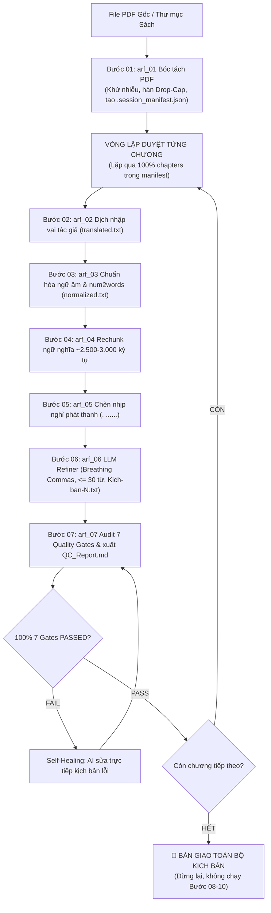

# 🎙️ WORKFLOW: SẢN XUẤT KỊCH BẢN SÁCH NÓI PHÁT THANH (BƯỚC 01 - 07)
## Universal Script Production & Quality Audit Playbook (Steps 01 to 07)

> **QUY TẮC BẤT BIẾN:**
> 1. **Phạm vi khóa cứng:** Chỉ thực hiện từ **Bước 01 đến Bước 07**. Tuyệt đối **KHÔNG** chạy Bước 08 (TTS), Bước 09 (Ghép audio Full) và Bước 10 (Hòa âm BGM).
> 2. **Duyệt trọn vẹn toàn sách (Full-Book Loop Invariance):** AI Agent PHẢI xử lý tuần tự qua **100% các chương** trong `.session_manifest.json`, không được dừng dở dang sau 1-2 chương mẫu.

---

## 1. TỔNG QUAN LUỒNG THỰC THI (STEPS 01 - 07)



---

## 2. NGUYÊN TẮC CỐT LÕI CỦA BIÊN TẬP VIÊN AI

1. **Bảo toàn ngữ nghĩa 100% (Zero Loss):** Tuyệt đối không tóm tắt, không cắt bớt dẫn chứng, số liệu hay ví dụ thực tế của tác giả.
2. **Chiến lược Thuật ngữ 3 Tầng (Anti-Auditory Fatigue):**
   - *Tầng 1 (Định danh):* Giữ nguyên chữ quốc tế ở lần đầu xuất hiện kèm giải nghĩa tiếng Việt để giọng đọc Brian phát âm chuẩn.
   - *Tầng 2 (Nhắc lại có chọn lọc):* Chỉ nhắc lại ở tiêu đề hoặc đầu mục lớn (H1/H2).
   - *Tầng 3 (Thân bài linh hoạt):* Chuyển ngữ tự nhiên sang tiếng Việt, dùng từ viết tắt tách âm phát thanh (*P-M-I*, *W-B-S*) hoặc đại từ thay thế ngắn gọn. Cấm lặp từ ngoại ngữ gây mỏi tai người nghe.
3. **Zero-digit Policy (Không chữ số trần):** 100% con số, năm, phần trăm, tiền tệ phải viết thành chữ tiếng Việt (`20%` $\to$ `hai mươi phần trăm`).
4. **Cú pháp nhịp nghỉ chuẩn:** Dùng ký hiệu `. ......` (chấm, khoảng trắng, sáu chấm) tạo khoảng lặng 1.5 - 2 giây. Cấm dùng `...` tùy tiện.
5. **Thư mục lưu trữ chuẩn:** Mọi kịch bản hoàn chỉnh lưu tại `[chapter_dir]/kich-ban/Kich-ban-N.txt`. Tự động xóa file thô tạm `Kich-ban-raw-*.txt` sau Bước 06.

---

## 3. CHI TIẾT 7 BƯỚC THỰC THI

### BƯỚC 01: BÓC TÁCH CẤU TRÚC PDF (`arf_01_pdf_structure_extractor`)
- **Mục tiêu:** Tạo cây thư mục chương, file gốc `raw_original.txt` và `.session_manifest.json`.
- **Thao tác:**
  ```bash
  python core/extract_pdf_structure.py --source_path "<PATH_TO_PDF>" --output_dir "Kich-ban-clipchamp" --book_slug "<BOOK_SLUG>"
  ```
- **Yêu cầu:** Lọc sạch Header, Footer, số trang; phục hồi ligature lỗi (`\x00`), nối liền chữ Drop-Cap bị rớt dòng (`T\nrong` $\to$ `Trong`).

### BƯỚC 02: DỊCH THUẬT NHẬP VAI TÁC GIẢ (`arf_02_author_style_translator`)
- **Mục tiêu:** Chuyển đổi `raw_original.txt` thành bản dịch tiếng Việt hoàn chỉnh `translated.txt`.
- **Thao tác:** AI nhập vai tác giả chuyển ngữ (hoặc sao chép nếu sách gốc là tiếng Việt). Chuyển bảng biểu, sơ đồ thành văn xuôi phát thanh truyền cảm. Cập nhật `step_2_status: "completed"` trong manifest.

### BƯỚC 03: CHUẨN HÓA NGỮ ÂM & SỐ HÓA (`arf_03_text_phonetics_normalizer`)
- **Mục tiêu:** Tạo `normalized.txt` sạch 100% lỗi gây vấp âm TTS.
- **Thao tác:**
  - Viết toàn bộ số thành chữ tiếng Việt (`num2words`).
  - Xóa sạch icons/bullets: `[▶►▪●★▲◆■✓•–—…|/\\\\]`.
  - Xóa ngoặc kép `""“”`; thay `()[]` thành dấu phẩy `, `; thay `:` thành `, ` hoặc `. `.
  - Tách âm từ viết tắt và áp dụng Chiến lược thuật ngữ 3 Tầng.

### BƯỚC 04: PHÂN TÁCH PHÂN ĐOẠN NGỮ NGHĨA (`arf_04_smart_audiobook_rechunker`)
- **Mục tiêu:** Tạo các khối kịch bản thô `kich-ban/Kich-ban-raw-N.txt` (2.500 – 3.000 ký tự).
- **Thao tác:** Cắt tại ranh giới kết thúc đoạn văn hoặc câu có dấu chấm `.`. Tuyệt đối không cắt cụt giữa câu hoặc giữa mạch ý.

### BƯỚC 05: ĐỊNH HÌNH NHỊP THỞ PHÁT THANH (`arf_05_script_structure_formatter`)
- **Mục tiêu:** Thiết lập nhịp điệu phát thanh chuyên nghiệp.
- **Thao tác:** Tiêu đề viết IN HOA đứng riêng một dòng; chèn `. ......` sau tiêu đề và sau các đoạn chuyển ý hoặc luận điểm triết lý sâu sắc.

### BƯỚC 06: TINH CHỈNH DIỄN ĐỌC BẰNG LLM (`arf_06_llm_script_refiner`)
- **Mục tiêu:** Đạo diễn âm thanh và nhịp thở, xuất `kich-ban/Kich-ban-N.txt` và dọn dẹp file tạm.
- **Thao tác:**
  - Thêm dấu phẩy lấy hơi (Breathing Commas) tại các mệnh đề phụ, liên từ (`tuy nhiên,`, `do đó,`), khống chế câu $\le 30$ từ.
  - Quét sạch việc lặp từ tiếng Anh trong thân bài (Anti-Auditory Fatigue).
  - Tự động xóa các file thô `Kich-ban-raw-*.txt` sau khi tạo xong `Kich-ban-N.txt`.

### BƯỚC 07: KIỂM TOÁN CHẤT LƯỢNG 7 GATES (`arf_07_audiobook_qc_auditor`)
- **Mục tiêu:** Cổng kiểm soát chất lượng không nhân nhượng. 100% PASSED mới hoàn tất chương.
- **Bảng 7 Quality Gates:**
  1. *Gate 1 (Folder):* Tên thư mục regex `^[a-zA-Z0-9\-]+$`.
  2. *Gate 2 (Size):* File kịch bản $\le 3.000$ ký tự, không rỗng (0 bytes).
  3. *Gate 3 (Forbidden):* Quét regex sạch 100% ngoặc, nháy kép, `:`, gạch dài, icon.
  4. *Gate 4 (Zero-digit):* Không còn bất kỳ chữ số tự nhiên nào (`0-9`).
  5. *Gate 5 (Pacing):* Cú pháp nhịp nghỉ chuẩn `. ......` (chấm, cách, 6 chấm).
  6. *Gate 6 (Word Delta):* Đối soát độ lệch số từ, đảm bảo không tóm tắt hay cắt xén.
  7. *Gate 7 (Fatigue):* Không lặp thuật ngữ ngoại ngữ quá 2 lần/đoạn thân bài.
- **Cơ chế Self-Healing Loop:** Nếu bất kỳ Gate nào FAIL, AI tự động mở đúng file lỗi, trực tiếp sửa chữa và tái kiểm toán cho đến khi 100% PASSED. Xuất báo cáo `QC_Report.md`.

---

## 4. CƠ CHẾ DUYỆT TOÀN BỘ SÁCH (FULL-BOOK BATCH ITERATOR)

Để đảm bảo AI Agent xử lý trọn vẹn toàn bộ cuốn sách mà không dừng lại giữa chừng:

1. **Đọc Manifest:** Mở `.session_manifest.json` trong thư mục sách.
2. **Lọc danh sách cần xử lý:** Lấy toàn bộ chapters có `step_7_status != "completed"`.
3. **Thực thi vòng lặp:**
   ```python
   for chapter in pending_chapters:
       # Chạy Bước 02 -> Bước 07 cho chapter
       # Khi Bước 07 đạt 100% 7 Gates PASSED -> cập nhật manifest: step_7_status = 'completed'
   ```
4. **Điều kiện kết thúc:** Chỉ thông báo hoàn tất khi TẤT CẢ các chương trong manifest đều có trạng thái `qc_passed` và có file `QC_Report.md` hợp lệ.

---

## 5. KHÓA CHẶN THI CÔNG & BÀN GIAO (TERMINATION GATE)

> [!CAUTION]
> **DỪNG LẠI SAU BƯỚC 07:**
> - Tuyệt đối **KHÔNG** gọi hàm thu âm TTS (Bước 08).
> - Tuyệt đối **KHÔNG** gọi hàm ghép audio Full (Bước 09).
> - Tuyệt đối **KHÔNG** gọi hàm hòa âm nhạc nền BGM (Bước 10).
> - Sau khi toàn bộ các chương đạt 100% 7 Gates PASSED, Agent bàn giao danh sách kịch bản và báo cáo kết thúc.

### Cấu trúc thư mục bàn giao:
```
[book_dir]/
├── .session_manifest.json          # Trạng thái 100% chapters: qc_passed
└── [Tên-Chương]/
    ├── raw_original.txt            # Dữ liệu nguồn đối soát
    ├── translated.txt              # Bản dịch đầy đủ
    ├── normalized.txt              # Bản ngữ âm chuẩn hóa
    ├── QC_Report.md                # Báo cáo 100% 7 Gates PASSED
    └── kich-ban/
        ├── Kich-ban-1.txt          # Kịch bản phát thanh hoàn chỉnh
        └── ...
```

---

## 6. LỆNH ĐIỀU PHỐI NHANH (QUICK COMMANDS)

```bash
# 1. Bóc tách PDF (Bước 01):
python core/extract_pdf_structure.py --source_path "<PATH_TO_PDF>" --output_dir "Kich-ban-clipchamp" --book_slug "<BOOK_SLUG>"

# 2. Xử lý kịch bản trọn gói Bước 02 -> Bước 07 cho 1 chương:
python -c "import sys; sys.path.insert(0, 'core'); from audiobook_script_processor import process_chapter_scripts; print(process_chapter_scripts('<DIR>', '<CHAP>'))"

# 3. Kiểm toán độc lập 7 Gates QC (Bước 07):
python .agent/skills/arf_07_audiobook_qc_auditor/scripts/qc_pipeline_v2.py --input_dir "<BOOK_DIR>"
```