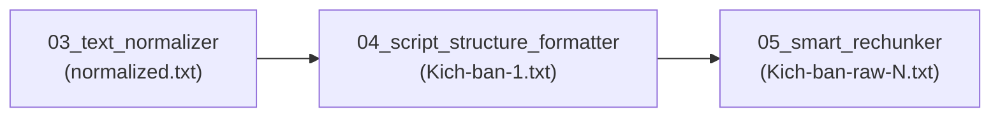

# Kỹ năng 04: Định dạng Cấu trúc Kịch bản TTS (Script Structure Formatter)

Kỹ năng này chịu trách nhiệm **chuẩn hóa cấu trúc hình thức và nhịp thở của văn bản kịch bản**, giải quyết triệt để lỗi dính tiêu đề (Heading) vào nội dung đoạn văn (Body paragraph), đồng thời phân bổ các điểm ngắt nghỉ chuẩn xác cho công cụ Text-To-Speech (TTS như Clipchamp, Edge TTS, v.v.).

---

## 🎯 1. Mục tiêu & Nhiệm vụ cốt lõi

1. **Phân tách Tiêu đề độc lập & Bảo vệ Chữ cái Đầu đoạn (Heading Guard):**
   - Phát hiện chính xác tiêu đề chương, tiêu đề phần, tiêu đề phụ (Sub-heading) dù nằm trên một dòng riêng hay bị dính vào câu đầu tiên của đoạn văn.
   - Đưa tiêu đề về một khối riêng biệt phía trên đoạn văn.
   - **Quy tắc Chặn Tuyệt đối (Heading Guard):** Các dòng ngắn $\le 2$ ký tự hoặc chữ cái đơn lẻ rớt dòng (`T`, `B`, `C`...) tuyệt đối KHÔNG được coi là tiêu đề; tự động hàn gắn lại vào chữ cái đầu của đoạn văn (`T` + `rong` -> `Trong`, `B` + `ạn` -> `Bạn`).

2. **Chèn Marker ngắt nghỉ TTS chuẩn (`. ......`):**
   - **Sau tiêu đề:** Thêm `. ......` và xuống **1 dòng trắng** (`\n\n`) để tạo khoảng nghỉ trang trọng, nhấn mạnh chủ đề trước khi bắt đầu nội dung.
   - **Cuối mỗi đoạn văn:** Thêm `. ......` và xuống **1 dòng trắng** (`\n\n`) để tạo nhịp thở tự nhiên, giúp người nghe có thời gian chiêm nghiệm và tiếp thu.
   - **Tuyệt đối KHÔNG chèn `. ......` sau các chữ cái đơn lẻ hoặc từ bị gãy dòng.**

3. **Loại bỏ hiện tượng gãy nhịp TTS:**
   - Dọn sạch các dấu chấm lửng rải rác sai vị trí (`...`, `..`) ở giữa câu gây ra hiện tượng đọc giật cục hoặc giọng robot.
   - Chuẩn hóa dấu kết thúc câu đảm bảo bộ đọc AI điều chỉnh ngữ điệu lên/xuống giọng tự nhiên.

4. **Quản lý Session & Lưu vết Manifest:**
   - Tự động nhận diện session hiện tại từ thư mục hoặc tham số `--session_id`.
   - Cập nhật trường `step_4_status` (`in_progress`, `completed`, `failed`) trong file `.session_manifest.json` kèm báo cáo chi tiết từng chương.

---

## 📥 2. Luồng Dữ liệu (I/O)

| Thành phần | Chi tiết |
| :--- | :--- |
| **Input** | `normalized.txt` (Văn bản đã qua bước dịch thuật và chuẩn hóa sơ bộ).<br>*(Fallback tự động: `translated.txt` hoặc `raw_original.txt` nếu chưa có `normalized.txt`)* |
| **Output** | `Kich-ban-1.txt` (Kịch bản thô cấp 1 hoàn chỉnh về cấu trúc và ngắt nghỉ). |
| **Manifest** | `.session_manifest.json` (Cập nhật `step_4_status`, thời gian hoàn thành và số lượng marker ngắt nghỉ). |

---

## 📐 3. Quy tắc Định dạng Cấu trúc

### ❌ Trường hợp Sai (Tiêu đề dính liền, thiếu ngắt nghỉ):
```text
Số lượng nhiệm vụ so với tầm quan trọng Đây là một khám phá thú vị. Mỗi nhiệm vụ bạn thực hiện đều mang lại một giá trị khác nhau. Bạn không nên đối xử với mọi công việc như nhau.
```

### ✅ Trường hợp Đúng (Đã tách tiêu đề, có nhịp thở TTS):
```text
Số lượng nhiệm vụ so với tầm quan trọng. ......

Đây là một khám phá thú vị. Mỗi nhiệm vụ bạn thực hiện đều mang lại một giá trị khác nhau. Bạn không nên đối xử với mọi công việc như nhau. ......
```

---

## ⚙️ 4. Hướng dẫn Sử dụng & Lệnh CLI

### 4.1. Lệnh thực thi cơ bản:
```bash
python .agy/skills/04_script_structure_formatter/scripts/format_script_structure.py --input_dir "<ĐƯỜNG_DẪN_THƯ_MỤC_SÁCH>"
```

### 4.2. Lệnh thực thi có Session ID:
```bash
python .agy/skills/04_script_structure_formatter/scripts/format_script_structure.py --input_dir "d:/Solution/Audio-Book-Refactor/Kich-ban-clipchamp/Eat-that-frog" --session_id "session_20260816_01"
```

### 4.3. Các tham số CLI:
- `--input_dir` *(Bắt buộc)*: Đường dẫn tới thư mục sách chứa các thư mục chương con (ví dụ: `00-Preface`, `01-Chuong-01`, ...) hoặc thư mục kịch bản đơn lẻ.
- `--session_id` *(Tùy chọn)*: Mã định danh phiên làm việc phục vụ theo dõi tiến trình.
- `--manifest_path` *(Tùy chọn)*: Đường dẫn tùy chỉnh tới file `.session_manifest.json`.

---

## 📊 5. Cấu trúc Cập nhật trong `.session_manifest.json`

Khi tiến trình hoàn tất, file `.session_manifest.json` sẽ được tự động cập nhật:

```json
{
  "session_id": "session_20260816_01",
  "step_4_status": "completed",
  "steps": {
    "step_4_script_structure_formatter": {
      "status": "completed",
      "completed_at": "2026-08-16T10:06:17.123456",
      "details": {
        "total_dirs": 22,
        "success_count": 22,
        "results": [
          {
            "dir": "01-Chuong-01",
            "status": "success",
            "input_file": "normalized.txt",
            "output_file": "Kich-ban-1.txt",
            "chars_count": 4850,
            "marker_count": 18
          }
        ]
      }
    }
  }
}
```

---

## 6. Hướng Dẫn Kích Hoạt Sub-Agent Đạo Diễn Nhịp Thở Từng Chương (Audio Breathing Subagent)

Khi cần tối ưu sâu cấu trúc cho các chương dài với nhiều tiểu mục:

```python
invoke_subagent(
    Subagents=[
        {
            "TypeName": "self",
            "Role": "Audio Breathing Director [01-quy-luat-01]",
            "Prompt": (
                "Bạn là Tổng đạo diễn Nhịp thở Âm thanh phụ trách chương '01-quy-luat-01'.\n"
                "Nhiệm vụ: Đọc file 'normalized.txt', bóc tách độc lập các tiêu đề chương/mục và chèn marker ngắt nghỉ '. ......' đúng nhịp thở tự nhiên vào 'Kich-ban-1.txt'.\n"
                "Tuyệt đối: Không chèn marker ngắt nghỉ sau các chữ cái đơn lẻ hoặc từ bị gãy dòng (Heading Guard)."
            )
        }
    ]
)
```

---

## 🔄 7. Vị trí trong Quy trình Tổng thể


