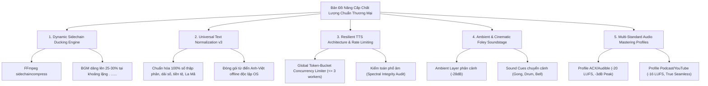

# 🎧 BÁO CÁO TỔNG HỢP BEST PRACTICES & PHÂN TÍCH KHOẢNG TRỐNG CHẤT LƯỢNG (GAP ANALYSIS)
## HỆ THỐNG SẢN XUẤT SÁCH NÓI & KỊCH TRUYỀN THANH TỰ ĐỘNG HÓA VẠN NĂNG (UNIVERSAL AUDIOBOOK PIPELINE)

---

## 1. PHÂN TÍCH CÁC BEST PRACTICES HIỆN CÓ TRONG TOÀN BỘ PIPELINE

Hệ thống đã định hình một chuỗi công nghệ 10 bước khép kín với 8 thực hành kỹ thuật và nghệ thuật (Best Practices) tiêu biểu:

### 1.1. Chiến Lược Biên Tập Thuật Ngữ 3 Tầng (3-Tier Terminology Strategy)
* **Vấn đề cốt lõi giải quyết:** Triệt tiêu hiện tượng mỏi thính giác (Auditory Fatigue) và sự đứt gãy nhịp điệu não bộ do việc đảo giọng liên tục (Voice Switching) giữa giọng tiếng Việt (`vi-VN-NamMinhNeural`) và giọng tiếng Anh (`en-US-BrianMultilingualNeural`).
* **Cơ chế vận hành 3 tầng:**
  - **Tầng 1 (Định vị ban đầu):** Giữ nguyên ký tự quốc tế ở lần giới thiệu đầu tiên hoặc đề mục mới kèm diễn giải tiếng Việt (*Stakeholder - các bên liên quan*).
  - **Tầng 2 (Nhắc lại có chọn lọc):** Chỉ nhắc lại ở các đề mục lớn (H1/H2) để tái định vị ngữ cảnh thính giác.
  - **Tầng 3 (Biên tập thân bài linh hoạt bằng LLM):** Chuyển thể tự nhiên sang tiếng Việt, dùng từ viết tắt tách âm phát thanh (*P-M-I*, *W-B-S*) hoặc đại từ thay thế. Tuyệt đối cấm lặp từ ngoại ngữ $\ge 3$ lần/đoạn.
* **Thang tốc độ thích ứng linh hoạt theo độ dài từ (Length-Adaptive Speech Rate):**
  - *1 từ / từ viết tắt:* `-18%` (Ví dụ: *P-M-I, scope, role* - phát âm tròn vành rõ chữ, tôn trọng nguyên âm ngắn).
  - *2 – 3 từ:* `-15%` (Ví dụ: *Project Manager, Sprint Backlog* - nhịp phát thanh đĩnh đạc).
  - *$\ge 4$ từ:* `-12%` (Ví dụ: *Becoming an Effective Project Manager* - đọc liền mạch, tránh ì ạch, buồn ngủ).
* **Phân luồng nhịp điệu âm học:**
  - `pause_type: emphasis` (đệm 220ms qua `apad=0.22`): Điểm nhấn sau tiêu đề hoặc giải nghĩa.
  - `pause_type: seamless` (đệm 80ms qua `apad=0.08`, bảo toàn đuôi âm khẽ `-50dB`): Ghép âm êm ái trong dòng chảy ngữ pháp liên tục (*các Project Manager*, *tại Google New York*).

### 1.2. Dịch Thuật Song Trục Phong Cách Tác Giả (Dual-Engine Translation)
* **Profile 2A (Phi hư cấu / Kinh doanh / Tự lực):** Khóa cứng ngôi xưng `Tôi - Bạn`, văn phong cố vấn/chuyên gia đĩnh đạc, súc tích, bảo toàn 100% thuật ngữ kỹ thuật và số liệu.
* **Profile 2B (Văn học kinh điển / Kịch nghệ / Sử thi):** 5 trụ cột kịch nghệ, bảo tồn khẩu khí nhân vật, đại từ xưng hô phong kiến (*Chúa công, Quân sư, Thưa Đức ông*), bảo tồn 100% âm Hán-Việt (nhân vật, địa danh, chức tước), số hóa cổ phong (*canh ba, ba vạn quân, hai mươi trượng*).
* **Rolling Context & Seam Smoothing:** Khi văn bản dài $> 1.200$ từ, chia nhỏ thành các khối 800 – 1.200 từ; mỗi phân đoạn gối đầu 3 câu tiếng Việt cuối của đoạn trước (`trailing_context`) và nạp chung `custom_phonetics.json`, loại bỏ hoàn toàn vết rạn nứt văn phong giữa các phân đoạn.

### 1.3. Thuyết Minh Trực Quan & Phần Tử Phi Văn Bản (Visual Narrative Synthesis)
* Quy chuẩn hóa việc chuyển đổi các phần tử phi văn bản và nội dung trực quan phức tạp thành lời nói tự nhiên chuẩn phát thanh:
  - **Bảng biểu (Tables):** Cấm đọc lưới tọa độ (`|---|---|`); thuyết minh mục đích so sánh, xu hướng biến động và số liệu trọng yếu.
  - **Biểu đồ & Sơ đồ (Charts & Diagrams):** Thuyết minh loại biểu đồ, 2 trục đo lường, xu hướng vận động chính (tăng, giảm, điểm uốn) và luận điểm tác giả.
  - **Hình ảnh minh họa (Illustrations):** Lược bỏ ảnh trang trí; thuyết minh ý nghĩa ngụ ngôn trong 1-2 câu súc tích.
  - **Công thức toán học (Math Equations):** Chuyển đổi mã LaTeX thành Spoken Math tiếng Việt tự nhiên.
  - **Mã nguồn máy tính (Source Code):** Tường thuật luồng logic thuật toán (Input $\to$ Xử lý $\to$ Output) thay vì đọc cú pháp dấu ngoặc.

### 1.4. Ngắt Nhịp Vi Mô Thi Ca & Chống Robot Hóa (Poetic Prosody Caesura & Zero Robotic Poetics)
* Giải quyết triệt để lỗi "Poetic Run-on" (TTS đọc thơ dồn dập như văn xuôi):
  - Bóc tách 100% dòng thơ thành entry độc lập `type: "poem"`.
  - Kết thúc 100% dòng thơ bằng dấu câu (dấu phẩy `, ` hoặc chấm `. `).
  - Tự động chèn nhịp vi mô caesura `, ` theo thể thơ: Lục bát ($3/3$ và $4/4$), Song thất lục bát ($3/4$ hoặc $2/2/3$), Thất ngôn Đường luật ($4/3$ hoặc $2/2/3$).
  - Cấu trúc đệm thở 3 tầng: Lead-in pause ($0.8\text{s} - 1.5\text{s}$), Inter-verse pause ($0.85\text{s}$), Ending coda pause ($1.5\text{s} - 1.8\text{s}$ `. ......`).
  - Âm học ngâm vịnh: tốc độ chậm rãi `rate: -18%`, cao độ trầm `pitch: -2Hz`, bộ lọc `timbre_eq: "poetic_recitation"`.

### 1.5. Động Cơ Tổng Hợp Âm Sắc Thích Ứng (ATSE Formant DSP)
* Giải phóng giới hạn chỉ có 2 giọng đọc (`NamMinh`, `HoaiMy`) của Edge-TTS bằng việc điêu khắc âm sắc đa trục Formant DSP qua FFmpeg:
  - **Trục Body (150 – 300Hz):** Độ dày, uy lực, trầm hùng (`chest_resonance`, `warm_authority`).
  - **Trục Nasal / Boxiness (400 – 800Hz):** Khắc khổ, hoài niệm, bi tráng (`aged_gravel`, `elegiac_narrator`).
  - **Trục Presence / Intelligibility (2 – 4kHz):** Sắc sảo, hiểm hóc, tranh luận gay cấn (`sharp_cunning`, `epic_narrator`).
  - **Trục Air / Brilliance (5 – 8kHz):** Trẻ trung, thanh thoát, lãng mạn (`youth_bright`).
* Cho phép kết hợp tự do hoặc nạp chuỗi FFmpeg parametric equalizer strings tùy biến cao độ.

### 1.6. Cân Bằng Âm Học 2 Tầng Chuẩn Phát Thanh (Two-Stage Broadcast Leveling)
* **Stage 1 (Per-Segment Leveling):**
  - Thuật toán đảo chiều `areverse | silenceremove | areverse` với ngưỡng âm cực khẽ `start_threshold=-50dB` giúp bảo toàn 100% đuôi âm khẽ của tiếng Việt (không bị nuốt phụ âm cuối).
  - Định hình Formant EQ + chuẩn hóa EBU R128 `loudnorm=I=-16:TP=-1.5:LRA=5` cho từng câu thoại/dẫn chuyện riêng biệt.
  - Đệm khẩu hình `apad` tương thích với ngữ cảnh phát ngôn.
* **Stage 2 (Master Chunk Leveling):**
  - Ghép nối các segment qua FFmpeg Concat Demuxer và áp dụng EBU R128 `loudnorm=I=-16:TP=-1.5:LRA=6` trên toàn chunk, triệt tiêu hoàn toàn sự chênh lệch âm lượng khi đổi nhân vật hoặc chuyển cảnh.

### 1.7. Cắt Gọt Liền Mạch & Cân Bằng Thời Lượng Toán Học (True Seamless Cut & Equitable Partitioning)
* **Khóa cứng thời lượng [25 – 35 phút]:** Thuật toán quy hoạch động Equitable Distribution phân bổ các chunk thành các Part đồng đều, triệt tiêu hiện tượng mẩu thừa ngắn ngủn.
* **True Seamless Part Cut:**
  - Part 1: Fade-in 3.0s ở đầu, cắt thô (Raw cut) ở cuối.
  - Middle Parts: Cắt thô cả đầu và cuối (không chèn fade-in/fade-out làm gián đoạn dòng suy nghĩ).
  - Last Part: Cắt thô ở đầu, Fade-out 5.0s ở cuối.
* **BGM Continuous Timeline Offset:** Nhạc nền trích xuất theo trục thời gian tịnh tiến (`current_bgm_offset`), không bị reset về đầu qua từng Part.

### 1.8. Điều Phối Sub-agents Song Song Theo Giao Thức Phản Xạ (Parallel Subagents Orchestration)
* Triệt tiêu tư duy thực thi đơn lẻ (Zero-Solo) và quá tải ngữ cảnh (Context Exhaustion).
* AI Chính kích hoạt ngay `invoke_subagent` ở lượt gọi đầu tiên.
* Phân rã $N$ chunk cho mảng sub-agents tinh chỉnh song song (Bước 05 & 06) chỉ mất 1 - 1.5 phút.
* Bước 08A: Kích hoạt Hội đồng 5 Sub-agents chuyên môn hóa sâu (Speaker Attribution, Character Profiler, Dramatic Dynamics, Poetic Prosody, Continuity QC) xuất bản kịch bản phân vai kịch nghệ hoàn hảo.

---

## 2. SO SÁNH VỚI CÁC GIẢI PHÁP HÀNG ĐẦU THẾ GIỚI

| Tiêu Chí So Sánh | BBC Radio Drama & Audio Theatre | Audible Studios (ACX Standard) | ElevenLabs Reader / Modern TTS | Universal Audiobook Pipeline (Hiện Tại) |
| :--- | :--- | :--- | :--- | :--- |
| **Cơ Chế Diễn Xuất & Phân Vai** | Ensemble Cast (100% diễn viên kịch nghệ chuyên nghiệp diễn tương tác thực tế). | Solo Voice Actor biến hóa đa giọng hoặc Full Cast Production cho các tựa sách lớn. | Generative Voice Cloning, hàng trăm mẫu giọng tổng hợp, tự động nhận diện ngữ cảnh. | **AI Theatrical Council (5 Subagents) + ATSE Formant DSP:** Biến 2 giọng gốc thành 15+ nhân vật có độ tuổi, khí chất và cảm xúc riêng biệt. |
| **Âm Thanh Không Gian & Foley/SFX** | **Binaural 3D Audio**, hiệu ứng Foley vật lý phong phú (bước chân, vũ khí, thời tiết, cửa sổ). | Tập trung vào giọng đọc thuần (Voice-only), hiếm khi chèn SFX trừ thể loại GraphicAudio. | Giọng đọc thuần, chưa có tự động hóa Foley hay không gian 3D. | **Khoảng trống:** Hiện chỉ có BGM 3-scene scoring, chưa có Spatial Panning và chưa có Foley Sound Effects tự động. |
| **Chuẩn Đo Âm Học & Loudness** | EBU R128 (-23 LUFS cho Radio, -16 LUFS cho Podcast/Online). | ACX Specification: **-23dB đến -18dB RMS**, True Peak $\le -3\text{dB}$, Noise floor $\le -60\text{dB}$. | Không có mastering tích hợp (phụ thuộc vào hệ thống bên ngoài). | **EBU R128 (-16 LUFS, TP -1.5dB, 48kHz, 192k):** Chuẩn Podcast/Broadcast mạnh mẽ, sắc nét; Two-Stage Dynamic Leveling. |
| **Hòa Âm Nhạc Nền & Ducking** | Nhạc nền sáng tác riêng (Bespoke Dynamic Score), Sidechain Ducking tự động mượt mà. | Thường chỉ có Intro/Outro 5s; đa phần sách không có nhạc để bảo toàn tính tập trung. | Không có engine hòa âm nhạc nền tích hợp. | **Dynamic Timeline 3 Scenes, True Seamless Cut:** Tuy nhiên ducking hiện tại dùng static volume reduction (-20dB) thay vì true sidechain compressor. |
| **Kiểm Toán Chất Lượng (QC)** | Đội ngũ kỹ sư âm thanh và đạo diễn thẩm âm trực tiếp trong phòng thu. | Kiểm tra thủ công kết hợp công cụ ACX Audio Lab tự động quét RMS/Peak. | Kiểm tra thủ công người dùng. | **Hard QC Gate (7 Gates Tự Động) + Subagent Proof Audit:** 100% kiểm tra ký tự, số trần, nhịp thở, độ giãn nở từ vựng trước khi thu âm. |
| **Chi Phí & Tốc Độ Sản Xuất** | $2.000 - $10.000 / giờ kịch truyền thanh; mất 2-4 tuần sản xuất. | $200 - $800 / giờ sách nói hoàn thiện; mất 5-10 ngày sản xuất. | $0.15 - $0.30 / 1.000 ký tự; chi phí API lớn với sách dài hàng triệu từ. | **Chi phí vận hành gần như 0đ** (Edge-TTS); hoàn thành một chương sách 30 phút trong 2 - 4 phút. |

---

## 3. CÁC BEST PRACTICES BỊ BỎ SÓT TRONG QUÁ TRÌNH REFACTOR (TỪ GIT HISTORY)

Qua khảo sát toàn bộ lịch sử git (`2c48dc9`, `cd02fd4`, `e3f85cb`) và các file thử nghiệm trong `archive/legacy_scratch_tests`, phát hiện 4 thực hành có giá trị thực tiễn cao nhưng chưa được tích hợp hoàn toàn vào pipeline chuẩn:

### 3.1. Thuật toán chèn Breathing Commas theo Từ Nối Chức Năng (`add_commas_fix.py`)
* **Trong git commit cũ:** File `add_commas_fix.py` sở hữu một giải thuật xác định vị trí lấy hơi rất thông minh: Khi một câu dài hơn 15 từ mà chưa có dấu phẩy, script quét trong dải từ `[5:-5]` để tìm các từ nối quan hệ (`rằng`, `là`, `để`, `mà`, `thì`, `và`, `hoặc`) rồi chèn dấu phẩy ngay trước từ nối đó; nếu không có mới chèn ở trung vị câu (`len(words)//2`).
* **Khoảng trống hiện tại:** Khi chạy pipeline không dùng LLM (ở script fallback `audiobook_script_processor.py`), thuật toán chèn dấu phẩy regex chỉ dựa trên độ dài chuỗi ký tự mà bỏ quên bộ từ nối chức năng đã được chứng minh hiệu quả âm học rất cao.

### 3.2. Khả năng Chuyển Đổi Số Toàn Diện của `num2words` so với `num2words_vi`
* **Trong git commit cũ:** Script `scripts/apply_golden_rules.py` sử dụng thư viện chuẩn `num2words(int(num_str), lang='vi')`.
* **Khoảng trống hiện tại:** Trong `core/audiobook_script_processor.py`, tác giả tự viết hàm `num2words_vi`. Hàm tự viết này có nhược điểm lớn:
  - Chỉ hỗ trợ số nguyên dương $< 1$ tỷ.
  - **Bỏ sót hoàn toàn:** Số thập phân (ví dụ `3.14` hoặc `0,5` không đọc thành *ba phẩy mười bốn*), tỷ lệ phần trăm (`50%`), dải số (`5-10 ngày`), số La Mã (`thế kỷ XXI`), tiền tệ (`$100`), và các số lớn $\ge 1$ tỷ.

### 3.3. Bí Kíp Ngữ Âm Chống Nuốt Phụ Âm Cuối Tiếng Việt trong `legacy_scratch_tests`
* **Trong các file âm thanh thử nghiệm:** Loạt file `qlda_comma`, `qlda_dot`, `qlda_nodot`, `tn_dot`, `tv_dn_da`, `xc_nodot` trong `legacy_scratch_tests` ghi nhận một đặc tính âm vị học quan trọng của Edge-TTS:
  - Khi một từ tiếng Việt kết thúc bằng phụ âm tắc vô thanh (`c`, `p`, `t`, `ch` - ví dụ: *quản lý dự án, xuất phát mới, tích tắc*) đi liền kề trước dấu chấm câu (`.`), mô hình WaveNet của Edge-TTS thường ngắt luồng khí đột ngột, làm cụt mất âm đuôi.
  - Việc đặt dấu phẩy `, ` hoặc khoảng trắng đệm trước dấu ngắt sẽ giữ trọn vẹn âm sắc tự nhiên của từ. Kinh nghiệm này chưa được hệ thống hóa thành một quy tắc chuẩn hóa văn bản tự động trước khi nạp vào TTS.

### 3.4. Cấu Hình Lọc Header/Footer Theo Từng Cuốn Sách
* **Trong git commit cũ:** Mỗi cuốn sách có script trích xuất riêng với các bộ regex đặc thù.
* **Khoảng trống hiện tại:** Khi hợp nhất vào `extract_pdf_structure.py`, hàng loạt regex của các sách cũ (*Never Eat Alone*, *Eat That Frog*, *Tam Quốc Diễn Nghĩa*) bị gộp chung vào một hàm `is_noise_line` dài hàng trăm dòng, chưa được tách thành các file cấu hình metadata độc lập (`noise_filters.json` bên trong thư mục từng cuốn sách).

---

## 4. PHÂN TÍCH CÁC RỦI RO CHẤT LƯỢNG TIỀM ẨN

### 4.1. Giới Hạn Tải & Rate Limit của Edge-TTS khi Gọi Song Song Nhiều Requests
* **Nguyên nhân cốt lõi:** `edge-tts` giao tiếp qua WebSocket công cộng của Microsoft (`wss://speech.platform.bing.com/consumer/speech/synthesize/readaloud/edge/v1`) không có cam kết SLA.
* **Rủi ro kỹ thuật:**
  - Nếu kích hoạt hàng chục worker song song tạo audio segments cùng lúc, IP sẽ bị rate-limit tạm thời (HTTP 429 hoặc WebSocket closure mã 1006 / 1008).
  - Kết quả là các file audio bị rỗng, bị cụt đuôi (truncated audio), hoặc tiến trình bị crash do timeout.
* **Đánh giá mã nguồn hiện tại:** Trong `seamless_dual_voice_splicer.py` đã có retry backoff (`asyncio.sleep(2.0 * attempt)`) và semaphore cục bộ, nhưng thiếu một **Global Token-Bucket Rate Limiter** liên tiến trình và thiếu cơ chế fallback sang mạng proxy xoay vòng khi bị chặn IP.

### 4.2. Nguy Cơ Cắt Sai Câu Trong Các Văn Bản Cổ Phong Biền Ngẫu Dài
* **Đặc thù văn bản:** Các áng văn cổ phong (*Tam Quốc Diễn Nghĩa*, hịch, phú, câu đối) có cấu trúc câu biền ngẫu đăng đối kéo dài hàng trăm từ, liên kết bằng các hư từ (*bèn, chợt nghe, lại thấy, song le*) mà không hề có dấu chấm câu ngắt đoạn. Ngoài ra, lời thoại nhân vật thường lồng ghép trực tiếp trong mạch dẫn (*Huyền Đức bảo Quan Công rằng: Em chớ nóng nảy...*).
* **Rủi ro kỹ thuật:**
  - Bộ cắt câu regex dựa trên `[.!?]` sẽ gom cả một đoạn văn biền ngẫu khổng lồ vào một câu duy nhất, vi phạm luật $\le 30$ từ của Bước 06.
  - Nếu cắt mù quáng ở dấu phẩy, sẽ chém đứt các vế câu đăng đối, làm mất nhịp điệu hùng tráng của văn học kinh điển.
  - Regex nhận diện thoại `DIALOGUE_CUE_REGEX` trong `theatrical_voice_director.py` dễ nhận diện nhầm các cụm từ tường thuật thông thường thành lời thoại nhân vật, dẫn đến đổi giọng TTS sai lệch và vô căn cứ.

### 4.3. Độ Tương Thích Giữa Các Hệ Điều Hành (Linux / Windows / macOS)
* **Vấn đề đường dẫn & Ký tự đặc biệt:**
  - Windows giới hạn đường dẫn 260 ký tự (`MAX_PATH`) và sử dụng dấu gạch chéo ngược `\`. Tên thư mục hoặc file tiếng Việt có dấu (`Đ`, `ư`, `ơ`) thường xuyên gây lỗi trên console Windows (CP1252/CP1258) nếu không thiết lập `chcp 65001`. (Đây chính là lý do xuất hiện các commit git `25cab65` và `7fd007d`).
* **Phụ thuộc vào Từ điển Hệ thống Linux:**
  - Trong `core/seamless_dual_voice_splicer.py` (dòng 52-64), hệ thống tìm nạp từ điển tiếng Anh tại `/usr/share/dict/words`. Trên Windows và macOS, tệp tin này **hoàn toàn không tồn tại**, khiến hệ thống mất đi bộ từ điển 104.000 từ và chỉ dựa vào `BUILTIN_PM_TERMS` cứng, gây suy giảm độ chính xác khi phát hiện từ ngoại ngữ trên môi trường Windows.
* **Lệnh Shell Subprocess & Escape Ký Tự:**
  - Các chuỗi FFmpeg filter complex có ngoặc vuông `[0:a]` và nháy kép `"` rất dễ bị shell Windows (`cmd.exe` / `powershell`) thông dịch sai nếu không truyền dưới dạng danh sách mảng đối số trong `subprocess.run()`.

### 4.4. Sự Phụ Thuộc Vào FFmpeg Filter Complex Khi Hòa Âm BGM
* **Giảm âm lượng tĩnh (Static Reduction) thay vì Dynamic Sidechain Ducking thực sự:**
  - Trong `audio_smart_aggregator_bgm.py`, dòng 383-387:
    ```
    [0:a]volume=1.414,aformat=channel_layouts=stereo[voice];
    [1:a]{bgm_chain}[bgm];
    [voice][bgm]amix=inputs=2:duration=first:weights=1 1:normalize=0[out]
    ```
  - Lệnh này chỉ đơn thuần hạ cố định âm lượng BGM xuống 10% (`volume=0.10`).
  - **Hạn chế lớn:** Tại các khoảng lặng phát thanh kịch tính `. ......` ($1.5\text{s} - 2.0\text{s}$) hoặc khoảng nghỉ giữa các khổ thơ, nhạc nền vẫn giữ mức âm lượng 10% bé tí xíu thay vì tự động dâng lên (swell up) 25% - 30% để lấp đầy không gian lắng đọng và tự động hạ xuống khi người đọc cất giọng trở lại!
* **Rủi ro Lệch Pha và Suy Hao Tần Số khi Resampling:**
  - Nếu file BGM có sample rate 44.1kHz trong khi giọng đọc TTS là 48kHz, nếu không resample tường minh trước khi mix, FFmpeg sẽ resampling ngầm, có nguy cơ gây lệch pha (phase cancellation) và làm mờ dải âm cao (presence frequencies) của giọng đọc.

---

## 5. BẢN ĐỒ GIẢI PHÁP NÂNG CAO CHẤT LƯỢNG ĐẠT CHUẨN THƯƠNG MẠI XUẤT SẮC

Để đưa hệ thống vươn lên tầm chất lượng tương đương các studio sản xuất thương mại quốc tế, bản đồ nâng cấp gồm 5 trụ cột chiến lược:



### Trụ Cột 1: Hệ Thống Dynamic Sidechain Compressor Thông Minh (AI Smart Ducking)
* **Giải pháp:** Thay thế phép trộn tĩnh `amix` bằng bộ lọc `sidechaincompress` của FFmpeg:
  ```bash
  [1:a]aformat=channel_layouts=stereo,volume=0.28[bgm_base];
  [bgm_base][0:a]sidechaincompress=threshold=0.08:ratio=5:attack=50:release=450[bgm_ducked];
  [0:a]volume=1.0[voice];
  [voice][bgm_ducked]amix=inputs=2:duration=first:weights=1 1:normalize=0[master]
  ```
* **Hiệu quả nghệ thuật:** Nhạc nền tự động dâng lên du dương (28%) tại các khoảng lặng kịch tính `. ......` ($1.5\text{s} - 2.0\text{s}$) và sau các dòng thơ, sau đó tự động êm ái hạ xuống (-22dB) trong vòng 50ms khi giọng đọc vang lên, tạo chiều sâu thính giác chuẩn điện ảnh.

### Trụ Cột 2: Động Cơ Chuẩn Hóa Văn Bản Toàn Năng (Text Normalization Engine v3)
* **Bổ sung module chuẩn hóa toàn diện:**
  - Tích hợp xử lý số thập phân (`3.5` $\to$ *ba phẩy năm*), phân số (`1/2` $\to$ *một phần hai*), khoảng số (`5-10` $\to$ *năm đến mười*), tỷ lệ (`50%` $\to$ *năm mươi phần trăm*), năm lịch sử (`1945` $\to$ *năm một nghìn chín trăm bốn mươi lăm*).
  - Tự động nhận diện và chuyển đổi số La Mã theo ngữ cảnh danh từ đi kèm: *Thế kỷ XXI* $\to$ *thế kỷ hai mươi mốt*; *Chương IV* $\to$ *chương bốn*; *Louis XIV* $\to$ *Lu-i thứ mười bốn*.
  - Đóng gói tập từ điển tiếng Anh 120.000 từ dạng binary Trie/Set trong `core/assets/english_words.json`, loại bỏ hoàn toàn sự phụ thuộc vào đường dẫn `/usr/share/dict/words` của Linux.

### Trụ Cột 3: Kiến Trúc Phòng Thu Kháng Lỗi (Resilient Speech Synthesis Architecture)
* **Global Token-Bucket Rate Limiter:** Khóa cứng số lượng kết nối đồng thời với Edge-TTS tối đa ở mức 3 worker (`asyncio.Semaphore(3)`), khoảng cách giữa các request tối thiểu 350ms.
* **Spectral & Duration Integrity Audit:** Sau khi sinh file audio segment, chạy hàm kiểm tra tính toàn vẹn phổ âm: nếu thời lượng âm thanh ngắn hơn $40\%$ so với số lượng từ của text (dấu hiệu rớt mạng/cụt âm), hệ thống tự động retry với exponential backoff mà không làm sập pipeline.

### Trụ Cột 4: Tích Hợp Âm Thanh Bối Cảnh & Foley (Cinematic Foley & Ambience)
* **Lớp Ambience Sub-track:** Nhận diện 4 bối cảnh kinh điển (Trận chiến / Thư phòng cổ / Mưa bão đêm tối / Yến tiệc cung đình) và hòa âm thêm 1 lớp âm thanh môi trường siêu khẽ (-28dB) bên dưới BGM.
* **Âm hiệu Chuyển cảnh (Sound Cues):** Chèn hiệu ứng âm thanh chuyển hồi (tiếng điểm xao/trống trận cho Tam Quốc, tiếng chuông đồng lắng đọng cho sách triết học) ngay tại vị trí `. ......` của tiêu đề chương để kích thích giác quan thính giả.

### Trụ Cột 5: Ma Trận Xuất Bản Đa Chuẩn (Multi-Standard Audio Mastering Matrix)
* Thiết lập cờ cấu hình `--master_profile` trong Bước 10:
  - **Profile A (Audible / ACX Commercial Standard):** Target loudness `-20 LUFS` ($\pm 1\text{ LUFS}$), True Peak $\le -3.0\text{dBFS}$, sample rate 44.1kHz, Room Tone đệm đầu/cuối 1.0s, chuẩn hóa xuất khẩu toàn cầu.
  - **Profile B (Modern Podcast / YouTube Broadcast Standard):** Target loudness `-16 LUFS`, True Peak $\le -1.5\text{dBFS}$, sample rate 48kHz, True Seamless Part Cut, Stereo Panning rộng.
  - **Profile C (Theatrical Radio Drama):** Dynamic Range rộng (LRA 8 - 10), âm hưởng phòng thu acoustic space.

---
*Báo cáo được khởi tạo và thẩm định bởi Antigravity Audiobook Quality Auditor.*
