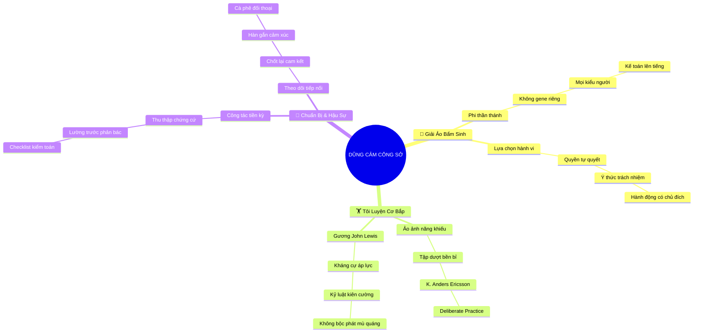

# 🧠 BẢN ĐỒ TƯ DUY TINH GỌN (4-5 TẦNG): CHƯƠNG 1 - LÒNG DŨNG CẢM LÀ KỸ NĂNG CÓ THỂ RÈN LUYỆN ĐƯỢC

## 1. Sơ Đồ Tư Duy Trực Quan (Mermaid Mindmap Tinh Gọn)

---

## 2. Cây Phân Cấp Tri Thức Gợi Nhớ Nhanh 4-5 Tầng (Active Recall Hierarchy)

- 📌 **Giải Ảo Bẩm Sinh (The Myth of Born Courage)**
  - 🔹 *Phi thần thánh hóa:* ➔ *Không có gene dũng cảm* ➔ *Đa dạng tính cách* ➔ *Kế toán viên dám nói thật*
  - 🔹 *Sự lựa chọn hành vi:* ➔ *Quyền tự quyết cá nhân* ➔ *Cam kết đạo đức* ➔ *Hành động có chủ đích*
- 📌 **Tôi Luyện Bền Bỉ (Deliberate Practice)**
  - 🔹 *Ảo ảnh năng khiếu:* ➔ *Luyện tập có chủ đích* ➔ *Trí nhớ cơ bắp* ➔ *Tập dượt trước gương*
  - 🔹 *Tấm gương John Lewis:* ➔ *Rèn luyện phản ứng bất bạo động* ➔ *Giữ vững nguyên tắc* ➔ *Đĩnh đạc trước hiểm nguy*
- 📌 **Tiến Trình 3 Giai Đoạn (Pre - During - Post)**
  - 🔹 *Chuẩn bị tiền kỳ:* ➔ *Thu thập chứng cứ số liệu* ➔ *Thiết lập đồng minh* ➔ *Bảo vệ phát ngôn*
  - 🔹 *Theo dõi hậu sự vụ:* ➔ *Chốt văn bản cam kết* ➔ *Hàn gắn quan hệ* ➔ *Cuộc hẹn giải tỏa căng thẳng*

---

## 3. Bảng Neo Trí Nhớ Từ Khóa Vàng (Memory Anchor Cheat Sheet)

| Từ Khóa Cốt Lõi | Phần Trong Tài Liệu | Bản Chất / Vai Trò (3-5 từ) | Tín Hiệu Gợi Nhớ (Memory Trigger) |
| :--- | :--- | :--- | :--- |
| **Gene Dũng Cảm** | Phần I | Ngộ nhận bẩm sinh sai lầm | Chiếc khiên thoái thác trách nhiệm |
| **Sự Lựa Chọn** | Phần I | Quyền tự quyết của cá nhân | Ngã ba đường hành động |
| **John Lewis** | Phần II | Điển hình rèn luyện dũng khí | Cuộc tuần hành bền bỉ kiên gan |
| **Cơ Bắp Tâm Lý** | Phần II | Càng tập càng vững vàng | Phòng tập thể hình nội tâm |
| **Tiền Kỳ Chuẩn Bị** | Phần III | Chiếm 95% thành bại | Bộ hồ sơ chứng cứ sắc bén |
| **Hậu Sự Vụ (Follow-up)** | Phần III | Chốt cam kết và hàn gắn | Tách cà phê gỡ bỏ hiềm khích |
