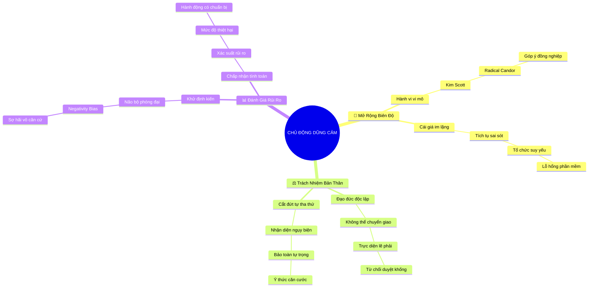

# 🧠 BẢN ĐỒ TƯ DUY TINH GỌN (4-5 TẦNG): CHƯƠNG 2 - CHỦ ĐỘNG LỰA CHỌN LÒNG DŨNG CẢM

## 1. Sơ Đồ Tư Duy Trực Quan (Mermaid Mindmap Tinh Gọn)

---

## 2. Cây Phân Cấp Tri Thức Gợi Nhớ Nhanh 4-5 Tầng (Active Recall Hierarchy)

- 📌 **Mở Rộng Biên Độ (Expanding Everyday Courage)**
  - 🔹 *Hành vi vi mô:* ➔ *Thoát khỏi kịch tính* ➔ *Giao tiếp thẳng thắn* ➔ *Góp ý đồng cấp*
  - 🔹 *Cái giá của sự im lặng:* ➔ *Tích tụ điểm mù* ➔ *Hòa khí giả tạo* ➔ *Tổ chức mục ruỗng*
- 📌 **Trách Nhiệm Đạo Đức (Inescapable Moral Duty)**
  - 🔹 *Không thể ủy thác:* ➔ *Tương đương đức tính trung thực* ➔ *Căn cước chuyên môn* ➔ *Từ chối ký khống*
  - 🔹 *Cắt đứt ngụy biện:* ➔ *Nhận thức sự tự tha thứ* ➔ *Không đổ lỗi hoàn cảnh* ➔ *Bảo vệ lòng tự trọng*
- 📌 **Quản Trị Rủi Ro (Calculated Risk Taking)**
  - 🔹 *Khử định kiến phóng đại:* ➔ *Bóc tách nỗi sợ vô căn cứ* ➔ *Thẩm định dữ liệu* ➔ *Hạ nhiệt tâm lý*
  - 🔹 *Chấp nhận có tính toán:* ➔ *Phân biệt xác suất vs thiệt hại* ➔ *Chọn đúng thời điểm* ➔ *Đề xuất giải pháp*

---

## 3. Bảng Neo Trí Nhớ Từ Khóa Vàng (Memory Anchor Cheat Sheet)

| Từ Khóa Cốt Lõi | Phần Trong Tài Liệu | Bản Chất / Vai Trò (3-5 từ) | Tín Hiệu Gợi Nhớ (Memory Trigger) |
| :--- | :--- | :--- | :--- |
| **Dũng Cảm Vi Mô** | Phần I | Hành động can đảm thường nhật | Giơ tay trong cuộc họp tuần |
| **Hòa Khí Giả Tạo** | Phần I | Cái giá ngầm của im lặng | Quả bom nổ chậm trong dự án |
| **Ủy Nhượng Đạo Đức** | Phần II | Ngụy biện nhường việc làm đúng | Chiếc mặt nạ "chờ sếp lên tiếng" |
| **Đức Tính Trung Thực** | Phần II | Chuẩn mực không thể đùn đẩy | Chiếc gương soi phẩm giá |
| **Khuếch Đại Rủi Ro** | Phần III | Não bộ phóng đại hiểm họa | Bóng ma trong phòng tối |
| **Rủi Ro Có Tính Toán** | Phần III | Phân tích xác suất và thiệt hại | Bàn cờ chiến lược của chuyên gia |
