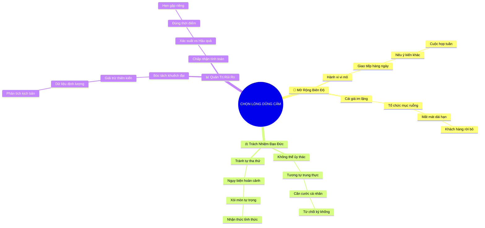

# Tóm Tắt: CHƯƠNG 2: CHỦ ĐỘNG LỰA CHỌN LÒNG DŨNG CẢM

## 1. Thông điệp cốt lõi (Core Message)
> Lòng dũng cảm là một sự lựa chọn hành vi mang tính đạo đức mà mỗi cá nhân không thể đùn đẩy cho người khác; việc né tránh thường bắt nguồn từ tâm lý tự tha thứ dễ dãi và sự thổi phồng thái quá về xác suất rủi ro.

---

## 2. Lược Đồ Phân Bổ Cấu Trúc Tài Liệu (Content Distribution Overview)

| Phần / Đề Mục Tài Liệu Gốc | Nội Dung Trọng Tâm | Số Luận Điểm Đại Diện |
| :--- | :--- | :---: |
| **Phần I: Mở Rộng Biên Độ Lòng Dũng Cảm Hàng Ngày** | Thoát khỏi quan niệm hẹp hòi xem dũng cảm chỉ là hành vi tố giác kịch tính; mở rộng sang các tương tác liên cá nhân thường nhật. | 3 Luận điểm |
| **Phần II: Không Thể Đùn Đẩy Trách Nhiệm Đạo Đức** | So sánh với đức tính trung thực: ta không bao giờ nhường việc trung thực cho người khác, vậy tại sao lại nhường sự dũng cảm? | 3 Luận điểm |
| **Phần III: Đánh Giá Rủi Ro & Chấp Nhận Có Tính Toán** | Bóc tách tâm lý khuếch đại rủi ro, phân biệt xác suất xảy ra vs. mức độ thiệt hại, hướng tới dũng cảm có năng lực. | 3 Luận điểm |
| **Tổng cộng** | **Bao quát 100% cấu trúc tài liệu Chương 2** | **9 Luận điểm** |

---

## 3. Luận điểm quan trọng theo cấu trúc tài liệu (Key Takeaways: 9 ý chuyên sâu)

### 📑 PHẦN I: MỞ RỘNG BIÊN ĐỘ LÒNG DŨNG CẢM HÀNG NGÀY

1. **VƯỢT THOÁT KHỎI KHÁI NIỆM DŨNG CẢM KỊCH TÍNH**
   - **Bản chất & Phân tích chuyên sâu:** Đa phần nhân sự chỉ coi việc vạch trần đại án gian lận tài chính hay bảo vệ tính mạng mới là dũng cảm. Nhận thức này khiến họ tê liệt trước các tình huống thường nhật: góp ý quy trình lỗi, bảo vệ đồng nghiệp bị chèn ép hoặc từ chối yêu cầu phi lý.
   - **Phương pháp / Công cụ / Quy trình đi kèm:** Khung Phổ Hành Vi Dũng Cảm Vi Mô (Micro-Courage Spectrum).
   - **Ví dụ thực tế đời thường:** Dám giơ tay nói: "Tôi nghĩ thời hạn này không khả thi cho đội ngũ kỹ thuật" ngay trong buổi lập kế hoạch tuần, thay vì im lặng nhận việc rồi trễ hạn.

2. **DŨNG CẢM TRONG GIAO TIẾP LIÊN CÁ NHÂN**
   - **Bản chất & Phân tích chuyên sâu:** Những hành vi dũng cảm diễn ra thường xuyên nhất lại nằm ở mối quan hệ giữa người với người: đưa ra phản hồi thẳng thắn, thừa nhận mình sai sót, hoặc nói rõ cảm xúc bức xúc mà không nổi nóng.
   - **Phương pháp / Công cụ / Quy trình đi kèm:** Mô hình Giao Tiếp Thẳng Thắn & Trực Diện (Radical Candor Framework theo Kim Scott).
   - **Ví dụ thực tế đời thường:** Trưởng nhóm chủ động nói với đồng nghiệp cùng cấp: "Cách bạn ngắt lời người khác trong cuộc họp sáng nay đang khiến cấp dưới ngại đóng góp ý kiến".

3. **CÁI GIÁ VÔ HÌNH CỦA SỰ THỦ THẾ AN TOÀN**
   - **Bản chất & Phân tích chuyên sâu:** Khi mỗi người đều chọn an phận thủ thường, tổ chức sẽ dần tích tụ các điểm mù văn hóa và suy giảm năng lực cạnh tranh. Sự an toàn ngắn hạn của cá nhân đánh đổi bằng sự mục ruỗng dài hạn của tập thể.
   - **Phương pháp / Công cụ / Quy trình đi kèm:** Ma trận Chi Phí Cơ Hội Của Sự Im Lặng (Cost of Silence Matrix).
   - **Ví dụ thực tế đời thường:** Mọi người đều biết tính năng mới của phần mềm còn nhiều lỗi nhưng không ai dám hoãn ngày ra mắt, dẫn đến làn sóng khách hàng hủy dịch vụ hàng loạt sau đó.

---

### 📑 PHẦN II: KHÔNG THỂ ĐÙN ĐẨY TRÁCH NHIỆM ĐẠO ĐỨC

4. **NGHỊCH LÝ "ỦY NHƯỢNG ĐẠO ĐỨC"**
   - **Bản chất & Phân tích chuyên sâu:** Chúng ta không bao giờ chấp nhận một ai đó nói: "Tôi không cần trung thực, sếp tôi trung thực là đủ cho cả phòng rồi". Nhưng trong địa hạt lòng dũng cảm, chúng ta lại thản nhiên nói: "Tôi nhường việc lên tiếng cho sếp hoặc cho các đồng nghiệp năng nổ".
   - **Phương pháp / Công cụ / Quy trình đi kèm:** Phép So Chiếu Giá Trị Đạo Đức Chuẩn Tắc (Normative Virtue Ethics Benchmark).
   - **Ví dụ thực tế đời thường:** Trong phòng ban có nhân viên bị phân biệt đối xử, cả nhóm im lặng chờ đợi công đoàn can thiệp thay vì cùng đứng lên bảo vệ lẽ phải.

5. **CÁI BẪY TỰ THA THỨ QUÁ DỄ DÃI**
   - **Bản chất & Phân tích chuyên sâu:** Con người thường viện dẫn hàng loạt lý do ngoại cảnh: "Tôi còn con nhỏ", "Tôi là người mới", "Chuyện này không thuộc phận sự tôi" để ru ngủ lương tâm. Sự tự tha thứ liên tục này làm xói mòn lòng tự trọng cá nhân.
   - **Phương pháp / Công cụ / Quy trình đi kèm:** Thang Đo Nhận Thức Tự Biện Minh (Cognitive Self-Justification Scale).
   - **Ví dụ thực tế đời thường:** Tự an ủi "mình im lặng để giữ hòa khí cho dự án" trong khi thực chất là sợ mất lòng người có quyền quyết định tiền thưởng.

6. **TÍNH KHÔNG THỂ CHUYỂN GIAO CỦA TRÁCH NHIỆM BẢN THÂN**
   - **Bản chất & Phân tích chuyên sâu:** Đạo đức nghề nghiệp là căn cước cá nhân độc lập. Khi chứng kiến sự sai trái mà im lặng, bạn đã đồng lõa với sự sai trái đó. Trách nhiệm làm điều đúng đắn thuộc về từng cá nhân độc lập.
   - **Phương pháp / Công cụ / Quy trình đi kèm:** Khung Trách Nhiệm Giải Trình Cá Nhân (Individual Accountability Index).
   - **Ví dụ thực tế đời thường:** Một kỹ sư kiểm thử từ chối ký duyệt báo cáo an toàn giả mạo dù chịu sức ép tiến độ từ giám đốc kinh doanh.

---

### 📑 PHẦN III: ĐÁNH GIÁ RỦI RO & CHẤP NHẬN CÓ TÍNH TOÁN

7. **BÓC TÁCH TÂM LÝ KHUẾCH ĐẠI RỦI RO**
   - **Bản chất & Phân tích chuyên sâu:** Não bộ con người được tiến hóa để ưu tiên phát hiện hiểm họa (Negativity Bias). Khi nghĩ đến việc lên tiếng, ta lập tức hình dung kịch bản tồi tệ nhất: bị sa thải, mất sạch danh tiếng, bị đuổi khỏi ngành, dù thực tế xác suất đó cực kỳ thấp.
   - **Phương pháp / Công cụ / Quy trình đi kèm:** Khử Định Kiến Bất Lợi Tiến Hóa (Cognitive De-biasing Protocol).
   - **Ví dụ thực tế đời thường:** Lo sợ bị đuổi việc chỉ vì góp ý sếp không nên họp đột xuất vào tối Chủ nhật, trong khi thực tế sếp chỉ đơn giản là chưa ý thức được ảnh hưởng giờ giấc.

8. **PHÂN BIỆT XÁC SUẤT XẢY RA VÀ MỨC ĐỘ THIỆT HẠI**
   - **Bản chất & Phân tích chuyên sâu:** Một rủi ro có hậu quả nghiêm trọng (Severity) không đồng nghĩa với việc nó có xác suất xảy ra cao (Probability). Người dũng cảm khôn ngoan biết dùng dữ liệu để lượng hóa rủi ro thực tế thay vì để nỗi ám ảnh chi phối.
   - **Phương pháp / Công cụ / Quy trình đi kèm:** Ma trận Đánh Giá Rủi Ro Nhị Phân (Risk Severity vs. Probability Grid).
   - **Ví dụ thực tế đời thường:** Đánh giá việc phản biện một phương án kinh doanh: Mức độ xấu nhất là sếp không đồng ý (xác suất 40%, thiệt hại 0%), còn khả năng bị ghét bỏ chỉ xảy ra nếu dùng lời lẽ xúc phạm (có thể kiểm soát được).

9. **SỰ KHÁC BIỆT GIỮA DŨNG CẢM LIỀU LĨNH VÀ CÓ NĂNG LỰC**
   - **Bản chất & Phân tích chuyên sâu:** Dũng cảm mù quáng là cứ đâm đầu vào chỗ chết mà không chuẩn bị. Dũng cảm có năng lực là chọn đúng thời điểm, sử dụng ngôn từ thích hợp, có phương án thay thế khả thi và sẵn sàng chấp nhận một ngưỡng rủi ro nhất định.
   - **Phương pháp / Công cụ / Quy trình đi kèm:** Mô hình Năng Lực Dũng Cảm Toàn Diện (Competent Courage Construct).
   - **Ví dụ thực tế đời thường:** Thay vì chỉ trích gay gắt kế hoạch của phòng ban khác trước mặt khách hàng, hẹn gặp riêng trưởng phòng đó kèm theo bản phân tích giải pháp khắc phục.

---

## 4. Kế hoạch hành động (Action Plan: 14 việc cụ thể)

#### Nhóm 1: Hành động ngay hôm nay (Micro-habits dưới 2 phút)
- [ ] **Hành động 1:** Tự hỏi bản thân: "Nếu hôm nay mình im lặng trước việc này, cái giá phải trả sau 6 tháng là gì?".
- [ ] **Hành động 2:** Nhận diện 1 lý do tự tha thứ mà bạn vừa dùng trong tuần này để né tránh một việc khó.
- [ ] **Hành động 3:** Ghi lại 1 điều bạn không đồng tình trong dự án hiện tại nhưng chưa từng nói ra.
- [ ] **Hành động 4:** Đánh giá mức độ rủi ro thực tế của việc lên tiếng theo thang điểm 1 - 10.
- [ ] **Hành động 5:** Chọn 1 người đồng nghiệp đáng tin cậy để chia sẻ góc nhìn thẳng thắn về một khúc mắc nhỏ.

#### Nhóm 2: Kế hoạch rèn luyện trong tuần (Áp dụng vào công việc & đời sống)
- [ ] **Hành động 6:** Áp dụng Ma trận Rủi ro (Xác suất vs Thiệt hại) trước khi quyết định nêu một đề xuất mới.
- [ ] **Hành động 7:** Thực hành từ chối 1 yêu cầu công việc nằm ngoài phạm vi hoặc vi phạm nguyên tắc cá nhân.
- [ ] **Hành động 8:** Chuẩn bị sẵn 2 phương án giải quyết trước khi chỉ ra một lỗ hổng trong quy trình làm việc.
- [ ] **Hành động 9:** Đặt lịch trao đổi riêng 1-1 với người mà bạn đang có bất đồng quan điểm chuyên môn.
- [ ] **Hành động 10:** Tự rà soát xem mình có đang đùn đẩy trách nhiệm đạo đức cho cấp trên hay không.

#### Nhóm 3: Thói quen duy trì & Chuyển hóa lâu dài (Phát triển bền vững)
- [ ] **Hành động 11:** Thiết lập ranh giới đạo đức rõ ràng trong công việc và cam kết không thỏa hiệp.
- [ ] **Hành động 12:** Định kỳ hàng tháng đánh giá các cơ hội đã bỏ lỡ chỉ vì thói quen chọn giải pháp an toàn.
- [ ] **Hành động 13:** Rèn luyện kỹ năng đóng khung vấn đề để biến việc phản biện thành đóng góp xây dựng.
- [ ] **Hành động 14:** Lan tỏa văn hóa phản hồi thẳng thắn và xây dựng trong đội ngũ của bạn.

---

## 5. Câu hỏi tự ngẫm (Reflection: 20 câu hỏi sâu sắc)

#### Nhóm 1: Tự vấn Nhận thức & Hệ tư duy (Self-Awareness & Mindset)
1. Tôi có đang tự cho phép mình hèn nhát trong khi vẫn đòi hỏi người khác phải trung thực?
2. Nỗi sợ lớn nhất đang chi phối hành vi của tôi tại cơ quan là gì: mất việc hay mất lòng?
3. Tôi thường tự tha thứ cho sự im lặng của mình bằng những câu ngụy biện quen thuộc nào?
4. Nếu một người ngoài nhìn vào cách tôi ứng xử tuần qua, họ sẽ thấy tôi là người can đảm hay thủ thế?
5. Sự khác biệt giữa việc bảo vệ bản thân chính đáng và việc trốn tránh trách nhiệm đạo đức là gì?

#### Nhóm 2: Nhận diện Thói quen & Điểm mù (Habits & Blind Spots)
6. Tôi có hay thổi phồng hậu quả tiêu cực của việc lên tiếng lên gấp nhiều lần thực tế không?
7. Khi thấy đồng nghiệp bị đối xử bất công, phản xạ đầu tiên của tôi là quay mặt đi hay tìm cách can thiệp?
8. Tôi có đang nhầm lẫn giữa việc giữ hòa khí giả tạo với sự bình an thực sự trong tổ chức?
9. Tôi thường chọn thời điểm lên tiếng dựa trên cảm xúc bộc phát hay chiến lược thấu đáo?
10. Lần gần nhất tôi chấp nhận rủi ro có tính toán là khi nào và kết quả ra sao?

#### Nhóm 3: Ứng dụng Thực tế & Giải quyết Vấn đề (Practical Application & Problem Solving)
11. Đâu là vấn đề sai sót trong dự án hiện tại mà tôi biết rõ nhưng vẫn chưa ai dám nói?
12. Nếu tôi đưa ra giải pháp khắc phục đi kèm, mức độ phản đối của cấp trên sẽ giảm đi bao nhiêu?
13. Làm sao để tôi rèn luyện khả năng đối diện với sự khó chịu trong các cuộc đối thoại căng thẳng?
14. Ai trong tổ chức có thể đóng vai trò là người đồng hành hỗ trợ khi tôi cần lên tiếng?
15. Những dữ liệu khách quan nào có thể chứng minh cho rủi ro mà tôi đang cảnh báo?

#### Nhóm 4: Bứt phá Giới hạn & Chuyển hóa Tương lai (Breakthrough & Transformation)
16. Nếu tôi không còn bị nỗi sợ mất việc chi phối, hành động đầu tiên tôi sẽ làm vào sáng thứ Hai là gì?
17. Giá trị cốt lõi nào là kim chỉ nam mà tôi tuyệt đối không bao giờ đánh đổi vì sự thăng tiến?
18. Làm thế nào để biến lòng can đảm thành một phần căn cước nghề nghiệp của chính mình?
19. Tôi muốn con cái hoặc cấp dưới học được gì từ cách tôi đối diện với những áp lực công việc?
20. Sau 10 năm nữa, tôi sẽ tự hào nhất về quyết định can đảm nào trong sự nghiệp của mình?

---

## 6. Bản Đồ Tư Duy Trực Quan (Visual Mindmap Overview - Tinh Gọn 4-5 Tầng)

