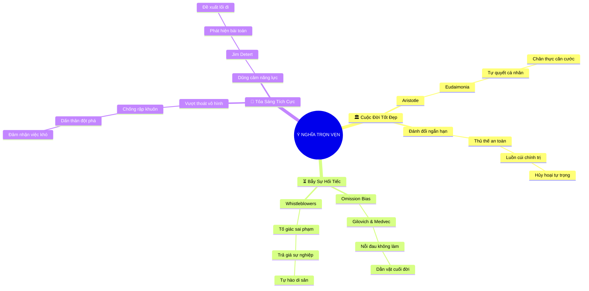

# 🧠 BẢN ĐỒ TƯ DUY TINH GỌN (4-5 TẦNG): CHƯƠNG 3 - LÒNG DŨNG CẢM MANG LẠI SỰ TRỌN VẸN VÀ Ý NGHĨA

## 1. Sơ Đồ Tư Duy Trực Quan (Mermaid Mindmap Tinh Gọn)

---

## 2. Cây Phân Cấp Tri Thức Gợi Nhớ Nhanh 4-5 Tầng (Active Recall Hierarchy)

- 📌 **Cuộc Đời Tốt Đẹp (Aristotelian Eudaimonia)**
  - 🔹 *Triết lý đức hạnh:* ➔ *Phát triển tiềm năng đạo đức* ➔ *Quyền tự quyết cá nhân* ➔ *Sống đúng giá trị*
  - 🔹 *Cái giá của sự phục tùng:* ➔ *Thăng tiến ngắn hạn* ➔ *Đánh đổi lương tâm* ➔ *Đánh mất bản thể*
- 📌 **Tâm Lý Học Hối Tiếc (Psychology of Regret)**
  - 🔹 *Thiên kiến không hành động:* ➔ *Omission Bias* ➔ *Ân hận sâu sắc dài hạn* ➔ *Nỗi đau 30 năm sau*
  - 🔹 *Minh chứng từ người tố giác:* ➔ *Whistleblowers* ➔ *Chấp nhận mất mát vật chất* ➔ *Bảo toàn tự hào di sản*
- 📌 **Tỏa Sáng Tích Cực (Competent Standing Out)**
  - 🔹 *Nguy cơ kẻ vô hình:* ➔ *Làm tròn phận sự* ➔ *Thiếu năng lực đột phá* ➔ *Dễ dàng bị đào thải*
  - 🔹 *Dũng cảm có năng lực:* ➔ *Phát hiện vấn đề then chốt* ➔ *Thiết kế giải pháp gia tăng giá trị* ➔ *Được kính trọng*

---

## 3. Bảng Neo Trí Nhớ Từ Khóa Vàng (Memory Anchor Cheat Sheet)

| Từ Khóa Cốt Lõi | Phần Trong Tài Liệu | Bản Chất / Vai Trò (3-5 từ) | Tín Hiệu Gợi Nhớ (Memory Trigger) |
| :--- | :--- | :--- | :--- |
| **Eudaimonia** | Phần I | Hạnh phúc trọn vẹn đức hạnh | Bức tượng Aristotle trầm tư |
| **Quyền Tự Quyết** | Phần I | Làm chủ câu chuyện cuộc đời | Tay lái định mệnh nghề nghiệp |
| **Omission Bias** | Phần II | Nỗi đau vì đã không làm | Giọt nước mắt ân hận tuổi già |
| **Whistleblowers** | Phần II | Tố giác và lương tâm trong sạch | Chiếc còi công lý trong đêm |
| **Kẻ Vô Hình** | Phần III | Nguy cơ của sự an phận | Chiếc bóng mờ nơi văn phòng |
| **Dũng Cảm Năng Lực** | Phần III | Vạch ra giải pháp tích cực | Ngọn đuốc mở lối tăng trưởng |
