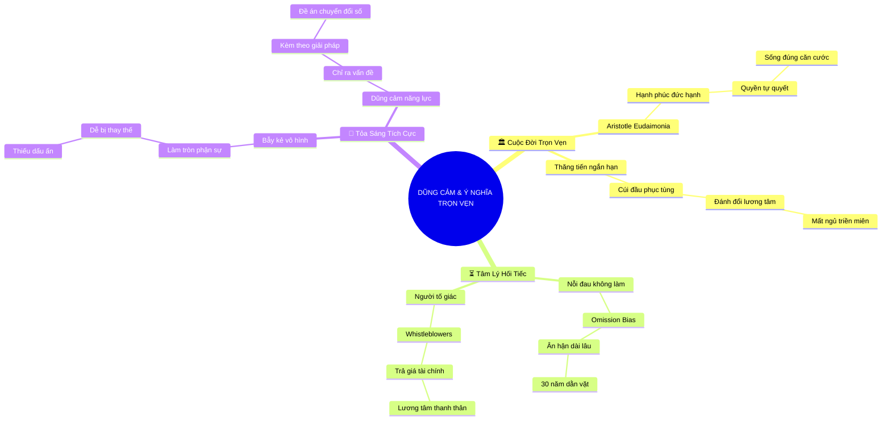

# Tóm Tắt: CHƯƠNG 3: LÒNG DŨNG CẢM MANG LẠI SỰ TRỌN VẸN VÀ Ý NGHĨA

## 1. Thông điệp cốt lõi (Core Message)
> Lòng dũng cảm có năng lực là con đường thiết yếu để kiến tạo một cuộc đời trọn vẹn (eudaimonia) theo chuẩn mực Aristotle, giải phóng con người khỏi nỗi ân hận dài lâu do không hành động, và giúp bạn tỏa sáng tích cực thay vì luồn cúi chính trị nơi công sở.

---

## 2. Lược Đồ Phân Bổ Cấu Trúc Tài Liệu (Content Distribution Overview)

| Phần / Đề Mục Tài Liệu Gốc | Nội Dung Trọng Tâm | Số Luận Điểm Đại Diện |
| :--- | :--- | :---: |
| **Phần I: Thăng Tiến Ngắn Hạn vs. Cuộc Đời Trọn Vẹn** | Đối lập giữa mục tiêu leo thang danh vọng bằng mọi giá và khát vọng sống chân thực, có quyền tự quyết theo triết học Aristotle. | 3 Luận điểm |
| **Phần II: Nghiên Cứu Tâm Lý Học Về Sự Hối Tiếc** | Bằng chứng khoa học về việc con người ân hận sâu sắc vì điều "không làm" hơn điều "đã làm", dẫn chứng từ người tố giác sai phạm. | 3 Luận điểm |
| **Phần III: Tỏa Sáng Tích Cực vs. Thủ Thế Chính Trị** | Phân biệt dũng cảm mù quáng vs. dũng cảm có năng lực; con đường nổi bật bằng giá trị đột phá thay vì làm tay chơi chính trị. | 3 Luận điểm |
| **Tổng cộng** | **Bao quát 100% cấu trúc tài liệu Chương 3** | **9 Luận điểm** |

---

## 3. Luận điểm quan trọng theo cấu trúc tài liệu (Key Takeaways: 9 ý chuyên sâu)

### 📑 PHẦN I: THĂNG TIẾN NGẮN HẠN VS. CUỘC ĐỜI TRỌN VẸN

1. **SỰ ĐÁNH ĐỔI GIỮA THĂNG TIẾN NGẮN HẠN VÀ LÝ TƯỞNG SỐNG**
   - **Bản chất & Phân tích chuyên sâu:** Nếu mục tiêu tối thượng duy nhất của bạn là leo chức nhanh nhất có thể trong một tổ chức độc hại, giải pháp an toàn nhất thường là cúi đầu bảo gì làm nấy. Tuy nhiên, cái giá phải trả là bạn phải đánh đổi quyền tự quyết và cảm giác chân thực với chính mình.
   - **Phương pháp / Công cụ / Quy trình đi kèm:** Mô hình Đánh Đổi Mục Tiêu Nghề Nghiệp (Career Ambition vs. Authenticity Trade-off).
   - **Ví dụ thực tế đời thường:** Một quản lý trung cấp chọn im lặng trước các chính sách bóc lột nhân sự để được lọt vào danh sách quy hoạch phó giám đốc, nhưng hàng đêm đều mất ngủ vì cắn rứt lương tâm.

2. **TRIẾT LÝ VỀ "CUỘC ĐỜI TỐT ĐẸP" CỦA ARISTOTLE (EUDAIMONIA)**
   - **Bản chất & Phân tích chuyên sâu:** Aristotle định nghĩa hạnh phúc đích thực không phải là sự thỏa mãn khoái lạc hay chức tước bên ngoài, mà là sự phát triển toàn diện của tiềm năng đạo đức con người (Eudaimonia). Bạn không thể có một cuộc đời trọn vẹn nếu tước bỏ đi lòng can đảm đứng lên vì lẽ phải.
   - **Phương pháp / Công cụ / Quy trình đi kèm:** Thang Giá Trị Đạo Đức Đức Hạnh (Aristotelian Virtue Ethics Matrix).
   - **Ví dụ thực tế đời thường:** Dù biết có thể bị chuyển công tác, một kỹ sư môi trường vẫn quyết tâm công bố dữ liệu ô nhiễm nguồn nước của nhà máy vì không thể sống trái với giá trị lương tri.

3. **QUYỀN TỰ QUYẾT & SỐNG ĐÚNG VỚI CĂN CƯỚC BẢN THÂN**
   - **Bản chất & Phân tích chuyên sâu:** Sống có dũng khí mang lại cảm giác làm chủ vận mệnh (Self-Determination). Khi bạn dám hành động vì điều mình tin tưởng, bạn trở thành tác giả của câu chuyện đời mình thay vì chỉ là con rối trong kịch bản của người khác.
   - **Phương pháp / Công cụ / Quy trình đi kèm:** Thuyết Tự Quyết (Self-Determination Theory theo Deci & Ryan).
   - **Ví dụ thực tế đời thường:** Nhân viên từ chối tham gia vào chiến dịch bôi nhọ đối thủ cạnh tranh trên mạng xã hội, khẳng định thương hiệu cá nhân của mình dựa trên sự cạnh tranh sòng phẳng.

---

### 📑 PHẦN II: NGHIÊN CỨU TÂM LÝ HỌC VỀ SỰ HỐI TIẾC

4. **TÂM LÝ HỌC VỀ SỰ ÂN HẬN DO KHÔNG HÀNH ĐỘNG (OMISSION BIAS)**
   - **Bản chất & Phân tích chuyên sâu:** Nghiên cứu tâm lý học thực nghiệm chỉ ra rằng: trong ngắn hạn, người ta có thể tiếc nuối vì một sai lầm do hành động gây ra (Commission); nhưng trong dài hạn (10 - 30 năm), nỗi đau đớn và dằn vặt sâu sắc nhất luôn đến từ những điều họ biết mình nên làm nhưng đã hèn nhát bỏ qua (Omission).
   - **Phương pháp / Công cụ / Quy trình đi kèm:** Khung Nghiên Cứu Sự Hối Tiếc Thời Gian Dài (Temporal Regret Framework theo Gilovich & Medvec).
   - **Ví dụ thực tế đời thường:** Về già, một giám đốc hưu trí ân hận nhất không phải vì dự án khởi nghiệp thất bại năm 30 tuổi, mà vì đã im lặng không bảo vệ một đồng nghiệp bị vu oan năm xưa.

5. **BẰNG CHỨNG THỰC CHỨNG TỪ NHỮNG NGƯỜI TỐ GIÁC SAI PHẠM (WHISTLEBLOWERS)**
   - **Bản chất & Phân tích chuyên sâu:** Nghiên cứu các trường hợp người dũng cảm đứng ra vạch trần sai phạm công quyền hoặc tập đoàn lớn cho thấy: dù phải trả giá rất đắt về tài chính, công việc hay bị tẩy chay, hầu như không một ai trong số họ nói rằng mình hối hận vì đã dũng cảm lên tiếng.
   - **Phương pháp / Công cụ / Quy trình đi kèm:** Khảo Sát Tâm Lý Hậu Tố Giác Thực Nghiệm (Whistleblower Retrospective Survey Analysis).
   - **Ví dụ thực tế đời thường:** Các chuyên viên tố giác gian lận khí thải ô tô dù mất việc nhưng khẳng định họ ngủ ngon mỗi đêm vì đã bảo vệ sức khỏe cộng đồng.

6. **TẦM NHÌN DÀI HẠN & DI SẢN NGHỀ NGHIỆP TỰ HÀO**
   - **Bản chất & Phân tích chuyên sâu:** Khi đặt câu hỏi: "Mọi người sẽ nhớ đến tôi vì điều gì sau khi tôi rời khỏi tổ chức này?", câu trả lời không bao giờ là "anh ấy đã tuân thủ rất ngoan ngoãn mọi thứ". Di sản thực sự được khắc ghi bởi những giá trị đột phá và sự chính trực mà bạn đã bảo vệ.
   - **Phương pháp / Công cụ / Quy trình đi kèm:** Bảng Hoạch Định Di Sản Nghề Nghiệp (Professional Legacy Canvas).
   - **Ví dụ thực tế đời thường:** Người quản lý được toàn bộ nhân viên cũ nhớ đến và kính trọng vì từng đứng ra bảo vệ toàn bộ quỹ phúc lợi nhân viên trước đợt cắt giảm vô lý của tập đoàn.

---

### 📑 PHẦN III: TỎA SÁNG TÍCH CỰC VS. THỦ THẾ CHÍNH TRỊ

7. **BẪY TRỞ THÀNH "KẺ VÔ HÌNH" TẦM THƯỜNG NƠI CÔNG SỞ**
   - **Bản chất & Phân tích chuyên sâu:** Nếu bạn chỉ làm đúng phận sự được giao, không bao giờ thách thức hiện trạng, bạn sẽ trở nên hoàn toàn mờ nhạt và có thể bị thay thế bất kỳ lúc nào. An toàn tuyệt đối đồng nghĩa với việc tự triệt tiêu cơ hội phát triển vượt bậc.
   - **Phương pháp / Công cụ / Quy trình đi kèm:** Định Luật Về Giá Trị Gia Tăng Khác Biệt (Differentiation Value Curve).
   - **Ví dụ thực tế đời thường:** Một nhân viên mẫn cán làm việc 10 năm không một lỗi nhỏ nhưng liên tục bị bỏ qua trong các đợt cất nhắc lãnh đạo vì thiếu tư duy đổi mới và dám nghĩ dám làm.

8. **BẾ TẮC CỦA CON ĐƯỜNG "TAY CHƠI CHÍNH TRỊ NƠI CÔNG SỞ"**
   - **Bản chất & Phân tích chuyên sâu:** Có một con đường để thăng tiến là trở thành tay chơi chính trị luồn cúi, bám đuôi người quyền lực và xu nịnh cấp trên. Nhưng con đường này vừa hủy hoại nhân cách, vừa mong manh vì khi người bảo trợ ngã ngựa, sự nghiệp của tay chơi chính trị cũng sụp đổ theo.
   - **Phương pháp / Công cụ / Quy trình đi kèm:** Đánh Giá Tính Bền Vững Của Quyền Lực Tổ Chức (Political vs. Competence Power Audit).
   - **Ví dụ thực tế đời thường:** Thư ký chuyên bợ đỡ giám đốc điều hành bị sa thải ngay ngày đầu tiên tân tổng giám đốc lên nắm quyền cải tổ bộ máy.

9. **DŨNG CẢM CÓ NĂNG LỰC ĐỂ TỎA SÁNG TÍCH CỰC**
   - **Bản chất & Phân tích chuyên sâu:** Đỉnh cao của lòng dũng cảm công sở là "chọn lòng dũng cảm có năng lực" (Competent Courage). Bạn không chỉ chỉ ra vấn đề mà còn đề xuất giải pháp, vạch ra thị trường mới, sáng kiến tăng trưởng, và trình bày sao cho lãnh đạo cảm thấy được hỗ trợ chứ không phải bị đe dọa.
   - **Phương pháp / Công cụ / Quy trình đi kèm:** Khung Tỏa Sáng Tích Cực (Positive Standing-Out Model theo Detert).
   - **Ví dụ thực tế đời thường:** Trưởng nhóm chỉ ra sự lạc hậu của hệ thống bán hàng cũ, đồng thời trình bày dự thảo đề án chuyển đổi số kèm lộ trình hoàn vốn trong 12 tháng, thuyết phục ban giám đốc phê duyệt ngân sách.

---

## 4. Kế hoạch hành động (Action Plan: 14 việc cụ thể)

#### Nhóm 1: Hành động ngay hôm nay (Micro-habits dưới 2 phút)
- [ ] **Hành động 1:** Tự viết ra 3 giá trị cốt lõi mà bạn quyết tâm không bao giờ đánh đổi tại nơi làm việc.
- [ ] **Hành động 2:** Đọc lại định nghĩa về "Cuộc đời tốt đẹp" (Eudaimonia) của Aristotle để định vị lại mục tiêu sống.
- [ ] **Hành động 3:** Nhận diện 1 cơ hội mà bạn đang do dự có nên nhận trách nhiệm dẫn dắt hay không.
- [ ] **Hành động 4:** Tự hỏi: "Nếu 10 năm nữa nhìn lại ngày hôm nay, mình sẽ tự hào hay ân hận về sự lựa chọn này?".
- [ ] **Hành động 5:** Gửi lời cảm ơn chân thành tới 1 người đồng nghiệp từng có phát biểu dũng cảm bảo vệ lẽ phải.

#### Nhóm 2: Kế hoạch rèn luyện trong tuần (Áp dụng vào công việc & đời sống)
- [ ] **Hành động 6:** Chuyển hóa 1 lời phàn nàn về công việc thành một đề xuất giải pháp cụ thể có tính khả thi.
- [ ] **Hành động 7:** Chủ động đăng ký gánh vác 1 nhiệm vụ khó hoặc một dự án đổi mới sáng tạo trong phòng ban.
- [ ] **Hành động 8:** Từ chối tham gia các cuộc buôn chuyện tiêu cực hoặc bè phái chính trị nơi công sở.
- [ ] **Hành động 9:** Rà soát danh mục công việc để đảm bảo bạn không trở thành người "vô hình" chỉ làm việc rập khuôn.
- [ ] **Hành động 10:** Thảo luận với cấp trên về một sáng kiến cải tiến quy trình nhằm mang lại giá trị cho khách hàng.

#### Nhóm 3: Thói quen duy trì & Chuyển hóa lâu dài (Phát triển bền vững)
- [ ] **Hành động 11:** Xây dựng bản đồ di sản nghề nghiệp cá nhân (Personal Legacy Map) cập nhật định kỳ mỗi năm.
- [ ] **Hành động 12:** Kiên định với nguyên tắc "chính trực trong chuyên môn" làm lợi thế cạnh tranh dài hạn.
- [ ] **Hành động 13:** Bồi dưỡng năng lực đề xuất giải pháp song hành với năng lực phát hiện vấn đề.
- [ ] **Hành động 14:** Tạo dựng danh tiếng là một chuyên gia đáng tin cậy, dám nghĩ dám làm và luôn hướng về lợi ích chung.

---

## 5. Câu hỏi tự ngẫm (Reflection: 20 câu hỏi sâu sắc)

#### Nhóm 1: Tự vấn Nhận thức & Hệ tư duy (Self-Awareness & Mindset)
1. Mục tiêu công việc hiện tại của tôi là thăng tiến bằng mọi giá hay xây dựng một sự nghiệp chân thực?
2. Khi đối mặt với sự bất công nơi công sở, cảm giác của tôi là tê liệt, cam chịu hay muốn hành động có phương pháp?
3. Khái niệm "cuộc đời tốt đẹp" đối với tôi có chỗ đứng cho lòng can đảm hay chỉ toàn sự an phận?
4. Tôi có đang tự biến mình thành "tay chơi chính trị" để mưu cầu sự an toàn ngắn hạn?
5. Sự khác biệt giữa một người làm tròn việc và một người dũng cảm tạo ra đột phá là gì?

#### Nhóm 2: Nhận diện Thói quen & Điểm mù (Habits & Blind Spots)
6. Tôi có đang mắc bẫy "sự ân hận do không hành động" trong những dự án gần đây không?
7. Khi chỉ trích một vấn đề, tôi đã chuẩn bị sẵn giải pháp hay chỉ dừng lại ở sự than phiền?
8. Tôi có đang để nỗi sợ bị đánh giá kìm hãm những ý tưởng sáng tạo độc đáo của mình?
9. Lần gần nhất tôi chấp nhận một nhiệm vụ đầy thách thức mà kết quả chưa rõ ràng là khi nào?
10. Tôi có xu hướng a dua theo số đông trong các cuộc họp quan trọng để tránh bị chú ý?

#### Nhóm 3: Ứng dụng Thực tế & Giải quyết Vấn đề (Practical Application & Problem Solving)
11. Dự án hiện tại của tôi có điểm nghẽn nào cần một người dám đứng ra chịu trách nhiệm thay đổi?
12. Làm thế nào để đóng khung một đề xuất thách thức thành một cơ hội tăng trưởng cho toàn công ty?
13. Tôi cần bổ sung những kỹ năng nào để sự dũng cảm của mình trở nên "có năng lực" thay vì bộc phát?
14. Những số liệu thực chứng nào sẽ biến ý tưởng đột phá của tôi thành đề án thuyết phục ban giám đốc?
15. Ai là lãnh đạo cởi mở nhất trong tổ chức mà tôi có thể tìm đến để tham vấn ý kiến trước khi lên tiếng?

#### Nhóm 4: Bứt phá Giới hạn & Chuyển hóa Tương lai (Breakthrough & Transformation)
16. Nếu biết chắc chắn mình sẽ không bị trừng phạt, tôi sẽ đề xuất thay đổi căn bản điều gì trong tổ chức?
17. Khi về hưu, tôi muốn các đồng nghiệp nhớ về tôi như một người thế nào?
18. Làm sao để tôi rèn luyện cho bản thân sự tự do nội tâm, không bị phụ thuộc vào sự phán xét của cấp trên?
19. Di sản chuyên môn lớn nhất mà tôi muốn để lại cho ngành nghề của mình là gì?
20. Tại sao việc chọn lòng dũng cảm hôm nay lại là sự đầu tư tốt nhất cho hạnh phúc trọn vẹn ngày mai?

---

## 6. Bản Đồ Tư Duy Trực Quan (Visual Mindmap Overview - Tinh Gọn 4-5 Tầng)

