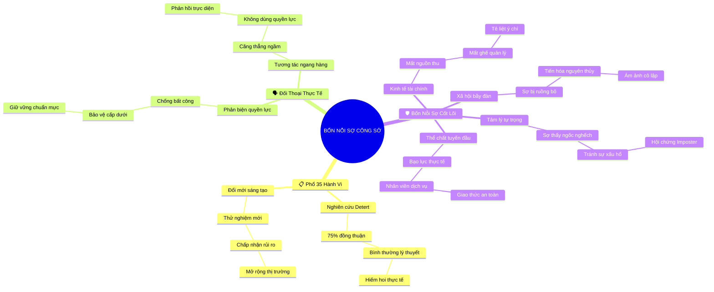

# 🧠 BẢN ĐỒ TƯ DUY TINH GỌN (4-5 TẦNG): CHƯƠNG 4 - BỐN NỖI SỢ CẢN TRỞ LÒNG DŨNG CẢM

## 1. Sơ Đồ Tư Duy Trực Quan (Mermaid Mindmap Tinh Gọn)

---

## 2. Cây Phân Cấp Tri Thức Gợi Nhớ Nhanh 4-5 Tầng (Active Recall Hierarchy)

- 📌 **Dải Phổ 35 Hành Vi (Workplace Courage Spectrum)**
  - 🔹 *Đúc kết thực nghiệm:* ➔ *75% nhân sự xác nhận* ➔ *Bình thường trên văn bản* ➔ *Hiếm hoi trong thực tế*
  - 🔹 *Đổi mới sáng tạo:* ➔ *Rời vùng an toàn* ➔ *Nhận nhiệm vụ mới* ➔ *Thử nghiệm giải pháp đột phá*
- 📌 **Hai Mặt Trận Giao Tiếp (Two Confrontational Arenas)**
  - 🔹 *Nói thật với quyền lực:* ➔ *Phản biện chính sách sếp* ➔ *Bảo vệ cấp dưới* ➔ *Ngăn chặn vi phạm*
  - 🔹 *Đối thoại ngang hàng:* ➔ *Thiếu chế tài quyền lực* ➔ *Căng thẳng tế nhị* ➔ *Góp ý thấu tình đạt lý*
- 📌 **Bốn Nỗi Sợ Tiến Hóa (Four Evolutionary Fears)**
  - 🔹 *Rủi ro kinh tế:* ➔ *Mất việc làm và thu nhập* ➔ *Bảo thủ vị trí* ➔ *Cần quỹ dự phòng*
  - 🔹 *Rủi ro xã hội:* ➔ *Tiến hóa bầy đàn nguyên thủy* ➔ *Nỗi sợ bị khai trừ* ➔ *Ám ảnh bị cô lập*
  - 🔹 *Rủi ro tâm lý:* ➔ *Sợ cảm thấy kém cỏi* ➔ *Hội chứng Imposter* ➔ *Né tránh phơi nhiễm*
  - 🔹 *Rủi ro thể chất:* ➔ *Xung đột bạo lực tuyến đầu* ➔ *Bảo vệ thân thể* ➔ *Quy chuẩn an toàn*

---

## 3. Bảng Neo Trí Nhớ Từ Khóa Vàng (Memory Anchor Cheat Sheet)

| Từ Khóa Cốt Lõi | Phần Trong Tài Liệu | Bản Chất / Vai Trò (3-5 từ) | Tín Hiệu Gợi Nhớ (Memory Trigger) |
| :--- | :--- | :--- | :--- |
| **35 Hành Vi** | Phần I | Danh mục dũng cảm thực tế | Bản danh sách kiểm tra công sở |
| **Nghịch Lý Bình Thường** | Phần I | Việc bổn phận nhưng ít làm | Bản mô tả công việc bám bụi |
| **Nói Thật Với Quyền Lực** | Phần II | Phản biện cấp trên vì lẽ phải | Tấm khiên chắn cho cấp dưới |
| **Đối Thoại Ngang Hàng** | Phần II | Thẳng thắn không dùng quyền uy | Bàn làm việc của hai người bạn |
| **Rủi Ro Kinh Tế** | Phần III | Sợ mất tiền mất việc | Chiếc phong bì lương đe dọa |
| **Rủi Ro Xã Hội** | Phần III | Sợ bị bầy đàn tẩy chay | Ngọn lửa bộ lạc nguyên thủy |
| **Rủi Ro Tâm Lý** | Phần III | Sợ cảm giác mình ngốc nghếch | Chiếc mặt nạ che đậy xấu hổ |
| **Rủi Ro Thể Chất** | Phần III | Bạo lực nơi tuyến đầu dịch vụ | Nút báo động dưới quầy thu ngân |
