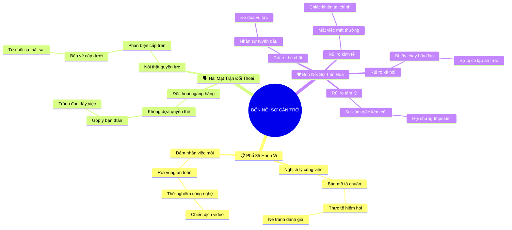

# Tóm Tắt: CHƯƠNG 4: BỐN NỖI SỢ CẢN TRỞ LÒNG DŨNG CẢM

## 1. Thông điệp cốt lõi (Core Message)
> Hành vi dũng cảm nơi công sở không chỉ giới hạn ở việc phản biện quyền lực mà trải rộng trên 35 hành vi liên cá nhân thường nhật; có 4 nỗi sợ tiến hóa cốt lõi kìm hãm con người hành động: rủi ro kinh tế, rủi ro xã hội, rủi ro tâm lý và rủi ro thể chất.

---

## 2. Lược Đồ Phân Bổ Cấu Trúc Tài Liệu (Content Distribution Overview)

| Phần / Đề Mục Tài Liệu Gốc | Nội Dung Trọng Tâm | Số Luận Điểm Đại Diện |
| :--- | :--- | :---: |
| **Phần I: Dải Phổ 35 Hành Vi Dũng Cảm Nơi Công Sở** | Đúc kết thực nghiệm từ hàng nghìn nhân sự về các hành động đòi hỏi dũng khí và nghịch lý "bình thường nhưng hiếm hoi". | 3 Luận điểm |
| **Phần II: Nói Thật Với Quyền Lực vs. Đối Thoại Ngang Hàng** | Phân tích hai mặt trận dũng cảm: phản biện sếp cấp trên và thách thức bất ngờ khi đối thoại thẳng thắn với đồng nghiệp/cấp dưới. | 3 Luận điểm |
| **Phần III: Giải Mã 4 Nỗi Sợ Tiến Hóa Cốt Lõi** | Bóc tách cơ chế sinh học - xã hội của 4 rào cản: Kinh tế (tiền/việc), Xã hội (cô lập), Tâm lý (xấu hổ) và Thể chất (bạo lực). | 4 Luận điểm |
| **Tổng cộng** | **Bao quát 100% cấu trúc tài liệu Chương 4** | **10 Luận điểm** |

---

## 3. Luận điểm quan trọng theo cấu trúc tài liệu (Key Takeaways: 10 ý chuyên sâu)

### 📑 PHẦN I: DẢI PHỔ 35 HÀNH VI DŨNG CẢM NƠI CÔNG SỞ

1. **DANH MỤC 35 HÀNH VI DŨNG CẢM THỰC NGHIỆM**
   - **Bản chất & Phân tích chuyên sâu:** Khảo sát hàng nghìn người lao động chỉ ra rằng trên 75% nhân sự đồng thuận có 35 hành vi điển hình đòi hỏi lòng dũng cảm từ mức độ trung bình trở lên. Lòng dũng cảm không phải là một khái niệm trừu tượng mà là tập hợp các phản ứng hành vi cụ thể có thể đo lường.
   - **Phương pháp / Công cụ / Quy trình đi kèm:** Bảng Phân Loại Hành Vi Dũng Cảm Công Sở (Workplace Courageous Action Taxonomy).
   - **Ví dụ thực tế đời thường:** Từ chối tham gia vào trò đùa phân biệt giới tính trong giờ ăn trưa, công khai nhận lỗi sai trước toàn đội khi dự án chậm tiến độ.

2. **NGHỊCH LÝ "BÌNH THƯỜNG NHƯNG HIẾM HOI"**
   - **Bản chất & Phân tích chuyên sâu:** Nhiều hành vi trong danh mục 35 việc (như đưa ra phản hồi thẳng thắn, bảo vệ đồng nghiệp, thừa nhận thiếu sót) trên lý thuyết chính là "bản mô tả công việc bình thường" của một chuyên viên hay nhà quản lý. Tuy nhiên, trong thực tế tổ chức, chúng lại diễn ra với tần suất ít ỏi đến đáng kinh ngạc.
   - **Phương pháp / Công cụ / Quy trình đi kèm:** Thước Đo Khoảng Cách Kỳ Vọng vs Thực Tế (Job Description vs. Behavioral Reality Gap).
   - **Ví dụ thực tế đời thường:** Quản lý biết rõ một nhân viên làm việc kém hiệu quả gây ảnh hưởng cả đội nhưng suốt 2 năm không hề có một cuộc đánh giá hiệu suất thẳng thắn nào.

3. **DŨNG CẢM ĐỔI MỚI SÁNG TẠO & NHẬN NHIỆM VỤ MỚI**
   - **Bản chất & Phân tích chuyên sâu:** Không chỉ dừng lại ở giao tiếp đối kháng, dũng cảm còn là việc dám bước ra khỏi vùng an toàn chuyên môn: đăng ký phụ trách một mảng thị trường mới, thử nghiệm công nghệ chưa ai dùng, hay thách thức các quy trình vận hành lỗi thời.
   - **Phương pháp / Công cụ / Quy trình đi kèm:** Khung Đổi Mới Dựa Trên Rủi Ro Tâm Lý (Innovation Courage Framework).
   - **Ví dụ thực tế đời thường:** Nhân viên marketing đề xuất chuyển toàn bộ ngân sách quảng cáo truyền thống sang nền tảng video ngắn dù chưa có tiền lệ tại công ty.

---

### 📑 PHẦN II: NÓI THẬT VỚI QUYỀN LỰC VS. ĐỐI THOẠI NGANG HÀNG

4. **NÓI THẬT VỚI NGƯỜI CÓ QUYỀN LỰC (SPEAKING TRUTH TO POWER)**
   - **Bản chất & Phân tích chuyên sâu:** Đây là nhóm hành vi phổ biến và trực diện nhất: phản biện quyết định sai lầm của sếp, vạch trần các chính sách bất công, ngăn chặn hành vi quấy rối hoặc vi phạm đạo đức, và đứng lên bảo vệ cấp dưới trước áp lực phi lý từ ban giám đốc.
   - **Phương pháp / Công cụ / Quy trình đi kèm:** Quy Trình Đối Thoại Phản Biện Cấp Trên (Upward Feedback Protocol).
   - **Ví dụ thực tế đời thường:** Trưởng phòng nhân sự kiên quyết từ chối yêu cầu sa thải nhân viên mang thai từ tổng giám đốc, viện dẫn quy định pháp luật và chuẩn mực đạo đức doanh nghiệp.

5. **THÁCH THỨC BẤT NGỜ TỪ CÁC CUỘC TRÒ CHUYỆN NGANG HÀNG**
   - **Bản chất & Phân tích chuyên sâu:** Các nghiên cứu chỉ ra một phát hiện phản trực giác: con người thường thấy việc có một cuộc trao đổi thẳng thắn với đồng nghiệp cùng cấp (Peer-to-Peer) khó khăn không kém, thậm chí căng thẳng hơn cả nói chuyện với sếp, vì không có cơ chế quyền lực rõ ràng để giải quyết xung đột.
   - **Phương pháp / Công cụ / Quy trình đi kèm:** Mô hình Phản Hồi Ngang Hàng Không Xung Đột (Non-adversarial Peer Feedback Canvas).
   - **Ví dụ thực tế đời thường:** Nhắc nhở người bạn thân cùng phòng làm việc ngừng việc đùn đẩy trách nhiệm trực nhật dự án mà không làm sứt mẻ tình bạn.

6. **ÁP LỰC ĐƯA RA PHẢN HỒI GAI GÓC CHO CẤP DƯỚI**
   - **Bản chất & Phân tích chuyên sâu:** Nhiều nhà quản lý sợ bị nhân viên ghét bỏ, sợ làm tổn thương tinh thần đội ngũ hoặc sợ bị gắn mác "sếp hắc ám", dẫn đến việc né tránh đưa ra những nhận xét tiêu cực nhưng cần thiết cho sự phát triển của cấp dưới.
   - **Phương pháp / Công cụ / Quy trình đi kèm:** Khung Phản Hồi Phát Triển (Constructive Developmental Feedback Model).
   - **Ví dụ thực tế đời thường:** Ngồi lại với một nhân viên tiềm năng để chỉ ra rằng thái độ kiêu ngạo của anh ta đang phá vỡ sự gắn kết của cả nhóm.

---

### 📑 PHẦN III: GIẢI MÃ 4 NỖI SỢ TIẾN HÓA CỐT LÕI

7. **RỦI RO KINH TẾ (ECONOMIC / CAREER FEAR)**
   - **Bản chất & Phân tích chuyên sâu:** Nỗi sợ mất việc làm, mất tiền thưởng, bị giáng chức hoặc bị gạt ra khỏi các dự án chiến lược. Đây là rào cản tài chính hữu hình khiến con người ưu tiên sự an toàn của chiếc ghế hơn là lên tiếng bảo vệ chân lý.
   - **Phương pháp / Công cụ / Quy trình đi kèm:** Phân Tích Chi Phí An Toàn Tài Chính (Financial Safety Net Analysis).
   - **Ví dụ thực tế đời thường:** Một nhân viên kinh doanh không dám báo cáo việc sếp khai khống chi phí tiếp khách vì sợ bị cắt tiền hoa hồng cuối năm.

8. **RỦI RO XÃ HỘI & NỖI SỢ BỊ TẨY CHAY (SOCIAL FEAR)**
   - **Bản chất & Phân tích chuyên sâu:** Có nguồn gốc từ thời kỳ săn bắt hái lượm nguyên thủy: bị bầy đàn khai trừ đồng nghĩa với cái chết. Nơi công sở, nỗi sợ này biến thành sự lo âu tột cùng trước việc bị đồng nghiệp xa lánh, tẩy chay, nói xấu sau lưng hoặc bị cô lập trong giờ ăn trưa.
   - **Phương pháp / Công cụ / Quy trình đi kèm:** Nhận Diện Cơ Chế Sinh Học Xã Hội Tiến Hóa (Evolutionary Sociobiology Mapping).
   - **Ví dụ thực tế đời thường:** Im lặng không dám bênh vực một người bị cả phòng tẩy chay chỉ vì sợ bản thân sẽ trở thành nạn nhân tiếp theo.

9. **RỦI RO TÂM LÝ & NỖI SỢ CẢM THẤY KÉM CỎI (PSYCHOLOGICAL FEAR)**
   - **Bản chất & Phân tích chuyên sâu:** Nỗi sợ bị bẽ bàng, xấu hổ, sợ cảm thấy mình ngốc nghếch trước đám đông hoặc sợ sự tự nghi ngờ bản thân (Imposter Syndrome) trỗi dậy nếu ý kiến của mình bị bác bỏ hoặc chứng minh là sai.
   - **Phương pháp / Công cụ / Quy trình đi kèm:** Trị Liệu Phơi Nhiễm Tâm Lý Công Sở (Workplace Psychological Exposure Toolkit).
   - **Ví dụ thực tế đời thường:** Không dám giơ tay đặt câu hỏi trong hội thảo chuyên môn vì sợ mọi người nghĩ mình là người thiếu hiểu biết cơ bản.

10. **RỦI RO THỂ CHẤT NƠI TUYẾN ĐẦU (PHYSICAL HARM)**
    - **Bản chất & Phân tích chuyên sâu:** Không chỉ tồn tại trong quân đội hay lực lượng cứu hộ, rủi ro thể chất hiện diện rất thực tế ở nhóm nhân sự tuyến đầu dịch vụ (y tá, nhân viên chăm sóc khách hàng, phục vụ bàn, thu ngân) khi họ đối mặt với bạo lực, đe dọa vũ lực từ khách hàng quá khích.
    - **Phương pháp / Công cụ / Quy trình đi kèm:** Giao Thức Bảo Vệ An Toàn Tuyến Đầu (Frontline Physical Safety Protocol).
    - **Ví dụ thực tế đời thường:** Một nhân viên y tế can đảm bước vào can ngăn một thân nhân bệnh nhân đang cầm hung khí đe dọa các bác sĩ trong phòng cấp cứu.

---

## 4. Kế hoạch hành động (Action Plan: 14 việc cụ thể)

#### Nhóm 1: Hành động ngay hôm nay (Micro-habits dưới 2 phút)
- [ ] **Hành động 1:** Tự gọi tên chính xác nỗi sợ đang cản trở bạn hôm nay: Kinh tế, Xã hội, Tâm lý hay Thể chất.
- [ ] **Hành động 2:** Đọc lại danh mục 4 nỗi sợ để nhận diện cơ chế phòng vệ tự nhiên của não bộ.
- [ ] **Hành động 3:** Tự nhủ: "Cảm giác sợ bị xấu hổ chỉ là phản ứng sinh lý tạm thời, không định nghĩa năng lực của mình".
- [ ] **Hành động 4:** Quan sát 1 cuộc trò chuyện nơi công sở và ghi nhận mức độ thẳng thắn của các bên.
- [ ] **Hành động 5:** Gửi 1 phản hồi tích cực nhưng chân thật cho đồng nghiệp về một điểm họ có thể cải thiện nhẹ.

#### Nhóm 2: Kế hoạch rèn luyện trong tuần (Áp dụng vào công việc & đời sống)
- [ ] **Hành động 6:** Thực hiện 1 cuộc trao đổi thẳng thắn với đồng nghiệp ngang hàng về sự phối hợp công việc.
- [ ] **Hành động 7:** Lên lịch họp 1-1 với một cấp dưới để đưa ra phản hồi phát triển chân thành.
- [ ] **Hành động 8:** Chuẩn bị quỹ dự phòng khẩn cấp cá nhân để giảm bớt áp lực từ nỗi sợ kinh tế khi làm việc.
- [ ] **Hành động 9:** Đăng ký nhận 1 nhiệm vụ mới nằm ngoài vùng an toàn quen thuộc của bạn.
- [ ] **Hành động 10:** Tập phơi nhiễm với cảm giác bị từ chối bằng cách đề xuất 1 ý tưởng cải tiến trong cuộc họp nhóm.

#### Nhóm 3: Thói quen duy trì & Chuyển hóa lâu dài (Phát triển bền vững)
- [ ] **Hành động 11:** Xây dựng văn hóa phản biện cởi mở, không trừng phạt người nói thật trong đội ngũ của bạn.
- [ ] **Hành động 12:** Rà soát định kỳ 35 hành vi dũng cảm để xem mình đã thực hành được bao nhiêu hành vi.
- [ ] **Hành động 13:** Thiết lập ranh giới an toàn tâm lý vững chắc, tách biệt giá trị bản thân khỏi sự chấp thuận của đám đông.
- [ ] **Hành động 14:** Đào tạo kỹ năng xử lý xung đột và đối thoại khó cho các quản lý kế cận.

---

## 5. Câu hỏi tự ngẫm (Reflection: 20 câu hỏi sâu sắc)

#### Nhóm 1: Tự vấn Nhận thức & Hệ tư duy (Self-Awareness & Mindset)
1. Trong 4 nhóm rủi ro (Kinh tế, Xã hội, Tâm lý, Thể chất), nỗi sợ nào có sức kìm kẹp lớn nhất đối với tôi?
2. Tôi có đang phóng đại nỗi sợ bị xã hội cô lập giống như người tiền sử sợ bị trục xuất khỏi bộ lạc?
3. Cảm giác sợ bị ngốc nghếch đã ngăn cản tôi học hỏi những điều mới mẻ nào trong năm qua?
4. Tôi nhìn nhận việc đưa ra phản hồi khó khăn cho đồng nghiệp là hành vi phá hoại hay xây dựng quan hệ?
5. Tại sao những việc tưởng chừng bình thường trong bản mô tả công việc lại hiếm khi diễn ra trong thực tế?

#### Nhóm 2: Nhận diện Thói quen & Điểm mù (Habits & Blind Spots)
6. Tôi có thường chọn cách "nói sau lưng" thay vì đối thoại trực diện với người gây ra vấn đề?
7. Khi cần phản biện sếp, tôi thường im lặng trong cuộc họp rồi ra ngoài than thở với ai?
8. Tôi có đang né tránh việc đánh giá hiệu suất thật lòng với nhân viên vì sợ mất lòng họ?
9. Lần gần nhất tôi chấp nhận cảm giác bẽ bàng trước tập thể để bảo vệ một ý kiến đúng là khi nào?
10. Nỗi sợ kinh tế có đang biến tôi thành một nhân sự thụ động chỉ biết vâng lời?

#### Nhóm 3: Ứng dụng Thực tế & Giải quyết Vấn đề (Practical Application & Problem Solving)
11. Trong tuần này, cuộc trò chuyện ngang hàng nào tôi đang trì hoãn vì e ngại xích mích?
12. Làm thế nào để phân tách giữa việc phê bình hành vi công việc và chỉ trích nhân cách con người?
13. Những bước đệm nào giúp giảm thiểu rủi ro kinh tế khi tôi chuẩn bị nói thật với lãnh đạo cấp cao?
14. Tôi có thể thực hành kỹ thuật gì để kiểm soát nỗi sợ tâm lý trước khi phát biểu trước hội nghị?
15. Nếu cấp dưới phản ứng tiêu cực trước phản hồi của tôi, tôi sẽ dẫn dắt cuộc đối thoại tiếp theo ra sao?

#### Nhóm 4: Bứt phá Giới hạn & Chuyển hóa Tương lai (Breakthrough & Transformation)
16. Nếu tôi hoàn toàn làm chủ được 4 nỗi sợ này, sự nghiệp của tôi sẽ bứt phá đến mức độ nào trong 3 năm tới?
17. Làm thế nào để xây dựng một tổ chức nơi mọi nhân viên đều xem 35 hành vi dũng cảm là điều hiển nhiên?
18. Tôi muốn để lại tấm gương gì cho cấp dưới về sự can đảm trong việc bảo vệ sự thật?
19. Nỗi sợ nào một khi được vượt qua sẽ mang lại sự tự do nội tâm lớn nhất cho tôi?
20. Bài học sâu sắc nhất về bản chất con người mà tôi rút ra từ 4 nỗi sợ tiến hóa là gì?

---

## 6. Bản Đồ Tư Duy Trực Quan (Visual Mindmap Overview - Tinh Gọn 4-5 Tầng)

