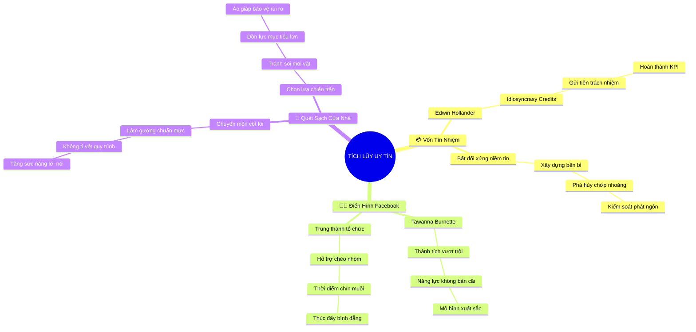

# 🧠 BẢN ĐỒ TƯ DUY TINH GỌN (4-5 TẦNG): CHƯƠNG 5 - XÂY DỰNG UY TÍN TRƯỚC KHI ĐƯA RA THÁCH THỨC

## 1. Sơ Đồ Tư Duy Trực Quan (Mermaid Mindmap Tinh Gọn)

---

## 2. Cây Phân Cấp Tri Thức Gợi Nhớ Nhanh 4-5 Tầng (Active Recall Hierarchy)

- 📌 **Vốn Tín Nhiệm Tổ Chức (Idiosyncrasy Credits)**
  - 🔹 *Mô hình Hollander:* ➔ *Tài khoản ngân hàng tâm lý* ➔ *Nạp tiền bằng thành tích* ➔ *Rút tiền khi phản biện*
  - 🔹 *Tính bất đối xứng:* ➔ *Xây dựng tính bằng năm* ➔ *Mất mát tính bằng giây* ➔ *Cẩn trọng sử dụng uy tín*
- 📌 **Tình Huống Facebook (The Tawanna Burnette Case)**
  - 🔹 *Thành tích không thể chối cãi:* ➔ *Hiệu suất vượt chỉ tiêu 150%* ➔ *Lãnh đạo kiểu mẫu* ➔ *Xóa bỏ định kiến ngầm*
  - 🔹 *Lòng trung thành & Đồng đội:* ➔ *Hỗ trợ dự án chéo* ➔ *Gầy dựng niềm tin* ➔ *Lên tiếng cải tổ văn hóa*
- 📌 **Nguyên Tắc Cốt Lõi (Mastering Core Duties First)**
  - 🔹 *Quét sạch trước cửa nhà:* ➔ *Hoàn thành xuất sắc phận sự* ➔ *Lời nói có trọng lượng* ➔ *Không thể bị bắt bẻ*
  - 🔹 *Chọn lựa trận chiến:* ➔ *Bỏ qua va chạm vặt* ➔ *Tập trung mục tiêu chiến lược* ➔ *Uy tín làm khiên chắn*

---

## 3. Bảng Neo Trí Nhớ Từ Khóa Vàng (Memory Anchor Cheat Sheet)

| Từ Khóa Cốt Lõi | Phần Trong Tài Liệu | Bản Chất / Vai Trò (3-5 từ) | Tín Hiệu Gợi Nhớ (Memory Trigger) |
| :--- | :--- | :--- | :--- |
| **Idiosyncrasy Credits** | Phần I | Nguồn vốn tín nhiệm tổ chức | Thẻ ngân hàng niềm tin |
| **Bất Đối Xứng Niềm Tin** | Phần I | Khó xây nhưng dễ mất | Lâu đài cát trước sóng biển |
| **Tawanna Burnette** | Phần II | Biểu tượng dũng cảm có năng lực | Nữ thủ lĩnh Facebook kiên cường |
| **Hiệu Suất Vượt Trội** | Phần II | Bệ phóng cho tiếng nói phản biện | Biểu đồ doanh thu tăng 150% |
| **Quét Sạch Cửa Nhà** | Phần III | Làm tốt việc mình trước tiên | Cây chổi quét sân sạch bóng |
| **Chọn Trận Chiến** | Phần III | Không lãng phí uy tín bừa bãi | Vị tướng chọn địa hình phục kích |
