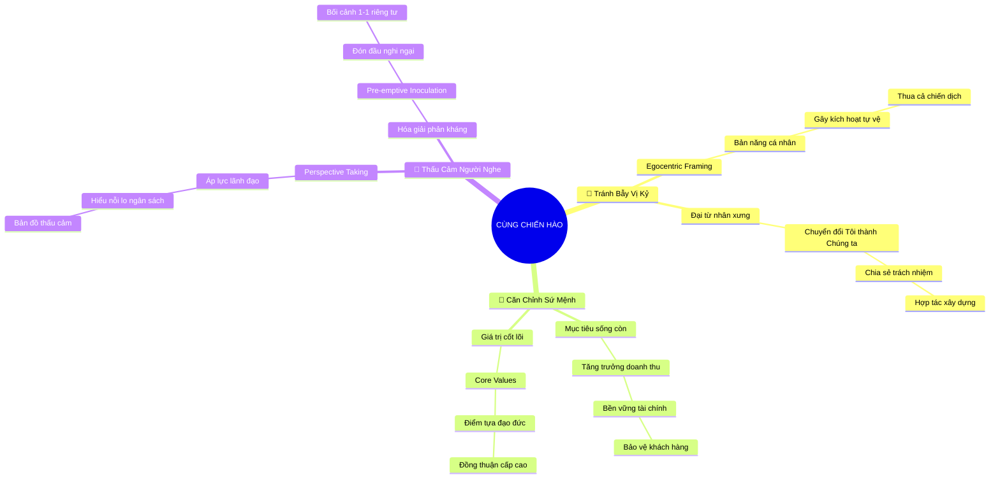

# 🧠 BẢN ĐỒ TƯ DUY TINH GỌN (4-5 TẦNG): CHƯƠNG 6 - THỂ HIỆN RẰNG BẠN ĐỨNG CÙNG MỘT CHIẾN TUYẾN

## 1. Sơ Đồ Tư Duy Trực Quan (Mermaid Mindmap Tinh Gọn)

---

## 2. Cây Phân Cấp Tri Thức Gợi Nhớ Nhanh 4-5 Tầng (Active Recall Hierarchy)

- 📌 **Vượt Bẫy Vị Kỷ (Overcoming Egocentric Framing)**
  - 🔹 *Bản năng cá nhân:* ➔ *Lập luận theo góc nhìn riêng* ➔ *Đúng lý nhưng hỏng việc* ➔ *Kích hoạt tự vệ*
  - 🔹 *Chuyển đổi tâm thế:* ➔ *Chuyển từ Tôi sang Chúng ta* ➔ *Đồng hành giải quyết* ➔ *Xây dựng nhịp cầu*
- 📌 **Căn Chỉnh Chiến Lược (Strategic Alignment)**
  - 🔹 *Gắn kết mục tiêu cốt lõi:* ➔ *Phục vụ bài toán kinh doanh* ➔ *Bảo vệ dòng tiền* ➔ *Sự hài lòng khách hàng*
  - 🔹 *Điểm tựa giá trị văn hóa:* ➔ *Core Values tổ chức* ➔ *Kim chỉ nam đạo đức* ➔ *Tạo sự đồng thuận*
- 📌 **Thấu Cảm Người Nghe (Audience Perspective Taking)**
  - 🔹 *Đặt mình vào ghế lãnh đạo:* ➔ *Thấu hiểu sức ép cấp trên* ➔ *Chia sẻ gánh nặng* ➔ *Trở thành đối tác*
  - 🔹 *Đón đầu phản kháng:* ➔ *Pre-emptive Inoculation* ➔ *Nêu trước rào cản* ➔ *Trao đổi 1-1 riêng tư*

---

## 3. Bảng Neo Trí Nhớ Từ Khóa Vàng (Memory Anchor Cheat Sheet)

| Từ Khóa Cốt Lõi | Phần Trong Tài Liệu | Bản Chất / Vai Trò (3-5 từ) | Tín Hiệu Gợi Nhớ (Memory Trigger) |
| :--- | :--- | :--- | :--- |
| **Đóng Khung Vị Kỷ** | Phần I | Bẫy lập luận một chiều | Chiếc kính râm chỉ thấy bóng mình |
| **Từ Tôi Sang Chúng Ta** | Phần I | Chuyển hóa tâm thế đồng hành | Hai bàn tay siết chặt hợp tác |
| **Căn Chỉnh Chiến Lược** | Phần II | Gắn đề xuất với sứ mệnh | Chiếc la bàn chỉ về hướng Bắc |
| **Điểm Tựa Giá Trị** | Phần II | Dùng văn hóa làm lá chắn | Bức tranh sứ mệnh trên tường |
| **Thấu Cảm Vị Trí** | Phần III | Ngồi vào ghế đối phương | Chiếc ghế xoay của vị tổng giám đốc |
| **Đón Đầu Phản Kháng** | Phần III | Hóa giải trước sự e ngại | Mũi tiêm vắc-xin miễn dịch nghi ngờ |
