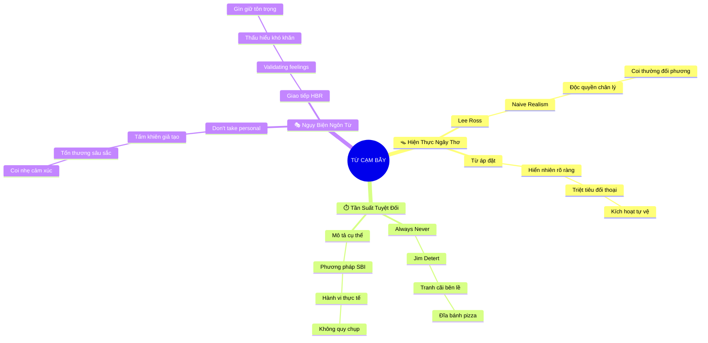

# 🧠 BẢN ĐỒ TƯ DUY TINH GỌN (4-5 TẦNG): CHƯƠNG 7 - TRÁNH NHỮNG TỪ NGỮ VÀ CỤM TỪ CẠM BẪY

## 1. Sơ Đồ Tư Duy Trực Quan (Mermaid Mindmap Tinh Gọn)

---

## 2. Cây Phân Cấp Tri Thức Gợi Nhớ Nhanh 4-5 Tầng (Active Recall Hierarchy)

- 📌 **Chủ Nghĩa Hiện Thực Ngây Thơ (Naive Realism)**
  - 🔹 *Thiên kiến độc quyền chân lý:* ➔ *Lee Ross* ➔ *Coi mình là chuẩn mực* ➔ *Coi người khác là ngốc*
  - 🔹 *Ngôn từ áp đặt:* ➔ *Từ "hiển nhiên/quá rõ ràng"* ➔ *Dập tắt câu hỏi phản biện* ➔ *Bùng nổ chiến tranh tự trọng*
- 📌 **Bẫy Tần Suất Tuyệt Đối (Absolute Frequency Traps)**
  - 🔹 *Luôn luôn & Không bao giờ:* ➔ *Đánh lạc hướng trọng tâm* ➔ *Chuyện đĩa pizza Detert* ➔ *Tranh cãi ngày tháng vụn vặt*
  - 🔹 *Phương pháp SBI cụ thể:* ➔ *Tình huống (S)* ➔ *Hành vi (B)* ➔ *Tác động (I)*
- 📌 **Ngụy Biện "Không Có Ý Cá Nhân" (Unmasking Euphemisms)**
  - 🔹 *Bản chất sự việc:* ➔ *Mang tính cá nhân sâu sắc* ➔ *Chiếc khiên trốn tránh tội lỗi* ➔ *Phủ nhận cảm xúc người nghe*
  - 🔹 *Chuẩn mực HBR:* ➔ *Thừa nhận tổn thương hợp lệ* ➔ *Giao tiếp tôn trọng nhân phẩm* ➔ *Bảo vệ quan hệ lâu dài*

---

## 3. Bảng Neo Trí Nhớ Từ Khóa Vàng (Memory Anchor Cheat Sheet)

| Từ Khóa Cốt Lõi | Phần Trong Tài Liệu | Bản Chất / Vai Trò (3-5 từ) | Tín Hiệu Gợi Nhớ (Memory Trigger) |
| :--- | :--- | :--- | :--- |
| **Naive Realism** | Phần I | Ảo tưởng độc quyền sự thật | Tấm gương phản chiếu chỉ có mình |
| **Từ "Hiển Nhiên"** | Phần I | Lời xúc phạm ngầm người nghe | Cây gậy dập tắt mọi câu hỏi |
| **Đĩa Bánh Pizza** | Phần II | Ẩn dụ cãi nhau vì từ tuyệt đối | Chiếc đĩa pizza ngày 30 tháng 7 |
| **Mô Hình SBI** | Phần II | Khắc tinh của từ quy chụp | Thước đo hành vi chuẩn xác |
| **Đừng Để Bụng** | Phần III | Câu ngụy biện trốn tội lỗi | Chiếc áo choàng đạo đức giả |
| **Cẩm Nang HBR** | Phần III | Chuẩn mực ngôn từ chuyên nghiệp | Tạp chí Harvard Business Review |
