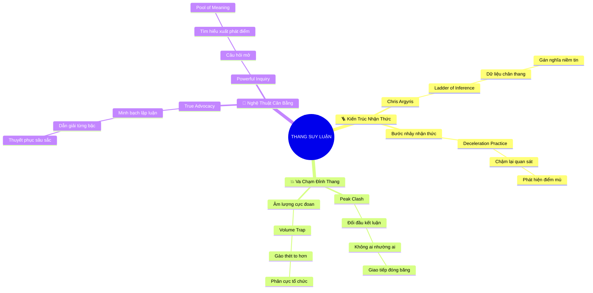

# 🧠 BẢN ĐỒ TƯ DUY TINH GỌN (4-5 TẦNG): CHƯƠNG 8 - HỎI THĂM DÒ VÀ TRÌNH BÀY QUAN ĐIỂM

## 1. Sơ Đồ Tư Duy Trực Quan (Mermaid Mindmap Tinh Gọn)

---

## 2. Cây Phân Cấp Tri Thức Gợi Nhớ Nhanh 4-5 Tầng (Active Recall Hierarchy)

- 📌 **Kiến Trúc Thang Suy Luận (The Ladder of Inference)**
  - 🔹 *Mô hình Chris Argyris:* ➔ *Dữ liệu quan sát khách quan* ➔ *Gán nghĩa & Đưa giả định* ➔ *Đỉnh thang kết luận*
  - 🔹 *Bước nhảy nhận thức vô thức:* ➔ *Nhảy vọt tốc độ cao* ➔ *Đồng nhất ý kiến với chân lý* ➔ *Cần làm chậm tư duy*
- 📌 **Hiểm Họa Va Chạm Đỉnh Thang (Peak-to-Peak Clashes)**
  - 🔹 *Đối đầu kết luận:* ➔ *Tranh cãi "Làm ngay" vs "Giữ nguyên"* ➔ *Bế tắc đàm phán* ➔ *Giao tiếp đóng băng*
  - 🔹 *Bẫy tăng âm lượng:* ➔ *Gào thét kết luận to hơn* ➔ *Dùng quyền lực áp chế* ➔ *Gia tăng thù hằn nội bộ*
- 📌 **Cân Bằng Trình Bày & Thăm Dò (Balancing Advocacy & Inquiry)**
  - 🔹 *Trình bày minh bạch (Advocacy):* ➔ *Công khai bậc thang dữ liệu* ➔ *Giải thích logic suy luận* ➔ *Mời gọi đóng góp*
  - 🔹 *Hỏi thăm dò sâu sắc (Inquiry):* ➔ *Hạ mình bước xuống chân thang* ➔ *Lắng nghe xuất phát điểm* ➔ *Xây dựng nhịp cầu*

---

## 3. Bảng Neo Trí Nhớ Từ Khóa Vàng (Memory Anchor Cheat Sheet)

| Từ Khóa Cốt Lõi | Phần Trong Tài Liệu | Bản Chất / Vai Trò (3-5 từ) | Tín Hiệu Gợi Nhớ (Memory Trigger) |
| :--- | :--- | :--- | :--- |
| **Chris Argyris** | Phần I | Cha đẻ mô hình thang nhận thức | Chiếc thang gỗ dựa vào bức tường |
| **Bước Nhảy Nhận Thức** | Phần I | Suy diễn vội vã vô thức | Vận động viên nhảy cao qua xà |
| **Va Chạm Đỉnh Thang** | Phần II | Bế tắc đối đầu hai kết luận | Hai con dê húc nhau trên cầu hẹp |
| **Bẫy Âm Lượng** | Phần II | Tưởng nói to là thuyết phục | Chiếc loa phóng thanh gào thét |
| **True Advocacy** | Phần III | Minh bạch hóa toàn bộ bậc thang | Bản vẽ thiết kế kiến trúc rõ ràng |
| **Powerful Inquiry** | Phần III | Câu hỏi mở chân thành cầu nối | Chiếc kính lúp khám phá sự thật |
