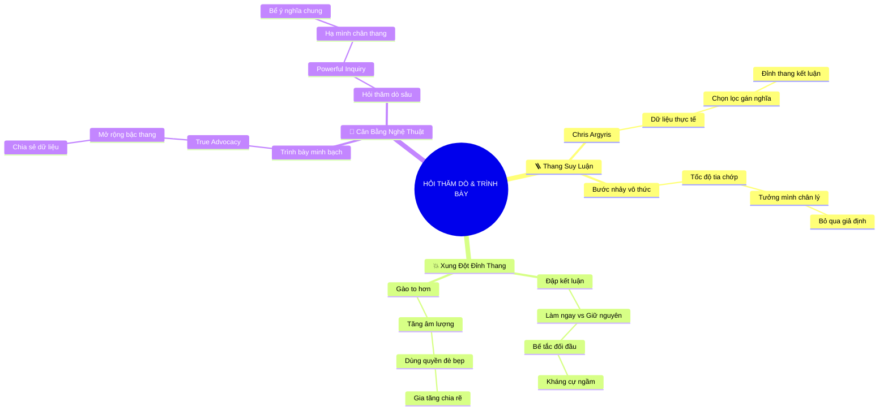

# Tóm Tắt: CHƯƠNG 8: HỎI THĂM DÒ VÀ TRÌNH BÀY QUAN ĐIỂM

## 1. Thông điệp cốt lõi (Core Message)
> Để vượt qua sự phân cực và bế tắc trong giao tiếp công sở, bạn phải từ bỏ thói quen gào thét kết luận từ trên "đỉnh thang suy luận" (Ladder of Inference); thay vào đó, hãy thành thạo nghệ thuật cân bằng giữa việc trình bày dữ liệu minh bạch (Advocate) và đặt những câu hỏi thăm dò khéo léo (Inquire) để thấu hiểu xuất phát điểm của người khác.

---

## 2. Lược Đồ Phân Bổ Cấu Trúc Tài Liệu (Content Distribution Overview)

| Phần / Đề Mục Tài Liệu Gốc | Nội Dung Trọng Tâm | Số Luận Điểm Đại Diện |
| :--- | :--- | :---: |
| **Phần I: Mô Hình Thang Suy Luận Của Chris Argyris** | Kiến trúc chiếc thang nhận thức: Dữ liệu quan sát -> Chọn lọc dữ liệu -> Gán nghĩa & Suy luận -> Niềm tin -> Kết luận hành động. | 3 Luận điểm |
| **Phần II: Hiểm Họa Tranh Luận Từ Đỉnh Thang** | Phân tích tình trạng xung đột đối đầu khi hai bên chỉ đập kết luận vào mặt nhau ("Hành động ngay!" vs. "Giữ nguyên hiện trạng!"). | 3 Luận điểm |
| **Phần III: Nghệ Thuật Cân Bằng Giữa Hỏi Thăm Dò & Trình Bày** | Kỹ thuật chia sẻ bậc thang suy luận của mình (Advocacy) và dùng câu hỏi mở thăm dò dữ liệu của đối phương (Inquiry) để xây nhịp cầu. | 3 Luận điểm |
| **Tổng cộng** | **Bao quát 100% cấu trúc tài liệu Chương 8** | **9 Luận điểm** |

---

## 3. Luận điểm quan trọng theo cấu trúc tài liệu (Key Takeaways: 9 ý chuyên sâu)

### 📑 PHẦN I: MÔ HÌNH THANG SUY LUẬN CỦA CHRIS ARGYRIS

1. **KIẾN TRÚC MÔ HÌNH THANG SUY LUẬN (LADDER OF INFERENCE)**
   - **Bản chất & Phân tích chuyên sâu:** Nhà lý thuyết quản trị huyền thoại Chris Argyris đã mô tả tiến trình tư duy con người qua ẩn dụ chiếc thang: Bắt đầu từ chân thang (dữ liệu thực tế khách quan), não bộ chọn lọc một phần dữ liệu, gán ý nghĩa văn hóa, đưa ra giả định, hình thành niềm tin và cuối cùng trèo lên đỉnh thang để đưa ra kết luận hành động.
   - **Phương pháp / Công cụ / Quy trình đi kèm:** Mô Hình Thang Suy Luận Nhận Thức (Argyris's Ladder of Inference Architecture).
   - **Ví dụ thực tế đời thường:** Nhìn thấy đối thủ giảm giá 10% (dữ liệu), suy diễn họ sắp chiếm thị trường (giả định), tin rằng công ty sắp nguy ngập (niềm tin), đi đến kết luận: phải giảm giá theo ngay ngày mai (đỉnh thang).

2. **BƯỚC NHẢY SUY LUẬN VÔ THỨC (THE COGNITIVE LEAP)**
   - **Bản chất & Phân tích chuyên sâu:** Não bộ con người thực hiện các bước leo thang với tốc độ tia chớp. Ta nhảy từ chân thang lên đỉnh thang trong một phần nghìn giây mà không hề nhận thức được chuỗi giả định ngầm của mình. Ta coi kết luận chủ quan của mình chính là chân lý khách quan.
   - **Phương pháp / Công cụ / Quy trình đi kèm:** Kỹ Thuật Làm Chậm Tốc Độ Nhận Thức (Cognitive Deceleration Practice).
   - **Ví dụ thực tế đời thường:** Thấy sếp không chào mình ở cửa thang máy, lập tức kết luận: "Sếp đang ghét mình và chuẩn bị sa thải mình", bỏ qua dữ liệu sếp đang tập trung suy nghĩ một cú điện thoại gấp.

3. **TÍNH ĐỘC LẬP VÀ KHÁC BIỆT CỦA DỮ LIỆU ĐẦU VÀO**
   - **Bản chất & Phân tích chuyên sâu:** Hai người đứng trong cùng một căn phòng, cùng quan sát một sự việc nhưng có thể nhìn vào hai tập dữ liệu hoàn toàn khác nhau. Sự khác biệt về nền tảng chuyên môn, vị trí phòng ban và kinh nghiệm cá nhân quyết định chiếc kính lọc dữ liệu của mỗi người.
   - **Phương pháp / Công cụ / Quy trình đi kèm:** Bản Đồ Đa Chiều Dữ Liệu Quan Sát (Multidimensional Observational Data Grid).
   - **Ví dụ thực tế đời thường:** Kỹ sư nhìn vào tỷ lệ lỗi phần mềm (dữ liệu kỹ thuật), còn nhân viên kinh doanh nhìn vào phản hồi đòi trả hàng của khách (dữ liệu thương mại).

---

### 📑 PHẦN II: HIỂM HỌA TRANH LUẬN TỪ ĐỈNH THANG

4. **XUNG ĐỘT ĐỈNH THANG: "ĐỐI ĐẦU KẾT LUẬN" (PEAK-TO-PEAK CLASHES)**
   - **Bản chất & Phân tích chuyên sâu:** Trong phần lớn các cuộc họp công sở, con người chỉ giao tiếp với nhau bằng đỉnh thang. Bên A nói: "Này Pete, ta phải làm dự án này ngay ngày mai!". Bên B đáp trả: "Anh điên rồi, ta phải giữ nguyên hiện trạng!". Khi chỉ có hai kết luận đập vào nhau, cuộc đối thoại lập tức rơi vào ngõ cụt.
   - **Phương pháp / Công cụ / Quy trình đi kèm:** Chẩn Đoán Xung Đột Đỉnh Thang (Peak Clash Diagnostic).
   - **Ví dụ thực tế đời thường:** Tranh cãi nảy lửa giữa phòng Marketing (đòi tăng ngân sách quảng cáo) và phòng Kế toán (đòi thắt chặt chi tiêu), không ai chịu giải thích dữ liệu đằng sau kết luận của mình.

5. **NGỘ NHẬN "GÀO TO HƠN SẼ THUYẾT PHỤC HƠN"**
   - **Bản chất & Phân tích chuyên sâu:** Khi kết luận của mình bị bác bỏ, phản xạ thông thường không phải là giải thích lý do, mà là lặp lại kết luận đó với âm lượng to hơn, tông giọng gay gắt hơn hoặc dùng quyền lực chức vụ để đè bẹp. Điều này chỉ làm gia tăng sự kháng cự và chia rẽ nội bộ.
   - **Phương pháp / Công cụ / Quy trình đi kèm:** Nhận Diện Bẫy Khuếch Đại Âm Lượng (Volume Amplification Trap).
   - **Ví dụ thực tế đời thường:** Giám đốc đập bàn quát: "Tôi đã nói phải làm là phải làm!", khiến cả phòng họp im lặng tuân thủ trong sự bất mãn và chống đối ngầm.

6. **HIỆN TƯỢNG PHÂN CỰC VÀ ĐÓNG BĂNG GIAO TIẾP**
   - **Bản chất & Phân tích chuyên sâu:** Thế giới hiện đại và các tổ chức đang bị chia rẽ sâu sắc chính vì thói quen đứng trên đỉnh thang của mình phán xét người khác. Khi không ai chịu bước xuống dưới chân thang để soi chiếu dữ liệu, giao tiếp sẽ hoàn toàn đóng băng và sự hợp tác bị phá hủy.
   - **Phương pháp / Công cụ / Quy trình đi kèm:** Khung Giải Trừ Phân Cực Tổ Chức (Organizational Depolarization Framework).
   - **Ví dụ thực tế đời thường:** Sự nghi kỵ kéo dài hàng năm trời giữa khối văn phòng và khối sản xuất nhà máy chỉ vì không bao giờ chia sẻ dữ liệu gốc với nhau.

---

### 📑 PHẦN III: NGHỆ THUẬT CÂN BẰNG GIỮA HỎI THĂM DÒ & TRÌNH BÀY

7. **TRÌNH BÀY QUAN ĐIỂM ĐÚNG NGHĨA (TRUE ADVOCACY)**
   - **Bản chất & Phân tích chuyên sâu:** Trình bày quan điểm (Advocate) không phải là khẳng định kết luận một cách áp đặt, mà là dẫn dắt người nghe đi từng bước trên chiếc thang của bạn: công khai dữ liệu bạn đang nhìn thấy, giải thích cách bạn suy luận từ dữ liệu đó và lý do đưa bạn đến kết luận cuối cùng.
   - **Phương pháp / Công cụ / Quy trình đi kèm:** Giao Thức Minh Bạch Thang Suy Luận (Transparent Ladder Protocol).
   - **Ví dụ thực tế đời thường:** "Tôi đề xuất triển khai dự án này vì dữ liệu 3 tháng qua cho thấy đối thủ đã ra mắt 2 tính năng tương tự và chúng ta đã mất 5 khách hàng lớn. Lập luận của tôi là cần giữ chân tập khách hàng còn lại bằng giải pháp này".

8. **QUYỀN NĂNG CỦA CÂU HỎI THĂM DÒ KHÉO LÉO (POWERFUL INQUIRY)**
   - **Bản chất & Phân tích chuyên sâu:** Hỏi thăm dò (Inquire) là phương thức đơn lẻ xuất sắc nhất để xây dựng những nhịp cầu giao tiếp. Bằng cách hạ mình bước xuống chân thang của đối phương và chân thành hỏi về dữ liệu của họ, bạn giải tỏa hoàn toàn thế đối đầu và mời gọi họ hợp tác.
   - **Phương pháp / Công cụ / Quy trình đi kèm:** Kỹ Thuật Đặt Câu Hỏi Thăm Dò Khám Phá (Inquiry Bridge-Building Technique).
   - **Ví dụ thực tế đời thường:** "Này Pete, tôi nghe bạn nói nên giữ nguyên hiện trạng. Bạn có thể giúp tôi hiểu rõ lý do vì sao không? Bạn đang nhìn vào những dữ liệu và góc nhìn nào mà có thể tôi chưa biết?".

9. **THIẾT LẬP VÙNG DỮ LIỆU CHUNG (SHARED DATA POOL)**
   - **Bản chất & Phân tích chuyên sâu:** Khi cả hai bên đều công khai chiếc thang của mình, cuộc đối thoại không còn là cuộc chiến giữa hai cái tôi ("Anh đúng hay Tôi đúng"), mà biến thành nỗ lực chung của hai người cùng nhìn vào một bảng dữ liệu mở để tìm ra giải pháp tối ưu nhất cho tổ chức.
   - **Phương pháp / Công cụ / Quy trình đi kèm:** Bể Dữ Liệu Ý Nghĩa Chung (Pool of Shared Meaning theo Patterson & Grenny).
   - **Ví dụ thực tế đời thường:** Hai trưởng phòng ngồi lại cùng mở bảng thống kê tài chính và phản hồi khách hàng, nhận ra cả hai đều có lý và cùng thống nhất một phương án dung hòa: nâng cấp tính năng nhưng theo lộ trình tiết kiệm chi phí.

---

## 4. Kế hoạch hành động (Action Plan: 14 việc cụ thể)

#### Nhóm 1: Hành động ngay hôm nay (Micro-habits dưới 2 phút)
- [ ] **Hành động 1:** Nhận diện vị trí trên chiếc thang của câu nói bạn chuẩn bị phát biểu: đó là Kết luận hay Dữ liệu?
- [ ] **Hành động 2:** Tự nhủ câu thần chú: "Mình chỉ đang đứng trên đỉnh thang của mình, đối phương có chiếc thang của họ".
- [ ] **Hành động 3:** Thực hành hỏi 1 câu thăm dò: "Bạn có thể chia sẻ góc nhìn và dữ liệu bạn đang cân nhắc không?".
- [ ] **Hành động 4:** Dừng lại 5 giây trước khi phản bác ý kiến trái chiều để làm chậm bước nhảy suy luận.
- [ ] **Hành động 5:** Mở đầu đề xuất bằng câu: "Tôi có thể giải thích cách lập luận dẫn đến ý tưởng này không?".

#### Nhóm 2: Kế hoạch rèn luyện trong tuần (Áp dụng vào công việc & đời sống)
- [ ] **Hành động 6:** Vẽ sơ đồ Thang Suy Luận ra giấy trước khi bước vào một cuộc họp đàm phán quan trọng.
- [ ] **Hành động 7:** Luyện tập tỷ lệ 50/50: 50% thời gian trình bày minh bạch (Advocate), 50% thời gian hỏi thăm dò (Inquire).
- [ ] **Hành động 8:** Khi bị ai đó bác bỏ ý kiến, thay vì gào to hơn, hãy hỏi: "Điều gì trong lập luận của tôi chưa thuyết phục bạn?".
- [ ] **Hành động 9:** Hướng dẫn 1 đồng nghiệp trong nhóm cách nhận diện các bậc thang suy luận để giảm xung đột nội bộ.
- [ ] **Hành động 10:** Tạo bảng tổng hợp dữ liệu chung cho 1 dự án đang có sự tranh cãi giữa các phòng ban.

#### Nhóm 3: Thói quen duy trì & Chuyển hóa lâu dài (Phát triển bền vững)
- [ ] **Hành động 11:** Xóa bỏ hoàn toàn thói quen "đập kết luận vào mặt nhau" trong văn hóa họp nhóm của bạn.
- [ ] **Hành động 12:** Xây dựng danh tiếng là người đối thoại thông tuệ, luôn biết cách lắng nghe và đặt câu hỏi mở sâu sắc.
- [ ] **Hành động 13:** Định kỳ rà soát các giả định ngầm trong các quyết định kinh doanh chiến lược của bộ phận.
- [ ] **Hành động 14:** Đào tạo kỹ năng Thang Suy Luận và Nghệ thuật Hỏi Thăm Dò cho toàn thể cán bộ quản lý.

---

## 5. Câu hỏi tự ngẫm (Reflection: 20 câu hỏi sâu sắc)

#### Nhóm 1: Tự vấn Nhận thức & Hệ tư duy (Self-Awareness & Mindset)
1. Trong các cuộc tranh luận, tôi dành bao nhiêu phần trăm thời gian để bảo vệ đỉnh thang của mình?
2. Bước nhảy suy luận vô thức của tôi thường bị chi phối bởi những nỗi sợ hay định kiến nào?
3. Tôi có thật lòng muốn hiểu dữ liệu của người khác hay chỉ hỏi thăm dò theo kiểu gài bẫy?
4. Khi ai đó phản bác kết luận của tôi, cảm xúc đầu tiên của tôi là tò mò muốn biết lý do hay giận dữ phòng thủ?
5. Sự khác biệt giữa việc ép buộc người khác nghe theo kết luận và việc mở rộng thang suy luận cho họ thấy là gì?

#### Nhóm 2: Nhận diện Thói quen & Điểm mù (Habits & Blind Spots)
6. Tôi có hay tăng âm lượng giọng nói khi cảm thấy mình không thuyết phục được người nghe?
7. Những dữ liệu quan trọng nào tôi thường vô thức bỏ qua vì chúng đi ngược lại niềm tin có sẵn của tôi?
8. Lần gần nhất tôi chịu bước xuống chân thang để thừa nhận dữ liệu của mình bị thiếu sót là khi nào?
9. Tôi có thói quen gán nhãn "kẻ ngốc" cho những ai nhìn nhận sự việc khác với kết luận của tôi?
10. Tại sao tôi lại cảm thấy việc thừa nhận mình chưa hiểu góc nhìn của người khác là biểu hiện của sự yếu đuối?

#### Nhóm 3: Ứng dụng Thực tế & Giải quyết Vấn đề (Practical Application & Problem Solving)
11. Bất đồng lớn nhất trong nhóm tôi hiện nay đang xuất phát từ việc thiếu dữ liệu chung hay do đụng độ đỉnh thang?
12. Câu hỏi thăm dò nào tôi có thể dùng ngay vào sáng mai để mở khóa cuộc đối thoại bế tắc với đồng nghiệp?
13. Làm thế nào để trình bày toàn bộ các bậc thang suy luận của tôi trong một bản slide thuyết trình 5 phút?
14. Nếu đối phương vẫn khăng khăng ở trên đỉnh thang và từ chối chia sẻ dữ liệu, tôi nên xử lý ra sao?
15. Những dữ liệu thực chứng nào sẽ là điểm tựa vững chắc nhất để thuyết phục ban giám đốc tuần này?

#### Nhóm 4: Bứt phá Giới hạn & Chuyển hóa Tương lai (Breakthrough & Transformation)
16. Nếu tôi trở thành bậc thầy về Hỏi Thăm Dò (Inquiry), năng lực lãnh đạo của tôi sẽ thăng hoa như thế nào?
17. Một tổ chức nơi mọi nhân viên đều biết cách minh bạch hóa thang suy luận sẽ vận hành trơn tru ra sao?
18. Làm sao để văn hóa đối thoại chân thành trở thành lợi thế cạnh tranh số 1 của doanh nghiệp chúng tôi?
19. Di sản về sự công tâm và lắng nghe mà tôi muốn để lại trong lòng đồng nghiệp là gì?
20. Bài học lớn nhất từ nhà quản trị Chris Argyris đã thay đổi nhân sinh quan của tôi như thế nào?

---

## 6. Bản Đồ Tư Duy Trực Quan (Visual Mindmap Overview - Tinh Gọn 4-5 Tầng)

