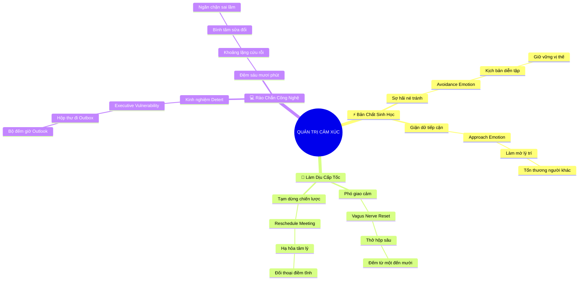

# 🧠 BẢN ĐỒ TƯ DUY TINH GỌN (4-5 TẦNG): CHƯƠNG 9 - CHUẨN BỊ VÀ QUẢN TRỊ CẢM XÚC SỢ HÃI LẪN GIẬN DỮ

## 1. Sơ Đồ Tư Duy Trực Quan (Mermaid Mindmap Tinh Gọn)

---

## 2. Cây Phân Cấp Tri Thức Gợi Nhớ Nhanh 4-5 Tầng (Active Recall Hierarchy)

- 📌 **Bản Chất Sinh Học Đối Lập (Biological Action Tendencies)**
  - 🔹 *Sợ hãi (Né tránh):* ➔ *Avoidance Emotion* ➔ *Tháo chạy & Câm lặng* ➔ *Diễn tập kịch bản chịu áp lực*
  - 🔹 *Giận dữ (Tiếp cận):* ➔ *Approach Emotion* ➔ *Tê liệt vỏ não thùy trán* ➔ *Hành xử vụng về gây tổn hại*
- 📌 **Kỹ Thuật Làm Dịu Cấp Tốc (In-the-Moment Physiological Soothing)**
  - 🔹 *Kích hoạt phó giao cảm:* ➔ *Kích thích dây thần kinh phế vị* ➔ *Thở sâu & Đếm 1-10* ➔ *Hạ nhịp tim tức thời*
  - 🔹 *Tạm dừng chiến lược:* ➔ *Không lên tiếng lúc bốc hỏa* ➔ *Dời lịch hẹn sang buổi sau* ➔ *Lấy lại cân bằng*
- 📌 **Rào Chắn Công Nghệ Trì Hoãn (Technological Guardrails)**
  - 🔹 *Bài học tự vấn Jim Detert:* ➔ *Dũng cảm nhưng thiếu năng lực* ➔ *Gửi email lúc bực tức* ➔ *Hủy hoại quan hệ*
  - 🔹 *Quy tắc Outlook 60 phút:* ➔ *Hẹn giờ giữ thư trong Outbox* ➔ *Khoảng đệm hạ nhiệt 1 giờ* ➔ *Đọc lại và sửa sai*

---

## 3. Bảng Neo Trí Nhớ Từ Khóa Vàng (Memory Anchor Cheat Sheet)

| Từ Khóa Cốt Lõi | Phần Trong Tài Liệu | Bản Chất / Vai Trò (3-5 từ) | Tín Hiệu Gợi Nhớ (Memory Trigger) |
| :--- | :--- | :--- | :--- |
| **Khuynh Hướng Cảm Xúc** | Phần I | Sợ né tránh vs Giận tiếp cận | Con linh dương chạy vs Con hổ vồ |
| **Diễn Tập Áp Lực** | Phần I | Đóng vai phản biện tôi luyện | Đấu sĩ tập dượt trong võ đài |
| **Phó Giao Cảm** | Phần II | Phanh hãm nhịp tim cơ thể | Bàn đạp phanh xe khẩn cấp |
| **Dời Lịch Hẹn** | Phần II | Khoảng lặng chiến lược tránh hỏa | Tấm biển "Tạm nghỉ phục vụ" |
| **Bài Học Jim Detert** | Phần III | Thừa nhận sai lầm để sửa mình | Vị giáo sư đứng nhìn màn hình |
| **Outlook 60 Phút** | Phần III | Phao cứu sinh công nghệ đắt giá | Đồng hồ cát đếm ngược trên thư |
