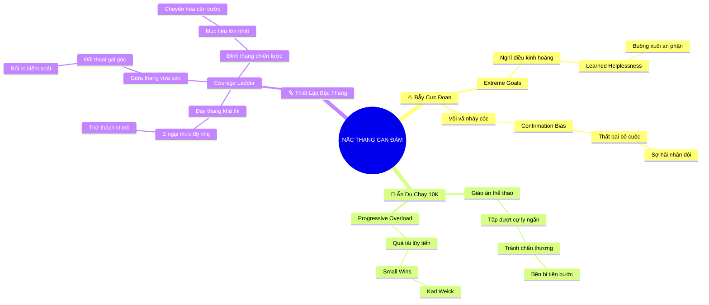

# 🧠 BẢN ĐỒ TƯ DUY TINH GỌN (4-5 TẦNG): CHƯƠNG 10 - XÂY DỰNG NẤC THANG LÒNG DŨNG CẢM CỦA RIÊNG BẠN

## 1. Sơ Đồ Tư Duy Trực Quan (Mermaid Mindmap Tinh Gọn)

---

## 2. Cây Phân Cấp Tri Thức Gợi Nhớ Nhanh 4-5 Tầng (Active Recall Hierarchy)

- 📌 **Bẫy Mục Tiêu Cực Đoan (The Extreme Goal Trap)**
  - 🔹 *Bất lực tập nhiễm:* ➔ *Nghĩ ngay tới điều đáng sợ nhất* ➔ *Tê liệt hành động* ➔ *Cam chịu số phận*
  - 🔹 *Định kiến củng cố:* ➔ *Thử việc quá khó một lần duy nhất* ➔ *Thất bại ê chề* ➔ *Vĩnh viễn rút lui*
- 📌 **Ẩn Dụ Giáo Án Chạy Bộ 10K (The 10K Running Analogy)**
  - 🔹 *Bài học thể thao:* ➔ *Không ai chạy 10km ngày đầu* ➔ *Tập từng cự ly ngắn* ➔ *Tránh chấn thương tâm lý*
  - 🔹 *Quá tải lũy tiến & Small Wins:* ➔ *Karl Weick* ➔ *Chiến thắng vi mô* ➔ *Sản sinh dopamine củng cố tự tin*
- 📌 **Thiết Kế Nấc Thang Lòng Dũng Cảm (Designing Your Courage Ladder)**
  - 🔹 *Cấu trúc 3 phân tầng:* ➔ *Đáy thang (e ngại nhẹ)* ➔ *Giữa thang (khó vừa)* ➔ *Đỉnh thang (mục tiêu lớn)*
  - 🔹 *Chuyển hóa căn cước:* ➔ *Gặt hái thành công ban đầu* ➔ *Nâng cao ngưỡng chịu đựng* ➔ *Trở thành bản năng*

---

## 3. Bảng Neo Trí Nhớ Từ Khóa Vàng (Memory Anchor Cheat Sheet)

| Từ Khóa Cốt Lõi | Phần Trong Tài Liệu | Bản Chất / Vai Trò (3-5 từ) | Tín Hiệu Gợi Nhớ (Memory Trigger) |
| :--- | :--- | :--- | :--- |
| **Bẫy Cực Đoan** | Phần I | Tê liệt vì nghĩ việc quá khó | Vách đá dựng đứng cheo leo |
| **Giáo Án 10K** | Phần II | Ẩn dụ bồi đắp dũng khí | Đôi giày chạy bộ trên đường đua |
| **Small Wins** | Phần II | Chiến thắng nhỏ tạo động lực | Ngọn lửa nhỏ nhen nhóm niềm tin |
| **Đáy Thang** | Phần III | Thử thách nhẹ bắt đầu ngay | Bậc thang gỗ đầu tiên sát đất |
| **Đỉnh Thang** | Phần III | Mục tiêu lớn nhất tương lai | Ngôi sao sáng trên bầu trời |
| **Bản Năng Dũng Cảm** | Phần III | Can đảm thành phong cách sống | Tấm áo giáp hòa vào da thịt |
