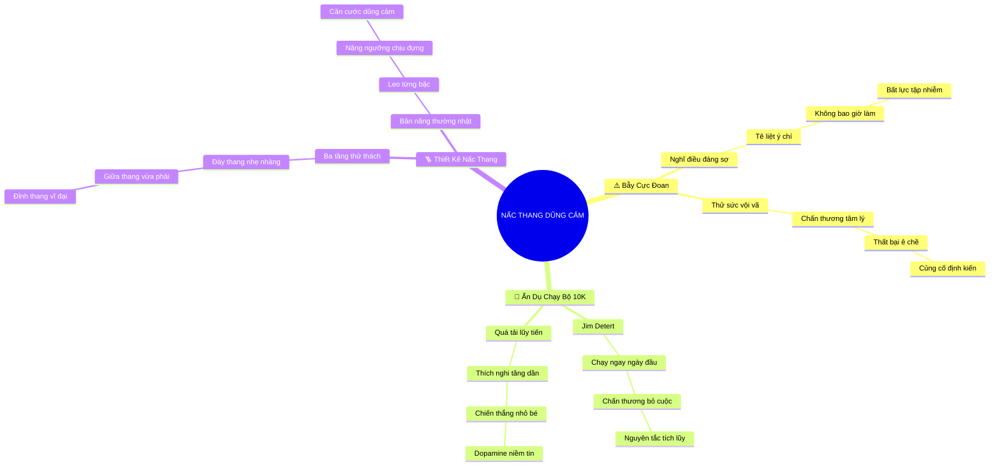

# Tóm Tắt: CHƯƠNG 10: XÂY DỰNG NẤC THANG LÒNG DŨNG CẢM CỦA RIÊNG BẠN

## 1. Thông điệp cốt lõi (Core Message)
> Lòng dũng cảm là một kỹ năng được tích lũy tuần tự thông qua việc thiết lập "Nấc thang lòng dũng cảm" (Courage Ladder) tương tự như giáo án tập luyện chạy bộ 10K: bắt đầu từ những thử thách nhỏ có độ e ngại thấp ở đáy thang, gặt hái thành công ban đầu để bồi đắp niềm tin, rồi từng bước tiến lên chinh phục những mục tiêu đáng sợ nhất ở đỉnh thang.

---

## 2. Lược Đồ Phân Bổ Cấu Trúc Tài Liệu (Content Distribution Overview)

| Phần / Đề Mục Tài Liệu Gốc | Nội Dung Trọng Tâm | Số Luận Điểm Đại Diện |
| :--- | :--- | :---: |
| **Phần I: Bẫy Mục Tiêu Cực Đoan & Sự Tê Liệt Ban Đầu** | Phân tích hai sai lầm kinh điển: hoặc không bao giờ dám làm vì mục tiêu quá đáng sợ, hoặc thử ngay điều khó nhất rồi thất bại thảm hại. | 3 Luận điểm |
| **Phần II: Ẩn Dụ Giáo Án Chạy Bộ 10K & Bồi Đắp Từng Bước** | Bài học sâu sắc từ thể thao: người mới bắt đầu chạy bộ nếu xỏ giày chạy ngay 10km sẽ chấn thương và từ bỏ; cần lộ trình tích lũy cự ly. | 3 Luận điểm |
| **Phần III: Thiết Kế & Thực Thi Nấc Thang Lòng Dũng Cảm** | Quy trình phân tầng thử thách 3 cấp độ (Đáy thang e ngại nhẹ -> Giữa thang khó vừa -> Đỉnh thang đáng sợ nhất) và sức mạnh của việc bắt đầu từ việc nhỏ. | 3 Luận điểm |
| **Tổng cộng** | **Bao quát 100% cấu trúc tài liệu Chương 10** | **9 Luận điểm** |

---

## 3. Luận điểm quan trọng theo cấu trúc tài liệu (Key Takeaways: 9 ý chuyên sâu)

### 📑 PHẦN I: BẪY MỤC TIÊU CỰC ĐOAN & SỰ TÊ LIỆT BAN ĐẦU

1. **BẪY NGHĨ NGAY ĐẾN ĐIỀU ĐÁNG SỢ NHẤT**
   - **Bản chất & Phân tích chuyên sâu:** Khi nhắc đến việc thực hành lòng dũng cảm, tâm trí con người có xu hướng nhảy thẳng tới tình huống kinh hoàng nhất (như đối đầu trực diện với tổng giám đốc độc đoán hay vạch trần đại án sai phạm). Việc đối mặt ngay với đỉnh dốc hiểm trở này khiến hệ thần kinh tê liệt hoàn toàn.
   - **Phương pháp / Công cụ / Quy trình đi kèm:** Nhận Diện Bẫy Nhận Thức Cực Đoan (Extreme Goal Cognitive Trap).
   - **Ví dụ thực tế đời thường:** Một nhân viên mới muốn rèn luyện sự tự tin nhưng lại đặt mục tiêu ngay tuần đầu tiên phải chất vấn chủ tịch tập đoàn trong buổi họp cổ đông.

2. **KẾT LUẬN TIÊU CỰC THỨ NHẤT: "TÔI SẼ KHÔNG BAO GIỜ LÀM ĐIỀU ĐÓ"**
   - **Bản chất & Phân tích chuyên sâu:** Khi mục tiêu xuất hiện quá vĩ đại và đầy hiểm nguy vượt xa năng lực hiện tại, cá nhân sẽ rơi vào trạng thái bất lực tập nhiễm (Learned Helplessness). Họ kết luận rằng lòng dũng cảm là điều bất khả thi với mình và vĩnh viễn chọn sống trong sự an phận thủ thường.
   - **Phương pháp / Công cụ / Quy trình đi kèm:** Thang Đo Bất Lực Tập Nhiễm (Learned Helplessness Metric).
   - **Ví dụ thực tế đời thường:** Tự nhủ: "Chỉ những người có ô dù mới dám lên tiếng phản đối chính sách công ty, còn phận thấp cổ bé họng như mình thì vĩnh viễn không bao giờ".

3. **KẾT LUẬN TIÊU CỰC THỨ HAI: "THỬ MỘT LẦN VÀ THẤT BẠI CÀNG CHỨNG MINH DŨNG CẢM LÀ NGỚ NGẨN"**
   - **Bản chất & Phân tích chuyên sâu:** Một số người liều lĩnh xông thẳng vào thử thách đỉnh cao khi chưa trang bị đủ kỹ năng. Khi bị phản pháo tơi bời hoặc gặp thất bại ê chề, họ rơi vào cái bẫy củng cố định kiến (Confirmation Bias), tự nhủ rằng dũng cảm là trò điên rồ và thề không bao giờ dám dại dột lần thứ hai.
   - **Phương pháp / Công cụ / Quy trình đi kèm:** Phá Vỡ Vòng Lặp Thất Bại Tê Liệt (Paralyzing Failure Loop Buster).
   - **Ví dụ thực tế đời thường:** Nhân viên thử phản biện sếp một lần duy nhất trong lúc giận dữ và bị khiển trách, từ đó về sau trở thành kẻ cam chịu nhất phòng suốt 5 năm liền.

---

### 📑 PHẦN II: ẨN DỤ GIÁO ÁN CHẠY BỘ 10K & BỒI ĐẮP TỪNG BƯỚC

4. **ẨN DỤ SÂU SẮC VỀ CỰ LY CHẠY BỘ 10 KI-LÔ-MÉT**
   - **Bản chất & Phân tích chuyên sâu:** Jim Detert sử dụng một ẩn dụ thể thao kinh điển: Một người chưa từng tập thể dục bao giờ nếu đùng một cái xỏ giày ra đường và cố chạy cự ly 10km ngay trong ngày đầu tiên sẽ gặp vô số chấn thương cơ xương khớp đau đớn, kiệt sức và có lẽ sẽ vĩnh viễn từ bỏ chạy bộ.
   - **Phương pháp / Công cụ / Quy trình đi kèm:** Mô Hình Tiến Trình Thể Thao Áp Dụng Cho Tâm Lý (Sports Progressive Overload Analogy).
   - **Ví dụ thực tế đời thường:** Người mới tập chạy bộ bắt đầu bằng việc đi bộ nhanh 500m, sau đó chạy xen kẽ đi bộ 1km trong 2 tuần đầu tiên trước khi nghĩ đến cự ly xa hơn.

5. **NGUYÊN TẮC QUÁ TẢI LŨY TIẾN TRONG TÂM LÝ (PROGRESSIVE OVERLOAD)**
   - **Bản chất & Phân tích chuyên sâu:** Tâm lý con người cũng cần được thích nghi dần với áp lực tương tự như hệ cơ bắp. Năng lực chịu đựng sự căng thẳng và đối thoại khó khăn chỉ có thể nở rộng khi bạn liên tục vượt qua các thử thách vừa vặn với ngưỡng chịu đựng hiện tại.
   - **Phương pháp / Công cụ / Quy trình đi kèm:** Nguyên Lý Thích Nghi Áp Lực Tăng Dần (Psychological Progressive Adaptation).
   - **Ví dụ thực tế đời thường:** Tập thói quen từ chối lời mời nhậu của đồng nghiệp trước khi dám từ chối một dự án làm thêm giờ không lương của sếp.

6. **SỨC MẠNH VÀ VẺ ĐẸP CỦA VIỆC BẮT ĐẦU TỪ VIỆC NHỎ**
   - **Bản chất & Phân tích chuyên sâu:** Xã hội thường ca tụng những cú nhảy vọt vĩ đại mà xem nhẹ giá trị của những bước đi tí hon. Nhưng trong khoa học hành vi, chính những chiến thắng vi mô (Small Wins) ban đầu mới là nguồn nhiên liệu sản sinh dopamine, bồi đắp niềm tin vào năng lực bản thân (Self-Efficacy) để chuẩn bị cho những bước nhảy lớn hơn.
   - **Phương pháp / Công cụ / Quy trình đi kèm:** Lý Thuyết Chiến Thắng Nhỏ (Small Wins Theory theo Karl Weick).
   - **Ví dụ thực tế đời thường:** Đặt câu hỏi chất vấn đầu tiên trong buổi họp giao ban nội bộ và nhận được lời khen ngợi của trưởng phòng giúp nhân viên tự tin lên gấp đôi.

---

### 📑 PHẦN III: THIẾT KẾ & THỰC THI NẤC THANG LÒNG DŨNG CẢM

7. **CẤU TRÚC 3 TẦNG CỦA NẤC THANG LÒNG DŨNG CẢM (COURAGE LADDER)**
   - **Bản chất & Phân tích chuyên sâu:** Một nấc thang lòng dũng cảm hoàn chỉnh được thiết kế gồm 3 phân tầng rõ rệt: Đáy thang (các hành vi chỉ hơi e ngại đôi chút, hoàn toàn khả thi); Giữa thang (các thử thách có độ khó và rủi ro vừa phải); Đỉnh thang (mục tiêu đáng sợ nhất, đòi hỏi kỹ năng bậc thầy).
   - **Phương pháp / Công cụ / Quy trình đi kèm:** Khung Thiết Kế Nấc Thang Lòng Dũng Cảm (Courage Ladder Architecture Canvas).
   - **Ví dụ thực tế đời thường:** 
     - *Đáy thang:* Góp ý một lỗi typo nhỏ trong tài liệu của sếp.
     - *Giữa thang:* Trình bày quan điểm khác biệt về phân bổ ngân sách nhóm.
     - *Đỉnh thang:* Đối thoại thẳng thắn yêu cầu ban giám đốc xem xét lại chính sách đãi ngộ toàn công ty.

8. **CƠ CHẾ TÍCH LŨY THÀNH CÔNG GIA TĂNG ĐỘNG LỰC**
   - **Bản chất & Phân tích chuyên sâu:** Cách duy nhất để bạn bồi đắp năng lực dũng cảm theo thời gian là bắt đầu từ những việc nhỏ ở đáy thang, gặt hái một chút thành công, cảm thấy tự tin hơn vào bản thân, và điều đó sẽ tự động gia tăng động lực thôi thúc bạn leo lên nấc thang tiếp theo.
   - **Phương pháp / Công cụ / Quy trình đi kèm:** Vòng Lặp Phản Hồi Tự Tin - Hành Động (Confidence-Action Feedback Loop).
   - **Ví dụ thực tế đời thường:** Sau khi thành công bảo vệ được một ý tưởng nhỏ trong nhóm, bạn cảm thấy tràn đầy năng lượng để đăng ký dẫn dắt buổi thuyết trình với khách hàng tuần tới.

9. **BIẾN LÒNG DŨNG CẢM THÀNH BẢN NĂNG THƯỜNG NHẬT**
   - **Bản chất & Phân tích chuyên sâu:** Khi bạn kiên trì leo từng nấc thang, những hành vi từng khiến bạn run rẩy ở nấc thang thứ 2, thứ 3 sẽ dần trở thành điều hết sức bình thường. Ngưỡng chịu đựng của bạn nâng lên, và sự dũng cảm có năng lực chính thức trở thành phong cách sống và làm việc tự nhiên của bạn.
   - **Phương pháp / Công cụ / Quy trình đi kèm:** Tiêu Chuẩn Hóa Căn Cước Can Đảm (Courageous Identity Normalization).
   - **Ví dụ thực tế đời thường:** Việc nói thật với lãnh đạo cấp cao từng là nỗi kinh hoàng thời mới đi làm, nay trở thành thói quen đối thoại tự nhiên, điềm đạm và chuẩn mực của một giám đốc kỳ cựu.

---

## 4. Kế hoạch hành động (Action Plan: 14 việc cụ thể)

#### Nhóm 1: Hành động ngay hôm nay (Micro-habits dưới 2 phút)
- [ ] **Hành động 1:** Vẽ một chiếc thang gồm 5 bậc lên trang sổ tay làm việc của bạn.
- [ ] **Hành động 2:** Điền điều đáng sợ nhất nơi công sở vào bậc thang số 5 cao nhất trên cùng.
- [ ] **Hành động 3:** Điền 1 hành vi bạn chỉ hơi e ngại nhẹ nhưng làm được ngay vào bậc thang số 1 ở đáy.
- [ ] **Hành động 4:** Thực hiện ngay hành động ở bậc số 1 trước khi kết thúc ngày làm việc hôm nay.
- [ ] **Hành động 5:** Tự khen thưởng bản thân một tách trà/cà phê ngon sau khi hoàn thành bước đi nhỏ đầu tiên.

#### Nhóm 2: Kế hoạch rèn luyện trong tuần (Áp dụng vào công việc & đời sống)
- [ ] **Hành động 6:** Hoàn thiện đầy đủ nội dung cho các bậc thang số 2, 3 và 4 với độ khó tăng dần.
- [ ] **Hành động 7:** Chinh phục bậc thang số 2: thực hiện một cuộc trò chuyện phản biện có độ khó vừa phải.
- [ ] **Hành động 8:** Ghi chép cảm nhận sau khi vượt qua thử thách để củng cố niềm tin vào năng lực bản thân.
- [ ] **Hành động 9:** Chia sẻ chiếc thang dũng cảm của bạn với một người bạn đồng hành (courage buddy) để cùng giám sát.
- [ ] **Hành động 10:** Tự nhắc nhở ẩn dụ chạy bộ 10K mỗi khi bạn cảm thấy nôn nóng muốn nhảy cóc mục tiêu.

#### Nhóm 3: Thói quen duy trì & Chuyển hóa lâu dài (Phát triển bền vững)
- [ ] **Hành động 11:** Định kỳ mỗi quý cập nhật và nâng cấp nấc thang lòng dũng cảm cá nhân lên tầm cao mới.
- [ ] **Hành động 12:** Kiên trì thực hành nguyên tắc quá tải lũy tiến: không bao giờ để bản thân ngủ quên trong sự an toàn quá 3 tháng.
- [ ] **Hành động 13:** Hỗ trợ cấp dưới xây dựng nấc thang lòng dũng cảm của riêng các em để phát triển năng lực lãnh đạo.
- [ ] **Hành động 14:** Đạt đến trạng thái xem việc dấn thân vì điều đúng đắn là phản xạ tự nhiên của nhân cách.

---

## 5. Câu hỏi tự ngẫm (Reflection: 20 câu hỏi sâu sắc)

#### Nhóm 1: Tự vấn Nhận thức & Hệ tư duy (Self-Awareness & Mindset)
1. Tôi có đang vô thức trì hoãn việc rèn luyện dũng khí chỉ vì luôn nghĩ tới điều đáng sợ nhất?
2. Ẩn dụ về việc chạy cự ly 10km đã giúp tôi giải phóng cảm giác tự ti về sự nhút nhát của mình như thế nào?
3. Khi thất bại trong một lần lên tiếng trước đây, tôi đã rút ra bài học kỹ năng hay vội vã kết luận mình không hợp với dũng cảm?
4. Đâu là "vạch xuất phát 500m đầu tiên" phù hợp nhất với năng lực can đảm hiện tại của tôi?
5. Sự khác biệt giữa việc liều lĩnh đốt cháy giai đoạn và việc kiên trì leo từng nấc thang là gì?

#### Nhóm 2: Nhận diện Thói quen & Điểm mù (Habits & Blind Spots)
6. Tôi có hay coi thường những hành động dũng cảm nhỏ bé và chỉ mơ ước những chiến công vang dội?
7. Những chấn thương tâm lý trong quá khứ có đang ngăn cản tôi xỏ giày bước ra đường chạy dũng khí lần nữa?
8. Tôi có thường xuyên đặt ra những mục tiêu phi thực tế rồi dùng chính sự thất bại đó làm cái cớ để buông xuôi?
9. Bậc thang số 1 ở đáy thang của tôi hiện tại có quá dễ dãi hay đã đủ tạo ra sự thử thách nhẹ?
10. Tại sao tôi lại ngần ngại chia sẻ nấc thang dũng cảm của mình với một người đồng hành tin cậy?

#### Nhóm 3: Ứng dụng Thực tế & Giải quyết Vấn đề (Practical Application & Problem Solving)
11. Nếu bậc thang số 5 của tôi là "yêu cầu tăng lương", thì các bậc thang 1, 2, 3, 4 sẽ là những hành động cụ thể nào?
12. Làm thế nào để tự đo lường sự tiến bộ về mức độ tự tin sau mỗi nấc thang được chinh phục?
13. Khi gặp một bậc thang quá khó khiến tôi bị chững lại, tôi có thể chia nhỏ nó thành những bậc thang phụ nào?
14. Những kỹ năng chuẩn bị và giao tiếp nào ở các chương trước cần được áp dụng cho từng bậc thang?
15. Ai là người thầy hoặc người cố vấn xuất sắc nhất có thể đồng hành cùng tôi trên chiếc thang này?

#### Nhóm 4: Bứt phá Giới hạn & Chuyển hóa Tương lai (Breakthrough & Transformation)
16. Khi tôi chính thức đặt chân lên đỉnh thang cao nhất, con người tôi đã chuyển hóa thành một phiên bản tuyệt vời ra sao?
17. Làm thế nào để nấc thang dũng cảm của tôi trở thành nguồn cảm hứng truyền lửa cho cả tổ chức?
18. Di sản nghề nghiệp lớn nhất mà một người kiên định leo thang lòng dũng cảm sẽ để lại là gì?
19. Nấc thang nào sẽ là bước ngoặt quyết định đưa sự nghiệp của tôi bước sang một trang hoàn toàn mới?
20. Thông điệp quý giá nhất mà toàn bộ khóa học và giáo sư Jim Detert để lại trong tim tôi là gì?

---

## 6. Bản Đồ Tư Duy Trực Quan (Visual Mindmap Overview - Tinh Gọn 4-5 Tầng)

