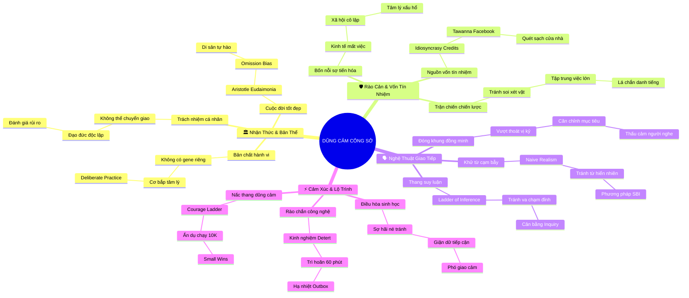

# 🧠 BẢN ĐỒ TƯ DUY TINH GỌN TOÀN TÁC PHẨM (4-5 TẦNG)
## Tác phẩm: XÂY DỰNG LÒNG DŨNG CẢM ĐỂ LÊN TIẾNG VÀ TỎA SÁNG NƠI CÔNG SỞ
**Tác giả:** Giáo sư Jim Detert & Pete Mockaitis

---

## 1. Sơ Đồ Tư Duy Trực Quan Master (Mermaid Mindmap Toàn Sách)

---

## 2. Cây Phân Cấp Tri Thức Gợi Nhớ Nhanh 4-5 Tầng (Active Recall Master Hierarchy)

- 📌 **Trụ Cột 1: Nhận Thức & Bản Thể (Mindset & Philosophical Foundations - Ch. 1, 2, 3)**
  - 🔹 *Bản chất kỹ năng:* ➔ *Không có gene dũng cảm* ➔ *Cơ bắp tâm lý* ➔ *Tiến trình 3 pha (Pre-During-Post)*
  - 🔹 *Trách nhiệm đạo đức:* ➔ *Không thể ủy thác* ➔ *Tương tự tính trung thực* ➔ *Chấp nhận rủi ro tính toán*
  - 🔹 *Ý nghĩa trọn vẹn:* ➔ *Aristotle Eudaimonia* ➔ *Tránh bẫy hối tiếc (Omission bias)* ➔ *Tỏa sáng tích cực*
- 📌 **Trụ Cột 2: Rào Cản & Vốn Tín Nhiệm (Fears & Social Capital - Ch. 4, 5)**
  - 🔹 *Giải mã 4 nỗi sợ:* ➔ *Kinh tế (mất việc)* ➔ *Xã hội (cô lập)* ➔ *Tâm lý (xấu hổ)* ➔ *Thể chất (bạo lực)*
  - 🔹 *Nguồn vốn tín nhiệm:* ➔ *Idiosyncrasy Credits của Hollander* ➔ *Thành tích vượt trội Tawanna Burnette* ➔ *Quét sạch cửa nhà*
  - 🔹 *Lựa chọn trận chiến:* ➔ *Không lãng phí uy tín* ➔ *Chọn mục tiêu chiến lược* ➔ *Biến uy tín thành áo giáp*
- 📌 **Trụ Cột 3: Nghệ Thuật Giao Tiếp & Thấu Cảm (Strategic Communication - Ch. 6, 7, 8)**
  - 🔹 *Cùng một chiến tuyến:* ➔ *Vượt thoát vị kỷ* ➔ *Đại từ "Chúng ta"* ➔ *Căn chỉnh sứ mệnh tổ chức*
  - 🔹 *Khử từ ngữ cạm bẫy:* ➔ *Naive Realism* ➔ *Xóa bỏ "hiển nhiên/luôn luôn"* ➔ *Áp dụng mô hình SBI*
  - 🔹 *Thang suy luận Argyris:* ➔ *Bóc tách dữ liệu chân thang* ➔ *Tránh va chạm đỉnh thang* ➔ *Cân bằng Advocacy & Inquiry*
- 📌 **Trụ Cột 4: Quản Trị Cảm Xúc & Lộ Trình Tiến Bộ (Emotional Mastery & Progression - Ch. 9, 10)**
  - 🔹 *Cảm xúc sinh học:* ➔ *Sợ hãi né tránh vs Giận dữ tiếp cận* ➔ *Kích hoạt phó giao cảm* ➔ *Dời lịch đối thoại*
  - 🔹 *Rào chắn công nghệ:* ➔ *Bài học tự vấn Jim Detert* ➔ *Quy tắc hoãn email 60 phút Outlook* ➔ *Đọc lại sửa sai*
  - 🔹 *Nấc thang dũng cảm:* ➔ *Tránh bẫy mục tiêu cực đoan* ➔ *Giáo án chạy bộ 10K* ➔ *Tích lũy Small Wins từng bậc*

---

## 3. Bảng Neo Trí Nhớ Từ Khóa Vàng Toàn Sách (Master Memory Anchor Cheat Sheet)

| Từ Khóa Cốt Lõi | Chương Đại Diện | Bản Chất / Vai Trò (3-5 từ) | Tín Hiệu Gợi Nhớ (Memory Trigger) |
| :--- | :---: | :--- | :--- |
| **Gene Dũng Cảm** | Chương 1 | Ngộ nhận bẩm sinh sai lầm | Chiếc khiên thoái thác trách nhiệm |
| **John Lewis** | Chương 1 | Điển hình rèn luyện kiên cường | Cuộc tuần hành bất bạo động |
| **Follow-up Hậu Sự** | Chương 1 | 95% quyết định sự thành bại | Tách cà phê hàn gắn sau cuộc họp |
| **Ủy Nhượng Đạo Đức** | Chương 2 | Nhường việc làm điều đúng đắn | Chiếc mặt nạ "chờ sếp lên tiếng" |
| **Eudaimonia** | Chương 3 | Cuộc đời tốt đẹp trọn vẹn | Bức tượng Aristotle uy nghiêm |
| **Omission Bias** | Chương 3 | Ân hận vì đã không hành động | Nỗi đau dằn vặt tuổi xế chiều |
| **Whistleblowers** | Chương 3 | Người tố giác giữ vững lương tri | Tiếng còi báo động công lý |
| **35 Hành Vi Công Sở** | Chương 4 | Danh mục dũng cảm thực tế | Danh sách kiểm tra bổn phận |
| **Bốn Nỗi Sợ Tiến Hóa** | Chương 4 | Kinh tế, Xã hội, Tâm lý, Thể chất | Ngọn lửa trại bộ lạc nguyên thủy |
| **Idiosyncrasy Credits** | Chương 5 | Nguồn vốn tín nhiệm tổ chức | Thẻ ngân hàng niềm tin Hollander |
| **Tawanna Burnette** | Chương 5 | Tích lũy uy tín tại Facebook | Nữ thủ lĩnh da màu bản lĩnh |
| **Cùng Chiến Tuyến** | Chương 6 | Đóng khung theo lợi ích chung | Hai người lính cùng chung chiến hào |
| **Perspective Taking** | Chương 6 | Đặt mình vào ghế người nghe | Chiếc ghế xoay của vị tổng giám đốc |
| **Naive Realism** | Chương 7 | Ảo tưởng mình là chân lý | Tấm gương soi chỉ thấy bóng mình |
| **Đĩa Bánh Pizza** | Chương 7 | Bẫy từ tần suất tuyệt đối | Chiếc đĩa pizza ngày 30 tháng 7 |
| **Mô Hình SBI** | Chương 7 | Phản hồi bối cảnh hành vi | Thước đo hành vi không quy chụp |
| **Thang Suy Luận** | Chương 8 | Mô hình nhận thức Chris Argyris | Chiếc thang gỗ dựa vào bức tường |
| **Va Chạm Đỉnh Thang** | Chương 8 | Đập kết luận vào mặt nhau | Hai con dê húc nhau trên cầu |
| **Advocacy & Inquiry** | Chương 8 | Trình bày và hỏi thăm dò | Chiếc cầu nối hai bờ vực thẳm |
| **Phó Giao Cảm** | Chương 9 | Phanh hãm nhịp tim cơ thể | Bàn đạp phanh xe khẩn cấp |
| **Outlook 60 Phút** | Chương 9 | Phao cứu sinh công nghệ đắt giá | Đồng hồ cát trong hòm thư đi |
| **Nấc Thang Dũng Cảm** | Chương 10 | Lộ trình bồi đắp từng bước | Chiếc thang leo từng nấc vững chãi |
| **Giáo Án Chạy 10K** | Chương 10 | Nguyên tắc tích lũy không nhảy cóc | Đôi giày chạy bộ trên đường đua |
| **Small Wins** | Chương 10 | Chiến thắng nhỏ tạo động lực | Ngọn lửa nhỏ nhen nhóm niềm tin |
