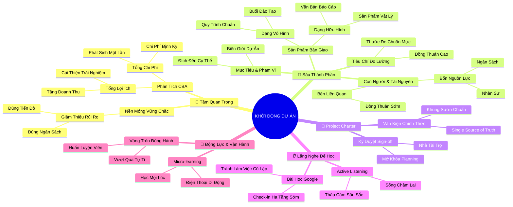

# 🧠 BẢN ĐỒ TƯ DUY TINH GỌN (4-5 TẦNG): HỌC PHẦN 1 - NGUYÊN LÝ NỀN TẢNG CỦA KHỞI ĐỘNG DỰ ÁN

## 1. Sơ Đồ Tư Duy Trực Quan (Mermaid Mindmap Tinh Gọn)

---

## 2. Cây Phân Cấp Tri Thức Gợi Nhớ Nhanh 4-5 Tầng (Active Recall Hierarchy)

- 📌 **Khởi Động Thiết Yếu & Phân Tích Chi Phí - Lợi Ích (CBA)**
  - 🔹 *Bản chất Initiation:* ➔ *Đặt nền móng:* ➔ *Ngăn chặn đổ vỡ* ➔ *Đúng hạn & ngân sách*
  - 🔹 *Cân bằng CBA:* ➔ *So sánh lợi ích - chi phí:* ➔ *Lợi ích > Chi phí* ➔ *Phê duyệt dự án*

- 📌 **Sáu Thành Phần Cốt Lõi Của Khởi Động Dự Án**
  - 🔹 *Mục tiêu (Goals):* ➔ *Đích đến:* ➔ *Định hình Scope* ➔ *Thống nhất với Lãnh đạo*
  - 🔹 *Phạm vi (Scope):* ➔ *Ranh giới công việc:* ➔ *In-scope vs Out-of-scope* ➔ *Ngăn Scope Creep*
  - 🔹 *Deliverables:* ➔ *Kết quả đầu ra:* ➔ *Hữu hình (Tài liệu/Phần mềm)* ➔ *Vô hình (Đào tạo/Quy trình)*
  - 🔹 *Tiêu chí thành công:* ➔ *Thước đo chuẩn mực:* ➔ *Định lượng rõ ràng* ➔ *Nghiệm thu minh bạch*
  - 🔹 *Stakeholders & Nguồn lực:* ➔ *Con người & Tài nguyên:* ➔ *Hiểu nhu cầu sớm* ➔ *Ngân sách, Nhân sự, Thời gian*

- 📌 **Bản Điều Lệ Dự Án (Project Charter)**
  - 🔹 *Văn kiện chính thức:* ➔ *Single Source of Truth:* ➔ *Xác nhận sự tồn tại* ➔ *Trao quyền cho PM*
  - 🔹 *Quy trình phê duyệt:* ➔ *Rà soát Charter:* ➔ *Ký duyệt Sign-off từ Sponsor* ➔ *Chuyển sang Planning*

- 📌 **Năng Lực Lắng Nghe Tích Cực (Active Listening - Afsheen)**
  - 🔹 *Phương pháp tiếp cận:* ➔ *Sống chậm lại:* ➔ *Lắng nghe để học hỏi* ➔ *Thấu cảm sâu sắc*
  - 🔹 *Bài học xương máu:* ➔ *Cô lập đội ngũ:* ➔ *Sát giờ ra mắt mới báo* ➔ *Thất bại toàn tập*

- 📌 **Duy Trì Động Lực Học Tập & Tiến Trình Sự Nghiệp**
  - 🔹 *Học tập vi mô:* ➔ *Micro-learning trên di động:* ➔ *Tận dụng thời gian rảnh* ➔ *Tiếp thu bền bỉ*
  - 🔹 *Mạng lưới đồng hành:* ➔ *Peer Support:* ➔ *Tìm kiếm cố vấn* ➔ *Vượt qua hội chứng kẻ giả mạo*

---

## 3. Bảng Neo Trí Nhớ Từ Khóa Vàng (Memory Anchor Cheat Sheet)

| Từ Khóa Cốt Lõi | Phần Trong Tài Liệu | Bản Chất / Vai Trò (3-5 từ) | Tín Hiệu Gợi Nhớ (Memory Trigger) |
| :--- | :--- | :--- | :--- |
| **Project Initiation** | Phần II | Giai đoạn khởi đầu vòng đời | Đặt viên gạch móng đầu tiên cho tòa nhà |
| **Cost-Benefit Analysis** | Phần II | Cân đo lợi ích và chi phí | Chiếc cân đĩa: Lợi ích phải nặng hơn chi phí |
| **Project Deliverables** | Phần III | Sản phẩm dịch vụ bàn giao | Hộp quà: Gói phần mềm (hữu hình) & Buổi tập huấn (vô hình) |
| **Success Criteria** | Phần III | Thước đo chuẩn mực thành công | Vạch đích có đồng hồ bấm giờ và trọng tài |
| **Project Charter** | Phần III | Khế ước chính thức trao quyền | Chiếu chỉ vua ban trao kiếm lệnh cho tướng quân |
| **Active Listening** | Phần IV | Lắng nghe chủ động thấu cảm | Đôi tai mở lớn, ghi chép và không ngắt lời |
| **Micro-learning** | Phần V | Học từng mẩu nhỏ tiện lợi | Viên kẹo ngậm tri thức trên xe buýt |
