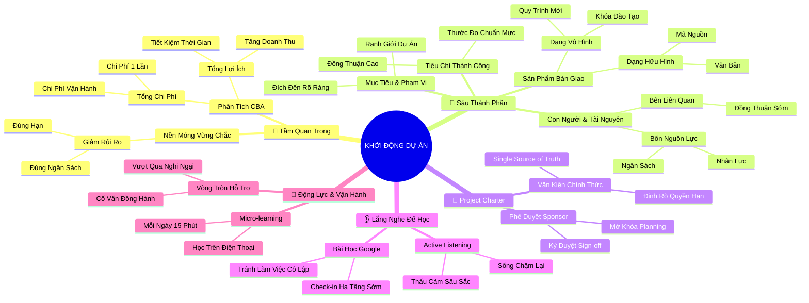

# Tóm Tắt: Học phần 1 - Những Nguyên lý Nền tảng của Khởi động Dự án (The Fundamentals of Project Initiation)

## 1. Thông điệp cốt lõi (Core Message)
> Giai đoạn Khởi động (Project Initiation) là nền móng quyết định sự sống còn của toàn bộ vòng đời dự án; một dự án chỉ có thể thành công khi mục tiêu, phạm vi, nguồn lực và kỳ vọng của các bên liên quan được đồng thuận và văn bản hóa chặt chẽ ngay từ điểm xuất phát.

---

## 2. Lược Đồ Phân Bổ Cấu Trúc Tài Liệu (Content Distribution Overview)

| Phần / Đề Mục Tài Liệu Gốc | Nội Dung Trọng Tâm | Số Luận Điểm Đại Diện |
| :--- | :--- | :---: |
| **Phần I: Giới thiệu Khóa học & Vai trò PM** | Định vị vai trò kết nối liên chức năng của Project Manager trong dự án hiện đại | 1 Luận điểm |
| **Phần II: Tầm Quan Trọng & Phân Tích Lợi Ích - Chi Phí** | Nguyên lý khởi động chuẩn xác và phương pháp Phân tích Chi phí - Lợi ích (Cost-Benefit Analysis) | 2 Luận điểm |
| **Phần III: Các Thành Phần Cốt Lõi & Project Charter** | 6 thành phần sống còn (Mục tiêu, Phạm vi, Deliverables, Tiêu chí, Stakeholders, Nguồn lực) và Bản Điều lệ | 3 Luận điểm |
| **Phần IV: Lắng Nghe để Học Hỏi - Câu Chuyện Afsheen** | Năng lực lắng nghe tích cực (Active Listening) và bài học xương máu về khởi động sai tại Google | 2 Luận điểm |
| **Phần V: Duy Trì Động Lực & Tổng Kết Nền Tảng** | Chiến lược xây dựng mạng lưới hỗ trợ học tập và ôn tập hệ thống khởi động dự án | 2 Luận điểm |
| **Tổng cộng** | **Bao quát 100% cấu trúc tài liệu gốc Học phần 1** | **10 Luận điểm** |

---

## 3. Luận điểm quan trọng theo cấu trúc tài liệu (Key Takeaways: 10 ý chuyên sâu)

### 📑 PHẦN I: GIỚI THIỆU KHÓA HỌC & VAI TRÒ PROJECT MANAGER

1. **PROJECT MANAGER LÀ TRỤ CỘT ĐIỀU PHỐI VÀ KẾT NỐI ĐA CHỨC NĂNG**
   - **Bản chất & Phân tích chuyên sâu:** 
     - Quản lý dự án không chỉ đơn thuần là theo dõi tiến độ thời gian mà là chiếc cầu nối trọng yếu giữa bài toán kinh doanh, nhu cầu khách hàng và đội ngũ kỹ thuật thực thi.
     - Người quản lý dự án xuất sắc xuất phát từ khả năng nắm bắt yêu cầu cốt lõi, thấu hiểu tiếng nói của nhiều bộ phận (Product, Engineering, UX, Operations) và chuyển hóa chúng thành kế hoạch hành động nhịp nhàng.
     - Khởi đầu đúng đắn giúp định hình lộ trình phát triển sự nghiệp chuyên nghiệp, tạo lợi thế cạnh tranh vượt trội hơn cả các văn bằng học thuật dài hạn.
   - **Phương pháp / Công cụ / Quy trình đi kèm:** Mô hình Cross-functional Coordination, Quy trình thu thập yêu cầu (Requirements Gathering Framework).
   - **Ví dụ thực tế đời thường:** Một bạn nhân viên chăm sóc khách hàng nhận thấy người dùng liên tục phàn nàn về lỗi thanh toán; bạn chủ động tổng hợp dữ liệu, kết nối với đội ngũ lập trình và bộ phận tài chính để lập nhóm xử lý dứt điểm lỗi này, từng bước trở thành PM thực chiến.

---

### 📑 PHẦN II: TẦM QUAN TRỌNG CỦA KHỞI ĐỘNG & PHÂN TÍCH CHI PHÍ - LỢI ÍCH

2. **KHỞI ĐỘNG CHUẨN XÁC LÀ BỘ LỌC NGĂN NGỪA THẢM HỌA DỰ ÁN**
   - **Bản chất & Phân tích chuyên sâu:**
     - Mọi sự đổ vỡ ở giai đoạn thực thi (cháy ngân sách, trễ hạn, xung đột nội bộ) hầu hết đều bắt nguồn từ lỗ hổng trong khâu khởi động ban đầu.
     - Giai đoạn khởi động giúp tổ chức trả lời câu hỏi cốt tử: "Dự án này có thực sự đáng làm không và làm như thế nào để thành công?".
     - Khởi động sai lệch khiến đội ngũ đánh giá thấp khối lượng công việc, ngộ nhận về định nghĩa thành công và lãng phí tài nguyên của doanh nghiệp.
   - **Phương pháp / Công cụ / Quy trình đi kèm:** Vòng đời dự án 4 giai đoạn (Initiate ➔ Plan ➔ Execute ➔ Close), Bộ câu hỏi thẩm định tính khả thi (Feasibility Inquiry).
   - **Ví dụ thực tế đời thường:** Dự án mở quán cà phê vội vã thuê mặt bằng và sửa chữa mà chưa khảo sát lưu lượng khách bộ hành và nguồn cung ứng nguyên liệu; kết quả là khai trương được một tháng thì cạn kiềm vốn do chi phí vận hành vượt xa dự tính.

3. **PHÂN TÍCH CHI PHÍ - LỢI ÍCH (COST-BENEFIT ANALYSIS) LÀ LA BÀN TÀI CHÍNH**
   - **Bản chất & Phân tích chuyên sâu:**
     - Một dự án chỉ được phê duyệt khi tổng giá trị kỳ vọng (hữu hình và vô hình) vượt trội hơn hẳn so với tổng chi phí bỏ ra.
     - Lợi ích không chỉ là doanh thu trực tiếp mà còn bao gồm thời gian tiết kiệm, tỷ lệ giữ chân khách hàng và cải thiện trải nghiệm người dùng.
     - Chi phí phải được tính toán toàn diện: chi phí phát sinh một lần (thiết bị, bản quyền), chi phí định kỳ (nhân sự, hạ tầng) và chi phí cơ hội dài hạn.
   - **Phương pháp / Công cụ / Quy trình đi kèm:** Ma trận Phân tích Chi phí - Lợi ích (CBA Matrix), Chỉ số ROI (Return on Investment), Bộ câu hỏi thẩm tra tài chính của Google.
   - **Ví dụ thực tế đời thường:** Công ty chi 50 triệu đồng mua phần mềm tự động hóa hóa đơn (chi phí một lần) và 2 triệu/tháng (vận hành); đổi lại giúp phòng kế toán tiết kiệm 40 giờ lao động mỗi tháng (tương đương 30 triệu đồng tiền lương làm thêm giờ) ➔ Lợi ích vượt trội chi phí, dự án được duyệt ngay.

---

### 📑 PHẦN III: CÁC THÀNH PHẦN CỐT LÕI & PROJECT CHARTER

4. **SÁU TRỤ CỘT SỐNG CÒN CẤU THÀNH GIAI ĐOẠN KHỞI ĐỘNG**
   - **Bản chất & Phân tích chuyên sâu:**
     - Giai đoạn khởi động không thể tiến hành mơ hồ mà phải được cố định hóa bằng 6 cấu phần: Mục tiêu (Goals), Phạm vi (Scope), Sản phẩm bàn giao (Deliverables), Tiêu chí thành công (Success Criteria), Các bên liên quan (Stakeholders), Nguồn lực (Resources).
     - Thiếu hụt bất kỳ trụ cột nào cũng tạo ra "vùng xám" dẫn đến hiểu lầm tai hại giữa người quản lý dự án và các nhà tài trợ.
     - Sáu thành phần này liên kết hữu cơ: Mục tiêu định hình phạm vi, phạm vi tạo ra deliverables, deliverables được đo lường bằng tiêu chí, và tất cả vận hành bởi con người cùng nguồn lực.
   - **Phương pháp / Công cụ / Quy trình đi kèm:** Bộ khung 6 yếu tố khởi động (6-Pillar Initiation Framework).
   - **Ví dụ thực tế đời thường:** Tổ chức một đám cưới: Mục tiêu là buổi lễ ấm cúng 200 khách; Phạm vi gồm tiệc tối và âm nhạc (không bao gồm chuyến du lịch trăng mật); Deliverables gồm thiệp mời, hoa tươi, video cưới; Tiêu chí là đúng giờ và khách hài lòng; Stakeholders là cô dâu, chú rể và hai họ; Nguồn lực là ngân sách 300 triệu đồng.

5. **PHÂN ĐỊNH SẢN PHẨM BÀN GIAO HỮU HÌNH VÀ VÔ HÌNH**
   - **Bản chất & Phân tích chuyên sâu:**
     - Sản phẩm bàn giao (Deliverables) là kết quả trực tiếp của các gói công việc nhằm hiện thực hóa mục tiêu dự án.
     - Cần phân biệt rạch ròi giữa Deliverables hữu hình (sản phẩm vật lý, tài liệu văn bản, mã nguồn phần mềm) và Deliverables vô hình (khóa đào tạo chuyển giao, quy trình cải tiến, văn hóa làm việc mới).
     - Cả hai loại đều đòi hỏi tiêu chuẩn nghiệm thu rõ ràng để tránh tình trạng bàn giao sản phẩm kỹ thuật nhưng không ai biết cách vận hành.
   - **Phương pháp / Công cụ / Quy trình đi kèm:** Phân loại Deliverables Matrix, Biên bản nghiệm thu sản phẩm bàn giao (Deliverable Acceptance Sign-off).
   - **Ví dụ thực tế đời thường:** Triển khai phần mềm bán hàng mới cho chuỗi siêu thị: Bản cài đặt phần mềm trên máy POS là sản phẩm hữu hình; chuỗi 5 buổi đào tạo thu ngân sử dụng thành thạo máy POS là sản phẩm vô hình.

6. **BẢN ĐIỀU LỆ DỰ ÁN (PROJECT CHARTER) LÀ KHẾ ƯỚC PHÁP LÝ TỐI CAO**
   - **Bản chất & Phân tích chuyên sâu:**
     - Bản điều lệ dự án là văn kiện chính thức xác nhận sự tồn tại của dự án và trao quyền hạn cho người quản lý dự án huy động nguồn lực tổ chức.
     - Project Charter đóng vai trò là "Nguồn chân lý duy nhất" (Single Source of Truth), thiết lập ranh giới bảo vệ dự án trước các đòi hỏi phát sinh vô căn cứ.
     - Dự án chỉ chính thức được kích hoạt và bước sang giai đoạn lập kế hoạch chi tiết sau khi nhận được chữ ký phê duyệt (Sign-off) từ Nhà tài trợ (Sponsor) và các bên liên quan chủ chốt.
   - **Phương pháp / Công cụ / Quy trình đi kèm:** Mẫu chuẩn Google Project Charter Template, Quy trình rà soát và ký duyệt điều lệ (Charter Walkthrough & Sign-off).
   - **Ví dụ thực tế đời thường:** Khi nhận bàn giao xây nhà, chủ nhà và nhà thầu cùng ký vào bản hợp đồng nguyên tắc ghi rõ số tầng, kinh phí tối đa, thời hạn bàn giao thô; mọi phát sinh về sau đều phải đối chiếu lại văn bản này.

---

### 📑 PHẦN IV: LẮNG NGHE ĐỂ HỌC HỎI - CÂU CHUYỆN CỦA AFSHEEN

7. **NĂNG LỰC LẮNG NGHE TÍCH CỰC (ACTIVE LISTENING) LÀ VŨ KHÍ TỐI THƯỢNG CỦA PM**
   - **Bản chất & Phân tích chuyên sâu:**
     - Quản lý dự án không phải là áp đặt ý chí mà là mở rộng không gian thấu cảm để lắng nghe sâu sắc kỳ vọng và nỗi đau của các bên liên quan.
     - Lắng nghe tích cực đòi hỏi người quản lý dự án phải chủ động "sống chậm lại", đặt câu hỏi gợi mở, quan sát bức tranh toàn cảnh và không phán xét vội vàng.
     - Rèn luyện "cơ bắp lắng nghe" giúp thu thập dữ liệu ngầm mà các bản khảo sát biểu mẫu thông thường không bao giờ chạm tới được.
   - **Phương pháp / Công cụ / Quy trình đi kèm:** Phương pháp Phỏng vấn Stakeholder thấu cảm (Empathy Interviewing), Kỹ thuật phản hồi chủ động (Active Listening & Paraphrasing).
   - **Ví dụ thực tế đời thường:** Thay vì gửi email yêu cầu điền mẫu khảo sát khô khan, PM dành 20 phút uống cà phê trực tiếp với trưởng phòng kinh doanh để lắng nghe tâm tư về những trục trặc trong quy trình nhập đơn hàng cũ.

8. **BÀI HỌC CÔ LẬP VÀ THẤT BẠI TRƯỚC GIỜ RA MẮT TẠI GOOGLE**
   - **Bản chất & Phân tích chuyên sâu:**
     - Phát triển một tính năng hoàn hảo về mặt kỹ thuật nhưng thiếu sự tham vấn của các bên chịu tác động trực tiếp sẽ dẫn tới sự đổ vỡ hoàn toàn.
     - Trường hợp nhóm dự án tại Google cận kề ngày ra mắt mới tiếp cận giám đốc hạ tầng (Afsheen) là minh chứng điển hình cho cái giá đắt của việc "làm việc trong bóng tối".
     - Đầu tư thời gian gặp gỡ và đối thoại với các bên liên quan ngay từ khâu khởi động không bao giờ là lãng phí mà là khoản bảo hiểm rẻ nhất cho thành công của dự án.
   - **Phương pháp / Công cụ / Quy trình đi kèm:** Check-in sớm các bên liên quan (Early Stakeholder Alignment Loop), Ma trận mức độ ảnh hưởng hạ tầng.
   - **Ví dụ thực tế đời thường:** Đội IT tự phát triển ứng dụng chấm công nhận diện khuôn mặt suốt 3 tháng, đến ngày áp dụng thì phòng nhân sự từ chối tiếp nhận vì chưa thỏa thuận với công đoàn về quy định bảo mật hình ảnh cá nhân.

---

### 📑 PHẦN V: DUY TRÌ ĐỘNG LỰC & TỔNG KẾT NỀN TẢNG KHỞI ĐỘNG

9. **CHIẾN LƯỢC HỌC TẬP VI MÔ VÀ XÂY DỰNG MẠNG LƯỚI ĐỒNG HÀNH**
   - **Bản chất & Phân tích chuyên sâu:**
     - Sự choáng ngợp trước kiến thức chuyên môn đồ sộ thường bắt nguồn từ tâm lý hoài nghi bản thân và thiếu phương pháp chia nhỏ mục tiêu.
     - Tận dụng học tập vi mô (Micro-learning) qua thiết bị di động trong các khoảng thời gian trống giúp tích lũy tri thức bền bỉ mà không gây kiệt sức.
     - Xây dựng mạng lưới hỗ trợ (bạn học, cố vấn, người thân) đóng vai trò như những "huấn luyện viên tinh thần", thúc đẩy hành động ngay cả khi động lực suy giảm.
   - **Phương pháp / Công cụ / Quy trình đi kèm:** Kỹ thuật Micro-learning, Mô hình Vòng tròn Hỗ trợ Đồng đẳng (Peer Support Circle).
   - **Ví dụ thực tế đời thường:** Tranh thủ 15 phút trên xe buýt nghe bài giảng về Deliverables và trao đổi thắc mắc với một người bạn học cùng khóa qua nhóm chat mỗi tối.

10. **KHỞI ĐỘNG CHU ĐÁO LÀ TẤM BẢO HIỂM RỦI RO CHO LẬP KẾ HOẠCH**
    - **Bản chất & Phân tích chuyên sâu:**
      - Giai đoạn lập kế hoạch chi tiết (Planning Phase) chỉ có thể phát huy tác dụng khi đầu vào của giai đoạn khởi động đạt độ chính xác cao.
      - Mọi mâu thuẫn về phạm vi công việc cần được giải quyết triệt để tại khâu khởi động; để lọt sang giai đoạn lập kế hoạch sẽ làm chi phí sửa chữa tăng theo cấp số nhân.
      - Thành thạo các nguyên lý khởi động tạo bàn đạp vững chắc để tự tin bước vào giai đoạn xác định mục tiêu SMART, OKRs và quản trị rủi ro ở các học phần tiếp theo.
    - **Phương pháp / Công cụ / Quy trình đi kèm:** Cổng kiểm soát chất lượng khởi động (Initiation Phase Gate Review Checklist).
    - **Ví dụ thực tế đời thường:** Trước khi vẽ sơ đồ Gantt chi tiết cho chuyến dã ngoại công ty, ban tổ chức chốt rõ ngân sách tối đa 2 triệu/người và địa điểm biển; tránh việc lên lịch trình leo núi chi tiết rồi lại bị sếp bác bỏ vì không đúng định hướng.

---

## 4. Kế hoạch hành động (Action Plan: 16 việc cụ thể)

#### Nhóm 1: Hành động ngay hôm nay (Micro-habits dưới 2 phút - 5 việc)
- [ ] **Hành động 1:** Viết ra giấy 1 mục tiêu duy nhất của công việc hiện tại dưới dạng một câu đơn giản, rõ ràng.
- [ ] **Hành động 2:** Liệt kê tên 3 bên liên quan trực tiếp nhất (khách hàng, sếp, đồng nghiệp) chịu ảnh hưởng từ công việc bạn đang làm.
- [ ] **Hành động 3:** Tự hỏi bản thân một câu kiểm tra chi phí - lợi ích: "Việc tôi sắp làm trong 1 giờ tới mang lại giá trị gì lớn hơn thời gian bỏ ra?".
- [ ] **Hành động 4:** Cài đặt ứng dụng học tập hoặc lưu trữ tài liệu quản trị dự án trên điện thoại để sẵn sàng học tập vi mô.
- [ ] **Hành động 5:** Nhắn tin cho một người bạn hoặc đồng nghiệp thông báo về cam kết hoàn thành khóa học quản trị dự án.

#### Nhóm 2: Kế hoạch rèn luyện trong tuần (Áp dụng vào công việc & đời sống - 6 việc)
- [ ] **Hành động 6:** Thực hành một buổi phỏng vấn lắng nghe tích cực kéo dài 15 phút với một stakeholder mà không ngắt lời hay phán xét.
- [ ] **Hành động 7:** Lập bảng phân tích Chi phí - Lợi ích (CBA) đơn giản cho một quyết định mua sắm hoặc kế hoạch cải tiến quy trình trong nhóm.
- [ ] **Hành động 8:** Phân loại toàn bộ các đầu việc trong tuần thành 2 nhóm: Sản phẩm bàn giao hữu hình (báo cáo, slide) và vô hình (cuộc họp gắn kết, đào tạo).
- [ ] **Hành động 9:** Phác thảo một bản tóm tắt ý tưởng dự án 1 trang (One-pager) bao gồm đủ 6 yếu tố: Goal, Scope, Deliverables, Criteria, Stakeholders, Resources.
- [ ] **Hành động 10:** Chủ động gặp người phụ trách hạ tầng/hậu cần trước khi bắt tay thực hiện một sáng kiến mới ít nhất 1 tuần.
- [ ] **Hành động 11:** Thiết lập lịch học cố định 20 phút mỗi ngày vào khung giờ ít bị làm phiền nhất.

#### Nhóm 3: Thói quen duy trì & Chuyển hóa lâu dài (Phát triển bền vững - 5 việc)
- [ ] **Hành động 12:** Luôn yêu cầu hoặc chủ động soạn thảo Bản Điều lệ Dự án (Project Charter) và xin chữ ký phê duyệt trước khi triển khai bất kỳ dự án nào.
- [ ] **Hành động 13:** Trui rèn phản xạ "Lắng nghe để học hỏi" như một năng lực lãnh đạo cốt lõi trong mọi cuộc giao tiếp chuyên nghiệp.
- [ ] **Hành động 14:** Duy trì thói quen kiểm tra tính khả thi và đo lường giá trị (ROI) định kỳ trong suốt vòng đời dự án.
- [ ] **Hành động 15:** Xây dựng mạng lưới cố vấn (Mentorship network) gồm những người có kinh nghiệm quản trị dự án thực chiến để tham vấn khi gặp vướng mắc.
- [ ] **Hành động 16:** Đóng vai trò là người huấn luyện (Coach), chia sẻ lại các nguyên lý khởi động dự án cho các đồng nghiệp mới vào nghề.

---

## 5. Câu hỏi tự ngẫm (Reflection: 22 câu hỏi sâu sắc)

#### Nhóm 1: Tự vấn Nhận thức & Hệ tư duy (Self-Awareness & Mindset: 5 câu)
1. Tôi đang nhìn nhận vai trò quản lý dự án là người giám sát đốc thúc công việc hay là người kiến tạo kết nối và tháo gỡ rào cản cho đội ngũ?
2. Trong các dự án trước đây, tôi đã dành bao nhiêu phần trăm thời gian cho khâu khởi động so với thời gian lao vào thực thi ngay lập tức?
3. Tôi có thường xuyên rơi vào cái bẫy "nghĩ rằng mình đã hiểu hết ý của sếp và khách hàng" mà không kiểm chứng lại bằng văn bản hay không?
4. Động lực sâu xa nhất thôi thúc tôi theo đuổi và hoàn thành chương trình quản trị dự án chuyên nghiệp này là gì?
5. Khi gặp phải một khái niệm quản trị mới mẻ và phức tạp, phản xạ đầu tiên của tôi là tò mò khám phá hay tự ti, né tránh?

#### Nhóm 2: Nhận diện Thói quen & Điểm mù (Habits & Blind Spots: 6 câu)
6. Tôi có xu hướng chỉ tính toán chi phí tài chính hữu hình mà bỏ quên các chi phí cơ hội, chi phí thời gian và sức khỏe tinh thần của đội ngũ không?
7. Khi lắng nghe các bên liên quan phát biểu, tôi thực sự lắng nghe để thấu cảm hay chỉ đang chuẩn bị sẵn câu trả lời để tranh biện?
8. Đã bao nhiêu lần tôi gặp phải tình huống dự án làm xong nhưng khách hàng từ chối nhận vì tiêu chí thành công không được làm rõ từ đầu?
9. Tôi có thói quen làm việc độc lập trong bóng tối và chỉ báo cáo khi sản phẩm đã gần hoàn tất như câu chuyện cảnh báo của Afsheen không?
10. Điểm mù lớn nhất của tôi khi ước tính nguồn lực dự án là gì: thường đánh giá quá cao năng lực hay đánh giá quá thấp thời gian cần thiết?
11. Tôi có dám thẳng thắn từ chối khởi động một dự án khi phân tích cho thấy chi phí vượt xa lợi ích thu được không?

#### Nhóm 3: Ứng dụng Thực tế & Giải quyết Vấn đề (Practical Application & Problem Solving: 6 câu)
12. Trong dự án tôi đang đảm nhiệm, 6 thành phần cốt lõi (Mục tiêu, Phạm vi, Deliverables, Tiêu chí, Stakeholders, Nguồn lực) đã được văn bản hóa cụ thể chưa?
13. Nếu phải thuyết phục Nhà tài trợ phê duyệt dự án ngay hôm nay, 3 luận điểm mạnh mẽ nhất trong phân tích Chi phí - Lợi ích của tôi là gì?
14. Đâu là các sản phẩm bàn giao vô hình trọng yếu trong công việc của tôi mà nếu thiếu chúng, sản phẩm hữu hình sẽ không thể vận hành hiệu quả?
15. Tôi có thể sử dụng những câu hỏi gợi mở nào để giúp các bên liên quan tự nhận diện rõ phạm vi In-scope và Out-of-scope của họ?
16. Làm thế nào để thiết lập một buổi họp rà soát Bản Điều lệ Dự án (Project Charter Walkthrough) đạt được 100% sự đồng thuận mà không biến thành cuộc tranh cãi kéo dài?
17. Khi phát hiện một bên liên quan quan trọng chưa từng được tham vấn trong giai đoạn khởi động, tôi cần có kế hoạch ứng phó khẩn cấp như thế nào?

#### Nhóm 4: Bứt phá Giới hạn & Chuyển hóa Tương lai (Breakthrough & Transformation: 5 câu)
18. Nếu coi cuộc đời và sự nghiệp của chính mình là một dự án lớn, Bản Điều lệ Cuộc đời (Personal Charter) của tôi gồm những mục tiêu và tiêu chí thành công nào?
19. Làm thế nào để tôi rèn luyện "cơ bắp lắng nghe" đạt đến trình độ của một Senior Program Manager tại các tập đoàn công nghệ hàng đầu?
20. Mạng lưới những người đồng hành và truyền cảm hứng cho tôi hiện nay đã đủ mạnh để nâng đỡ tôi vượt qua những giai đoạn áp lực nhất chưa?
21. Kỹ năng khởi động dự án chuẩn mực sẽ giúp tôi tạo ra bước nhảy vọt như thế nào về vị thế và thu nhập trong 2 đến 3 năm tới?
22. Giá trị nhân văn và phụng sự lớn nhất mà tôi muốn để lại qua các dự án mà mình dẫn dắt là gì?

---

## 6. Bản Đồ Tư Duy Trực Quan (Visual Mindmap Overview - Tinh Gọn 4-5 Tầng)

