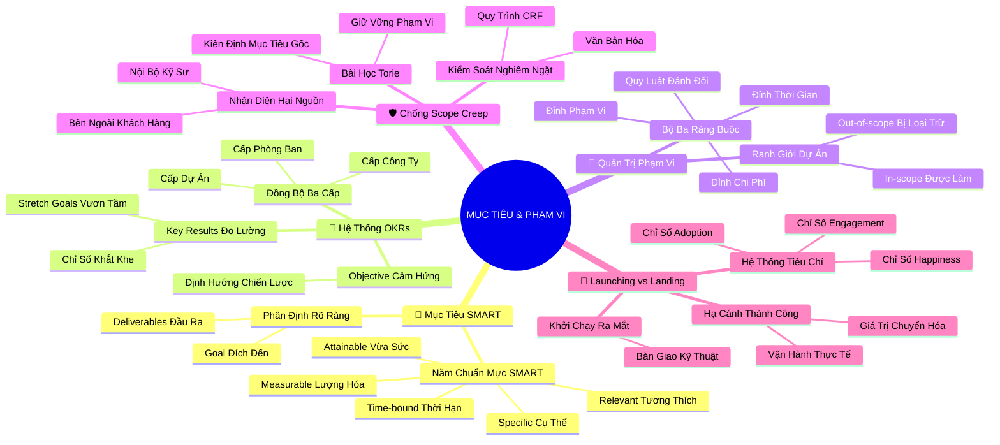

# 🧠 BẢN ĐỒ TƯ DUY TINH GỌN (4-5 TẦNG): HỌC PHẦN 2 - MỤC TIÊU, PHẠM VI VÀ TIÊU CHÍ THÀNH CÔNG

## 1. Sơ Đồ Tư Duy Trực Quan (Mermaid Mindmap Tinh Gọn)

---

## 2. Cây Phân Cấp Tri Thức Gợi Nhớ Nhanh 4-5 Tầng (Active Recall Hierarchy)

- 📌 **Mục Tiêu Dự Án & Bộ Lọc SMART**
  - 🔹 *Goal vs Deliverables:* ➔ *Mục tiêu là đích đến:* ➔ *Deliverables là phương tiện* ➔ *Tránh nhầm lẫn vai trò*
  - 🔹 *Bộ lọc SMART 5 chiều:* ➔ *Specific (Cụ thể):* ➔ *Measurable (Đo lường)* ➔ *Attainable (Vừa sức)* ➔ *Relevant & Time-bound*

- 📌 **Mục Tiêu và Kết Quả Then Chốt (Google OKRs)**
  - 🔹 *Cấu trúc Objective & KR:* ➔ *Objective định tính truyền cảm hứng:* ➔ *3-5 Key Results định lượng* ➔ *Đo lường mức độ chạm đích*
  - 🔹 *Stretch Goals & Phân tầng:* ➔ *Mục tiêu vươn tầm:* ➔ *Đạt 70-80% là xuất sắc* ➔ *Đồng bộ: Công ty ➔ Phòng ban ➔ Dự án*

- 📌 **Ranh Giới Phạm Vi & Mô Hình Bộ Ba Ràng Buộc (Triple Constraint)**
  - 🔹 *In-scope vs Out-of-scope:* ➔ *Vẽ ranh giới rạch ròi:* ➔ *Out-of-scope là khiên chắn* ➔ *Văn bản hóa công khai*
  - 🔹 *Bộ ba ràng buộc (Triple Constraint):* ➔ *Scope - Time - Cost:* ➔ *Thay đổi 1 đỉnh ắt biến dạng 2 đỉnh* ➔ *Nghệ thuật thương lượng đánh đổi*

- 📌 **Kiểm Soát Scope Creep & Bản Lĩnh Quản Trị Của Torie**
  - 🔹 *Hai nguồn Scope Creep:* ➔ *Khách hàng bên ngoài đổi ý:* ➔ *Kỹ sư nội bộ tiện tay thêm việc* ➔ *Bào mòn lợi nhuận & trễ hạn*
  - 🔹 *Chiến lược phòng ngự & Torie:* ➔ *Biểu mẫu CRF phê duyệt:* ➔ *Đối chiếu mục tiêu gốc* ➔ *Dũng cảm nói không bảo vệ đội ngũ*

- 📌 **Tiêu Chí Thành Công & Triết Lý Khởi Chạy vs Hạ Cánh (Launching vs Landing)**
  - 🔹 *Bộ ba chỉ số HEART:* ➔ *Happiness (Hài lòng):* ➔ *Adoption (Tiếp nhận không rào cản)* ➔ *Engagement (Tương tác bền lâu)*
  - 🔹 *Launching vs Landing:* ➔ *Launching là cất cánh bàn giao:* ➔ *Landing là tiếp đất an toàn* ➔ *Đo lường giá trị thực tế sau 30-90 ngày*

---

## 3. Bảng Neo Trí Nhớ Từ Khóa Vàng (Memory Anchor Cheat Sheet)

| Từ Khóa Cốt Lõi | Phần Trong Tài Liệu | Bản Chất / Vai Trò (3-5 từ) | Tín Hiệu Gợi Nhớ (Memory Trigger) |
| :--- | :--- | :--- | :--- |
| **SMART Goals** | Phần I | 5 tiêu chuẩn chuẩn hóa mục tiêu | Ngôi sao 5 cánh định hướng con tàu |
| **OKRs** | Phần II | Mục tiêu truyền cảm hứng & kết quả đo lường | Tên lửa phóng tới mặt trăng (Stretch Goal) |
| **Out-of-scope** | Phần III | Những việc kiên quyết không làm | Biển báo "Khu vực cấm vào" bảo vệ công trường |
| **Triple Constraint** | Phần III | Tam giác ràng buộc Phạm vi - Thời gian - Chi phí | Chiếc kiềng ba chân: Cưa một chân là đổ |
| **Scope Creep** | Phần IV | Sự phình to phạm vi không kiểm soát | Con trăn nuốt thêm mồi làm nứt da |
| **Adoption Metrics** | Phần V | Đo lường mức độ người dùng tiếp nhận | Cánh cửa mở toang người nườm nượp bước vào |
| **Landing a Project** | Phần V | Đạt giá trị thực tế bền vững | Máy bay hạ cánh êm ái trên đường băng |
