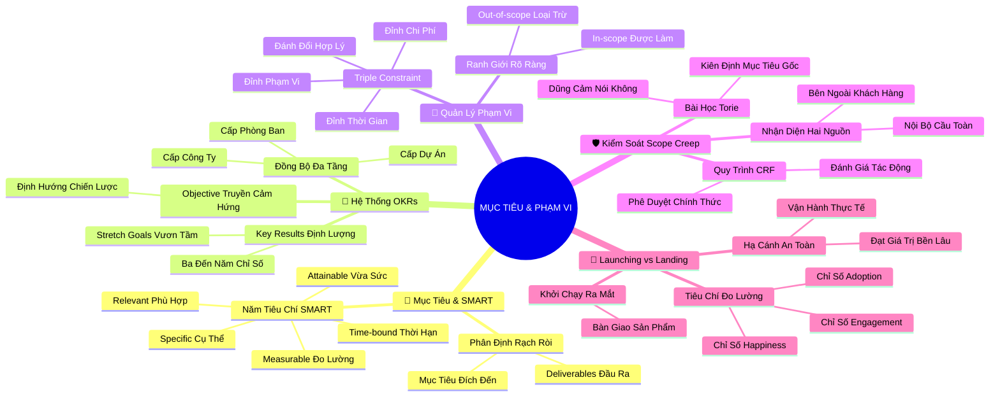

# Tóm Tắt: Học phần 2 - Xác định Mục tiêu, Phạm vi và Tiêu chí Thành công của Dự án (Project Goals, Scope, and Success Criteria)

## 1. Thông điệp cốt lõi (Core Message)
> Một dự án chỉ có thể cập bến thành công khi được định hướng bởi mục tiêu SMART và hệ thống OKRs đầy khát vọng, được bảo vệ nghiêm ngặt bằng ranh giới phạm vi trước cạm bẫy Scope Creep thông qua Bộ ba Ràng buộc (Triple Constraint), và được định nghĩa thành công vượt lên trên ngày ra mắt (Launching) để chạm tới giá trị chuyển hóa dài hạn khi hạ cánh (Landing).

---

## 2. Lược Đồ Phân Bổ Cấu Trúc Tài Liệu (Content Distribution Overview)

| Phần / Đề Mục Tài Liệu Gốc | Nội Dung Trọng Tâm | Số Luận Điểm Đại Diện |
| :--- | :--- | :---: |
| **Phần I: Mục Tiêu Dự Án & Khung SMART** | Phân định Goal vs Deliverables và phương pháp thiết lập mục tiêu SMART chuẩn xác | 2 Luận điểm |
| **Phần II: Hệ Thống OKRs Chuẩn Google** | Mô hình Objective & Key Results, mục tiêu vươn tầm (Stretch goals) và cơ chế phân tầng | 2 Luận điểm |
| **Phần III: Phạm Vi Dự Án & Bộ Ba Ràng Buộc** | Khái niệm In-scope vs Out-of-scope và nghệ thuật đánh đổi Triple Constraint (Scope - Time - Cost) | 2 Luận điểm |
| **Phần IV: Kiểm Soát Scope Creep & Câu Chuyện Torie** | Nguồn gốc phình to phạm vi (nội bộ/bên ngoài) và bài học kiên định phạm vi tại Google | 2 Luận điểm |
| **Phần V: Tiêu Chí Thành Công & Launching vs Landing** | Hệ thống chỉ số (Happiness, Adoption, Engagement) và triết lý Cất cánh vs Hạ cánh an toàn | 3 Luận điểm |
| **Tổng cộng** | **Bao quát 100% cấu trúc tài liệu gốc Học phần 2** | **11 Luận điểm** |

---

## 3. Luận điểm quan trọng theo cấu trúc tài liệu (Key Takeaways: 11 ý chuyên sâu)

### 📑 PHẦN I: MỤC TIÊU DỰ ÁN & KHUNG THIẾT LẬP SMART

1. **PHÂN BIỆT RẠCH RÒI GIỮA MỤC TIÊU DỰ ÁN VÀ KẾT QUẢ BÀN GIAO**
   - **Bản chất & Phân tích chuyên sâu:**
     - Mục tiêu dự án (Project Goal) là kết quả kỳ vọng cao nhất, định vị lý do tồn tại và giá trị cốt lõi mà dự án hướng tới (ví dụ: tăng trưởng 5% doanh thu).
     - Sản phẩm bàn giao (Deliverables) là các kết quả đầu ra cụ thể, hữu hình hoặc vô hình, được sản xuất nhằm hiện thực hóa mục tiêu đó (ví dụ: trang web thương mại điện tử, danh mục cây cảnh).
     - Nhầm lẫn giữa phương tiện (Deliverables) và đích đến (Goal) khiến đội ngũ sa đà vào việc hoàn thành đầu việc mà quên mất giá trị kinh doanh cần đạt.
   - **Phương pháp / Công cụ / Quy trình đi kèm:** Bảng ánh xạ Mục tiêu - Đầu ra (Goal-to-Deliverables Mapping), Ma trận phân rã kết quả.
   - **Ví dụ thực tế đời thường:** Trong dự án Plant Pals tại Office Green, mục tiêu là tăng 5% doanh thu hàng năm; kết quả bàn giao là ra mắt trang web đặt cây cảnh để bàn và danh mục in ấn phát tận tay các khách hàng doanh nghiệp.

2. **CHUẨN HÓA MỤC TIÊU THEO KHUNG 5 CHIỀU KÍCH SMART**
   - **Bản chất & Phân tích chuyên sâu:**
     - Một mục tiêu mơ hồ ("cải thiện dịch vụ khách hàng") là mầm mống cho sự thất bại; mục tiêu bắt buộc phải được lọc qua 5 bộ lọc SMART.
     - **S (Specific):** Nêu rõ chính xác điều cần làm, đối tượng thụ hưởng và bối cảnh cụ thể;
     - **M (Measurable):** Có chỉ số lượng hóa khách quan (con số, tỷ lệ % hoặc trạng thái Yes/No);
     - **A (Attainable):** Nằm trong tầm với thông qua việc phân bổ lộ trình hợp lý từng quý, từng tháng;
     - **R (Relevant):** Đồng điệu với chiến lược chung của tổ chức và xứng đáng với nguồn lực bỏ ra;
     - **T (Time-bound):** Gắn liền với một thời hạn chót không thể thương lượng.
   - **Phương pháp / Công cụ / Quy trình đi kèm:** Bảng kiểm SMART Goals Checklist, Thước đo đối sánh (Baseline Benchmarking).
   - **Ví dụ thực tế đời thường:** Thay vì nói "chạy bộ nhiều hơn", bạn đặt mục tiêu SMART: "Nâng cự ly chạy từ 2.5 km lên 5 km trong vòng 4 tuần, bằng cách tăng thêm 0.6 km mỗi tuần vào các buổi chạy sáng thứ Ba, Năm, Bảy".

---

### 📑 PHẦN II: HỆ THỐNG MỤC TIÊU VÀ KẾT QUẢ THEN CHỐT (OKRs)

3. **MÔ HÌNH OKRS VÀ NGHỆ THUẬT THIẾT LẬP MỤC TIÊU VƯƠN TẦM (STRETCH GOALS)**
   - **Bản chất & Phân tích chuyên sâu:**
     - OKRs (Objectives and Key Results) bóc tách mục tiêu thành hai vế: Objective (Mục tiêu truyền cảm hứng, định tính) và Key Results (3-5 kết quả then chốt định lượng khắt khe).
     - Khác với SMART chú trọng tính khả thi an toàn, OKRs tại Google khuyến khích các "mục tiêu vươn tầm" (Stretch Goals) để phá vỡ giới hạn thông thường.
     - Đạt được 70% - 80% một Key Result tham vọng được xem là thành công rực rỡ; nếu hoàn thành 100% mọi lúc chứng tỏ mục tiêu đặt ra quá dễ dãi.
   - **Phương pháp / Công cụ / Quy trình đi kèm:** Khung Google OKRs Scoring Framework (thang điểm 0.0 – 1.0), Chu kỳ thiết lập OKRs hàng quý.
   - **Ví dụ thực tế đời thường:** Objective: "Biến Plant Pals thành dịch vụ cây xanh văn phòng được yêu thích nhất"; Key Result 1: "Đạt điểm số hài lòng khách hàng CSAT từ 90% trở lên trong quý 1"; Key Result 2: "25% khách hàng hiện tại đăng ký dùng thử dịch vụ".

4. **CƠ CHẾ PHÂN TẦNG VÀ ĐỒNG BỘ HÓA OKRS ĐA CẤP ĐỘ**
   - **Bản chất & Phân tích chuyên sâu:**
     - Sức mạnh của OKRs nằm ở khả năng kết nối liền mạch từ cấp toàn công ty (Company OKRs) ➔ cấp phòng ban/đội ngũ (Department OKRs) ➔ cấp dự án cụ thể (Project OKRs).
     - Một Key Result ở cấp công ty hoàn toàn có thể trở thành Objective khởi đầu cho một dự án độc lập của người quản lý dự án.
     - Đồng bộ hóa OKRs đảm bảo mọi thành viên dù làm tác vụ nhỏ nhất cũng thấy rõ đóng góp trực tiếp của mình vào sứ mệnh tối thượng của doanh nghiệp.
   - **Phương pháp / Công cụ / Quy trình đi kèm:** Cây mục tiêu phân tầng (Cascading OKRs Tree), Bảng điều phối liên chức năng (Cross-alignment Sheet).
   - **Ví dụ thực tế đời thường:** Công ty đặt Key Result: "Thử nghiệm 3 gói dịch vụ văn phòng phân tán vào quý 2" ➔ Đội ngũ dự án tiếp nhận và chuyển hóa thành Objective dự án: "Khởi tạo thành công gói dịch vụ Plant Pals phục vụ 500 văn phòng tại Hà Nội và TP.HCM".

---

### 📑 PHẦN III: PHẠM VI DỰ ÁN & BỘ BA RÀNG BUỘC (TRIPLE CONSTRAINT)

5. **THIẾT LẬP RANH GIỚI VỮNG CHẮC: TRONG PHẠM VI (IN-SCOPE) VÀ NGOÀI PHẠM VI (OUT-OF-SCOPE)**
   - **Bản chất & Phân tích chuyên sâu:**
     - Phạm vi dự án (Project Scope) là sự thỏa thuận đồng thuận tuyệt đối về những gì ĐƯỢC LÀM và những gì BỊ LOẠI TRỪ khỏi dự án.
     - Định nghĩa Out-of-scope (những việc không làm) quan trọng tương đương, thậm chí hơn cả In-scope, vì đây là hàng rào phòng thủ bảo vệ ngân sách và thời gian.
     - Ranh giới phạm vi phải được văn bản hóa chi tiết và công khai minh bạch để dập tắt mọi kỳ vọng ngầm sai lệch từ khách hàng và ban lãnh đạo.
   - **Phương pháp / Công cụ / Quy trình đi kèm:** Tài liệu Tuyên bố Phạm vi (Scope Statement), Bảng phân định In-scope / Out-of-scope Table.
   - **Ví dụ thực tế đời thường:** Khi nhận dự án thiết kế website bán hàng: In-scope là lập trình giao diện chuẩn di động và tích hợp cổng thanh toán thẻ; Out-of-scope ghi rõ không bao gồm chụp ảnh sản phẩm và viết bài quảng cáo (khách hàng phải tự cung cấp).

6. **MÔ HÌNH BỘ BA RÀNG BUỘC (TRIPLE CONSTRAINT) VÀ NGHỆ THUẬT ĐÁNH ĐỔI**
   - **Bản chất & Phân tích chuyên sâu:**
     - Bất kỳ dự án nào cũng bị khóa chặt bởi tam giác 3 đỉnh: Phạm vi (Scope), Thời gian (Time) và Chi phí/Ngân sách (Cost). Chất lượng nằm ở tâm tam giác.
     - Nguyên lý bất biến: Không thể thay đổi một đỉnh mà không làm biến dạng hai đỉnh còn lại. Nới rộng phạm vi bắt buộc phải tăng ngân sách hoặc kéo dài tiến độ.
     - Người quản lý dự án không nói "Không thể làm được", mà nói: "Chúng ta có thể làm điều này, nhưng cái giá phải trả là kéo dài thêm 2 tháng hoặc bổ sung thêm 100 triệu đồng kinh phí".
   - **Phương pháp / Công cụ / Quy trình đi kèm:** Ma trận Đánh đổi Dự án (Project Trade-off Matrix: Fixed - Flexible - Constrained).
   - **Ví dụ thực tế đời thường:** Khách hàng muốn bổ sung tính năng chậu cây tự tưới nước (tăng Scope) nhưng ngân sách đã cố định; PM đàm phán kéo dài thời hạn bàn giao thêm 3 tuần để tìm nhà cung cấp phù hợp mà không bị phạt hợp đồng.

---

### 📑 PHẦN IV: KIỂM SOÁT SCOPE CREEP & BÀI HỌC CỦA TORIE

7. **BẢN CHẤT CỦA HIỆN TƯỢNG PHÌNH TO PHẠM VI (SCOPE CREEP) VÀ CHIẾN LƯỢC PHÒNG VỆ**
   - **Bản chất & Phân tích chuyên sâu:**
     - Scope Creep là hiện tượng các yêu cầu, chi tiết mới liên tục bị thêm vào sau khi dự án đã bắt đầu mà không có sự điều chỉnh tương ứng về ngân sách hay thời gian.
     - Scope Creep đến từ hai nguồn: Bên ngoài (khách hàng thay đổi ý định, áp lực đối thủ) và Nội bộ (thành viên tự ý làm thêm tính năng vì chủ nghĩa hoàn hảo "tiện tay làm luôn").
     - Không có sự thay đổi nào là "nhỏ"; mọi công việc phát sinh không kiểm soát đều trực tiếp bào mòn lợi nhuận và đẩy đội ngũ vào tình trạng kiệt sức.
   - **Phương pháp / Công cụ / Quy trình đi kèm:** Quy trình Quản lý Yêu cầu Thay đổi (Change Request Form - CRF), Sổ theo dõi thay đổi phạm vi (Scope Change Log).
   - **Ví dụ thực tế đời thường:** Ban đầu chỉ định sửa icon tìm kiếm trên bàn phím điện thoại, kỹ sư "tiện tay" sửa luôn icon micro, rồi sếp đề xuất hỗ trợ thêm 10 ngôn ngữ mới ➔ Dự án từ 2 tuần bị kéo lê thành 4 tháng, trễ toàn bộ kế hoạch phát hành sản phẩm.

8. **BÀI HỌC KIÊN ĐỊNH MỤC TIÊU GỐC TỪ CHƯƠNG TRÌNH KỸ NĂNG SỐ GOOGLE CỦA TORIE**
   - **Bản chất & Phân tích chuyên sâu:**
     - Trong quá trình triển khai dự án Applied Digital Skills, các bên liên quan đòi hỏi mở rộng từ học sinh phổ thông sang người học trưởng thành.
     - Đứng trước sức ép lớn, nhà quản lý chương trình (Torie) đã kiên quyết bảo vệ phạm vi ban đầu bằng cách đối chiếu lại sứ mệnh và mục tiêu gốc rễ.
     - Thay đổi đối tượng người học đồng nghĩa với việc thay đổi toàn bộ triết lý thiết kế bài giảng, phương pháp tiếp cận và nguồn lực phân bổ; kiên định nói "Không" là hành động dũng cảm cứu sống dự án.
   - **Phương pháp / Công cụ / Quy trình đi kèm:** Nguyên tắc Đối chiếu Mục tiêu Gốc (Original Objective Check), Kỹ thuật đàm phán bảo vệ phạm vi (Scope Defense Protocol).
   - **Ví dụ thực tế đời thường:** Đang xây dựng khóa học lập trình cho trẻ em 10-15 tuổi, cổ đông yêu cầu dạy luôn cả sinh viên đại học; PM kiên quyết từ chối và đề xuất mở một dự án riêng biệt vào năm sau thay vì nhồi nhét vào dự án hiện tại.

---

### 📑 PHẦN V: TIÊU CHÍ THÀNH CÔNG & NGHỆ THUẬT LAUNCHING VS LANDING

9. **THIẾT LẬP BỘ CHỈ SỐ ĐO LƯỜNG THÀNH CÔNG ĐA CHIỀU**
   - **Bản chất & Phân tích chuyên sâu:**
     - Tiêu chí thành công (Success Criteria) là các tiêu chuẩn định lượng được thống nhất trước để đánh giá xem dự án có hoàn thành thắng lợi hay không.
     - Cần kết hợp hài hòa giữa các chỉ số tài chính và bộ ba chỉ số hành vi người dùng:
       + **Chỉ số Hạnh phúc (Happiness Metrics):** Đo lường mức độ hài lòng, sự tiện lợi qua khảo sát CSAT, NPS.
       + **Chỉ số Tiếp nhận (Adoption Metrics):** Tỷ lệ người dùng mới bắt đầu sử dụng tính năng/sản phẩm mà không gặp trở ngại.
       + **Chỉ số Tương tác (Engagement Metrics):** Tần suất sử dụng định kỳ, thời gian tương tác và tỷ lệ tái tục đơn hàng.
   - **Phương pháp / Công cụ / Quy trình đi kèm:** Khung Google HEART Framework, Bảng kiểm soát đo lường thành công (Success Measurement Dashboard).
   - **Ví dụ thực tế đời thường:** Ra mắt dịch vụ Plant Pals: Adoption là 200 văn phòng đặt chậu cây đầu tiên; Happiness là 88% đánh giá cây xanh tươi tốt; Engagement là 60% văn phòng tiếp tục gia hạn hợp đồng chăm sóc cây tháng thứ hai.

10. **TRIẾT LÝ CẤT CÁNH VS HẠ CÁNH (LAUNCHING VS LANDING A PROJECT)**
    - **Bản chất & Phân tích chuyên sâu:**
      - **Khởi chạy (Launching):** Là thời điểm bàn giao sản phẩm ra thị trường, kết thúc các gói công việc kỹ thuật (máy bay rời đường băng).
      - **Hạ cánh (Landing):** Là khi sản phẩm vận hành bền bỉ trong thực tế, giải quyết đúng nỗi đau của khách hàng và đạt trọn vẹn các tiêu chí thành công (máy bay tiếp đất an toàn).
      - Rất nhiều dự án tổ chức tiệc ăn mừng rầm rộ vào ngày Launching, nhưng 1 tháng sau biến thành thảm họa vì sản phẩm lỗi hỏng, người dùng rời bỏ (tai nạn khi hạ cánh).
    - **Phương pháp / Công cụ / Quy trình đi kèm:** Kế hoạch Hạ cánh Dự án (Project Landing Plan), Đánh giá sau bàn giao (Post-launch Monitoring Period: 30 - 90 ngày).
    - **Ví dụ thực tế đời thường:** Khai trương rạp chiếu phim đúng ngày lễ là Launching thành công; duy trì hệ thống bán vé không sập mạng, máy lạnh hoạt động tốt và lấp đầy 80% rạp suốt 3 tháng tiếp theo mới là Landing an toàn.

11. **QUY TRÌNH PHÊ DUYỆT VÀ ĐỒNG THUẬN TIÊU CHÍ NGHIỆM THU TỪ STAKEHOLDERS**
    - **Bản chất & Phân tích chuyên sâu:**
      - Tiêu chí thành công không thể do PM tự đặt ra trong phòng kín mà phải có sự tham gia và ký duyệt (Sign-off) của các bên liên quan chủ chốt.
      - Mỗi tiêu chí phải chỉ định rõ: Đo cái gì? Đo bằng công cụ nào? Tần suất đo bao lâu một lần? Và ai là người chịu trách nhiệm thẩm định số liệu?
      - Văn bản hóa tiêu chí nghiệm thu triệt tiêu hoàn toàn tình trạng tranh cãi cảm tính vào giai đoạn kết thúc dự án.
    - **Phương pháp / Công cụ / Quy trình đi kèm:** Biên bản Thỏa thuận Tiêu chí Thành công (Success Criteria Alignment Agreement), Quy trình đánh giá cổng nghiệm thu (Phase Gate Sign-off).
    - **Ví dụ thực tế đời thường:** Trước khi nghiệm thu phần mềm kế toán, PM và Giám đốc Tài chính cùng ký thỏa thuận: Phần mềm được coi là thành công khi xử lý 1.000 hóa đơn không lỗi trong 5 giây và kế toán viên thao tác không quá 3 cú nhấp chuột.

---

## 4. Kế hoạch hành động (Action Plan: 18 việc cụ thể)

#### Nhóm 1: Hành động ngay hôm nay (Micro-habits dưới 2 phút - 6 việc)
- [ ] **Hành động 1:** Rà soát lại 1 mục tiêu gần nhất của bạn và bổ sung ngay một thời hạn chót (Time-bound) cụ thể theo ngày/giờ.
- [ ] **Hành động 2:** Tự hỏi bản thân: "Trong các việc tôi đang làm hôm nay, việc nào thực sự là In-scope và việc nào là Out-of-scope?".
- [ ] **Hành động 3:** Viết ra 1 con số định lượng để đo lường hiệu suất làm việc của bạn trong ngày hôm nay.
- [ ] **Hành động 4:** Đọc lại mô tả công việc hiện tại và xác định đâu là sản phẩm bàn giao (Deliverable) lớn nhất của bạn tuần này.
- [ ] **Hành động 5:** Nhận diện 1 yêu cầu phát sinh bất ngờ hôm nay và dán nhãn xem nó thuộc Scope, Time hay Cost.
- [ ] **Hành động 6:** Ghi chú lại 1 chỉ số hài lòng (Happiness) mà bạn muốn người nhận công việc của bạn cảm nhận được.

#### Nhóm 2: Kế hoạch rèn luyện trong tuần (Áp dụng vào công việc & đời sống - 7 việc)
- [ ] **Hành động 7:** Chuyển đổi toàn bộ các mục tiêu mơ hồ trong tuần thành mục tiêu SMART chuẩn mực 5 tiêu chí.
- [ ] **Hành động 8:** Thiết lập 1 bộ OKRs cá nhân cho quý hiện tại gồm: 1 Objective truyền cảm hứng và 3 Key Results đo lường được.
- [ ] **Hành động 9:** Vẽ bảng In-scope vs Out-of-scope cho dự án bạn đang phụ trách và gửi email xin xác nhận từ cấp trên.
- [ ] **Hành động 10:** Áp dụng Mô hình Bộ ba Ràng buộc (Triple Constraint) để đàm phán lại tiến độ cho một đầu việc đang bị quá tải.
- [ ] **Hành động 11:** Thiết lập một biểu mẫu Yêu cầu Thay đổi Phạm vi (Change Request Form) đơn giản cho nhóm làm việc.
- [ ] **Hành động 12:** Thực hiện bài tập phân biệt Launching và Landing cho sản phẩm/dịch vụ bạn sắp ra mắt.
- [ ] **Hành động 13:** Lập bảng theo dõi 3 nhóm chỉ số: Tiếp nhận (Adoption), Hài lòng (Happiness) và Tương tác (Engagement).

#### Nhóm 3: Thói quen duy trì & Chuyển hóa lâu dài (Phát triển bền vững - 5 việc)
- [ ] **Hành động 14:** Duy trì kỷ luật "Nói Không với Scope Creep không chính thức": mọi thay đổi phạm vi bắt buộc phải qua đánh giá đánh đổi.
- [ ] **Hành động 15:** Xây dựng văn hóa OKRs định kỳ hàng quý, liên tục thách thức bản thân với các mục tiêu vươn tầm (Stretch Goals).
- [ ] **Hành động 16:** Luôn yêu cầu ký duyệt văn bản Tiêu chí Thành công trước khi bước sang giai đoạn lập kế hoạch chi tiết.
- [ ] **Hành động 17:** Thiết lập khoảng thời gian theo dõi hậu bàn giao (Post-launch Landing Period) từ 30 đến 90 ngày cho mọi dự án.
- [ ] **Hành động 18:** Định kỳ hàng tháng đánh giá lại tính phù hợp (Relevant) của toàn bộ các dự án đang chạy với sứ mệnh cốt lõi của công ty.

---

## 5. Câu hỏi tự ngẫm (Reflection: 24 câu hỏi sâu sắc)

#### Nhóm 1: Tự vấn Nhận thức & Hệ tư duy (Self-Awareness & Mindset: 6 câu)
1. Tôi có đang nhầm lẫn giữa việc "bận rộn hoàn thành các Deliverables" với việc "thực sự chạm tới Mục tiêu chiến lược" không?
2. Khi đặt mục tiêu, tôi có thói quen chọn vùng an toàn 100% khả thi hay dám đặt ra các mục tiêu vươn tầm (Stretch Goals) để bứt phá?
3. Cảm xúc đầu tiên của tôi khi đối diện với một yêu cầu phát sinh mới là gì: cả nể nhận lời hay bình tĩnh phân tích tác động đánh đổi?
4. Tôi định nghĩa thành công của bản thân dựa trên số lượng công việc làm xong (Launch) hay giá trị thực tế mang lại cho người khác (Land)?
5. Tại sao tôi thường e ngại việc nói "Không" trước những đòi hỏi ngoài phạm vi của cấp trên hoặc khách hàng?
6. Bản thân tôi đã có một hệ thống OKRs cá nhân rõ ràng để chèo lái sự nghiệp của mình trong năm nay chưa?

#### Nhóm 2: Nhận diện Thói quen & Điểm mù (Habits & Blind Spots: 6 câu)
7. Có bao nhiêu đầu việc trong tuần qua tôi tự ý làm thêm vì nghĩ rằng "chỉ mất chút ít thời gian" nhưng rốt cuộc lại làm trễ hạn kế hoạch chính?
8. Tôi có thường xuyên quên xác định danh sách Out-of-scope khi bắt đầu một hợp đồng hoặc thỏa thuận công việc mới không?
9. Điểm mù nào trong Bộ ba Ràng buộc mà tôi hay xem nhẹ nhất: chi phí ngầm, thời gian kiểm thử hay phạm vi thực tế?
10. Khi khách hàng đòi hỏi thêm tính năng, tôi có xu hướng tự gồng gánh làm thêm giờ thay vì yêu cầu bổ sung ngân sách hoặc giãn tiến độ?
11. Tôi có thói quen đo lường sự hài lòng của khách hàng một cách hệ thống hay chỉ phán đoán cảm tính dựa trên việc không thấy ai phàn nàn?
12. Đã bao nhiêu lần dự án của tôi "cất cánh rực rỡ" nhưng sau đó rơi vào quên lãng vì không ai lên kế hoạch theo dõi khi "hạ cánh"?

#### Nhóm 3: Ứng dụng Thực tế & Giải quyết Vấn đề (Practical Application & Problem Solving: 6 câu)
13. Trong dự án hiện tại, mục tiêu của tôi đã đạt đủ 5 tiêu chuẩn SMART chưa, hay vẫn còn chỗ mơ hồ cần định lượng hóa?
14. Nếu nhà tài trợ yêu cầu rút ngắn 30% thời gian hoàn thành dự án, tôi sẽ sử dụng ma trận đánh đổi nào để đề xuất cắt giảm phạm vi tương ứng?
15. Làm thế nào để giải thích cho một kỹ sư cầu toàn hiểu rằng việc họ tự ý thêm tính năng không nằm trong phạm vi đang gây nguy hiểm cho toàn đội ngũ?
16. Bộ tiêu chí thành công trong dự án của tôi đã được lượng hóa thành con số cụ thể và được các bên liên quan ký duyệt chưa?
17. Những chỉ số nào thuộc nhóm Adoption và Engagement là quan trọng nhất để chứng minh sản phẩm của tôi đang thực sự "hạ cánh" an toàn?
18. Tôi cần chuẩn bị kịch bản giao tiếp như thế nào để từ chối một yêu cầu thay đổi phạm vi từ một bên liên quan có quyền lực cao?

#### Nhóm 4: Bứt phá Giới hạn & Chuyển hóa Tương lai (Breakthrough & Transformation: 6 câu)
19. Nếu áp dụng triết lý OKRs của Google vào mục tiêu tài chính cá nhân trong 3 năm tới, Objective lớn và 3 Key Results đột phá của tôi là gì?
20. Làm thế nào để tôi rèn luyện sự kiên định và bản lĩnh bảo vệ phạm vi như câu chuyện truyền cảm hứng của Torie tại Google?
21. Năng lực làm chủ Bộ ba Ràng buộc (Triple Constraint) sẽ thay đổi phong thái lãnh đạo và khả năng thương thuyết của tôi ra sao?
22. Nếu tôi chuyển từ tư duy "Người bàn giao dự án" sang tư duy "Người kiến tạo giá trị chuyển hóa", chất lượng cuộc sống và công việc của tôi sẽ thay đổi thế nào?
23. Làm sao để xây dựng một môi trường làm việc mà ở đó mọi người xem việc hoàn thành 80% mục tiêu vươn tầm là niềm tự hào thay vì nỗi sợ thất bại?
24. Di sản lớn nhất mà tôi muốn để lại sau khi kết thúc một dự án trọng đại là một sản phẩm kỹ thuật hay là một tập thể gắn kết và trưởng thành?

---

## 6. Bản Đồ Tư Duy Trực Quan (Visual Mindmap Overview - Tinh Gọn 4-5 Tầng)

