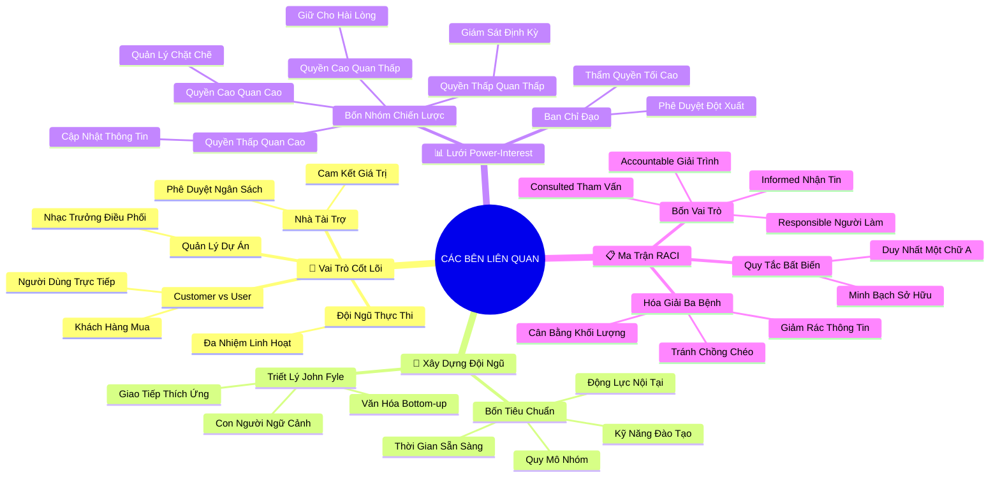

# 🧠 BẢN ĐỒ TƯ DUY TINH GỌN (4-5 TẦNG): HỌC PHẦN 3 - LÀM VIỆC HIỆU QUẢ VỚI CÁC BÊN LIÊN QUAN

## 1. Sơ Đồ Tư Duy Trực Quan (Mermaid Mindmap Tinh Gọn)

---

## 2. Cây Phân Cấp Tri Thức Gợi Nhớ Nhanh 4-5 Tầng (Active Recall Hierarchy)

- 📌 **Hệ Thống Vai Trò & Phân Biệt Khách Hàng vs Người Dùng**
  - 🔹 *Sponsor vs PM:* ➔ *Sponsor rót vốn & chịu trách nhiệm vĩ mô:* ➔ *PM điều phối vận hành vi mô* ➔ *Hợp tác chiến lược*
  - 🔹 *Customer vs User:* ➔ *Khách hàng ra quyết định mua:* ➔ *Người dùng thao tác hàng ngày* ➔ *Thỏa mãn trải nghiệm người dùng*

- 📌 **Xây Dựng Đội Ngũ & Triết Lý "Con Người & Ngữ Cảnh" (John Fyle)**
  - 🔹 *Bốn tiêu chí tuyển chọn:* ➔ *Quy mô vừa vặn:* ➔ *Kỹ năng có thể đào tạo* ➔ *Thời gian sẵn sàng & Động lực nội tại*
  - 🔹 *Triết lý Google:* ➔ *Công cụ chỉ là chiếc búa:* ➔ *Thấu hiểu con người & ngữ cảnh* ➔ *May đo giao tiếp cho hướng nội/ngoại*

- 📌 **Phân Tích Stakeholders & Lưới Quyền Hạn - Mức Độ Quan Tâm**
  - 🔹 *Tiến trình 3 bước:* ➔ *Lập danh sách vét cạn:* ➔ *Định vị Power vs Interest* ➔ *Lập kế hoạch lôi cuốn*
  - 🔹 *Bốn chiến lược 2x2:* ➔ *Quyền cao - Quan cao: Quản lý chặt:* ➔ *Quyền cao - Quan thấp: Giữ hài lòng* ➔ *Quyền thấp - Quan cao: Báo cáo tin* ➔ *Quyền thấp - Quan thấp: Giám sát*

- 📌 **Ban Chỉ Đạo (Steering Committee) & Giao Tiếp Chiến Lược**
  - 🔹 *Cơ quan tối cao:* ➔ *Ban chỉ đạo ra quyết định lớn:* ➔ *PM cung cấp dữ liệu minh bạch* ➔ *Tháo gỡ xung đột ngân sách*
  - 🔹 *Giao tiếp chiến lược:* ➔ *Đúng mức độ chi tiết:* ➔ *Tránh ngập lụt lãnh đạo* ➔ *Đảm bảo đội ngũ đủ thông tin*

- 📌 **Ma Trận RACI & Nguyên Tắc Quyền Sở Hữu Đơn Nhất**
  - 🔹 *Bốn vai trò R-A-C-I:* ➔ *Responsible (Làm việc):* ➔ *Accountable (Giải trình độc tôn)* ➔ *Consulted (Tham vấn 2 chiều)* ➔ *Informed (Nhận tin 1 chiều)*
  - 🔹 *Nguyên tắc một chữ A:* ➔ *Chỉ 1 Accountable cho mỗi dòng:* ➔ *Xóa bỏ đùn đẩy trách nhiệm* ➔ *Quét sạch chồng chéo & quá tải tin*

---

## 3. Bảng Neo Trí Nhớ Từ Khóa Vàng (Memory Anchor Cheat Sheet)

| Từ Khóa Cốt Lõi | Phần Trong Tài Liệu | Bản Chất / Vai Trò (3-5 từ) | Tín Hiệu Gợi Nhớ (Memory Trigger) |
| :--- | :--- | :--- | :--- |
| **Project Sponsor** | Phần I | Người rót vốn chịu trách nhiệm | Vị thần hộ mệnh bảo bọc kho vàng |
| **User vs Customer** | Phần I | Người thao tác vs Người trả tiền | Bố mẹ mua sữa (Customer) & Em bé uống sữa (User) |
| **People & Context** | Phần II | Chìa khóa quản trị thực chiến | Bác sĩ khám bệnh từng bệnh nhân, không kê đơn chung |
| **Power-Interest Grid** | Phần III | Ma trận phân loại 4 nhóm liên quan | La bàn 4 góc định vị gió bão chính trị công sở |
| **Manage Closely** | Phần III | Hợp tác chặt chẽ góc trên-phải | Nắm chặt tay bạn đồng hành qua hẻm núi |
| **RACI Chart** | Phần V | Ma trận phân công trách nhiệm chuẩn | Tấm bản đồ giao thông phân làn 4 làn xe chạy |
| **Single "A" Rule** | Phần V | Duy nhất một người giải trình | Một chiếc thuyền chỉ có một thuyền trưởng cầm lái |
