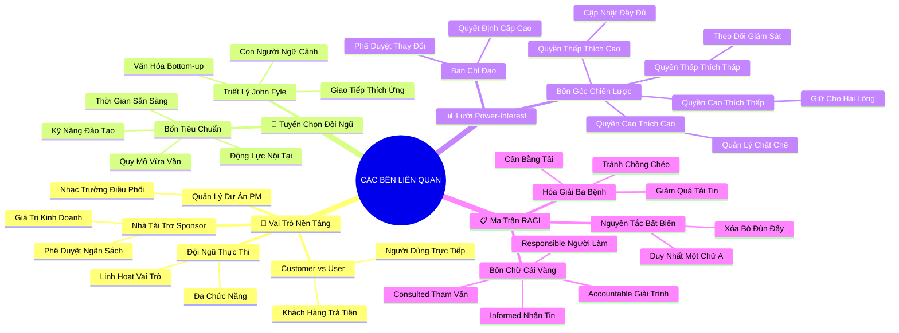

# Tóm Tắt: Học phần 3 - Làm việc Hiệu quả với các Bên Liên quan (Working Effectively with Stakeholders)

## 1. Thông điệp cốt lõi (Core Message)
> Quản trị dự án xuất sắc về bản chất là nghệ thuật quản trị con người và thấu hiểu ngữ cảnh; thành bại của dự án được định đoạt bởi khả năng thu hút sự ủng hộ của các bên liên quan thông qua Lưới Quyền hạn - Mức độ quan tâm (Power-Interest Grid) và thiết lập trách nhiệm giải trình minh bạch bằng Ma trận RACI.

---

## 2. Lược Đồ Phân Bổ Cấu Trúc Tài Liệu (Content Distribution Overview)

| Phần / Đề Mục Tài Liệu Gốc | Nội Dung Trọng Tâm | Số Luận Điểm Đại Diện |
| :--- | :--- | :---: |
| **Phần I: Vai Trò & Phân Biệt Khách Hàng vs Người Dùng** | Định vị 5 vai trò nền tảng (Sponsor, PM, Team, Customer, User) và tính linh hoạt vai trò | 2 Luận điểm |
| **Phần II: Xây Dựng Đội Ngũ & Triết Lý Con Người của John** | 4 yếu tố lựa chọn nhân sự và triết lý "Con người & Ngữ cảnh" văn hóa Google | 2 Luận điểm |
| **Phần III: Phân Tích Stakeholders & Lưới Power-Interest** | 3 bước phân tích các bên liên quan và 4 chiến lược điều phối trên ma trận 2x2 | 2 Luận điểm |
| **Phần IV: Ban Chỉ Đạo & Nghệ Thuật Giao Tiếp Chiến Lược** | Vai trò của Steering Committee và kỹ thuật điều tiết lượng thông tin không gây quá tải | 1 Luận điểm |
| **Phần V: Ma Trận RACI & Nguyên Tắc Quyền Sở Hữu Đơn Nhất** | 4 cấp độ tham gia (R-A-C-I) và nguyên tắc tối cao "Chỉ duy nhất một chữ A cho mỗi tác vụ" | 2 Luận điểm |
| **Phần VI: Xóa Bỏ Xung Đột, Chồng Chéo & Quá Tải Thông Tin** | Tháo gỡ các điểm nghẽn tổ chức và bảo vệ sự tập trung của đội ngũ | 1 Luận điểm |
| **Tổng cộng** | **Bao quát 100% cấu trúc tài liệu gốc Học phần 3** | **10 Luận điểm** |

---

## 3. Luận điểm quan trọng theo cấu trúc tài liệu (Key Takeaways: 10 ý chuyên sâu)

### 📑 PHẦN I: HỆ THỐNG VAI TRÒ DỰ ÁN & PHÂN BIỆT KHÁCH HÀNG VS NGƯỜI DÙNG

1. **NĂM VAI TRÒ NỀN TẢNG VÀ TÍNH ĐA NHIỆM TRONG TỔ CHỨC TINH GỌN**
   - **Bản chất & Phân tích chuyên sâu:**
     - Dự án vận hành dựa trên 5 vai trò hạt nhân: Nhà tài trợ (Project Sponsor - người rót vốn và chịu trách nhiệm cao nhất về giá trị kinh doanh), Quản lý dự án (Project Manager - nhạc trưởng điều phối), Đội ngũ dự án (Project Team - lực lượng thực thi), Khách hàng (Customers) và Các bên liên quan (Stakeholders).
     - Trong các doanh nghiệp vừa và nhỏ hoặc môi trường khởi nghiệp, các vai trò này thường không cố định; một thành viên có thể vừa là nhà thiết kế vừa là người tiếp thị.
     - Dù đa nhiệm hay chuyên trách, việc minh định rõ "ai đang đội chiếc mũ nào" tại từng thời điểm là điều kiện tiên quyết để tránh khoảng trống trách nhiệm.
   - **Phương pháp / Công cụ / Quy trình đi kèm:** Bảng phân định Vai trò Dự án (Project Roles Clarification Sheet), Mô hình tổ chức linh hoạt (Agile Squad Structure).
   - **Ví dụ thực tế đời thường:** Tại Office Green, Giám đốc Sản phẩm đóng vai trò Sponsor (duyệt ngân sách); PM là người lên lịch trình; còn chuyên viên thiết kế cảnh quan kiêm luôn nhiệm vụ thiết kế giao diện website đặt cây.

2. **PHÂN BIỆT RẠCH RÒI GIỮA KHÁCH HÀNG (CUSTOMERS) VÀ NGƯỜI DÙNG (USERS)**
   - **Bản chất & Phân tích chuyên sâu:**
     - **Khách hàng (Customer):** Là cá nhân hoặc tổ chức ra quyết định mua hàng, ký hợp đồng và chi trả ngân sách cho sản phẩm/dịch vụ của dự án.
     - **Người dùng (User):** Là những người trực tiếp tương tác, thụ hưởng và thao tác trên sản phẩm mỗi ngày.
     - Sai lầm kinh điển của các dự án là chỉ thỏa mãn yêu cầu của người mua (Customer) mà phớt lờ trải nghiệm thực tế của người dùng cuối (User), dẫn đến việc sản phẩm mua về nhưng bị đắp chiếu.
   - **Phương pháp / Công cụ / Quy trình đi kèm:** Phân tích Chân dung Khách hàng & Người dùng (Buyer Persona vs User Persona Mapping).
   - **Ví dụ thực tế đời thường:** Doanh nghiệp mua phần mềm chấm công: Ban giám đốc/Phòng mua sắm là Khách hàng (quan tâm chi phí và báo cáo); toàn thể nhân viên quẹt vân tay hàng sáng là Người dùng (quan tâm tốc độ nhận diện và giao diện dễ nhìn).

---

### 📑 PHẦN II: XÂY DỰNG ĐỘI NGŨ DỰ ÁN & TRIẾT LÝ CON NGƯỜI CỦA JOHN

3. **BỐN TRỤ CỘT TUYỂN CHỌN ĐỘI NGŨ TRONG MƠ (DREAM TEAM SELECTION)**
   - **Bản chất & Phân tích chuyên sâu:**
     - Quy mô nhóm phải vừa vặn: Quá đông người dẫn đến tắc nghẽn giao tiếp và tam sao thất bản; quá mỏng nhân sự dẫn đến quá tải và trễ hạn.
     - Tuyển chọn dựa trên 4 yếu tố: Kỹ năng chuyên môn (Hard skills), Kỹ năng đào tạo được (Trainability), Mức độ sẵn sàng thời gian (Availability) và Động lực nội tại (Motivation).
     - Một nhân sự chưa hoàn hảo về kỹ năng nhưng có thái độ cầu tiến và sự tỉ mỉ thường mang lại giá trị bền vững hơn một chuyên gia giỏi nhưng thiếu cam kết và không có quỹ thời gian.
   - **Phương pháp / Công cụ / Quy trình đi kèm:** Bảng đánh giá Kỹ năng & Mức độ Sẵn sàng (Skills & Capacity Matrix), Quy tắc hai chiếc bánh Pizza (Two-Pizza Team Rule).
   - **Ví dụ thực tế đời thường:** Khi chọn người xây dựng ứng dụng Plant Pals, PM chọn một lập trình viên trẻ có 100% thời gian rảnh và đam mê cây cảnh thay vì chọn chuyên gia cao cấp của công ty nhưng đang bị kẹt cứng ở 3 dự án khác.

4. **TRIẾT LÝ QUẢN TRỊ "CON NGƯỜI VÀ NGỮ CẢNH" TỪ QUẢN LÝ GOOGLE (JOHN FYLE)**
   - **Bản chất & Phân tích chuyên sâu:**
     - Các kỹ năng cứng (Agile, Extreme Programming, sơ đồ Gantt) chỉ là công cụ vô tri; chúng giống như chiếc búa và bạn không thể dùng búa để vặn ốc vít.
     - Quản trị chương trình gói gọn trong hai chữ: **Con người (People) và Ngữ cảnh (Context)**. Mấu chốt là thấu hiểu động lực, cá tính và phong cách làm việc của từng cộng sự.
     - Biết cách may đo phong cách giao tiếp: Với người hướng ngoại, thảo luận trực tiếp sôi nổi trong cuộc họp; với người hướng nội, tạo không gian phản hồi bất đồng bộ (qua văn bản/tài liệu) để họ thoải mái cất lên tiếng nói.
   - **Phương pháp / Công cụ / Quy trình đi kèm:** Kênh giao tiếp đồng bộ và bất đồng bộ (Sync vs Async Channels), Mô hình văn hóa đổi mới từ dưới lên (Bottom-up Innovation).
   - **Ví dụ thực tế đời thường:** Thay vì ép buộc một kỹ sư phần mềm hướng nội phải thuyết trình ý tưởng trước 20 người, PM gửi trước tài liệu để kỹ sư đó viết phản hồi chi tiết, nhờ đó thu hoạch được giải pháp tối ưu hệ thống vô cùng sâu sắc.

---

### 📑 PHẦN III: PHÂN TÍCH STAKEHOLDERS & LƯỚI QUYỀN HẠN - MỐI QUAN TÂM

5. **QUY TRÌNH BA BƯỚC THẨM ĐỊNH BẢN ĐỒ CÁC BÊN LIÊN QUAN**
   - **Bản chất & Phân tích chuyên sâu:**
     - Sự thất bại của dự án thường không đến từ lỗi kỹ thuật mà đến từ việc một bên liên quan có sức ảnh hưởng bất ngờ xuất hiện và phủ quyết thành quả.
     - Tiến trình 3 bước bóc tách Stakeholder: (1) Lập danh sách vét cạn tất cả các bên bị ảnh hưởng; (2) Định vị Tầm ảnh hưởng (Influence/Power) và Mức độ quan tâm (Interest); (3) Xây dựng kế hoạch thu hút và gắn kết phù hợp.
     - Phân tích sớm giúp chuyển hóa các đối tượng hoài nghi thành đồng minh chiến lược trước khi dự án bước vào giai đoạn thực thi nhạy cảm.
   - **Phương pháp / Công cụ / Quy trình đi kèm:** Bảng khảo sát Stakeholders (Stakeholder Register Template), Bảng câu hỏi xác định quyền lực và mối quan tâm.
   - **Ví dụ thực tế đời thường:** Trước khi triển khai hệ thống quản lý rác thải mới trong chung cư, ban quản trị khảo sát cư dân, công ty vệ sinh, ban quản lý tòa nhà và chính quyền phường để không bỏ sót bất kỳ ai.

6. **BỐN CHIẾN LƯỢC ĐIỀU PHỐI TRÊN MA TRẬN POWER-INTEREST GRID**
   - **Bản chất & Phân tích chuyên sâu:**
     - Ma trận 2x2 phân loại các bên liên quan thành 4 nhóm chiến lược riêng biệt:
       + **Quyền hạn Cao - Quan tâm Cao (Góc trên-phải):** Các nhân vật chủ chốt ➔ Chiến lược: **Quản lý Chặt chẽ (Manage Closely)**, hợp tác như đối tác chiến lược.
       + **Quyền hạn Cao - Quan tâm Thấp (Góc trên-trái):** Ban giám đốc, cơ quan thẩm quyền ➔ Chiến lược: **Giữ Hài Lòng (Keep Satisfied)**, tham vấn định kỳ, đáp ứng đúng kỳ vọng.
       + **Quyền hạn Thấp - Quan tâm Cao (Góc dưới-phải):** Người dùng trực tiếp, nhóm hỗ trợ ➔ Chiến lược: **Cập Nhật Thông Tin (Keep Informed)**, ghi nhận tâm tư, đối thoại thường xuyên.
       + **Quyền hạn Thấp - Quan tâm Thấp (Góc dưới-trái):** Bên thứ cấp ➔ Chiến lược: **Giám Sát (Monitor)**, chỉ gửi thông báo tổng quan khi có thay đổi lớn.
   - **Phương pháp / Công cụ / Quy trình đi kèm:** Ma trận Lưới Quyền lực - Mối quan tâm (Power-Interest Grid 2x2).
   - **Ví dụ thực tế đời thường:** Ra mắt dịch vụ Plant Pals: Giám đốc Sản phẩm ở ô Quản lý Chặt chẽ (gặp gỡ hàng tuần); Giám đốc Tài chính ở ô Giữ Hài lòng (báo cáo ngân sách hàng tháng); Nhân viên thu ngân ở ô Cập nhật Thông tin (hướng dẫn sử dụng); Đơn vị cung ứng phân bón ở ô Giám sát.

---

### 📑 PHẦN IV: BAN CHỈ ĐẠO & GIAO TIẾP CHIẾN LƯỢC

7. **CƠ CHẾ VẬN HÀNH CỦA BAN CHỈ ĐẠO (STEERING COMMITTEE) VÀ ĐIỀU TIẾT DÒNG TIN**
   - **Bản chất & Phân tích chuyên sâu:**
     - Ban chỉ đạo (Steering Committee) tập hợp những bên liên quan quyền lực cao nhất, đóng vai trò là tòa trọng tài tối cao giải quyết các tranh chấp và phê duyệt ngân sách/phạm vi vượt thẩm quyền của PM.
     - Người quản lý dự án không phải thành viên biểu quyết của ban chỉ đạo mà là cầu nối thông tin trung thực, cung cấp dữ liệu minh bạch để ban chỉ đạo ra quyết định chuẩn xác.
     - **Giao tiếp chiến lược:** Cung cấp đúng mức độ chi tiết; không làm ngập lụt lãnh đạo bằng chi tiết vụn vặt và không bỏ rơi đội ngũ trực tiếp thiếu thốn hướng dẫn cụ thể.
   - **Phương pháp / Công cụ / Quy trình đi kèm:** Báo cáo Tóm tắt Điều hành (Executive Summary Dashboard), Lịch trình Giao tiếp Phân tầng (Tiered Communication Schedule).
   - **Ví dụ thực tế đời thường:** Khi dự án vượt quá ngân sách 15% do giá cây nhập khẩu tăng đột biến, PM chuẩn bị bản báo cáo gồm 3 phương án đánh đổi kèm số liệu cụ thể để trình Ban chỉ đạo đưa ra phán quyết cuối cùng trong vòng 30 phút.

---

### 📑 PHẦN V: MA TRẬN RACI & NGUYÊN TẮC VÀNG QUYỀN SỞ HỮU

8. **BỐN VAI TRÒ HÀNH ĐỘNG TRONG MA TRẬN RACI**
   - **Bản chất & Phân tích chuyên sâu:**
     - Ma trận RACI là công cụ pháp lý mạnh mẽ nhất để xóa bỏ sự mập mờ trong phân công công việc:
       + **R (Responsible):** Người thực hiện - xắn tay áo trực tiếp làm ra sản phẩm (có thể có nhiều người).
       + **A (Accountable):** Người chịu trách nhiệm giải trình - người cuối cùng đứng mũi chịu sào đảm bảo kết quả đạt chuẩn và có quyền phủ quyết/nghiệm thu.
       + **C (Consulted):** Người được tham vấn - các chuyên gia hai chiều cung cấp ý kiến chuyên môn trước khi quyết định được ban hành.
       + **I (Informed):** Người được thông báo - những người nhận thông tin một chiều sau khi quyết định hoặc công việc đã hoàn thành.
   - **Phương pháp / Công cụ / Quy trình đi kèm:** Biểu mẫu chuẩn RACI Chart Template (Hàng là Nhiệm vụ/Deliverables, Cột là Vai trò/Chức danh).
   - **Ví dụ thực tế đời thường:** Nhiệm vụ định giá gói dịch vụ Plant Pals: Chuyên viên Phân tích Tài chính là **R** (tính toán chi phí); Trưởng phòng Tài chính là **A** (ký duyệt bảng giá); Giám đốc Sản phẩm là **C** (tham vấn độ cạnh tranh thị trường); Đội ngũ nhân viên bán hàng là **I** (nhận bảng giá để tư vấn khách).

9. **NGUYÊN TẮC BẤT BIẾN: CHỈ DUY NHẤT MỘT CHỮ "A" CHO MỖI TÁC VỤ**
   - **Bản chất & Phân tích chuyên sâu:**
     - Quy tắc vàng số 1 của RACI: Mỗi một nhiệm vụ hoặc kết quả bàn giao **CHỈ ĐƯỢC PHÉP CÓ DUY NHẤT MỘT NGƯỜI CHỊU TRÁCH NHIỆM GIẢI TRÌNH (ACCOUNTABLE)**.
     - Khi có hai chữ "A" trên cùng một dòng, trách nhiệm giải trình bị phân tán: khi thành công thì tranh công, khi xảy ra sự cố thì đùn đẩy trách nhiệm cho nhau.
     - Tuy nhiên, một người giữ chữ "A" hoàn toàn có thể kiêm luôn vai trò "R" (vừa tự làm vừa tự chịu trách nhiệm giải trình trong các nhóm nhỏ).
   - **Phương pháp / Công cụ / Quy trình đi kèm:** Kiểm toán Ma trận RACI (RACI Horizontal & Vertical Audit Rules).
   - **Ví dụ thực tế đời thường:** Bàn giao bản thiết kế website: Chỉ có duy nhất Trưởng nhóm Thiết kế giữ chữ "A" chịu trách nhiệm về tính thẩm mỹ và công năng; nếu gán cả PM và Trưởng phòng Tiếp thị cùng chữ "A" thì website sẽ bị trễ hạn vì hai bên bất đồng quan điểm thẩm mỹ.

---

### 📑 PHẦN VI: XÓA BỎ XUNG ĐỘT, CHỒNG CHÉO & QUÁ TẢI THÔNG TIN

10. **HÓA GIẢI BA CĂN BỆNH TỔ CHỨC: CHỒNG CHÉO, MẤT CÂN BẰNG VÀ GIAO TIẾP THỪA**
    - **Bản chất & Phân tích chuyên sâu:**
      - **Chồng chéo công việc (Overlap):** Nhiều người cùng tưởng mình làm chủ một việc ➔ Triệt tiêu bằng cách rà soát cột R và A trên ma trận RACI.
      - **Mất cân bằng khối lượng (Imbalance):** Một cá nhân gánh quá nhiều chữ R/A trong khi người khác chỉ nhận chữ I ➔ Phân bổ lại tài nguyên để chống kiệt sức.
      - **Quá tải thông tin (Communication Overload):** Gán chữ I tràn lan khiến hộp thư nhân viên ngập rác thông báo ➔ Chỉ thông báo cho những ai thực sự cần hành động dựa trên thông tin đó.
    - **Phương pháp / Công cụ / Quy trình đi kèm:** Quy trình Rà soát Dọc/Ngang RACI (Vertical/Horizontal RACI Analysis), Bộ lọc thông tin tối giản (Minimalist Communication Filter).
    - **Ví dụ thực tế đời thường:** Kiểm tra ma trận RACI thấy kỹ sư trưởng có mặt trong 20 nhiệm vụ với chữ R và C; PM lập tức phân bớt 8 nhiệm vụ cho các kỹ sư trung cấp, giúp kỹ sư trưởng tập trung giải quyết nút thắt kiến trúc hệ thống cốt lõi.

---

## 4. Kế hoạch hành động (Action Plan: 16 việc cụ thể)

#### Nhóm 1: Hành động ngay hôm nay (Micro-habits dưới 2 phút - 5 việc)
- [ ] **Hành động 1:** Rà soát lại 1 đầu việc bạn sắp gửi đi và xác định rõ: Ai là người chịu trách nhiệm cuối cùng (chữ A duy nhất) cho việc này?
- [ ] **Hành động 2:** Kiểm tra danh sách người nhận email (CC) của bạn và loại bỏ ngay những ai không thực sự cần biết (giảm chữ I thừa).
- [ ] **Hành động 3:** Viết ra tên 1 stakeholder có quyền lực cao nhất trong công việc hiện tại của bạn và ghi chú cách bạn giữ họ hài lòng.
- [ ] **Hành động 4:** Tự hỏi bản thân: "Người mua sản phẩm của tôi (Customer) và người trực tiếp dùng nó (User) hôm nay có mâu thuẫn nhu cầu gì không?".
- [ ] **Hành động 5:** Nhắn một tin nhắn ngắn cảm ơn hoặc cập nhật nhanh tiến độ cho một bên liên quan thuộc nhóm "Cần giữ hài lòng".

#### Nhóm 2: Kế hoạch rèn luyện trong tuần (Áp dụng vào công việc & đời sống - 6 việc)
- [ ] **Hành động 6:** Vẽ Lưới Quyền hạn - Mức độ quan tâm (Power-Interest Grid 2x2) cho toàn bộ các bên liên quan trong dự án của bạn.
- [ ] **Hành động 7:** Thiết lập Ma trận RACI hoàn chỉnh cho 5 đến 8 kết quả bàn giao trọng yếu nhất của tuần làm việc.
- [ ] **Hành động 8:** Thực hiện một buổi phỏng vấn thấu cảm 15 phút với một thành viên hướng nội trong nhóm theo hình thức 1-on-1 hoặc bằng văn bản.
- [ ] **Hành động 9:** Rà soát hàng dọc ma trận RACI để phát hiện và giảm tải cho thành viên nào đang ôm đồm quá nhiều chữ R hoặc A.
- [ ] **Hành động 10:** Xây dựng bản Báo cáo Điều hành 1 trang (Executive Dashboard) dành riêng cho Ban chỉ đạo hoặc ban giám đốc.
- [ ] **Hành động 11:** Thiết lập lịch họp định kỳ với tần suất phân tầng: hàng tuần cho nhóm cốt lõi, hàng tháng cho nhóm tư vấn.

#### Nhóm 3: Thói quen duy trì & Chuyển hóa lâu dài (Phát triển bền vững - 5 việc)
- [ ] **Hành động 12:** Khắc sâu nguyên tắc vàng "Chỉ một chữ A duy nhất" trong mọi phân công công việc từ quy mô gia đình đến doanh nghiệp.
- [ ] **Hành động 13:** Nuôi dưỡng văn hóa "Con người & Ngữ cảnh" (John Fyle): luôn điều chỉnh phương pháp quản trị thích ứng với cá tính nhân sự.
- [ ] **Hành động 14:** Định kỳ hàng quý cập nhật lại Lưới Power-Interest để nhận diện sự dịch chuyển quyền lực của các bên liên quan mới.
- [ ] **Hành động 15:** Xây dựng cơ chế tiếp nhận phản hồi hai chiều minh bạch, biến các bên liên quan khó tính thành đồng minh trung thành.
- [ ] **Hành động 16:** Rèn luyện năng lực thương thuyết và giải quyết xung đột dựa trên lợi ích chung thay vì tranh chấp quyền lực cá nhân.

---

## 5. Câu hỏi tự ngẫm (Reflection: 22 câu hỏi sâu sắc)

#### Nhóm 1: Tự vấn Nhận thức & Hệ tư duy (Self-Awareness & Mindset: 5 câu)
1. Tôi đang nhìn nhận các bên liên quan khó tính là "trở ngại cần né tránh" hay là "nguồn lực phản biện quý giá cần gắn kết"?
2. Khi một nhiệm vụ bị hỏng, tôi có xu hướng truy cứu lỗi cá nhân hay rà soát lại sự mập mờ trong phân quyền trách nhiệm giải trình?
3. Tôi có đang áp đặt cùng một phong cách làm việc cứng nhắc của mình lên tất cả các thành viên có cá tính và nền tảng khác nhau không?
4. Đâu là ranh giới giữa việc "lắng nghe thấu cảm các bên liên quan" và "đánh mất lập trường để dự án bị chi phối vô lý"?
5. Tôi có thực sự hiểu rõ ai là người nắm giữ quyền phủ quyết sinh tử (Sponsor) đối với dự án mà tôi đang theo đuổi không?

#### Nhóm 2: Nhận diện Thói quen & Điểm mù (Habits & Blind Spots: 6 câu)
6. Trong các dự án tôi từng làm, có bao nhiêu nhiệm vụ rơi vào tình trạng "cha chung không ai khóc" vì gán cho 2 người cùng chịu trách nhiệm?
7. Tôi có thói quen gửi email CC cho hàng chục người vô can chỉ để phòng ngừa rủi ro cá nhân (Cover Your Ass) hay không?
8. Tôi có đang chăm sóc quá mức những người nói to, đòi hỏi nhiều nhưng thực chất lại có quyền hạn và mức độ quan tâm thấp?
9. Điểm mù lớn nhất của tôi khi phân biệt Khách hàng và Người dùng là gì: có bao giờ tôi giao một phần mềm mà người dùng ghét cay ghét đắng?
10. Trong nhóm của tôi, có ai đang bị kiệt sức âm thầm vì gánh quá nhiều chữ R mà tôi chưa từng nhận ra qua phân tích RACI?
11. Tôi đã từng bao giờ tạo ra một cuộc họp 10 người chỉ để giải quyết một vấn đề đáng lẽ chỉ cần 2 người trao đổi chưa?

#### Nhóm 3: Ứng dụng Thực tế & Giải quyết Vấn đề (Practical Application & Problem Solving: 6 câu)
12. Nếu một bên liên quan thuộc nhóm "Quyền hạn Cao - Quan tâm Thấp" bất ngờ can thiệp đòi đổi hướng dự án, tôi sẽ xử lý thế nào?
13. Làm sao để giải thích cho hai trưởng bộ phận đang tranh giành quyền lực hiểu rằng chỉ một người duy nhất được giữ chữ A trong RACI?
14. Kế hoạch truyền thông của tôi đã được phân tầng hợp lý chưa: ai cần thông báo hàng ngày, ai cần báo cáo hàng tuần và ai chỉ cần hàng tháng?
15. Khi một nhân sự trong đội ngũ thiếu hụt kỹ năng cần thiết nhưng có thừa động lực, tôi sẽ thiết kế lộ trình kèm cặp họ ra sao để không trễ hạn?
16. Làm thế nào để tạo điều kiện cho các thành viên hướng nội đóng góp được những ý tưởng đột phá nhất trong quá trình khởi tạo dự án?
17. Khi Ban chỉ đạo (Steering Committee) đưa ra một quyết định mâu thuẫn với lợi ích của Người dùng cuối, PM cần đưa ra dữ liệu gì để thuyết phục họ?

#### Nhóm 4: Bứt phá Giới hạn & Chuyển hóa Tương lai (Breakthrough & Transformation: 5 câu)
18. Năng lực làm chủ ma trận RACI và Lưới Power-Interest sẽ nâng tầm tôi từ một người điều phối tác vụ thành một nhà lãnh đạo chiến lược ra sao?
19. Làm thế nào để tôi kiến tạo được một văn hóa đổi mới từ dưới lên (Bottom-up culture) giống như trải nghiệm của John tại Google?
20. Nếu áp dụng RACI vào các mục tiêu phát triển của gia đình và cuộc sống cá nhân, sự rõ ràng và bình an nội tại của tôi sẽ tăng lên thế nào?
21. Để trở thành một "nhạc trưởng điều phối đa chức năng" được mọi phòng ban tin tưởng tuyệt đối, tôi cần tôi luyện phẩm chất đạo đức nào?
22. Hình mẫu nhà quản lý dự án truyền cảm hứng mà tôi muốn các cộng sự nhớ đến sau 10 năm nữa là người như thế nào?

---

## 6. Bản Đồ Tư Duy Trực Quan (Visual Mindmap Overview - Tinh Gọn 4-5 Tầng)

