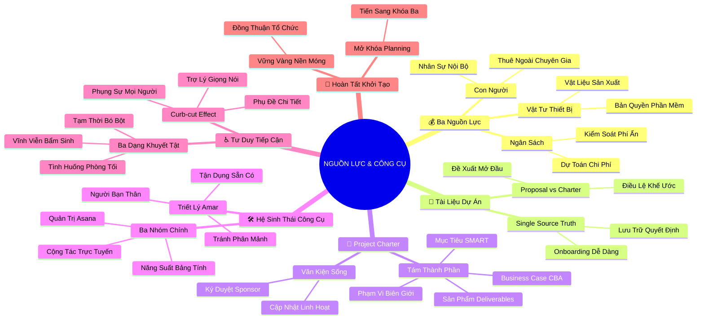

# 🧠 BẢN ĐỒ TƯ DUY TINH GỌN (4-5 TẦNG): HỌC PHẦN 4 - NGUỒN LỰC, TÀI LIỆU VÀ CÔNG CỤ QUẢN TRỊ DỰ ÁN

## 1. Sơ Đồ Tư Duy Trực Quan (Mermaid Mindmap Tinh Gọn)

---

## 2. Cây Phân Cấp Tri Thức Gợi Nhớ Nhanh 4-5 Tầng (Active Recall Hierarchy)

- 📌 **Ba Nguồn Lực Thiết Yếu (Budget, People, Materials)**
  - 🔹 *Ngân sách dự toán:* ➔ *Tính toán toàn diện:* ➔ *Lường trước chi phí ẩn* ➔ *Dự phòng rủi ro*
  - 🔹 *Con người & Vật tư:* ➔ *Nhân sự nội bộ & thuê ngoài:* ➔ *Trang thiết bị máy móc* ➔ *Tạo bệ phóng vững chắc*

- 📌 **Giá Trị Của Tài Liệu & Đề Xuất vs Bản Điều Lệ**
  - 🔹 *Single Source of Truth:* ➔ *Bảo toàn quyết định:* ➔ *Lưu chuyển thông tin hai chiều* ➔ *Hồ sơ bài học kinh nghiệm*
  - 🔹 *Proposal vs Charter:* ➔ *Proposal thuyết phục cấp vốn:* ➔ *Charter định nghĩa chi tiết* ➔ *Trao quyền pháp lý cho PM*

- 📌 **Cấu Trúc Tám Thành Phần Chuẩn Của Project Charter**
  - 🔹 *Khung sườn Google Charter:* ➔ *Mục tiêu SMART & Deliverables:* ➔ *In-scope vs Out-of-scope* ➔ *Business Case & CBA*
  - 🔹 *Tài liệu sống (Living document):* ➔ *Thích ứng biến động:* ➔ *Kiểm soát phiên bản* ➔ *Ký duyệt Sign-off từ Sponsor*

- 📌 **Hệ Sinh Thái Công Cụ & Triết Lý Amar (Google Shopping)**
  - 🔹 *Ba nhóm công cụ:* ➔ *Quản trị công việc (Asana):* ➔ *Năng suất (Spreadsheets/Docs)* ➔ *Cộng tác (Chat/Email)*
  - 🔹 *Triết lý Amar:* ➔ *Công cụ là bạn thân nhất:* ➔ *Tránh phân mảnh hệ thống* ➔ *Tận dụng tối đa công cụ sẵn có*

- 📌 **Tư Duy Tiếp Cận Hòa Nhập (Accessibility) & Holly**
  - 🔹 *Ba trạng thái khuyết tật:* ➔ *Vĩnh viễn (Khiếm thính):* ➔ *Tạm thời (Gãy tay)* ➔ *Tình huống (Môi trường ồn ào)*
  - 🔹 *Hiệu ứng Curb-cut effect:* ➔ *Thiết kế vì người khuyết tật:* ➔ *Mở khóa lợi ích toàn dân* ➔ *Closed Captioning & Voice AI*

---

## 3. Bảng Neo Trí Nhớ Từ Khóa Vàng (Memory Anchor Cheat Sheet)

| Từ Khóa Cốt Lõi | Phần Trong Tài Liệu | Bản Chất / Vai Trò (3-5 từ) | Tín Hiệu Gợi Nhớ (Memory Trigger) |
| :--- | :--- | :--- | :--- |
| **Project Resources** | Phần I | Ba trụ cột Ngân sách - Con người - Vật tư | Kiềng ba chân chống đỡ nồi cơm dự án |
| **Single Source of Truth** | Phần II | Nguồn chân lý duy nhất lưu trữ | Cuốn đại từ điển chung đặt giữa thư viện |
| **Project Proposal** | Phần II | Bản đề xuất xin phê duyệt vốn | Lá thư ngỏ mở đầu câu chuyện đầu tư |
| **Project Charter** | Phần III | Bản điều lệ pháp lý chính thức | Giấy phép khai sinh chính thức của dự án |
| **Living Document** | Phần III | Tài liệu sống cập nhật liên tục | Cái cây xanh thay lá theo từng mùa |
| **Tool Fragmentation** | Phần IV | Sự phân mảnh công cụ gây rối | Người thợ mang 10 chiếc túi đồ nghề nặng trĩu |
| **Curb-cut Effect** | Phần V | Lợi ích lan tỏa toàn xã hội | Bậc vạt vỉa hè cho xe lăn giúp ích cả xe nôi |
