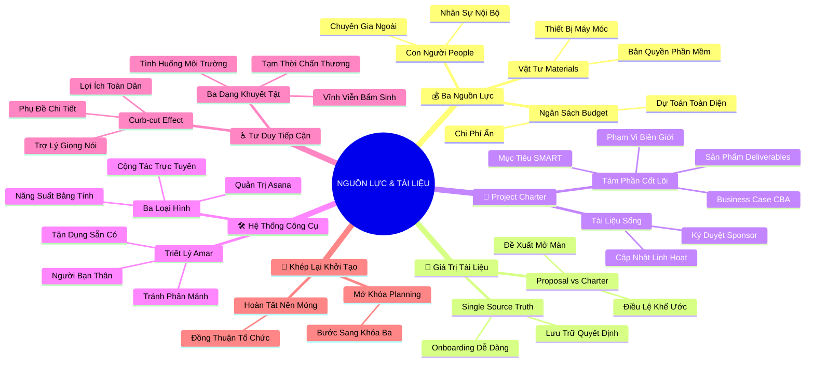

# Tóm Tắt: Học phần 4 - Vận dụng Nguồn lực, Tài liệu và Công cụ để Dự án Thành công (Utilizing Resources, Documentation, and Tools for Project Success)

## 1. Thông điệp cốt lõi (Core Message)
> Bản Điều lệ Dự án (Project Charter) đóng vai trò là văn kiện pháp lý và nguồn chân lý duy nhất (Single Source of Truth) kết tinh toàn bộ nguồn lực, phạm vi và mục tiêu; cùng với việc lựa chọn hệ sinh thái công cụ quản trị vừa vặn và tư duy tiếp cận hòa nhập (Accessibility) toàn diện, người quản lý dự án sẽ tạo dựng bệ phóng vững chắc nhất để đưa dự án bước vào giai đoạn lập kế hoạch thành công.

---

## 2. Lược Đồ Phân Bổ Cấu Trúc Tài Liệu (Content Distribution Overview)

| Phần / Đề Mục Tài Liệu Gốc | Nội Dung Trọng Tâm | Số Luận Điểm Đại Diện |
| :--- | :--- | :---: |
| **Phần I: Ba Nguồn Lực Thiết Yếu Của Dự Án** | Quản trị Ngân sách (Budget), Con người (People) và Vật tư trang thiết bị (Materials) | 2 Luận điểm |
| **Phần II: Giá Trị Tài Liệu & So Sánh Proposal vs Charter** | Sức mạnh của Single Source of Truth và sự chuyển giao từ Đề xuất sang Điều lệ dự án | 2 Luận điểm |
| **Phần III: Cấu Trúc Chuẩn Của Bản Điều Lệ Dự Án** | Phân tích 8 thành phần cốt lõi trong Google Project Charter mẫu qua case study Plant Pals | 3 Luận điểm |
| **Phần IV: Hệ Sinh Thái Công Cụ & Triết Lý Amar** | Phân loại công cụ (Asana, Bảng tính, Docs) và nguyên lý "Tránh phân mảnh công cụ" của Amar | 2 Luận điểm |
| **Phần V: Tư Duy Tiếp Cận Hòa Nhập (Accessibility) Từ Holly** | Ba trạng thái khuyết tật (vĩnh viễn, tạm thời, tình huống) và hiệu ứng Curb-cut effect | 2 Luận điểm |
| **Phần VI: Tổng Kết Toàn Diện Khóa Học Khởi Động** | Khép lại giai đoạn Initiation và chuẩn bị tâm thế bước vào giai đoạn Planning | 1 Luận điểm |
| **Tổng cộng** | **Bao quát 100% cấu trúc tài liệu gốc Học phần 4** | **12 Luận điểm** |

---

## 3. Luận điểm quan trọng theo cấu trúc tài liệu (Key Takeaways: 12 ý chuyên sâu)

### 📑 PHẦN I: BA NGUỒN LỰC THIẾT YẾU CỦA DỰ ÁN (RESOURCES)

1. **BA TRỤ CỘT NGUỒN LỰC CỐT LÕI: NGÂN SÁCH, CON NGƯỜI VÀ NGUYÊN VẬT LIỆU**
   - **Bản chất & Phân tích chuyên sâu:**
     - Nguồn lực là mọi phương tiện và tài sản mà người quản lý dự án có thẩm quyền huy động để chuyển hóa ý tưởng thành kết quả bàn giao.
     - **Ngân sách (Budget):** Không chỉ là con số ước tính chi phí mua sắm mà phải tính toán đến các chi phí ẩn (thuế, phí vận chuyển, phụ phí bản quyền, lương làm thêm giờ).
     - **Con người (People):** Gồm nhân sự nội bộ đa chức năng và các chuyên gia thuê ngoài sở hữu kỹ năng đặc thù mà nội bộ không có.
     - **Nguyên vật liệu & Thiết bị (Materials):** Toàn bộ cơ sở vật chất, phần mềm, máy móc phục vụ quá trình sản xuất.
   - **Phương pháp / Công cụ / Quy trình đi kèm:** Bảng Kế hoạch Phân bổ Nguồn lực (Resource Allocation Sheet), Dự toán Chi phí Ẩn (Hidden Costs Checklist).
   - **Ví dụ thực tế đời thường:** Dự án Plant Pals dự trù ngân sách 250.000 USD: bao gồm tiền mua 1.000 chậu cây giống và phân bón (Materials), chi phí thuê đội ngũ lập trình website và người chăm sóc cây (People), và phí đăng ký cổng thanh toán trực tuyến (Budget).

2. **CẠM BẪY ĐÁNH GIÁ THẤP NGUỒN LỰC VÀ CHIẾN LƯỢC DỰ PHÒNG TỪ SỚM**
   - **Bản chất & Phân tích chuyên sâu:**
     - Thiếu hụt nguồn lực giữa chặng đường là "bản án tử" đối với tiến độ và tinh thần làm việc của đội ngũ.
     - Dự toán ngân sách quá thấp buộc dự án phải cắt giảm chất lượng sản phẩm bàn giao hoặc vắt kiệt sức lực nhân sự; thiếu hụt nhân lực làm chậm tiến độ dây chuyền.
     - Hoạch định nguồn lực kỹ lưỡng trong giai đoạn khởi tạo là khoản đầu tư rẻ nhất để bảo vệ uy tín của PM trước nhà tài trợ.
   - **Phương pháp / Công cụ / Quy trình đi kèm:** Phân tích Dự phòng Ngân sách (Contingency Reserve), Kỹ thuật ước lượng từ dưới lên (Bottom-up Resource Estimation).
   - **Ví dụ thực tế đời thường:** Xây nhà ước tính 1 tỷ đồng nhưng quên tính chi phí xin giấy phép xây dựng và hoàn công 50 triệu đồng; kết quả là công trình bị đình chỉ thi công 2 tháng để chạy vạy bổ sung vốn.

---

### 📑 PHẦN II: GIÁ TRỊ TÀI LIỆU DỰ ÁN & SO SÁNH PROPOSAL VS CHARTER

3. **TÀI LIỆU DỰ ÁN LÀ NGUỒN CHÂN LÝ DUY NHẤT (SINGLE SOURCE OF TRUTH)**
   - **Bản chất & Phân tích chuyên sâu:**
     - Bộ não con người không thể ghi nhớ hàng trăm quyết định lớn nhỏ được đưa ra trong các cuộc họp hàng tuần.
     - Tài liệu dự án (Documentation) đóng vai trò là "Nguồn chân lý duy nhất", bảo đảm thông tin lưu chuyển hai chiều minh bạch và không bị tam sao thất bản.
     - Tài liệu hóa đóng vai trò như chiếc la bàn hỗ trợ hội nhập nhanh chóng cho các thành viên mới gia nhập, đồng thời là hồ sơ lịch sử quý giá để tổng kết bài học kinh nghiệm (Retrospective).
   - **Phương pháp / Công cụ / Quy trình đi kèm:** Hệ thống Quản trị Tri thức Dự án (Project Knowledge Repository), Sổ đăng ký Quyết định (Decision Log).
   - **Ví dụ thực tế đời thường:** Thay vì để các trưởng phòng tranh cãi "Hôm trước sếp bảo làm tính năng A hay B?", PM chỉ cần mở Decision Log trên Google Docs được lưu lại vào ngày 15/8 có chữ ký xác nhận của sếp để làm sáng tỏ ngay trong 10 giây.

4. **PHÂN BIỆT RẠCH RÒI: ĐỀ XUẤT DỰ ÁN (PROPOSAL) VS BẢN ĐIỀU LỆ DỰ ÁN (CHARTER)**
   - **Bản chất & Phân tích chuyên sâu:**
     - **Đề xuất Dự án (Project Proposal):** Xuất hiện tại thời điểm sơ khai nhất của giai đoạn khởi tạo; mục đích là thuyết phục ban lãnh đạo rằng ý tưởng này đáng giá và sinh lời để được cấp vốn (thường do lãnh đạo cấp cao hoặc phòng kinh doanh soạn thảo).
     - **Bản Điều lệ Dự án (Project Charter):** Xuất hiện ở cuối giai đoạn khởi tạo; mục đích là định nghĩa tường tận chi tiết dự án, xác lập ranh giới phạm vi, và chính thức trao thẩm quyền pháp lý cho PM huy động tài nguyên công ty.
     - Proposal mở ra cánh cửa ý tưởng, còn Charter chính thức đặt viên gạch móng pháp lý đầu tiên để khởi chạy công việc.
   - **Phương pháp / Công cụ / Quy trình đi kèm:** Bảng so sánh Vòng đời Tài liệu Khởi tạo (Initiation Document Lifecycle Chart).
   - **Ví dụ thực tế đời thường:** Proposal là bản kế hoạch kinh doanh thuyết trình với nhà đầu tư để xin rót vốn 1 tỷ đồng; Charter là bản hợp đồng cổ đông và điều lệ công ty được ký kết tại phòng công chứng ghi rõ quyền hạn của Giám đốc điều hành.

---

### 📑 PHẦN III: CẤU TRÚC CHUẨN CỦA BẢN ĐIỀU LỆ DỰ ÁN (PROJECT CHARTER)

5. **TÁM THÀNH PHẦN BẮT BUỘC TRONG MẪU PROJECT CHARTER GOOGLE**
   - **Bản chất & Phân tích chuyên sâu:**
     - Một bản điều lệ dự án chuẩn mực phải bao quát 8 thành tố then chốt: (1) Tên dự án & Tóm tắt tổng quan; (2) Mục tiêu SMART; (3) Sản phẩm bàn giao (Deliverables); (4) Trường hợp kinh doanh & Phân tích Chi phí - Lợi ích (Business Case & CBA); (5) Phạm vi In-scope & Out-of-scope; (6) Đội ngũ dự án & Nhà tài trợ (Sponsor); (7) Các bên liên quan bổ sung; (8) Tiêu chí đo lường thành công.
     - Thiếu một trong 8 thành phần này sẽ tạo ra kẽ hở pháp lý khiến dự án dễ bị tranh chấp trách nhiệm hoặc biến dạng mục tiêu về sau.
   - **Phương pháp / Công cụ / Quy trình đi kèm:** Biểu mẫu Google Project Charter Standard Template, Quy trình rà soát Walkthrough & Ký duyệt Sign-off.
   - **Ví dụ thực tế đời thường:** Trong Charter của Office Green: ghi rõ mục tiêu tăng 5% doanh thu; Deliverable là 1.000 chậu cây và trang web; Out-of-scope là không chăm sóc cây sau giao hàng; Ngân sách là 250.000 USD; Tiêu chí là đạt 95% khách hàng hài lòng sau 3 tháng.

6. **TRƯỜNG HỢP KINH DOANH (BUSINESS CASE) VÀ BẢO BỐI TÀI CHÍNH CBA**
   - **Bản chất & Phân tích chuyên sâu:**
     - Business Case là trái tim lý luận của bản điều lệ, trả lời câu hỏi: "Tại sao công ty phải đầu tư tiền vào dự án này mà không phải vào dự án khác?".
     - Business Case phải được bảo chứng bằng con số cụ thể qua Phân tích Chi phí - Lợi ích (Cost-Benefit Analysis): chứng minh lợi ích dài hạn (doanh thu tăng, giữ chân khách hàng, giảm rủi ro) vượt trội hoàn toàn so với vốn đầu tư ban đầu.
     - Lập luận kinh doanh vững chắc là vũ khí sắc bén nhất giúp PM bảo vệ dự án trước những đợt cắt giảm ngân sách của công ty mẹ.
   - **Phương pháp / Công cụ / Quy trình đi kèm:** Khung lập luận Business Case (Problem ➔ Solution ➔ Value ➔ ROI).
   - **Ví dụ thực tế đời thường:** Dự án Plant Pals đưa ra Business Case: Khách hàng hiện tại liên tục yêu cầu dịch vụ cây để bàn; dự án giúp giảm 15% tỷ lệ rời bỏ của khách hàng lớn và mang về 1,2 triệu USD doanh thu mới trong năm đầu, trong khi chi phí đầu tư chỉ là 250.000 USD.

7. **PROJECT CHARTER LÀ MỘT "TÀI LIỆU SỐNG" (LIVING DOCUMENT)**
   - **Bản chất & Phân tích chuyên sâu:**
     - Bản điều lệ không phải là văn bản hóa thạch bất di bất dịch mà là một "Tài liệu sống" (Living document).
     - Khi bối cảnh thị trường biến động, chính sách pháp lý thay đổi hoặc công nghệ mới xuất hiện, Charter hoàn toàn có thể được cập nhật và điều chỉnh.
     - Tuy nhiên, mọi sự thay đổi trong Charter đều phải trải qua quy trình đánh giá tác động nghiêm ngặt và bắt buộc phải nhận được sự tái phê duyệt (Re-approval) bằng chữ ký của Sponsor.
   - **Phương pháp / Công cụ / Quy trình đi kèm:** Quy trình Quản lý Phiên bản Tài liệu (Version Control Protocol: v1.0, v1.1), Nhật ký Sửa đổi (Revision History Log).
   - **Ví dụ thực tế đời thường:** Giữa chừng dự án, nhà cung cấp cây tăng giá nhập khẩu 20%; PM cập nhật lại phần ngân sách trong Charter lên 280.000 USD và mời Sponsor ký phê duyệt bản Charter v1.2 trước khi chi tiền.

---

### 📑 PHẦN IV: HỆ SINH THÁI CÔNG CỤ & TRIẾT LÝ QUẢN TRỊ CỦA AMAR

8. **BA NHÓM CÔNG CỤ NỀN TẢNG: QUẢN TRỊ CÔNG VIỆC, NĂNG SUẤT VÀ CỘNG TÁC**
   - **Bản chất & Phân tích chuyên sâu:**
     - **Phần mềm Quản trị Công việc (Work Management Software):** Asana, Jira, Trello ➔ Quản lý dòng chảy công việc, giao việc, phân quyền, cảnh báo nút thắt tiến độ (Bottlenecks) và trực quan hóa tiến độ.
     - **Công cụ Năng suất (Productivity Tools):** Bảng tính (Spreadsheets/Excel/Sheets), Soạn thảo văn bản (Docs/Word), Trình chiếu (Slides/PowerPoint) ➔ Linh hoạt phi thường trong tính toán ngân sách, lập ma trận RACI và báo cáo.
     - **Công cụ Cộng tác (Collaboration Tools):** Email, Slack, Teams, Google Chat ➔ Kết nối thông tin tức thì hai chiều, giảm bớt các cuộc họp không cần thiết.
   - **Phương pháp / Công cụ / Quy trình đi kèm:** Ma trận Lựa chọn Công cụ Dự án (Tool Stack Evaluation Matrix).
   - **Ví dụ thực tế đời thường:** PM sử dụng Google Docs để viết Project Charter; dùng Google Sheets để tính toán bảng ngân sách và phân tích RACI; rồi nhập toàn bộ các gói công việc vào Asana để giao việc cho các kỹ sư và thiết lập cảnh báo tiến độ tự động.

9. **TRIẾT LÝ AMAR (GOOGLE SHOPPING): TẬN DỤNG CÔNG CỤ SẴN CÓ VÀ CHỐNG PHÂN MẢNH**
   - **Bản chất & Phân tích chuyên sâu:**
     - "Công cụ là người bạn thân thiết nhất của PM" nhưng không được biến công cụ thành gánh nặng của đội ngũ.
     - Đưa vào quá nhiều công cụ mới lạ sẽ gây ra "phân mảnh hệ thống" (System Fragmentation), tiêu tốn thời gian đào tạo và khiến nhân viên chán nản vì phải cập nhật trạng thái trên quá nhiều nền tảng.
     - Nguyên tắc vàng của Amar: Luôn khảo sát và tận dụng tối đa các công cụ tiêu chuẩn hiện có trong tổ chức; chỉ đề xuất công cụ mới khi phát hiện ra một "khoảng trống kỹ thuật" (Technical Gap) thực sự mà công cụ cũ không thể đáp ứng.
   - **Phương pháp / Công cụ / Quy trình đi kèm:** Khung Đánh giá Khoảng trống Công cụ (Tool Gap Analysis Framework), Nguyên tắc Thống nhất Nguồn Chân lý (Single Tool Ecosystem).
   - **Ví dụ thực tế đời thường:** Công ty đã trả tiền mua bộ Google Workspace và toàn bộ nhân viên đang dùng thành thạo Google Sheets; PM thông minh sẽ tối ưu bảng tính để quản lý tiến độ thay vì nằng nặc đòi công ty chi thêm 10.000 USD mua phần mềm mới mà nhân viên không chịu dùng.

---

### 📑 PHẦN V: TƯ DUY TIẾP CẬN HÒA NHẬP (ACCESSIBILITY) TỪ HOLLY

10. **BA TRẠNG THÁI KHUYẾT TẬT TRONG MÔI TRƯỜNG LÀM VIỆC VÀ CUỘC SỐNG**
    - **Bản chất & Phân tích chuyên sâu:**
      - Hơn 1 tỷ người trên toàn cầu đang mang một dạng khuyết tật nào đó. Khuyết tật tự thân nó không phải là rào cản, mà chính thiết kế thiếu chu đáo của thế giới xung quanh đã tạo ra rào cản.
      - **Khuyết tật Vĩnh viễn (Permanent):** Khiếm thính, khiếm thị, hạn chế vận động thể chất bẩm sinh hoặc suốt đời.
      - **Khuyết tật Tạm thời (Temporary):** Một cánh tay bị bó bột do chấn thương thể thao, phục hồi sau phẫu thuật mắt.
      - **Khuyết tật Tình huống (Situational):** Phải làm việc trong phòng máy chủ ồn ào không nghe rõ âm thanh, hoặc vừa bế con nhỏ vừa phải trả lời email bằng một tay.
    - **Phương pháp / Công cụ / Quy trình đi kèm:** Khung Thiết kế Hòa nhập Toàn diện (Inclusive Design Framework), Mô hình Tiếp cận Đa tình huống (Situational Accessibility Model).
    - **Ví dụ thực tế đời thường:** Thiết kế ứng dụng cho phép thao tác hoàn toàn bằng một tay: vừa giúp ích cho người bị mất một cánh tay (vĩnh viễn), vừa giúp ích cho người đang bị bó bột (tạm thời), và giúp ích cho bà mẹ đang bế con trên xe buýt (tình huống).

11. **HIỆU ỨNG ĐƯỜNG DỐC VỈA HÈ (CURB-CUT EFFECT) VÀ TRÁCH NHIỆM CỦA PM**
    - **Bản chất & Phân tích chuyên sâu:**
      - Hiệu ứng Curb-cut effect: Một giải pháp ban đầu được tạo ra để phục vụ người khuyết tật rốt cuộc lại mang lại lợi ích phi thường cho toàn bộ xã hội.
      - Vết vát hạ bậc ở góc vỉa hè ban đầu dành cho người ngồi xe lăn, nhưng người đẩy xe đẩy em bé, người kéo vali du lịch và người đi xe đạp đều được hưởng lợi to lớn.
      - Tính năng Phụ đề chi tiết (Closed Captioning) ban đầu cho người khiếm thính, nay trở thành cứu cánh cho hàng triệu người xem video ở nơi công cộng hoặc người học ngoại ngữ; Trợ lý ảo giọng nói (Voice Assistant) ban đầu hỗ trợ người khiếm thị nay phục vụ hàng tỷ người lái xe an toàn.
      - PM có trách nhiệm xây dựng cơ sở hạ tầng thông tin dự án dễ tiếp cận cho mọi thành viên (hỗ trợ đọc màn hình, độ tương phản màu sắc cao, phụ đề trong các buổi họp).
    - **Phương pháp / Công cụ / Quy trình đi kèm:** Tiêu chuẩn Tiếp cận Web (WCAG Guidelines), Danh mục Kiểm tra Tính Tiếp cận Dự án (Project Accessibility Checklist).
    - **Ví dụ thực tế đời thường:** Soạn thảo slide báo cáo tiến độ dự án: PM luôn bật tính năng phụ đề tự động (Live Captions) trên Google Meet và lựa chọn màu chữ tương phản cao; việc này giúp đồng nghiệp khiếm thính tiếp thu tốt, đồng thời giúp các đồng nghiệp đang ở sân bay ồn ào vẫn theo dõi được cuộc họp.

---

### 📑 PHẦN VI: TỔNG KẾT TOÀN DIỆN KHÓA HỌC KHỞI ĐỘNG DỰ ÁN

12. **BỨC TRANH KHÉP KÍN GIAI ĐOẠN KHỞI TẠO VÀ BÀN ĐẠP SANG GIAI ĐOẠN LẬP KẾ HOẠCH**
    - **Bản chất & Phân tích chuyên sâu:**
      - Khởi tạo dự án (Initiation) không phải là chuỗi thủ tục hành chính hình thức, mà là tiến trình khoa học xác lập nền móng vững chắc: từ Thấu hiểu mục tiêu SMART/OKRs ➔ Khoanh vùng Phạm vi & Chống Scope Creep ➔ Định vị Stakeholders & Phân quyền RACI ➔ Đóng gói Project Charter & Thiết lập Công cụ.
      - Đạt được sự phê duyệt của Sponsor trên bản điều lệ dự án chính thức khép lại giai đoạn khởi tạo, mở toang cánh cửa dẫn bước sang Khóa học 3: Giai đoạn Lập kế hoạch chi tiết (Planning Phase) cùng chuyên gia Rowena.
      - Thành tựu lớn nhất của người quản lý dự án sau giai đoạn khởi động là sự đồng thuận tuyệt đối của toàn bộ tổ chức và ngọn lửa niềm tin rực cháy trong trái tim từng thành viên đội ngũ.
    - **Phương pháp / Công cụ / Quy trình đi kèm:** Cổng Thẩm định Hoàn tất Khởi tạo (Phase 1 Exit Gate Review), Lộ trình Chứng chỉ Quản trị Dự án Chuyên nghiệp Google.
    - **Ví dụ thực tế đời thường:** Hoàn thành xong bản Project Charter của Office Green được Giám đốc Sản phẩm ký duyệt, PM tự tin bàn giao hồ sơ cho nhóm lập kế hoạch để bắt đầu chia nhỏ công việc thành cấu trúc phân rã WBS và vẽ sơ đồ Gantt chi tiết.

---

## 4. Kế hoạch hành động (Action Plan: 18 việc cụ thể)

#### Nhóm 1: Hành động ngay hôm nay (Micro-habits dưới 2 phút - 6 việc)
- [ ] **Hành động 1:** Mở 1 tài liệu công việc hiện tại và định dạng lại màu chữ/kích thước để đảm bảo độ tương phản cao, dễ đọc cho mọi người.
- [ ] **Hành động 2:** Tự hỏi bản thân: "Công cụ tôi đang mở có đang đóng vai trò là Nguồn chân lý duy nhất (Single Source of Truth) hay chỉ là nơi lưu trữ cá nhân?".
- [ ] **Hành động 3:** Ghi chú lại 1 chi phí ẩn có thể phát sinh trong tuần này mà bạn chưa từng đưa vào dự toán.
- [ ] **Hành động 4:** Bật tính năng phụ đề chi tiết (Closed Captions) trong buổi họp trực tuyến tiếp theo của bạn.
- [ ] **Hành động 5:** Sắp xếp lại danh sách nhiệm vụ trong ngày trên bảng tính theo thứ tự ưu tiên hạn chót (Deadline).
- [ ] **Hành động 6:** Gửi một tin nhắn ngắn xác nhận lại một quyết định quan trọng vừa được thống nhất qua điện thoại để lưu vết bằng văn bản.

#### Nhóm 2: Kế hoạch rèn luyện trong tuần (Áp dụng vào công việc & đời sống - 7 việc)
- [ ] **Hành động 7:** Soạn thảo một bản Điều lệ Dự án (Project Charter) hoàn chỉnh 8 thành phần cho một dự án sắp tới dựa trên mẫu chuẩn Google.
- [ ] **Hành động 8:** Tổ chức một buổi họp rà soát (Walkthrough) bản Charter với Sponsor và ghi nhận chữ ký phê duyệt chính thức.
- [ ] **Hành động 9:** Tiến hành rà soát bộ công cụ (Tool Audit) trong nhóm theo lời khuyên của Amar: loại bỏ 1 công cụ thừa thãi gây phân mảnh.
- [ ] **Hành động 10:** Tận dụng tính năng lọc, phân loại và tô màu có điều kiện trên bảng tính Google Sheets để trực quan hóa tiến độ công việc.
- [ ] **Hành động 11:** Thiết lập một Decision Log (Sổ ghi nhận quyết định) trên Google Docs dùng chung cho toàn bộ thành viên trong nhóm.
- [ ] **Hành động 12:** Đánh giá tính tiếp cận (Accessibility Review) cho tài liệu hoặc sản phẩm của bạn theo 3 trạng thái khuyết tật của Holly.
- [ ] **Hành động 13:** Lập bảng so sánh Đề xuất Dự án (Proposal) và Bản Điều lệ (Charter) để đào tạo lại cho nhân viên mới vào nghề.

#### Nhóm 3: Thói quen duy trì & Chuyển hóa lâu dài (Phát triển bền vững - 5 việc)
- [ ] **Hành động 14:** Luôn coi Project Charter là "Tài liệu sống", định kỳ xem xét và cập nhật phiên bản khi có biến động chiến lược.
- [ ] **Hành động 15:** Thấm nhuần triết lý thiết kế hòa nhập (Inclusive Design) vào mọi quy trình làm việc để khai mở hiệu ứng Curb-cut effect.
- [ ] **Hành động 16:** Duy trì nguyên tắc "Không bao giờ khởi công khi chưa có chữ ký duyệt Charter": xây dựng văn hóa làm việc chuẩn mực, chuyên nghiệp.
- [ ] **Hành động 17:** Không ngừng nâng cao năng lực làm chủ các công cụ quản lý dự án hiện đại (Asana, Jira, Spreadsheets) để tối ưu hóa năng suất.
- [ ] **Hành động 18:** Đóng gói toàn bộ hồ sơ năng lực dự án khởi tạo (Project Initiation Portfolio) làm tài sản tri thức cá nhân suốt sự nghiệp.

---

## 5. Câu hỏi tự ngẫm (Reflection: 24 câu hỏi sâu sắc)

#### Nhóm 1: Tự vấn Nhận thức & Hệ tư duy (Self-Awareness & Mindset: 6 câu)
1. Tôi có đang xem công tác viết tài liệu dự án là "thủ tục hành chính phiền toái" hay là "nguồn chân lý bảo vệ sự thành công của đội ngũ"?
2. Bản thân tôi có thói quen thích chạy theo những công cụ mới hào nhoáng hay thực sự tập trung vào giá trị giải quyết bài toán của Amar?
3. Khi nghĩ về người khuyết tật, tôi nhìn thấy sự thiếu hụt của cá nhân họ hay nhận ra sự thiếu hoàn thiện trong thiết kế của môi trường xung quanh?
4. Đâu là chi phí ẩn lớn nhất mà tôi hay bỏ quên khi lập dự toán: thời gian sửa lỗi, chi phí đào tạo hay sự kiệt sức của nhân sự?
5. Tôi có đủ bản lĩnh để từ chối bắt tay vào lập kế hoạch chi tiết khi Sponsor chưa chính thức ký duyệt Bản Điều lệ Dự án không?
6. Thành tựu lớn nhất mà tôi tự hào đã đạt được sau khi đi hết Khóa học 2 về Khởi động Dự án là gì?

#### Nhóm 2: Nhận diện Thói quen & Điểm mù (Habits & Blind Spots: 6 câu)
7. Đã bao nhiêu lần các quyết định quan trọng trong nhóm của tôi bị lãng quên hoặc tranh cãi lại chỉ vì không được văn bản hóa trong Decision Log?
8. Nhóm của tôi hiện đang sử dụng bao nhiêu ứng dụng nhắn tin và quản lý công việc: chúng có đang làm phân mảnh thông tin nghiêm trọng không?
9. Tôi có thường xuyên để một bản Project Charter nằm yên trong ngăn kéo sau khi ký xong thay vì liên tục cập nhật như một "Tài liệu sống"?
10. Trong các sản phẩm hoặc tài liệu tôi từng tạo ra, có bao nhiêu phần trăm người mang khuyết tật tạm thời hoặc tình huống có thể tiếp cận trơn tru?
11. Điểm mù nào khiến dự toán ngân sách của tôi hay bị vượt trần: do không tính thuế, phụ phí phát sinh hay biến động giá cả thị trường?
12. Tôi có thói quen giải thích công việc bằng miệng nhiều hơn hay dẫn dắt đội ngũ dựa trên tài liệu chuẩn mực được chia sẻ chung?

#### Nhóm 3: Ứng dụng Thực tế & Giải quyết Vấn đề (Practical Application & Problem Solving: 6 câu)
13. Làm thế nào để tổ chức một buổi Walkthrough bản Charter với Sponsor một cách thuyết phục nhất trong vòng 20 phút?
14. Nếu công ty không có kinh phí mua Asana, tôi sẽ cấu hình một bảng tính Google Sheets như thế nào để đảm bảo đủ tính năng phân công, lọc và cảnh báo hạn chót?
15. Khi một thành viên trong nhóm gặp phải khuyết tật tạm thời (ví dụ: gãy tay), tôi sẽ điều chỉnh quy trình làm việc và công cụ cho họ ra sao?
16. Làm sao để chứng minh với ban giám đốc rằng việc đầu tư cho tính năng tiếp cận (Accessibility) sẽ tạo ra hiệu ứng Curb-cut mang lại doanh thu đột phá?
17. Nếu một bên liên quan đòi hỏi thay đổi lớn về ngân sách giữa chừng, tôi sẽ thực hiện quy trình cập nhật và tái phê duyệt Charter như thế nào?
18. Đâu là 3 chỉ số quan trọng nhất cần đưa vào bảng Dashboard để Ban chỉ đạo nắm bắt tình trạng dự án chỉ sau 30 giây nhìn lướt qua?

#### Nhóm 4: Bứt phá Giới hạn & Chuyển hóa Tương lai (Breakthrough & Transformation: 6 câu)
19. Năng lực làm chủ nghệ thuật soạn thảo Project Charter sẽ giúp tôi khẳng định vị thế một nhà quản trị chuyên nghiệp chuẩn quốc tế như thế nào?
20. Làm sao để tôi rèn luyện được phong thái điềm tĩnh, tự tin và thấu suốt của một Senior Engineering Program Manager như Amar tại Google?
21. Nếu tôi lồng ghép triết lý tiếp cận hòa nhập của Holly vào mọi khía cạnh cuộc sống, tầm nhìn nhân văn và sự thấu cảm của tôi sẽ mở rộng ra sao?
22. Khóa học Khởi động Dự án này đã làm thay đổi hoàn toàn cách tôi nhìn nhận về sự khởi đầu của một dự án kinh doanh hay một kế hoạch cuộc đời như thế nào?
23. Làm thế nào để tôi truyền tải ngọn lửa nhiệt huyết và tinh thần phụng sự này cho các đồng nghiệp xung quanh cùng tiến bộ?
24. Tôi đã sẵn sàng mang toàn bộ hành trang vững chắc này để bước sang Khóa học 3: Giai đoạn Lập Kế Hoạch Dự Án Chuyên Nghiệp chưa?

---

## 6. Bản Đồ Tư Duy Trực Quan (Visual Mindmap Overview - Tinh Gọn 4-5 Tầng)

