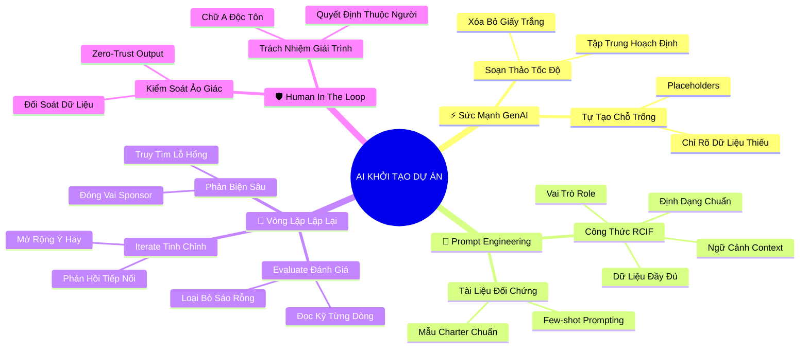

# 🧠 BẢN ĐỒ TƯ DUY TINH GỌN (4-5 TẦNG): CHUYÊN ĐỀ ĐẶC BIỆT - TRÍ TUỆ NHÂN TẠO TRONG KHỞI TẠO DỰ ÁN

## 1. Sơ Đồ Tư Duy Trực Quan (Mermaid Mindmap Tinh Gọn)

---

## 2. Cây Phân Cấp Tri Thức Gợi Nhớ Nhanh 4-5 Tầng (Active Recall Hierarchy)

- 📌 **Ứng Dụng GenAI Soạn Thảo Project Charter**
  - 🔹 *Đòn bẩy tốc độ:* ➔ *Xóa bỏ trang giấy trắng:* ➔ *Tổng hợp dữ liệu phân mảnh* ➔ *Dự thảo hoàn chỉnh trong 30 giây*
  - 🔹 *Placeholders tự động:* ➔ *Chèn phần giữ chỗ:* ➔ *Nhận diện lỗ hổng thông tin* ➔ *Định hướng câu hỏi phỏng vấn tiếp theo*

- 📌 **Kỹ Thuật Prompt Engineering Đỉnh Cao Cho PM**
  - 🔹 *Công thức RCIF:* ➔ *Role (Vai trò PM cấp cao):* ➔ *Context (Bối cảnh dự án)* ➔ *Input Data (Dữ liệu nền)* ➔ *Format & Constraints*
  - 🔹 *Few-shot Prompting:* ➔ *Tài liệu đối chứng (References):* ➔ *Cung cấp Charter mẫu* ➔ *Đồng bộ văn phong chuyên nghiệp*

- 📌 **Vòng Lặp Phản Hồi Tinh Chỉnh (Evaluate & Iterate)**
  - 🔹 *Evaluate (Đánh giá khắt khe):* ➔ *Đọc kỹ từng câu chữ:* ➔ *Nhận diện điểm yếu* ➔ *Không chấp nhận mù quáng*
  - 🔹 *Iterate & Phản biện:* ➔ *Gửi prompt tinh chỉnh tiếp nối:* ➔ *Yêu cầu AI đóng vai đối tác phản biện* ➔ *Tìm kiếm rủi ro ngầm*

- 📌 **Nguyên Tắc "Human-in-the-Loop" & Trách Nhiệm Đạo Đức**
  - 🔹 *Phòng chống ảo giác:* ➔ *Cảnh giác văn phong mượt mà:* ➔ *Đối soát dữ liệu thực tế (Fact-check)* ➔ *Triệt tiêu số liệu bịa đặt*
  - 🔹 *Trách nhiệm giải trình:* ➔ *AI không có tư cách pháp lý:* ➔ *Chữ A thuộc về PM* ➔ *Giữ vững đạo đức và bảo mật dữ liệu*

---

## 3. Bảng Neo Trí Nhớ Từ Khóa Vàng (Memory Anchor Cheat Sheet)

| Từ Khóa Cốt Lõi | Phần Trong Tài Liệu | Bản Chất / Vai Trò (3-5 từ) | Tín Hiệu Gợi Nhớ (Memory Trigger) |
| :--- | :--- | :--- | :--- |
| **GenAI / Gemini** | Phần I | Trợ lý soạn thảo siêu tốc | Chiếc máy đánh chữ ma thuật tự gõ theo ý nghĩ |
| **Placeholders** | Phần I | Phần giữ chỗ thông tin thiếu | Tấm biển "Chỗ này dành cho bạn" trên ghế trống |
| **RCIF Formula** | Phần II | 4 thành tố tạo prompt chuẩn | Khẩu lệnh huấn luyện chú cảnh khuyển tinh nhuệ |
| **Few-shot Prompting** | Phần II | Dạy AI qua ví dụ đối chứng | Cho họa sĩ xem tranh mẫu trước khi vẽ |
| **Evaluate & Iterate** | Phần III | Vòng lặp đánh giá và sửa đổi | Người thợ gốm liên tục nắn vuốt bình trên bàn xoay |
| **AI Hallucination** | Phần IV | Ảo giác tạo số liệu sai lệch | Ảo ảnh ốc đảo nước mát giữa sa mạc khô cằn |
| **Human-in-the-Loop** | Phần IV | Con người giữ quyền phán quyết | Người phi công nắm cần lái, không phó mặc lái tự động |
