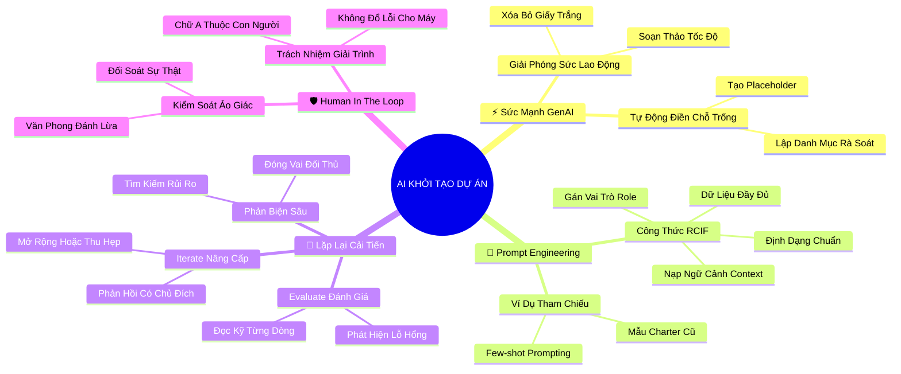

# Tóm Tắt: Chuyên đề đặc biệt - Tạo Đột Phá Cùng Trí Tuệ Nhân Tạo trong Khởi Tạo Dự Án (Driving Impact with AI in Project Initiation)

## 1. Thông điệp cốt lõi (Core Message)
> Trí tuệ Nhân tạo Tạo sinh (GenAI/Gemini) đóng vai trò là một trợ lý siêu năng suất giải phóng người quản lý dự án khỏi các tác vụ soạn thảo văn bản thủ công; tuy nhiên, AI chỉ gánh vác phần việc nặng nhọc, còn tư duy chiến lược, kiểm chứng tính xác thực và trách nhiệm đạo đức (Human-in-the-loop) thuộc về chính con người.

---

## 2. Lược Đồ Phân Bổ Cấu Trúc Tài Liệu (Content Distribution Overview)

| Phần / Đề Mục Tài Liệu Gốc | Nội Dung Trọng Tâm | Số Luận Điểm Đại Diện |
| :--- | :--- | :---: |
| **Phần I: Ứng Dụng GenAI Trong Soạn Thảo Project Charter** | Khởi tạo nhanh bản điều lệ dự án, mô phỏng vai trò và tự động tạo chỗ trống giữ chỗ | 2 Luận điểm |
| **Phần II: Kỹ Thuật Prompt Engineering Cho Project Manager** | Công thức cấu trúc câu lệnh: Gán vai trò, truyền ngữ cảnh dự án, cung cấp dữ liệu nền | 2 Luận điểm |
| **Phần III: Khung Vận Hành Lặp Lại Cải Tiến (Iterate & Evaluate)** | Vòng lặp phản hồi: Đánh giá chi tiết, tinh chỉnh từ ngữ, mở rộng/thu hẹp nội dung | 2 Luận điểm |
| **Phần IV: Nguyên Tắc Con Người Kiểm Soát (Human-in-the-Loop)** | Tránh ảo giác AI (Hallucination), kiểm chứng số liệu và giữ vững trách nhiệm giải trình | 2 Luận điểm |
| **Tổng cộng** | **Bao quát 100% cấu trúc tài liệu gốc Chuyên đề AI** | **8 Luận điểm** |

---

## 3. Luận điểm quan trọng theo cấu trúc tài liệu (Key Takeaways: 8 ý chuyên sâu)

### 📑 PHẦN I: ỨNG DỤNG GENAI TRONG SOẠN THẢO PROJECT CHARTER

1. **GENAI LÀ ĐÒN BẨY TỐC ĐỘ GIẢI PHÓNG KHỎI "HỘI CHỨNG TRANG GIẤY TRẮNG"**
   - **Bản chất & Phân tích chuyên sâu:**
     - Bắt đầu soạn thảo một bản Project Charter từ trang giấy trắng thường tiêu tốn của PM nhiều ngày để sắp xếp bố cục và diễn đạt câu chữ.
     - Các mô hình ngôn ngữ lớn (như Gemini) có khả năng tổng hợp các mảnh ghép rời rạc (ghi chú cuộc họp, email trao đổi, bản đề xuất ý tưởng) thành một bản dự thảo hoàn chỉnh chỉ trong vài giây.
     - Bản dự thảo do AI tạo ra cung cấp một bệ phóng cấu trúc vững chắc, giúp PM chuyển từ tư duy "người viết lách cơ học" sang "nhà biên tập và hoạch định chiến lược".
   - **Phương pháp / Công cụ / Quy trình đi kèm:** Công cụ Google Gemini Workspace, Quy trình Tự động hóa Soạn thảo Tài liệu (Automated Drafting Workflow).
   - **Ví dụ thực tế đời thường:** Thay vì mất 4 tiếng viết nháp Charter cho dự án giao cây cảnh Plant Pals, PM nạp các gạch đầu dòng mục tiêu và ngân sách vào Gemini và nhận về bản dự thảo 8 phần đầy đủ chỉ sau 30 giây.

2. **CƠ CHẾ TỰ ĐỘNG CHÈN PHẦN GIỮ CHỖ (PLACEHOLDERS) CHO DỮ LIỆU THIẾU**
   - **Bản chất & Phân tích chuyên sâu:**
     - Trong giai đoạn khởi tạo, thông tin thường chưa đầy đủ (chưa chốt danh tính nhà tài trợ, chưa có báo giá chính thức của nhà cung cấp).
     - Bằng cách yêu cầu AI chèn các phần giữ chỗ rõ ràng (ví dụ: `[Cần bổ sung: Báo giá nhà thầu B trước ngày 20/9]`), PM sẽ không bị bỏ sót những khoảng trống thông tin then chốt.
     - Kỹ thuật này biến bản Charter thành một bảng kiểm soát hành động (Checklist) trực quan, chỉ ra chính xác những dữ liệu nào cần tiếp tục điều tra hoặc phỏng vấn thêm các bên liên quan.
   - **Phương pháp / Công cụ / Quy trình đi kèm:** Kỹ thuật Prompt Placeholder Insertion, Bản đồ Lỗ hổng Dữ liệu (Information Gap Map).
   - **Ví dụ thực tế đời thường:** Khi Gemini tạo bản Charter, mục ngân sách hiển thị: `[Placeholder: Ước tính chi phí vận chuyển cần xác nhận lại với Trưởng phòng Hậu cần]`, giúp PM biết ngay việc cần làm sáng hôm sau.

---

### 📑 PHẦN II: KỸ THUẬT PROMPT ENGINEERING CHO PROJECT MANAGER

3. **CÔNG THỨC CÂU LỆNH BỐN THÀNH TỐ: VAI TRÒ - BỐI CẢNH - DỮ LIỆU - ĐỊNH DẠNG**
   - **Bản chất & Phân tích chuyên sâu:**
     - Chất lượng đầu ra của AI tỷ lệ thuận với độ chính xác và chiều sâu của câu lệnh đầu vào (Garbage In, Garbage Out).
     - Một câu lệnh chuẩn mực của PM phải hội tụ đủ 4 yếu tố:
       + **Vai trò (Role):** "Hãy đóng vai trò một Senior Project Manager tại Google...".
       + **Bối cảnh (Context):** "Chúng tôi đang chuẩn bị ra mắt dịch vụ cây cảnh văn phòng mang tên Plant Pals...".
       + **Dữ liệu đầu vào (Input Data):** Nạp toàn bộ văn bản mô tả, danh sách stakeholders và ngân sách ước tính.
       + **Định dạng & Ràng buộc (Format/Constraints):** "Trình bày theo bảng 8 mục chuẩn Google Charter, sử dụng văn phong súc tích, chuyên nghiệp".
   - **Phương pháp / Công cụ / Quy trình đi kèm:** Khung Prompt Engineering RCIF (Role - Context - Input - Format).
   - **Ví dụ thực tế đời thường:** Thay vì gõ "Viết cho tôi bản Charter", PM gõ: "Hãy đóng vai PM chuyên nghiệp, sử dụng dữ liệu cuộc họp đính kèm dưới đây để soạn thảo bản điều lệ dự án 2 trang theo đúng 8 phần chuẩn của Google, để trống các phần chưa có dữ liệu".

4. **SỬ DỤNG VÍ DỤ ĐỐI CHỨNG VÀ TÀI LIỆU THAM KHẢO (FEW-SHOT PROMPTING)**
   - **Bản chất & Phân tích chuyên sâu:**
     - AI học tập và sao chép cấu trúc rất nhanh thông qua các ví dụ thực tế (chữ R trong khung References).
     - Cung cấp cho AI một bản Project Charter mẫu đã được phê duyệt từ dự án trước giúp AI nắm bắt chuẩn xác tông giọng, mức độ chi tiết và thuật ngữ nội bộ của tổ chức.
     - Đây là phương pháp tối ưu nhất để chuẩn hóa phong cách tài liệu trong toàn bộ phòng ban quản trị dự án (PMO).
   - **Phương pháp / Công cụ / Quy trình đi kèm:** Kỹ thuật Few-Shot Prompting, Bộ tài liệu mẫu tham chiếu (Reference Document Library).
   - **Ví dụ thực tế đời thường:** PM đính kèm bản Charter mẫu của dự án Office Green năm ngoái vào prompt và yêu cầu: "Hãy viết bản Charter cho dự án mới này với cấu trúc và văn phong tương tự như file mẫu trên".

---

### 📑 PHẦN III: KHUNG VẬN HÀNH LẶP LẠI CẢI TIẾN (ITERATE & EVALUATE)

5. **CHU TRÌNH ĐÁNH GIÁ VÀ LẶP LẠI LIÊN TỤC (THE EVALUATE & ITERATE LOOP)**
   - **Bản chất & Phân tích chuyên sâu:**
     - Đừng bao giờ kỳ vọng nhận được kết quả hoàn hảo 100% ngay từ lượt câu lệnh đầu tiên; làm việc với AI là một quá trình đối thoại cộng tác hai chiều.
     - **Evaluate (Đánh giá):** Đọc kỹ từng dòng kết quả, nhận diện những điểm đạt yêu cầu và những chỗ còn chung chung, sáo rỗng hoặc sai lệch.
     - **Iterate (Lặp lại):** Gửi các câu lệnh tiếp nối (Follow-up prompts) có chủ đích: "Giải thích rõ tại sao tôi thích ý 1 và 2, hãy mở rộng thêm 3 phương án tương tự và loại bỏ các yếu tố kỹ thuật phức tạp ở ý 3".
   - **Phương pháp / Công cụ / Quy trình đi kèm:** Vòng lặp Phản hồi Tinh chỉnh (Iterative Feedback Loop), Kỹ thuật Chain-of-Thought Prompting.
   - **Ví dụ thực tế đời thường:** Sau khi Gemini gợi ý 5 tiêu chí thành công, PM phản hồi: "Ý 1 về tỷ lệ hài lòng rất tốt; hãy viết lại ý 3 thành mục tiêu định lượng có con số cụ thể theo tháng và viết lại bằng ngôn ngữ kinh doanh dễ hiểu cho Giám đốc Tài chính".

6. **CHỦ ĐỘNG ĐẶT CÂU HỎI ĐỂ AI PHẢN BIỆN VÀ PHÁT HIỆN LỖ HỔNG DỰ ÁN**
   - **Bản chất & Phân tích chuyên sâu:**
     - AI không chỉ là công cụ trả lời mà còn là một đối tác phản biện (Critical Thinking Partner) xuất sắc nếu biết cách khai thác.
     - PM có thể yêu cầu AI "soi lỗi": "Dựa trên bản Charter vừa soạn, hãy chỉ ra 3 lỗ hổng lớn nhất về mặt logic hoặc những rủi ro tiềm ẩn mà tôi chưa lường tới?".
     - Khả năng mô phỏng góc nhìn của nhiều bên liên quan khác nhau (Giám đốc Tài chính khó tính, Kỹ sư bảo mật nghiêm ngặt) giúp PM chuẩn bị kỹ lưỡng trước các cuộc họp bảo vệ dự án.
   - **Phương pháp / Công cụ / Quy trình đi kèm:** Kỹ thuật Đóng vai Phản biện (Devil's Advocate Prompting), Thẩm tra Tính logic Dự án bằng AI.
   - **Ví dụ thực tế đời thường:** PM hỏi Gemini: "Nếu bạn là một Giám đốc Tài chính rất khắt khe về chi phí, bạn sẽ đặt ra những câu hỏi vặn vẹo nào đối với bản phân tích Chi phí - Lợi ích của dự án này?".

---

### 📑 PHẦN IV: NGUYÊN TẮC CON NGƯỜI KIỂM SOÁT (HUMAN-IN-THE-LOOP)

7. **TRIỆT TIÊU ẢO GIÁC (HALLUCINATION) VÀ BẪY TỰ MÃN CỦA VĂN PHONG MƯỢT MÀ**
   - **Bản chất & Phân tích chuyên sâu:**
     - Các mô hình GenAI rất giỏi trong việc tạo ra các câu văn trôi chảy, logic và đầy tự tin, nhưng chúng hoàn toàn có thể bịa đặt số liệu hoặc trích dẫn sai sự thật (hiện tượng ảo giác - Hallucination).
     - Sự nguy hiểm nằm ở chỗ văn phong quá mượt mà khiến người đọc dễ nảy sinh tâm lý lười biếng và bỏ qua khâu kiểm chứng thực tế.
     - Trách nhiệm của PM là phải soi chiếu lại từng con số ngân sách, từng thời hạn cam kết và từng quy định pháp lý với các tài liệu gốc của tổ chức.
   - **Phương pháp / Công cụ / Quy trình đi kèm:** Quy trình Kiểm toán Dữ liệu Thực tế (Fact-Checking Verification Protocol), Nguyên tắc "Không tin tưởng tuyệt đối, luôn luôn kiểm chứng" (Zero-Trust AI Output).
   - **Ví dụ thực tế đời thường:** Gemini tự động đề xuất: "Theo quy định của công ty, thời hạn thanh toán là 60 ngày"; PM kiểm tra lại quy chế tài chính thực tế thì phát hiện công ty chỉ cho phép thanh toán trong 30 ngày ➔ Kịp thời sửa lại trước khi trình ký.

8. **NGUYÊN TẮC HUMAN-IN-THE-LOOP VÀ TRÁCH NHIỆM GIẢI TRÌNH DUY NHẤT**
   - **Bản chất & Phân tích chuyên sâu:**
     - AI không có tư cách pháp nhân và không bao giờ phải chịu trách nhiệm trước hội đồng quản trị hay khách hàng khi dự án thất bại.
     - Chữ "A" (Accountable) trong ma trận RACI vĩnh viễn thuộc về con người — chính là người quản lý dự án.
     - Sử dụng AI như một trợ lý gia tăng năng lực (Augmentation) chứ không bao giờ thay thế hoàn toàn năng lực phán đoán đạo đức và cảm xúc của người lãnh đạo.
   - **Phương pháp / Công cụ / Quy trình đi kèm:** Khung Đạo đức Quản trị Dự án AI (AI Governance Framework for PMs), Hướng dẫn Trách nhiệm Giải trình Người - Máy (Human-in-the-Loop Protocol).
   - **Ví dụ thực tế đời thường:** Khi dự án bị trễ hạn, PM không thể biện minh: "Do AI lập kế hoạch sai", mà phải nhận trách nhiệm giải trình và trình bày phương án khắc phục dựa trên sự thấu hiểu bối cảnh thực tế.

---

## 4. Kế hoạch hành động (Action Plan: 15 việc cụ thể)

#### Nhóm 1: Hành động ngay hôm nay (Micro-habits dưới 2 phút - 5 việc)
- [ ] **Hành động 1:** Mở một công cụ AI (Gemini) và thử một câu lệnh gán vai trò: "Hãy đóng vai trò một Chuyên gia Quản trị Dự án...".
- [ ] **Hành động 2:** Thêm câu yêu cầu chèn phần giữ chỗ: "Hãy tạo các placeholder `[...]` cho những thông tin còn thiếu" vào câu lệnh tiếp theo của bạn.
- [ ] **Hành động 3:** Kiểm tra lại 1 kết quả do AI vừa tạo ra để phát hiện xem có con số nào mang tính phỏng đoán/ảo giác hay không.
- [ ] **Hành động 4:** Lưu trữ 1 câu lệnh prompt hiệu quả nhất bạn vừa sử dụng vào một file ghi chú cá nhân (Prompt Bank).
- [ ] **Hành động 5:** Yêu cầu AI tóm tắt một đoạn email dài thành 3 gạch đầu dòng về mục tiêu cốt lõi.

#### Nhóm 2: Kế hoạch rèn luyện trong tuần (Áp dụng vào công việc & đời sống - 6 việc)
- [ ] **Hành động 6:** Ứng dụng Gemini để soạn thảo dự thảo đầu tiên của một bản Project Charter hoàn chỉnh dựa trên ghi chú cuộc họp thực tế.
- [ ] **Hành động 7:** Thực hành chu trình Lặp lại cải tiến (Iterate): thực hiện ít nhất 3 vòng phản hồi tinh chỉnh với AI để nâng cấp chất lượng bản Charter.
- [ ] **Hành động 8:** Sử dụng kỹ thuật Few-Shot: nạp 1 mẫu báo cáo cũ của công ty làm ví dụ tham chiếu (Reference) trước khi yêu cầu AI viết báo cáo mới.
- [ ] **Hành động 9:** Đặt câu hỏi đóng vai phản biện: yêu cầu AI đóng vai một Sponsor khó tính để chất vấn bản phân tích Chi phí - Lợi ích của bạn.
- [ ] **Hành động 10:** Xây dựng một thư viện Prompt mẫu (Prompt Templates) cho 3 tác vụ: Tạo Charter, Viết mục tiêu SMART, và Phân tích Stakeholders.
- [ ] **Hành động 11:** Thực hiện buổi đối soát thực tế (Fact-check) đối chiếu 100% các dữ liệu AI đề xuất với chính sách thực tế của công ty.

#### Nhóm 3: Thói quen duy trì & Chuyển hóa lâu dài (Phát triển bền vững - 4 việc)
- [ ] **Hành động 12:** Khắc cốt ghi tâm nguyên tắc "Human-in-the-loop": luôn là người ra quyết định cuối cùng và chịu trách nhiệm 100% về kết quả.
- [ ] **Hành động 13:** Liên tục cập nhật các tính năng và kỹ thuật Prompt Engineering mới nhất để duy trì lợi thế cạnh tranh của một PM thời đại số.
- [ ] **Hành động 14:** Đào tạo và chia sẻ các thông lệ chuẩn mực sử dụng AI an toàn, có trách nhiệm cho toàn bộ thành viên trong nhóm.
- [ ] **Hành động 15:** Thiết lập quy chế bảo mật dữ liệu: tuyệt đối không chia sẻ thông tin nhạy cảm hoặc bí mật kinh doanh lên các công cụ AI công cộng.

---

## 5. Câu hỏi tự ngẫm (Reflection: 20 câu hỏi sâu sắc)

#### Nhóm 1: Tự vấn Nhận thức & Hệ tư duy (Self-Awareness & Mindset: 5 câu)
1. Tôi đang nhìn nhận AI là một "cây gậy ma thuật làm thay mọi việc" hay là một "trợ lý gia tăng năng suất đòi hỏi sự dẫn dắt thông minh"?
2. Cảm giác của tôi khi đọc một văn bản AI viết rất mượt mà là gì: thỏa mãn vội vàng hay cảnh giác kiểm chứng tính xác thực?
3. Tôi có đang lười biếng giao phó việc tư duy chiến lược cho máy móc thay vì tự mình mổ xẻ bài toán kinh doanh không?
4. Đâu là giá trị con người độc bản (thấu cảm, trực giác, đạo đức) mà không một mô hình AI nào có thể thay thế tôi trong vai trò PM?
5. Tôi đã sẵn sàng nâng cấp bản thân thành một "AI-empowered Project Manager" để dẫn đầu xu hướng tương lai chưa?

#### Nhóm 2: Nhận diện Thói quen & Điểm mù (Habits & Blind Spots: 5 câu)
6. Tôi có thói quen chỉ ra lệnh 1 lần duy nhất rồi bực bội vì AI không hiểu ý thay vì kiên nhẫn lặp lại cải tiến (Iterate)?
7. Đã bao nhiêu lần tôi suýt gửi đi một văn bản có chứa số liệu bịa đặt (hallucination) do không đọc kỹ từng câu phản hồi của AI?
8. Các câu lệnh prompt của tôi có thường rơi vào tình trạng mơ hồ, thiếu dữ liệu đầu vào và thiếu ví dụ đối chứng cụ thể không?
9. Tôi có đang vô tình nạp các dữ liệu nhạy cảm của khách hàng hoặc tổ chức vào công cụ AI mà không kiểm tra chính sách bảo mật?
10. Điểm mù lớn nhất của tôi khi biên tập văn bản do AI tạo ra là gì: thường sửa lỗi ngữ pháp hay rà soát tính khả thi của cam kết?

#### Nhóm 3: Ứng dụng Thực tế & Giải quyết Vấn đề (Practical Application & Problem Solving: 5 câu)
11. Làm thế nào để thiết kế một chuỗi câu lệnh (Prompt Chain) dẫn dắt AI tạo ra một bản Project Charter hoàn hảo từ một đống ghi chú hỗn độn?
12. Khi AI đưa ra 5 ý tưởng nhưng chỉ có 2 ý tưởng dùng được, tôi sẽ viết câu lệnh phản hồi như thế nào để AI phát triển tiếp 2 ý tưởng đó?
13. Tôi có thể sử dụng AI để mô phỏng những xung đột lợi ích tiềm ẩn giữa các bên liên quan trong dự án như thế nào?
14. Làm sao để xây dựng quy trình kiểm toán tính xác thực (Fact-checking checklist) nhanh gọn cho toàn đội ngũ trước khi ban hành tài liệu?
15. Khi một thành viên trong nhóm lạm dụng AI tạo ra các báo cáo sáo rỗng vô thưởng vô phạt, tôi sẽ phản hồi và uốn nắn họ ra sao?

#### Nhóm 4: Bứt phá Giới hạn & Chuyển hóa Tương lai (Breakthrough & Transformation: 5 câu)
16. Nếu năng lực ứng dụng GenAI giúp tôi tiết kiệm 50% thời gian giấy tờ thủ công, tôi sẽ dùng khoảng thời gian quý báu đó để làm gì để tạo đột phá?
17. Làm thế nào để kết hợp nghệ thuật lãnh đạo thấu cảm của con người với tốc độ tính toán siêu việt của AI để tạo ra kết quả xuất sắc?
18. Sự nghiệp quản trị dự án của tôi trong 5 năm tới sẽ bứt phá ra sao nếu tôi thành thạo nghệ thuật tương tác với các hệ thống AI tự hành?
19. Làm sao để lan tỏa tinh thần đổi mới sáng tạo và văn hóa học tập công nghệ mới cho toàn bộ tổ chức mà tôi đang cống hiến?
20. Định nghĩa của tôi về một "Nhà lãnh đạo dự án kiệt xuất trong kỷ nguyên trí tuệ nhân tạo" là gì?

---

## 6. Bản Đồ Tư Duy Trực Quan (Visual Mindmap Overview - Tinh Gọn 4-5 Tầng)

