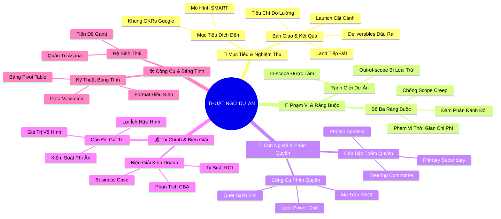

# 🧠 BẢN ĐỒ TƯ DUY TINH GỌN (4-5 TẦNG): HỌC PHẦN 6 - BẢNG THUẬT NGỮ QUẢN TRỊ DỰ ÁN

## 1. Sơ Đồ Tư Duy Trực Quan (Mermaid Mindmap Tinh Gọn)

---

## 2. Cây Phân Cấp Tri Thức Gợi Nhớ Nhanh 4-5 Tầng (Active Recall Hierarchy)

- 📌 **Nhóm Thuật Ngữ Mục Tiêu & Nghiệm Thu (Goals & Landing)**
  - 🔹 *Đích đến chiến lược:* ➔ *Goals & SMART (5 tiêu chuẩn):* ➔ *Google OKRs (Mục tiêu vươn tầm)* ➔ *Đo lường định lượng*
  - 🔹 *Bàn giao & Nghiệm thu:* ➔ *Deliverables đầu ra:* ➔ *Launch (Khởi chạy bàn giao)* ➔ *Land (Tiếp đất an toàn & bền vững)*

- 📌 **Nhóm Thuật Ngữ Phạm Vi & Bộ Ba Ràng Buộc (Scope & Constraints)**
  - 🔹 *Ranh giới công việc:* ➔ *In-scope (Được làm):* ➔ *Out-of-scope (Không làm)* ➔ *Văn bản hóa Tuyên bố phạm vi*
  - 🔹 *Bộ ba ràng buộc (Triple Constraint):* ➔ *Phạm vi - Thời gian - Chi phí:* ➔ *Chống Scope Creep* ➔ *Đàm phán đánh đổi khoa học*

- 📌 **Nhóm Thuật Ngữ Con Người, Phân Quyền & Tổ Chức (People & Governance)**
  - 🔹 *Thẩm quyền tối cao:* ➔ *Project Sponsor (Rót vốn & giá trị):* ➔ *Steering Committee (Hội đồng phê duyệt)* ➔ *Bảo trợ chính trị*
  - 🔹 *Công cụ phân quyền:* ➔ *Lưới Power-Interest (4 chiến lược):* ➔ *Ma trận RACI (Duy nhất 1 chữ A)* ➔ *Xóa bỏ căn bệnh Silo*

- 📌 **Nhóm Thuật Ngữ Tài Chính, Biện Giải & Lợi Ích (Finance & Value)**
  - 🔹 *Bệ phóng kinh doanh:* ➔ *Business Case (Căn cứ đầu tư):* ➔ *Phân tích CBA (Lợi ích > Chi phí)* ➔ *Tỷ suất hoàn vốn ROI*
  - 🔹 *Cân đo giá trị:* ➔ *Lợi ích hữu hình (Doanh thu):* ➔ *Lợi ích vô hình (Hài lòng, thương hiệu)* ➔ *Kiểm soát chi phí ngầm*

- 📌 **Nhóm Thuật Ngữ Công Cụ, Kỹ Thuật Bảng Tính & Năng Suất (Tools & Data)**
  - 🔹 *Hệ thống phần mềm:* ➔ *Asana (Nguồn chân lý duy nhất):* ➔ *Biểu đồ Gantt (Dòng thời gian)* ➔ *Công cụ cộng tác Docs/Chat*
  - 🔹 *Kỹ thuật bảng tính:* ➔ *Data Validation (Menu thả xuống):* ➔ *Conditional Formatting (Tô màu cảnh báo)* ➔ *Pivot Table (Tổng hợp đa chiều)*

---

## 3. Bảng Neo Trí Nhớ Từ Khóa Vàng (Memory Anchor Cheat Sheet)

| Từ Khóa Cốt Lõi | Phần Trong Tài Liệu | Bản Chất / Vai Trò (3-5 từ) | Tín Hiệu Gợi Nhớ (Memory Trigger) |
| :--- | :--- | :--- | :--- |
| **Common Language** | Tổng quan | Ngôn ngữ giao tiếp chung chuẩn | Tháp Babel xây thành công nhờ cùng một thứ tiếng |
| **Land a Project** | Phần I | Đo lường giá trị thực tế sau bàn giao | Phi công hạ cánh an toàn đón khách xuống sân bay |
| **In-scope vs Out-scope** | Phần II | Ranh giới những việc làm và không làm | Vạch vôi trắng phân định sân bóng đá |
| **Triple Constraint** | Phần II | Tam giác Phạm vi - Thời gian - Chi phí | Chiếc kiềng 3 chân không thể bẻ gãy |
| **Steering Committee** | Phần III | Hội đồng ra quyết định cấp cao | Tòa án tối cao phân xử tranh chấp |
| **Silo Effect** | Phần III | Căn bệnh cô lập thông tin nội bộ | Những tháp chứa thóc biệt lập không thông nhau |
| **Business Case** | Phần IV | Lý do thực tế để chi tiền | Bài thuyết trình gọi vốn của Startup |
| **Pivot Table** | Phần V | Bảng tổng hợp động đa chiều | Khối Rubik xoay chuyển góc nhìn dữ liệu |
