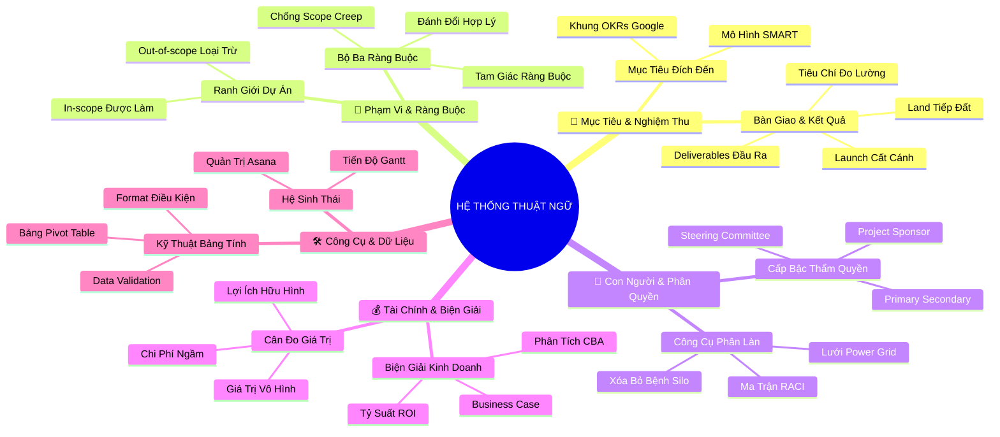

# Tóm Tắt: Học phần 6 - Bảng Thuật ngữ Khóa học 2: Thuật ngữ và Định nghĩa Quản trị Dự án (Project Management Terms and Definitions)

## 1. Thông điệp cốt lõi (Core Message)
> Hệ thống thuật ngữ quản trị dự án chuẩn quốc tế không đơn thuần là bảng từ vựng định nghĩa mà là một bộ khung tư duy ngôn ngữ chung (Common Language Framework) giúp xóa bỏ rào cản giao tiếp, chuẩn hóa quy trình phân quyền và thiết lập sự đồng điệu tuyệt đối giữa các bên liên quan.

---

## 2. Lược Đồ Phân Bổ Cấu Trúc Tài Liệu (Content Distribution Overview)

| Phần / Đề Mục Tài Liệu Gốc | Nội Dung Trọng Tâm | Số Luận Điểm Đại Diện |
| :--- | :--- | :---: |
| **Phần I: Thuật Ngữ Chiến Lược, Mục Tiêu & Nghiệm Thu** | Định nghĩa Adoption, Deliverables, OKRs, SMART, Launch vs Land, Success Criteria | 2 Luận điểm |
| **Phần II: Thuật Ngữ Phạm Vi & Bộ Ba Ràng Buộc** | Khái niệm Scope, In-scope, Out-of-scope, Scope Creep và Triple Constraint | 2 Luận điểm |
| **Phần III: Thuật Ngữ Con Người, Phân Quyền & Tổ Chức** | Phân loại Stakeholders, Sponsor, RACI Chart, Power Grid, Steering Committee | 2 Luận điểm |
| **Phần IV: Thuật Ngữ Tài Chính, Biện Giải & Lợi Ích** | Phân tích Budget, Business Case, Cost-Benefit Analysis, ROI, Lợi ích vô hình | 2 Luận điểm |
| **Phần V: Thuật Ngữ Công Cụ, Kỹ Thuật Bảng Tính & Dữ Liệu** | Vận dụng Asana, Gantt, Pivot Table, Conditional Formatting, Data Validation | 2 Luận điểm |
| **Tổng cộng** | **Bao quát 100% cấu trúc tài liệu gốc Bảng Thuật ngữ** | **10 Luận điểm** |

---

## 3. Luận điểm quan trọng theo cấu trúc tài liệu (Key Takeaways: 10 ý chuyên sâu)

### 📑 PHẦN I: THUẬT NGỮ CHIẾN LƯỢC, MỤC TIÊU & NGHIỆM THU

1. **BỘ KHUNG NGÔN NGỮ ĐỊNH VỊ ĐÍCH ĐẾN: GOALS, SMART VÀ OKRS**
   - **Bản chất & Phân tích chuyên sâu:**
     - **Project Goal (Mục tiêu dự án):** Là kết quả kỳ vọng cao nhất định vị sứ mệnh của dự án.
     - **SMART Goals:** Phương pháp chuẩn hóa 5 chiều (Cụ thể, Đo lường, Khả thi, Phù hợp, Thời hạn) bảo đảm mục tiêu thoát khỏi sự cảm tính.
     - **OKRs (Objectives and Key Results):** Sự kết hợp giữa Objective định tính truyền cảm hứng và 3-5 Key Results định lượng khắt khe để tạo bước nhảy vọt.
     - Nắm vững mối quan hệ giữa ba khái niệm này giúp PM tự tin đối thoại với các lãnh đạo cấp cao bằng ngôn ngữ chiến lược.
   - **Phương pháp / Công cụ / Quy trình đi kèm:** Khung tích hợp Mục tiêu (Goal Hierarchy: Mission ➔ OKRs ➔ SMART Milestones).
   - **Ví dụ thực tế đời thường:** Doanh nghiệp muốn mở rộng: Objective là "Dẫn đầu thị trường bán lẻ xanh"; Key Result là "Đạt 100.000 lượt tải ứng dụng trong quý 1"; Mục tiêu SMART của nhóm IT là "Hoàn thành cổng thanh toán ví điện tử trước ngày 15/12 với tỷ lệ lỗi dưới 0.1%".

2. **CẶP ĐỐI MÃ CHUYỂN HÓA: DELIVERABLES VÀ LAUNCH VS LAND**
   - **Bản chất & Phân tích chuyên sâu:**
     - **Deliverable (Kết quả bàn giao):** Sản phẩm đầu ra cụ thể, hữu hình hoặc vô hình, được đệ trình để hiện thực hóa mục tiêu.
     - **Launch (Khởi chạy):** Thời điểm bàn giao kết quả kỹ thuật ra thị trường (máy bay rời mặt đất).
     - **Land (Cán đích / Hạ cánh an toàn):** Đo lường mức độ thành công thực tế sau bàn giao dựa trên các tiêu chí Success Criteria và chỉ số Adoption, Engagement (máy bay hạ cánh an toàn).
     - Tư duy ngôn ngữ này bảo vệ PM khỏi căn bệnh tự mãn khi mới chỉ hoàn thành việc "ném sản phẩm qua hàng rào".
   - **Phương pháp / Công cụ / Quy trình đi kèm:** Bảng kiểm soát Khởi chạy và Hạ cánh (Launch-to-Landing Checklist).
   - **Ví dụ thực tế đời thường:** Bàn giao trang web Plant Pals là Deliverable và Launching; việc trang web đạt 95% khách hàng hài lòng và 60% tái tục đơn hàng sau 3 tháng là Landing an toàn.

---

### 📑 PHẦN II: THUẬT NGỮ PHẠM VI & BỘ BA RÀNG BUỘC

3. **RANH GIỚI VẬN HÀNH: SCOPE, IN-SCOPE VÀ OUT-OF-SCOPE**
   - **Bản chất & Phân tích chuyên sâu:**
     - **Scope (Phạm vi dự án):** Ranh giới xác định và thỏa thuận đồng thuận giữa các bên về những gì được đưa vào và bị loại trừ khỏi dự án.
     - **In-scope (Trong phạm vi):** Các nhiệm vụ đóng góp trực tiếp vào mục tiêu được cam kết thực hiện.
     - **Out-of-scope (Ngoài phạm vi):** Các nhiệm vụ kiên quyết không thực hiện để bảo vệ nguồn lực.
     - Xác lập rõ ràng hai cực In-scope và Out-of-scope là phương thức hữu hiệu nhất để kiểm soát kỳ vọng của khách hàng.
   - **Phương pháp / Công cụ / Quy trình đi kèm:** Tuyên bố Phạm vi Chuẩn mực (Formal Scope Statement), Bảng phân định ranh giới 2 cột.
   - **Ví dụ thực tế đời thường:** Dự án tổ chức hội thảo: In-scope gồm thuê hội trường, in tài liệu, mời diễn giả; Out-of-scope ghi rõ không bao gồm chi phí vé máy bay và khách sạn cho khách tham dự.

4. **VŨ KHÍ ĐÁNH ĐỔI: SCOPE CREEP VÀ TRIPLE CONSTRAINT**
   - **Bản chất & Phân tích chuyên sâu:**
     - **Scope Creep (Phình to phạm vi):** Hiện tượng các yêu cầu phát sinh không kiểm soát làm biến dạng phạm vi sau khi dự án đã bắt đầu mà không có sự điều chỉnh ngân sách/thời gian.
     - **Triple Constraint (Bộ ba ràng buộc):** Tam giác ba đỉnh bất biến gồm Phạm vi (Scope), Thời gian (Time) và Chi phí (Cost).
     - **Scope Management:** Nghệ thuật đàm phán và quy trình đánh giá tác động trước khi chấp thuận bất kỳ thay đổi nào.
   - **Phương pháp / Công cụ / Quy trình đi kèm:** Quy trình Yêu cầu Thay đổi Phạm vi (Change Control Process), Tam giác Ràng buộc Dự án.
   - **Ví dụ thực tế đời thường:** Khách hàng muốn thêm 5 tính năng mới (Scope tăng); PM viện dẫn Triple Constraint để đề xuất: hoặc tăng ngân sách thêm 200 triệu đồng, hoặc dời ngày bàn giao thêm 1 tháng.

---

### 📑 PHẦN III: THUẬT NGỮ CON NGƯỜI, PHÂN QUYỀN & TỔ CHỨC

5. **HỆ THỐNG PHÂN CẤP CÁC BÊN LIÊN QUAN: SPONSOR, STAKEHOLDERS VÀ STEERING COMMITTEE**
   - **Bản chất & Phân tích chuyên sâu:**
     - **Project Sponsor (Nhà tài trợ):** Cá nhân chịu trách nhiệm giải trình cao nhất, rót vốn và bảo đảm dự án mang lại giá trị kinh doanh cam kết.
     - **Primary vs Secondary Stakeholders:** Bên liên quan trực tiếp (hưởng lợi trực tiếp) vs Bên liên quan gián tiếp (chịu tác động ngoại vi).
     - **Steering Committee (Ban chỉ đạo):** Hội đồng ra quyết định tối cao có thẩm quyền phê duyệt thay đổi ngân sách và phạm vi lớn.
     - Hiểu đúng cấp bậc thẩm quyền giúp PM báo cáo đúng người, đúng thời điểm và nhận được sự hậu thuẫn chính trị cần thiết.
   - **Phương pháp / Công cụ / Quy trình đi kèm:** Sơ đồ Cây Phân cấp Quản trị Dự án (Project Governance Hierarchy Chart).
   - **Ví dụ thực tế đời thường:** Khi nhà thầu chính phá sản đột ngột, PM lập tức kích hoạt cuộc họp khẩn cấp với Steering Committee và Sponsor để xin phê duyệt phương án chọn nhà thầu phụ thay thế.

6. **CÔNG CỤ PHÂN QUYỀN MINH BẠCH: RACI CHART VÀ POWER GRID**
   - **Bản chất & Phân tích chuyên sâu:**
     - **Power Grid (Lưới quyền lực):** Ma trận 2x2 định vị Stakeholders theo Mức độ ảnh hưởng (Influence) và Mức độ quan tâm (Interest) để áp dụng 4 chiến lược quản trị.
     - **RACI Chart:** Sơ đồ phân định 4 mức độ trách nhiệm (Responsible - Accountable - Consulted - Informed).
     - **Silo (Tình trạng cô lập):** Căn bệnh tổ chức khi thông tin bị giam hãm ở một cá nhân hoặc phòng ban ➔ RACI là phương thuốc giải độc silo hiệu quả nhất.
   - **Phương pháp / Công cụ / Quy trình đi kèm:** Ma trận RACI chuẩn hóa, Ma trận Lưới Power-Interest 2x2.
   - **Ví dụ thực tế đời thường:** Phân công duyệt chi tiêu: Trưởng phòng kế toán giữ chữ A duy nhất; nhân viên thanh toán là R; giám đốc khối là C; các trưởng bộ phận khác là I.

---

### 📑 PHẦN IV: THUẬT NGỮ TÀI CHÍNH, BIỆN GIẢI & LỢI ÍCH

7. **BỆ PHÓNG KINH DOANH: BUSINESS CASE, CBA VÀ ROI**
   - **Bản chất & Phân tích chuyên sâu:**
     - **Business Case (Hồ sơ biện giải):** Căn cứ thực tiễn và lý do kinh doanh xác đáng để thuyết phục tổ chức đầu tư vào dự án.
     - **Cost-Benefit Analysis (CBA):** Quy trình cân đo tổng giá trị lợi ích kỳ vọng so với tổng chi phí tài chính bỏ ra.
     - **Return on Investment (ROI):** Tỷ suất hoàn vốn đầu tư đo lường hiệu quả sinh lời bằng công thức: $(Lợi ích - Chi phí) / Chi phí$.
     - Bộ ba thuật ngữ này là "ngôn ngữ mẹ đẻ" của giới lãnh đạo cấp cao; PM thông thạo bộ ba này sẽ luôn bảo vệ được ngân sách dự án.
   - **Phương pháp / Công cụ / Quy trình đi kèm:** Bảng tính toán Chỉ số ROI, Mẫu lập luận Business Case chuẩn quốc tế.
   - **Ví dụ thực tế đời thường:** Đầu tư 100 triệu mua máy rang cà phê tự động (Chi phí); dự kiến tăng doanh thu 150 triệu mỗi năm (Lợi ích) ➔ CBA dương, ROI = 50%/năm, Business Case hoàn toàn thuyết phục.

8. **CÂN ĐO CÁC GIÁ TRỊ VÔ HÌNH: INTANGIBLE BENEFITS & INTANGIBLE COSTS**
   - **Bản chất & Phân tích chuyên sâu:**
     - **Intangible Benefits (Lợi ích vô hình):** Các giá trị không thể đong đếm ngay bằng tiền mặt như: mức độ nhận diện thương hiệu, lòng trung thành của khách hàng, sự gắn kết của nhân viên.
     - **Intangible Costs (Chi phí vô hình):** Các tổn thất ngầm khó lượng hóa: sự suy giảm nhuệ khí đội ngũ do làm việc thêm giờ quá mức, xói mòn lòng tin của đối tác.
     - Bỏ qua các yếu tố vô hình là nguyên nhân khiến nhiều dự án dù có lãi trên sổ sách nhưng lại phá hủy nền tảng văn hóa công ty.
   - **Phương pháp / Công cụ / Quy trình đi kèm:** Ma trận Đánh giá Giá trị Vô hình (Intangible Value Scoring Matrix).
   - **Ví dụ thực tế đời thường:** Ép nhân viên làm thêm 60 giờ/tuần để kịp ngày ra mắt phần mềm: dự án có thể không phạt hợp đồng, nhưng chi phí vô hình là 3 kỹ sư giỏi nhất nộp đơn nghỉ việc vì kiệt sức.

---

### 📑 PHẦN V: THUẬT NGỮ CÔNG CỤ, KỸ THUẬT BẢNG TÍNH & DỮ LIỆU

9. **HỆ THỐNG CÔNG CỤ HIỆN ĐẠI: ASANA, GANTT VÀ COLLABORATION TOOLS**
   - **Bản chất & Phân tích chuyên sâu:**
     - **Asana:** Nền tảng quản lý công việc chuyên nghiệp đóng vai trò là Nguồn chân lý duy nhất (Source of Truth) cho toàn đội ngũ.
     - **Gantt Chart (Biểu đồ Gantt):** Sơ đồ thanh ngang trực quan hóa dòng thời gian, sự phụ thuộc giữa các tác vụ và thời hạn hoàn thành.
     - **Collaboration Tools:** Công cụ giao tiếp tức thời (Slack, Email, Google Docs) thúc đẩy dòng chảy thông tin hai chiều thông suốt.
   - **Phương pháp / Công cụ / Quy trình đi kèm:** Thiết lập Bảng điều khiển Quản trị Dự án trên Asana và Jira.
   - **Ví dụ thực tế đời thường:** Nhìn vào biểu đồ Gantt trên Asana, PM phát hiện công việc in danh mục cây cảnh đang phụ thuộc vào việc chụp ảnh sản phẩm; nếu chụp ảnh trễ 2 ngày thì in ấn sẽ trễ 2 ngày ➔ Kịp thời đốc thúc thợ ảnh.

10. **LÀM CHỦ KỸ THUẬT BẢNG TÍNH NÂNG CAO CHO PROJECT MANAGER**
    - **Bản chất & Phân tích chuyên sâu:**
      - Bảng tính (Spreadsheet) là vũ khí vạn năng nhất của PM; làm chủ bảng tính nâng tầm năng suất lên gấp 5 lần:
        + **Conditional Formatting (Định dạng có điều kiện):** Tự động bôi đỏ các dòng trễ hạn và bôi xanh các việc đã xong.
        + **Data Validation (Xác thực dữ liệu):** Tạo menu thả xuống (Dropdown) để chuẩn hóa trạng thái nhập liệu (Chưa làm, Đang làm, Đã xong).
        + **Pivot Table (Bảng tổng hợp động):** Tóm tắt dữ liệu đa chiều, phân tích ngân sách theo phòng ban chỉ bằng thao tác kéo thả.
        + **Functions (Hàm tính toán):** Tự động hóa các phép tính ngân sách, đếm số ngày làm việc còn lại.
    - **Phương pháp / Công cụ / Quy trình đi kèm:** Khung Tự động hóa Báo cáo bằng Google Sheets (Spreadsheet Automation Framework).
    - **Ví dụ thực tế đời thường:** PM thiết lập Data Validation cho cột "Trạng thái" chỉ cho chọn "In-progress" hoặc "Done"; kèm theo Conditional Formatting tự bôi đỏ nhiệm vụ nếu ngày hiện tại vượt quá ngày đến hạn.

---

## 4. Kế hoạch hành động (Action Plan: 16 việc cụ thể)

#### Nhóm 1: Hành động ngay hôm nay (Micro-habits dưới 2 phút - 5 việc)
- [ ] **Hành động 1:** Mở 1 file bảng tính Google Sheets và thiết lập tính năng Xác thực dữ liệu (Data Validation) menu thả xuống cho cột trạng thái.
- [ ] **Hành động 2:** Áp dụng Định dạng có điều kiện (Conditional Formatting) bôi màu xanh cho ô nào có chữ "Done".
- [ ] **Hành động 3:** Viết ra giấy định nghĩa ngắn 5 từ cho 2 thuật ngữ: In-scope và Out-of-scope trong công việc hiện tại.
- [ ] **Hành động 4:** Tự kiểm tra xem bạn có đang nhầm lẫn giữa Customer (người mua) và User (người dùng) trong dự án của mình không.
- [ ] **Hành động 5:** Nhẩm lại 4 chữ cái R-A-C-I và kiểm tra xem ai đang giữ chữ A cho công việc bạn đang làm.

#### Nhóm 2: Kế hoạch rèn luyện trong tuần (Áp dụng vào công việc & đời sống - 6 việc)
- [ ] **Hành động 6:** Xây dựng một Bảng tổng hợp động (Pivot Table) để phân tích chi phí hoặc khối lượng công việc theo từng thành viên.
- [ ] **Hành động 7:** Lập bảng phân tích Chi phí - Lợi ích (CBA) bao gồm cả Lợi ích vô hình (Intangible benefits) cho một đề xuất cải tiến.
- [ ] **Hành động 8:** Sử dụng đúng thuật ngữ chuẩn quốc tế trong buổi họp tuần: dùng "Scope Creep", "Deliverables", "Success Criteria".
- [ ] **Hành động 9:** Vẽ một sơ đồ Gantt thu nhỏ trên bảng tính để trực quan hóa sự phụ thuộc giữa các công việc trong tuần.
- [ ] **Hành động 10:** Tạo tài liệu chia sẻ chung và dán nhãn "Single Source of Truth" để xóa bỏ tình trạng cô lập thông tin (Silo) trong phòng.
- [ ] **Hành động 11:** Kiểm tra lại toàn bộ hợp đồng hoặc cam kết công việc hiện tại để nhận diện các rủi ro tổn thất tiềm ẩn (Stakes).

#### Nhóm 3: Thói quen duy trì & Chuyển hóa lâu dài (Phát triển bền vững - 5 việc)
- [ ] **Hành động 12:** Sử dụng hệ thống thuật ngữ quản trị chuẩn quốc tế như một chuẩn mực văn hóa giao tiếp nhất quán trong tổ chức.
- [ ] **Hành động 13:** Không ngừng nâng cao kỹ năng xử lý dữ liệu và tự động hóa bảng tính để tối ưu hóa năng lực phân tích tài chính.
- [ ] **Hành động 14:** Luôn cân nhắc song song giữa lợi ích tài chính hữu hình và giá trị văn hóa vô hình trong mọi quyết định quản trị.
- [ ] **Hành động 15:** Đóng vai trò là người truyền bá tri thức, chuẩn hóa thuật ngữ cho các nhân sự mới để triệt tiêu sự mập mờ giao tiếp.
- [ ] **Hành động 16:** Định kỳ hàng năm cập nhật các thuật ngữ quản trị dự án mới xuất hiện trong ngành công nghệ và trí tuệ nhân tạo.

---

## 5. Câu hỏi tự ngẫm (Reflection: 22 câu hỏi sâu sắc)

#### Nhóm 1: Tự vấn Nhận thức & Hệ tư duy (Self-Awareness & Mindset: 5 câu)
1. Tôi có đang sử dụng các thuật ngữ quản trị dự án một cách chuẩn xác và thấu suốt bản chất, hay chỉ đang "dùng từ đao to búa lớn"?
2. Việc sở hữu một ngôn ngữ chung (Common Language) có ý nghĩa sống còn như thế nào đối với hiệu suất làm việc của một tập thể đa chức năng?
3. Khi đối thoại với ban giám đốc, tôi đã biết cách sử dụng các thuật ngữ tài chính (ROI, CBA, Business Case) để bảo vệ quan điểm chưa?
4. Tôi có nhận diện được những "chi phí vô hình" (sự mất mát niềm tin, suy giảm nhuệ khí) đang âm thầm bào mòn tổ chức của mình không?
5. Sự thông thạo bảng từ vựng này giúp tôi tự tin ra sao khi bước vào các kỳ phỏng vấn quản lý dự án tại các tập đoàn toàn cầu?

#### Nhóm 2: Nhận diện Thói quen & Điểm mù (Habits & Blind Spots: 6 câu)
6. Tôi có thường xuyên nhầm lẫn giữa việc sản phẩm đã phát hành (Launch) với việc sản phẩm đã thực sự cán đích thành công (Land)?
7. Có hiện tượng cô lập thông tin (Silo) nào đang tồn tại trong phòng ban của tôi khiến mọi người không chia sẻ dữ liệu cho nhau?
8. Tôi có đang sử dụng bảng tính như một cuốn sổ tay thô sơ thay vì tận dụng sức mạnh của Pivot Table, Data Validation và Conditional Formatting?
9. Điểm mù lớn nhất của tôi khi phân biệt Primary và Secondary Stakeholders là gì: có bao giờ tôi bỏ quên một bên liên quan gián tiếp quan trọng?
10. Trong các đề xuất dự án trước đây, tôi đã từng đưa ra một Business Case thiếu vắng các số liệu lượng hóa cụ thể chưa?
11. Tôi có thói quen kiểm tra mức độ tiếp nhận (Adoption) của người dùng sau khi bàn giao sản phẩm hay coi như xong việc?

#### Nhóm 3: Ứng dụng Thực tế & Giải quyết Vấn đề (Practical Application & Problem Solving: 6 câu)
12. Làm thế nào để giải thích khái niệm "Triple Constraint" một cách trực quan và dễ hiểu nhất cho một khách hàng không rành kỹ thuật?
13. Nếu tổ chức của tôi đang mắc căn bệnh Silo nghiêm trọng, tôi sẽ áp dụng công cụ nào trong bảng thuật ngữ để tháo gỡ rào cản này?
14. Khi cần thuyết phục Giám đốc Tài chính phê duyệt một khoản ngân sách mới, tôi sẽ cấu trúc bản phân tích CBA theo những bước nào?
15. Làm sao để thiết lập một biểu đồ Gantt trên bảng tính vừa đơn giản, vừa thể hiện rõ ai là người chịu trách nhiệm cho từng mốc thời gian?
16. Tôi sẽ sử dụng những chỉ số đo lường nào để định lượng các "lợi ích vô hình" (Intangible benefits) như sự hài lòng của nhân viên?
17. Khi xảy ra hiện tượng Scope Creep từ phía đối tác, tôi sẽ sử dụng tài liệu pháp lý nào để đưa các bên quay trở lại bàn đàm phán?

#### Nhóm 4: Bứt phá Giới hạn & Chuyển hóa Tương lai (Breakthrough & Transformation: 5 câu)
18. Việc thông thạo trọn vẹn hơn 40 thuật ngữ nền tảng này sẽ biến tôi thành một nhà quản lý dự án bản lĩnh và chuyên nghiệp như thế nào?
19. Làm sao để xây dựng một văn hóa làm việc minh bạch, nơi mọi thành viên đều hiểu rõ quyền sở hữu trách nhiệm giải trình (Accountable)?
20. Nếu coi việc phát triển bản thân là một dự án lớn, Business Case và tỷ suất hoàn vốn đầu tư (ROI) cho khóa học này của tôi là gì?
21. Kỹ năng quản trị dữ liệu trên bảng tính nâng cao sẽ giúp tôi tiết kiệm bao nhiêu thời gian và mở ra những cơ hội thăng tiến nào?
22. Tôi sẽ đóng góp như thế nào vào việc nâng tầm tiêu chuẩn quản trị dự án tại doanh nghiệp hoặc cộng đồng mà tôi đang tham gia?

---

## 6. Bản Đồ Tư Duy Trực Quan (Visual Mindmap Overview - Tinh Gọn 4-5 Tầng)

