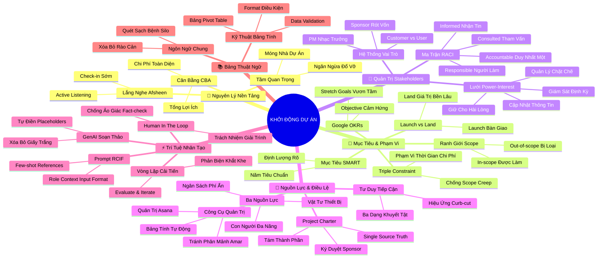

# 🧠 BẢN ĐỒ TƯ DUY TOÀN CẢNH (5 TẦNG): KHỞI ĐỘNG DỰ ÁN - KHỞI TẠO MỘT DỰ ÁN THÀNH CÔNG
*Master Mindmap Architecture - Google Project Management Professional Certificate (Khóa học 2)*

## 1. Sơ Đồ Tư Duy Trực Quan Toàn Khóa (Mermaid Mindmap 5 Tầng Tinh Gọn)

---

## 2. Cây Phân Cấp Tri Thức Gợi Nhớ Nhanh Toàn Cảnh (Master Active Recall Hierarchy)

- 📌 **Học phần 1: Nguyên Lý Nền Tảng Của Khởi Động Dự Án**
  - 🔹 *Bản chất Initiation:* ➔ *Đặt nền móng sống còn:* ➔ *Ngăn chặn thất bại thực thi* ➔ *Sáu trụ cột cốt lõi*
  - 🔹 *Cân bằng tài chính CBA:* ➔ *Cost-Benefit Analysis:* ➔ *Lợi ích kỳ vọng > Chi phí tài chính* ➔ *Phê duyệt dự án*
  - 🔹 *Năng lực lắng nghe tích cực:* ➔ *Active Listening (Afsheen):* ➔ *Check-in hạ tầng sớm* ➔ *Tránh cô lập tổ chức*

- 📌 **Học phần 2: Mục Tiêu, Phạm Vi Và Tiêu Chí Thành Công**
  - 🔹 *Chuẩn hóa mục tiêu:* ➔ *Goal vs Deliverables:* ➔ *Bộ lọc 5 chiều SMART* ➔ *Google OKRs (Mục tiêu vươn tầm)*
  - 🔹 *Ranh giới & Đánh đổi:* ➔ *In-scope vs Out-of-scope:* ➔ *Tam giác Bộ ba Ràng buộc (Triple Constraint)* ➔ *Nguyên lý đánh đổi*
  - 🔹 *Kiểm soát Scope Creep & Về đích:* ➔ *Dũng cảm nói "Không" (Torie):* ➔ *Launch (Khởi chạy bàn giao)* ➔ *Land (Hạ cánh an toàn 30-90 ngày)*

- 📌 **Học phần 3: Làm Việc Hiệu Quả Với Các Bên Liên Quan (Stakeholders)**
  - 🔹 *Cơ cấu vai trò:* ➔ *Sponsor (Rót vốn & giá trị):* ➔ *PM (Nhạc trưởng):* ➔ *Customer (Người trả tiền) vs User (Người dùng)*
  - 🔹 *Lưới quyền lực Power-Interest:* ➔ *Quyền cao - Quan cao: Quản lý chặt:* ➔ *Quyền cao - Quan thấp: Giữ hài lòng* ➔ *Ban chỉ đạo (Steering Committee)*
  - 🔹 *Ma trận RACI chuẩn mực:* ➔ *R-A-C-I bốn làn phân công:* ➔ *Duy nhất 1 chữ A giải trình* ➔ *Quét sạch chồng chéo & quá tải tin*

- 📌 **Học phần 4: Nguồn Lực, Bản Điều Lệ Dự Án Và Hệ Sinh Thái Công Cụ**
  - 🔹 *Ba nguồn lực cốt lõi:* ➔ *Ngân sách (Tính phí ẩn):* ➔ *Con người (Nội bộ & thuê ngoài)* ➔ *Nguyên vật liệu & Thiết bị*
  - 🔹 *Project Charter (Bản Điều lệ):* ➔ *Tám thành phần chuẩn Google:* ➔ *Single Source of Truth* ➔ *Ký duyệt Sign-off từ Sponsor*
  - 🔹 *Hệ sinh thái công cụ & Tiếp cận:* ➔ *Asana & Bảng tính tự động:* ➔ *Tránh phân mảnh (Amar)* ➔ *Hiệu ứng Curb-cut effect (Holly)*

- 📌 **Học phần 5: Đột Phá Cùng Trí Tuệ Nhân Tạo (GenAI) Trong Khởi Tạo Dự Án**
  - 🔹 *Đòn bẩy tốc độ GenAI:* ➔ *Xóa bỏ trang giấy trắng:* ➔ *Tự tạo placeholders thông tin thiếu* ➔ *Soạn thảo Charter trong 30 giây*
  - 🔹 *Kỹ thuật Prompt RCIF:* ➔ *Role - Context - Input - Format:* ➔ *Few-shot references* ➔ *Vòng lặp Evaluate & Iterate*
  - 🔹 *Nguyên tắc Human-in-the-loop:* ➔ *Cảnh giác ảo giác (Hallucination):* ➔ *Fact-check số liệu* ➔ *Trách nhiệm giải trình độc tôn của PM*

- 📌 **Học phần 6: Bảng Thuật Ngữ Hệ Thống Hóa Và Ngôn Ngữ Chung Quản Trị**
  - 🔹 *Ngôn ngữ chung (Common Language):* ➔ *Chuẩn hóa thuật ngữ A - T:* ➔ *Giao tiếp liên chức năng chuẩn xác* ➔ *Xóa bỏ căn bệnh cô lập Silo*
  - 🔹 *Kỹ thuật bảng tính nâng cao:* ➔ *Data Validation (Dropdown):* ➔ *Conditional Formatting (Tô màu)* ➔ *Pivot Table (Phân tích đa chiều)*

---

## 3. Bảng Neo Trí Nhớ Từ Khóa Vàng Toàn Khóa (Master Memory Anchor Cheat Sheet)

| Từ Khóa Cốt Lõi | Học Phần | Bản Chất / Vai Trò (3-5 từ) | Tín Hiệu Gợi Nhớ (Memory Trigger) |
| :--- | :--- | :--- | :--- |
| **Project Initiation** | Học phần 1 | Đặt móng vòng đời dự án | Lễ khởi công đặt viên gạch đầu tiên |
| **Cost-Benefit Analysis** | Học phần 1 | Cân đo lợi ích chi phí | Chiếc cân đĩa: Lợi ích phải nặng hơn chi phí |
| **Active Listening** | Học phần 1 | Lắng nghe thấu cảm học hỏi | Đôi tai mở lớn ghi chép không ngắt lời |
| **SMART Goals** | Học phần 2 | 5 tiêu chuẩn khóa mục tiêu | Ngôi sao 5 cánh định hướng đường bay |
| **Google OKRs** | Học phần 2 | Mục tiêu vươn tầm phá vỡ | Tên lửa bay tới mặt trăng (Stretch Goal) |
| **Triple Constraint** | Học phần 2 | Tam giác ràng buộc Scope-Time-Cost | Chiếc kiềng ba chân không thể nghiêng |
| **Scope Creep** | Học phần 2 | Phình to phạm vi mất kiểm soát | Con trăn nuốt mồi quá sức làm nứt da |
| **Landing a Project** | Học phần 2 | Đo lường giá trị thực tế sau bàn giao | Phi công hạ cánh an toàn đón khách |
| **Customer vs User** | Học phần 3 | Người trả tiền vs Người dùng | Bố mẹ mua sữa (Customer) & Em bé uống (User) |
| **Power-Interest Grid** | Học phần 3 | Ma trận phân loại 4 nhóm liên quan | La bàn định vị 4 hướng gió bão công sở |
| **Single "A" in RACI** | Học phần 3 | Duy nhất một người giải trình | Một con tàu chỉ có một thuyền trưởng |
| **Project Charter** | Học phần 4 | Khế ước pháp lý trao quyền PM | Chiếu chỉ vua ban trao kiếm lệnh khởi binh |
| **Living Document** | Học phần 4 | Tài liệu sống cập nhật liên tục | Cái cây xanh thay lá thích nghi thời tiết |
| **Tool Fragmentation** | Học phần 4 | Sự phân mảnh công cụ gây rối | Người thợ mang 10 túi đồ nghề vướng víu |
| **Curb-cut Effect** | Học phần 4 | Thiết kế hòa nhập mở rộng lợi ích | Bậc vát vỉa hè cho xe lăn giúp cả xe đẩy nôi |
| **RCIF Prompting** | Học phần 5 | 4 thành tố tạo prompt chuẩn | Khẩu lệnh dẫn dắt chú cảnh khuyển tinh nhuệ |
| **Human-in-the-Loop** | Học phần 5 | Con người nắm quyền phán quyết cuối | Người phi công nắm cần lái, không thả nổi |
| **Common Language** | Học phần 6 | Ngôn ngữ chung chuẩn quốc tế | Tháp Babel xây thành công nhờ chung tiếng nói |
| **Silo Effect** | Học phần 6 | Căn bệnh cô lập thông tin nội bộ | Các tháp chứa thóc biệt lập không thông gió |
| **Pivot Table** | Học phần 6 | Bảng tổng hợp dữ liệu động | Khối Rubik xoay chuyển đa góc nhìn |
