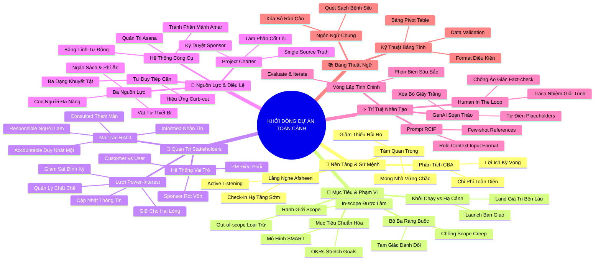

# Tóm Tắt Master: Khởi Động Dự Án - Khởi Tạo Một Dự Án Thành Công (Project Initiation: Starting a Successful Project)
*Google Project Management Professional Certificate - Khóa học 2*

## 1. Thông điệp cốt lõi (Core Message)
> Giai đoạn Khởi động (Project Initiation) là bệ phóng kiến tạo nền móng quyết định sự sống còn của toàn bộ vòng đời dự án; thông qua việc xác lập mục tiêu SMART/OKRs đầy khát vọng, thiết lập ranh giới phạm vi vững chắc trước Scope Creep, quản trị thấu cảm các bên liên quan bằng Lưới Power-Interest và Ma trận RACI, đóng gói khế ước pháp lý Project Charter và tăng tốc với Trí tuệ nhân tạo (GenAI), người quản lý dự án sẽ chèo lái con thuyền dự án cất cánh thuận lợi và hạ cánh an toàn trong sự đồng thuận tuyệt đối của tổ chức.

---

## 2. Lược Đồ Phân Bổ Cấu Trúc Tài Liệu (Content Distribution Overview)

| Học Phần / Đề Mục Toàn Khóa | Nội Dung Trọng Tâm | Số Luận Điểm Đại Diện |
| :--- | :--- | :---: |
| **Học phần 1: Nguyên Lý Nền Tảng Khởi Động Dự Án** | Tầm quan trọng của Initiation, Phân tích Cost-Benefit và năng lực Lắng nghe tích cực (Afsheen) | 2 Luận điểm |
| **Học phần 2: Mục Tiêu, Phạm Vi & Tiêu Chí Thành Công** | Mục tiêu SMART, Hệ thống OKRs Google, Triple Constraint, Chống Scope Creep và Khởi chạy vs Hạ cánh | 3 Luận điểm |
| **Học phần 3: Làm Việc Hiệu Quả Với Stakeholders** | Vai trò Sponsor/PM/Team, Lưới Power-Interest Grid, Ma trận RACI độc tôn một chữ A, Triết lý John Fyle | 3 Luận điểm |
| **Học phần 4: Nguồn Lực, Bản Điều Lệ & Công Cụ** | Ba nguồn lực (Budget/People/Materials), Cấu trúc 8 phần của Project Charter, Hệ sinh thái công cụ Amar và Tư duy tiếp cận Holly | 3 Luận điểm |
| **Học phần 5: Đột Phá Cùng Trí Tuệ Nhân Tạo (GenAI)** | Kỹ thuật Prompt Engineering RCIF, Tự động hóa soạn thảo Charter và Nguyên tắc Human-in-the-loop | 2 Luận điểm |
| **Học phần 6: Bảng Thuật Ngữ Hệ Thống Hóa A - T** | Xây dựng ngôn ngữ chung (Common Language), Khóa các khái niệm nền tảng và Kỹ thuật bảng tính nâng cao | 2 Luận điểm |
| **Tổng cộng** | **Bao quát 100% cấu trúc 6 học phần toàn khóa học** | **15 Luận điểm** |

---

## 3. Luận điểm quan trọng theo cấu trúc tài liệu (Key Takeaways: 15 ý chuyên sâu)

### 📑 HỌC PHẦN 1: NGUYÊN LÝ NỀN TẢNG CỦA KHỞI ĐỘNG DỰ ÁN

1. **KHỞI ĐỘNG CHUẨN XÁC LÀ TẤM BẢO HIỂM RỦI RO CHO TOÀN BỘ VÒNG ĐỜI DỰ ÁN**
   - **Bản chất & Phân tích chuyên sâu:**
     - Mọi đổ vỡ nghiêm trọng ở các giai đoạn sau (cháy ngân sách, trễ hạn bàn giao, mâu thuẫn nội bộ) hầu hết đều bắt nguồn từ sự chuẩn bị qua loa trong khâu khởi động.
     - Khởi động dự án (Project Initiation) giúp tổ chức định vị rõ bài toán kinh doanh, thẩm định tính khả thi và trả lời câu hỏi cốt tử: "Dự án này có thực sự đáng để làm và có mang lại giá trị lớn hơn chi phí bỏ ra hay không?".
     - Được dẫn dắt bởi 6 trụ cột cốt lõi: Mục tiêu, Phạm vi, Sản phẩm bàn giao, Tiêu chí thành công, Các bên liên quan và Nguồn lực.
   - **Phương pháp / Công cụ / Quy trình đi kèm:** Bộ khung 6 yếu tố khởi động (6-Pillar Initiation Framework), Cổng kiểm soát chất lượng khởi động (Phase Gate 1 Review).
   - **Ví dụ thực tế đời thường:** Mở một nhà hàng ẩm thực: Thay vì vội vã thuê mặt bằng và trang trí quán, chủ đầu tư dành 1 tháng khảo sát lưu lượng khách hàng, tính toán điểm hòa vốn và phân tích đối thủ cạnh tranh để không rơi vào cảnh cạn vốn sau 2 tháng khai trương.

2. **NĂNG LỰC LẮNG NGHE ĐỂ HỌC HỎI (ACTIVE LISTENING) VÀ BÀI HỌC TẠI GOOGLE**
   - **Bản chất & Phân tích chuyên sâu:**
     - Người quản lý dự án xuất sắc không phải là người nói nhiều nhất mà là người biết "sống chậm lại" để lắng nghe tích cực và thấu cảm sâu sắc nỗi đau của các bên liên quan.
     - Câu chuyện thất bại của một nhóm tại Google do Afsheen chia sẻ (sát ngày ra mắt mới báo cho bộ phận hạ tầng) là bài học xương máu về việc "làm việc trong bóng tối và cô lập tổ chức".
     - Đầu tư thời gian đối thoại sớm với các bên liên quan là khoản bảo hiểm rẻ nhất để ngăn chặn nguy cơ sản phẩm bị phủ quyết trước giờ G.
   - **Phương pháp / Công cụ / Quy trình đi kèm:** Phỏng vấn Thấu cảm (Empathy Interviewing), Vòng kiểm tra hạ tầng sớm (Early Infrastructure Alignment Loop).
   - **Ví dụ thực tế đời thường:** Nhóm kỹ sư phần mềm chủ động gặp gỡ bộ phận chăm sóc khách hàng ngay từ tuần đầu khởi tạo để lắng nghe những ức chế của người dùng về giao diện cũ, thay vì tự ngồi vẽ tính năng mới theo ý thích cá nhân.

---

### 📑 HỌC PHẦN 2: MỤC TIÊU, PHẠM VI VÀ TIÊU CHÍ THÀNH CÔNG

3. **CHUẨN HÓA MỤC TIÊU SMART VÀ HỆ THỐNG OKRS ĐỘT PHÁ TẠI GOOGLE**
   - **Bản chất & Phân tích chuyên sâu:**
     - Phân định rõ ràng: Mục tiêu (Goal - Đích đến chiến lược) vs Kết quả bàn giao (Deliverables - Phương tiện đầu ra).
     - Áp dụng bộ lọc 5 chiều **SMART** (Cụ thể, Đo lường, Khả thi, Phù hợp, Thời hạn) để biến các ý định mơ hồ thành cam kết hành động chuẩn xác.
     - Phát triển lên tầm cao với **OKRs (Objectives and Key Results)**: Kết hợp Objective truyền cảm hứng với 3-5 Key Results định lượng khắt khe; khuyến khích các "Mục tiêu vươn tầm" (Stretch Goals - đạt 70-80% đã là thành công vang dội).
   - **Phương pháp / Công cụ / Quy trình đi kèm:** Khung Google OKRs Scoring (0.0 - 1.0), Cây phân tầng OKRs đa cấp độ (Công ty ➔ Phòng ban ➔ Dự án).
   - **Ví dụ thực tế đời thường:** Dự án Plant Pals tại Office Green: Objective là "Trở thành nhà cung cấp cây xanh văn phòng số 1 thành phố"; Key Result 1 là "Đạt 25% khách hàng hiện tại đăng ký dịch vụ thử nghiệm"; Key Result 2 là "Chỉ số hài lòng khách hàng CSAT đạt từ 95% trở lên sau 3 tháng".

4. **RANH GIỚI PHẠM VI (SCOPE) VÀ MÔ HÌNH BỘ BA RÀNG BUỘC (TRIPLE CONSTRAINT)**
   - **Bản chất & Phân tích chuyên sâu:**
     - Phạm vi là ranh giới thỏa thuận rõ ràng về những gì ĐƯỢC LÀM (In-scope) và những gì KIÊN QUYẾT KHÔNG LÀM (Out-of-scope).
     - Dự án bị chi phối bởi Tam giác Bộ ba Ràng buộc: Phạm vi (Scope), Thời gian (Time) và Chi phí (Cost). Chất lượng nằm ở trung tâm tam giác.
     - Nguyên lý đánh đổi bất biến: Nới rộng phạm vi bắt buộc phải tăng ngân sách hoặc kéo dài thời hạn bàn giao; PM thương lượng bằng các phương án đánh đổi cụ thể chứ không bao giờ từ chối một cách cảm tính.
   - **Phương pháp / Công cụ / Quy trình đi kèm:** Tuyên bố Phạm vi Dự án (Project Scope Statement), Ma trận Đánh đổi Dự án (Trade-off Matrix).
   - **Ví dụ thực tế đời thường:** Khách hàng yêu cầu bổ sung tính năng chậu cây tự tưới nước; PM trình bày phương án: chấp nhận tính năng mới với điều kiện dời ngày ra mắt thêm 3 tuần hoặc bổ sung thêm 50 triệu đồng để thuê đối tác gia công khẩn cấp.

5. **KIỂM SOÁT BỆNH SCOPE CREEP VÀ TRIẾT LÝ CẤT CÁNH VS HẠ CÁNH (LAUNCH VS LAND)**
   - **Bản chất & Phân tích chuyên sâu:**
     - **Scope Creep (Phình to phạm vi):** Xuất phát từ bên ngoài (khách hàng thay đổi ý định) hoặc nội bộ (kỹ sư tự ý làm thêm việc nhỏ "tiện tay") ➔ Trực tiếp bào mòn lợi nhuận và làm kiệt sức đội ngũ.
     - Học tập bài học bản lĩnh của Torie tại Google: Dũng cảm nói "Không" và kiên định bám sát mục tiêu ban đầu để bảo vệ dự án.
     - **Triết lý Launch vs Land:** Khởi chạy (Launch) chỉ là máy bay cất cánh bàn giao sản phẩm; Cán đích (Land) mới là tiếp đất an toàn khi sản phẩm đạt các tiêu chí Adoption (tiếp nhận), Happiness (hài lòng) và Engagement (tương tác) sau 30-90 ngày vận hành thực tế.
   - **Phương pháp / Công cụ / Quy trình đi kèm:** Quy trình Quản lý Thay đổi (Change Request Form - CRF), Khung đo lường HEART Framework, Kế hoạch Theo dõi Hậu bàn giao (Post-launch Landing Plan).
   - **Ví dụ thực tế đời thường:** Khai trương ứng dụng mua sắm đúng hạn ngày 1/1 là Launching thành công; duy trì ứng dụng không bị sập mạng khi có 10.000 đơn hàng đồng thời và đạt 85% người dùng đánh giá 5 sao trong tháng đầu tiên là Landing an toàn.

---

### 📑 HỌC PHẦN 3: LÀM VIỆC HIỆU QUẢ VỚI CÁC BÊN LIÊN QUAN (STAKEHOLDERS)

6. **PHÂN ĐỊNH VAI TRÒ NỀN TẢNG VÀ SỰ KHÁC BIỆT GIỮA CUSTOMER VÀ USER**
   - **Bản chất & Phân tích chuyên sâu:**
     - Phân định rõ 5 vai trò hạt nhân: Sponsor (Nhà tài trợ rót vốn và cam kết giá trị kinh doanh), Project Manager (Nhạc trưởng điều phối), Project Team (Đội ngũ thực thi), Customer và Stakeholders.
     - **Khách hàng (Customer):** Là người ra quyết định mua, ký hợp đồng và trả tiền; **Người dùng (User):** Là người trực tiếp thao tác và thụ hưởng sản phẩm mỗi ngày.
     - Một dự án thành công bắt buộc phải cân bằng giữa lợi ích kinh tế của Khách hàng và trải nghiệm thực tế mượt mà của Người dùng cuối.
   - **Phương pháp / Công cụ / Quy trình đi kèm:** Bản đồ Thấu cảm Khách hàng vs Người dùng (Customer vs User Persona Map).
   - **Ví dụ thực tế đời thường:** Mua phần mềm quản lý văn phòng: Trưởng phòng Mua sắm là Customer (quan tâm giá rẻ, hóa đơn đầy đủ); 500 nhân viên văn phòng thao tác mỗi ngày là User (quan tâm phần mềm chạy nhanh, không bị đơ giật).

7. **LƯỚI QUYỀN HẠN - MỐI QUAN TÂM (POWER-INTEREST GRID) VÀ BAN CHỈ ĐẠO**
   - **Bản chất & Phân tích chuyên sâu:**
     - Phân loại các bên liên quan trên ma trận 2x2 để áp dụng 4 chiến lược giao tiếp chuẩn xác:
       + *Quyền cao - Quan tâm cao:* Quản lý chặt chẽ (Manage Closely) - Đồng hành như đối tác chiến lược;
       + *Quyền cao - Quan tâm thấp:* Giữ cho hài lòng (Keep Satisfied) - Đáp ứng đúng kỳ vọng, báo cáo định kỳ;
       + *Quyền thấp - Quan tâm cao:* Cập nhật thông tin (Keep Informed) - Lắng nghe tâm tư, trao đổi thường xuyên;
       + *Quyền thấp - Quan tâm thấp:* Giám sát (Monitor) - Chỉ gửi thông báo khi có biến động lớn.
     - **Ban chỉ đạo (Steering Committee):** Cơ quan ra quyết định cấp cao nhất nắm giữ quyền phê duyệt ngân sách và giải quyết xung đột vượt thẩm quyền PM.
   - **Phương pháp / Công cụ / Quy trình đi kèm:** Ma trận Lưới Power-Interest Grid 2x2, Kế hoạch Giao tiếp Phân tầng (Tiered Communication Plan).
   - **Ví dụ thực tế đời thường:** Triển khai dịch vụ Plant Pals: Giám đốc Sản phẩm ở ô Quản lý Chặt chẽ (họp hàng tuần); Ban Giám đốc công ty ở ô Giữ Hài lòng (báo cáo hàng tháng); Nhân viên phụ trách giao cây ở ô Cập nhật Thông tin (hướng dẫn chi tiết quy trình).

8. **MA TRẬN RACI VÀ NGUYÊN TẮC VÀNG DUY NHẤT MỘT CHỮ "A"**
   - **Bản chất & Phân tích chuyên sâu:**
     - Ma trận RACI phân định rạch ròi 4 cấp độ tham gia: **R** (Responsible - Người làm trực tiếp), **A** (Accountable - Người chịu trách nhiệm giải trình cuối cùng), **C** (Consulted - Người được tham vấn 2 chiều), **I** (Informed - Người nhận thông tin 1 chiều).
     - **Quy tắc vàng số 1:** Mỗi nhiệm vụ chỉ được phép có **DUY NHẤT MỘT NGƯỜI GIỮ CHỮ A**. Hai chữ A trên cùng một dòng sẽ tạo ra sự đùn đẩy trách nhiệm và tranh chấp quyền lực.
     - RACI là công cụ hữu hiệu nhất để quét sạch 3 căn bệnh tổ chức: Chồng chéo công việc, Mất cân bằng khối lượng và Quá tải thông tin.
   - **Phương pháp / Công cụ / Quy trình đi kèm:** Biểu mẫu RACI Chart Template, Quy trình Kiểm toán Ngang - Dọc RACI (Horizontal & Vertical Audit).
   - **Ví dụ thực tế đời thường:** Nhiệm vụ phê duyệt thiết kế giao diện website: Duy nhất Trưởng phòng Thiết kế giữ chữ A; Lập trình viên là R; Trưởng phòng Tiếp thị là C; Đội ngũ Bán hàng là I.

---

### 📑 HỌC PHẦN 4: NGUỒN LỰC, BẢN ĐIỀU LỆ VÀ HỆ SINH THÁI CÔNG CỤ

9. **BA NGUỒN LỰC THIẾT YẾU VÀ BẢN ĐIỀU LỆ DỰ ÁN (PROJECT CHARTER)**
   - **Bản chất & Phân tích chuyên sâu:**
     - Ba trụ cột nguồn lực của PM gồm: Ngân sách (Budget - phải tính toán chi phí ẩn), Con người (People - nội bộ và thuê ngoài), Vật tư & Thiết bị (Materials/Equipment).
     - **Project Charter (Bản Điều lệ Dự án):** Văn kiện pháp lý chính thức định nghĩa dự án và trao quyền cho PM huy động tài nguyên; là "Nguồn chân lý duy nhất" (Single Source of Truth) kết tinh 8 thành phần cốt lõi.
     - Charter là một "Tài liệu sống" (Living document), có thể điều chỉnh linh hoạt nhưng bắt buộc phải có chữ ký tái phê duyệt (Re-approval Sign-off) của Sponsor.
   - **Phương pháp / Công cụ / Quy trình đi kèm:** Mẫu Google Project Charter chuẩn 8 phần, Quy trình Phê duyệt Điều lệ (Charter Sign-off Protocol).
   - **Ví dụ thực tế đời thường:** Project Charter của Office Green ghi rõ: Ngân sách 250.000 USD; Mục tiêu tăng 5% doanh thu; Giao 1.000 chậu cây cho 100 khách hàng; In-scope là cung cấp cây để bàn; Out-of-scope là không bao gồm dịch vụ tưới cây hàng tuần; được Giám đốc Sản phẩm ký duyệt chính thức.

10. **HỆ SINH THÁI CÔNG CỤ QUẢN TRỊ VÀ BÀI HỌC TRÁNH PHÂN MẢNH CỦA AMAR**
    - **Bản chất & Phân tích chuyên sâu:**
      - Ba nhóm công cụ trợ lực cho PM: Phần mềm Quản trị Công việc (Asana, Jira), Công cụ Năng suất (Bảng tính Google Sheets, Docs, Slides) và Công cụ Cộng tác (Chat, Email).
      - Triết lý từ Amar (Google Shopping): "Công cụ là người bạn thân thiết nhất", nhưng phải tận dụng tối đa bộ công cụ sẵn có của tổ chức; đưa vào quá nhiều công cụ mới lạ sẽ gây "phân mảnh hệ thống" và làm giảm hiệu suất đội ngũ.
      - Bảng tính (Spreadsheet) là vũ khí vạn năng: thành thạo Data Validation, Conditional Formatting và Pivot Table giúp PM làm chủ dòng dữ liệu chỉ trong vài cú nhấp chuột.
    - **Phương pháp / Công cụ / Quy trình đi kèm:** Khung Đánh giá Khoảng trống Công cụ (Tool Gap Analysis), Kỹ thuật Tự động hóa Bảng tính Quản trị Dự án.
    - **Ví dụ thực tế đời thường:** Thay vì mua thêm phần mềm quản lý chấm công đắt đỏ, PM tận dụng Google Sheets chia sẻ chung, dùng menu thả xuống để theo dõi trạng thái tiến độ và tô màu tự động cho các đầu việc trễ hạn.

11. **TƯ DUY TIẾP CẬN HÒA NHẬP (ACCESSIBILITY) VÀ HIỆU ỨNG CURB-CUT EFFECT**
    - **Bản chất & Phân tích chuyên sâu:**
      - Hơn 1 tỷ người trên thế giới mang một dạng khuyết tật; khuyết tật tồn tại ở 3 trạng thái: Vĩnh viễn (khiếm thính), Tạm thời (gãy tay) và Tình huống (phòng ồn ào hoặc bế con nhỏ).
      - **Hiệu ứng Curb-cut effect:** Thiết kế giải pháp hỗ trợ người khuyết tật rốt cuộc lại tạo ra giá trị đột phá phục vụ toàn thể nhân loại (Vết vát vỉa hè cho xe lăn giúp ích cả người kéo vali; Phụ đề chi tiết Closed Captioning giúp mọi người xem video ở nơi công cộng; Trợ lý ảo giọng nói hỗ trợ lái xe an toàn).
      - PM có trách nhiệm xây dựng văn hóa làm việc và tài liệu dự án dễ tiếp cận cho tất cả mọi người.
    - **Phương pháp / Công cụ / Quy trình đi kèm:** Nguyên tắc Thiết kế Hòa nhập (Inclusive Design Principles), Tiêu chuẩn Tiếp cận Nội dung Số (WCAG Guidelines).
    - **Ví dụ thực tế đời thường:** Trong mọi cuộc họp trực tuyến của dự án, PM luôn bật tính năng Live Captions tự động và gửi kèm bản ghi chép cuộc họp bằng văn bản sau buổi họp, giúp đồng nghiệp khiếm thính và các thành viên đang di chuyển trên đường đều nắm bắt trọn vẹn thông tin.

---

### 📑 HỌC PHẦN 5: ĐỘT PHÁ CÙNG TRÍ TUỆ NHÂN TẠO (GENAI) TRONG KHỞI TẠO DỰ ÁN

12. **PROMPT ENGINEERING THỰC CHIẾN ĐỂ SOẠN THẢO PROJECT CHARTER TỐC ĐỘ**
    - **Bản chất & Phân tích chuyên sâu:**
     - GenAI (Gemini) giải phóng PM khỏi "hội chứng trang giấy trắng", chuyển hóa dữ liệu cuộc họp thô sơ thành bản dự thảo Charter hoàn chỉnh chỉ trong 30 giây.
     - Áp dụng công thức câu lệnh RCIF: **R**ole (Gán vai trò PM chuyên nghiệp) - **C**ontext (Cung cấp bối cảnh dự án) - **I**nput (Nạp thông tin mục tiêu/nguồn lực) - **F**ormat (Yêu cầu định dạng bảng chuẩn).
     - Yêu cầu AI tự động chèn các phần giữ chỗ `[Placeholders]` cho các dữ liệu còn thiếu để tạo thành danh mục rà soát thông tin trực quan.
    - **Phương pháp / Công cụ / Quy trình đi kèm:** Khung Prompt Engineering RCIF, Kỹ thuật Few-Shot Prompting (đưa kèm bản Charter mẫu tham chiếu).
    - **Ví dụ thực tế đời thường:** PM gõ lệnh vào Gemini: "Hãy đóng vai Senior PM, sử dụng biên bản họp đính kèm để soạn thảo Project Charter 8 phần theo chuẩn Google, để phần giữ chỗ `[Cần xác nhận]` cho ngân sách vận chuyển chưa chốt".

13. **VÒNG LẶP ITERATE & EVALUATE VÀ NGUYÊN TẮC HUMAN-IN-THE-LOOP**
    - **Bản chất & Phân tích chuyên sâu:**
      - Đừng bao giờ chấp nhận kết quả AI ngay từ lượt đầu; quy trình làm việc chuẩn là: Đánh giá khắt khe (Evaluate) ➔ Nhận diện điểm yếu ➔ Gửi câu lệnh lặp lại tinh chỉnh (Iterate).
      - Tận dụng AI làm "đối tác phản biện" (Devil's Advocate) để phát hiện các lỗ hổng logic và rủi ro tiềm ẩn trước khi trình ký Sponsor.
      - **Nguyên tắc Human-in-the-loop:** Cảnh giác với ảo giác AI (Hallucination) núp bóng dưới văn phong mượt mà; con người luôn là chủ thể duy nhất giữ chữ A (Accountable) và chịu trách nhiệm giải trình tối hậu.
    - **Phương pháp / Công cụ / Quy trình đi kèm:** Quy trình Kiểm toán Thực tế Dữ liệu AI (Fact-checking Protocol), Kỹ thuật Đóng vai Phản biện (Devil's Advocate Prompting).
    - **Ví dụ thực tế đời thường:** Sau khi AI gợi ý bản Charter, PM yêu cầu: "Hãy đóng vai Giám đốc Tài chính khó tính và chỉ ra 3 điểm yếu nhất trong phần phân tích Chi phí - Lợi ích của bản dự thảo này"; từ đó PM kịp thời bổ sung số liệu chứng minh tính khả thi.

---

### 📑 HỌC PHẦN 6: BẢNG THUẬT NGỮ HỆ THỐNG HÓA VÀ NGÔN NGỮ CHUNG QUẢN TRỊ

14. **NGÔN NGỮ CHUNG (COMMON LANGUAGE) LÀ CHÌA KHÓA LIÊN KẾT TỔ CHỨC**
    - **Bản chất & Phân tích chuyên sâu:**
      - Bảng thuật ngữ hơn 45 mục từ A đến T không phải danh mục từ vựng học vẹt mà là bộ khung tư duy chuẩn quốc tế giúp xóa bỏ hoàn toàn sự hiểu lầm và dị biệt văn hóa giữa các phòng ban.
      - Hiểu đúng và dùng chuẩn các thuật ngữ then chốt (Adoption, Benchmark, Business Case, Deliverables, In-scope/Out-scope, Power Grid, RACI, ROI, Silo, Stakes, Triple Constraint) biến PM thành cầu nối chuyên nghiệp được tôn trọng tuyệt đối.
      - Chấm dứt căn bệnh "Silo" (cô lập thông tin) bằng cách phổ biến ngôn ngữ và tài liệu minh bạch trong toàn tổ chức.
    - **Phương pháp / Công cụ / Quy trình đi kèm:** Từ điển Thuật ngữ Quản trị Dự án Tiêu chuẩn (PM Lexicon Standard), Sổ tay Định nghĩa Nội bộ PMO.
    - **Ví dụ thực tế đời thường:** Thay vì tranh cãi mơ hồ "Dự án đã xong chưa?", đội ngũ sử dụng chuẩn mực chung: "Chúng ta đã hoàn thành Deliverables và đang Launching; thời gian Landing sẽ kéo dài trong 60 ngày để đo lường chỉ số Adoption và CSAT".

15. **HỆ THỐNG HÓA KỸ THUẬT DỮ LIỆU BẢNG TÍNH VÀ ĐO LƯỜNG TÀI CHÍNH**
    - **Bản chất & Phân tích chuyên sâu:**
      - Quản trị dự án hiện đại gắn liền mật thiết với năng lực làm chủ số liệu: đo lường tỷ suất hoàn vốn đầu tư (ROI) và phân tích Chi phí - Lợi ích (CBA) là bắt buộc.
      - Thành thạo các tính năng bảng tính: Data Validation (menu thả xuống chuẩn hóa nhập liệu), Conditional Formatting (tô màu cảnh báo tự động), Functions (hàm tính toán tiến độ) và Pivot Tables (tổng hợp dữ liệu đa chiều).
      - Kỹ thuật dữ liệu xuất sắc giúp PM biến hàng nghìn dòng thông tin hỗn độn thành các biểu đồ trực quan sắc bén phục vụ việc ra quyết định của ban lãnh đạo.
    - **Phương pháp / Công cụ / Quy trình đi kèm:** Khung Tự động hóa Báo cáo Dự án bằng Google Sheets, Mô hình Đo lường Tài chính Dự án (CBA & ROI Models).
    - **Ví dụ thực tế đời thường:** PM xây dựng bảng theo dõi dự án tự động trên Google Sheets: khi nhân viên chọn trạng thái "Blocked" trong menu thả xuống, dòng công việc tự động đổi sang màu đỏ và gửi thông báo khẩn cấp tới email của PM để tháo gỡ điểm nghẽn ngay lập tức.

---

## 4. Kế hoạch hành động (Action Plan: 20 việc cụ thể)

#### Nhóm 1: Hành động ngay hôm nay (Micro-habits dưới 2 phút - 6 việc)
- [ ] **Hành động 1:** Viết ra giấy 1 mục tiêu quan trọng nhất trong công việc hiện tại và rà soát xem nó đã đạt đủ 5 tiêu chí SMART chưa.
- [ ] **Hành động 2:** Xác định rõ ràng 1 việc nằm trong phạm vi (In-scope) và 1 việc kiên quyết từ chối (Out-of-scope) trong ngày hôm nay.
- [ ] **Hành động 3:** Kiểm tra xem ai là người giữ chữ "A" (Accountable) duy nhất cho đầu việc bạn sắp bàn giao.
- [ ] **Hành động 4:** Loại bỏ ngay những người không liên quan ra khỏi danh sách email CC để giảm rác thông tin cho đồng nghiệp.
- [ ] **Hành động 5:** Mở Gemini và gõ 1 câu lệnh prompt có đầy đủ: Vai trò + Bối cảnh + Yêu cầu chèn phần giữ chỗ `[Placeholder]`.
- [ ] **Hành động 6:** Bật tính năng Live Captions hoặc kiểm tra độ tương phản màu sắc trong tài liệu bạn đang soạn thảo để rèn luyện tư duy tiếp cận.

#### Nhóm 2: Kế hoạch rèn luyện trong tuần (Áp dụng vào công việc & đời sống - 8 việc)
- [ ] **Hành động 7:** Soạn thảo một bản Project Charter hoàn chỉnh 8 thành phần cho dự án sắp tới dựa trên mẫu chuẩn Google.
- [ ] **Hành động 8:** Thiết lập 1 bộ OKRs cá nhân/đội ngũ gồm 1 Objective truyền cảm hứng và 3 Key Results đo lường được cho quý tới.
- [ ] **Hành động 9:** Vẽ Lưới Quyền hạn - Mức độ quan tâm (Power-Interest Grid 2x2) cho toàn bộ các bên liên quan trong dự án của bạn.
- [ ] **Hành động 10:** Xây dựng Ma trận RACI cho 6-10 kết quả bàn giao trọng yếu nhất và kiểm tra quy tắc "Chỉ một chữ A duy nhất".
- [ ] **Hành động 11:** Thực hành một buổi phỏng vấn lắng nghe tích cực (Active Listening) 15 phút với một stakeholder khó tính mà không tranh biện.
- [ ] **Hành động 12:** Lập bảng theo dõi tiến độ trên Google Sheets, ứng dụng Data Validation menu thả xuống và Conditional Formatting tô màu cảnh báo.
- [ ] **Hành động 13:** Sử dụng kỹ thuật Lặp lại cải tiến (Iterate): thực hiện ít nhất 3 vòng phản hồi tinh chỉnh với AI để hoàn thiện một văn bản quản trị.
- [ ] **Hành động 14:** Lập kế hoạch theo dõi hậu bàn giao (Landing Plan) từ 30 đến 60 ngày để đo lường các chỉ số Adoption và CSAT.

#### Nhóm 3: Thói quen duy trì & Chuyển hóa lâu dài (Phát triển bền vững - 6 việc)
- [ ] **Hành động 15:** Luôn coi Project Charter là "Tài liệu sống", định kỳ rà soát và cập nhật phiên bản khi có biến động chiến lược.
- [ ] **Hành động 16:** Kiên định nói "Không" với Scope Creep không chính thức; mọi thay đổi phạm vi bắt buộc phải qua đánh giá đánh đổi Triple Constraint.
- [ ] **Hành động 17:** Khắc sâu triết lý "Con người và Ngữ cảnh" (John Fyle): luôn may đo phong cách giao tiếp phù hợp với từng cá tính nhân sự.
- [ ] **Hành động 18:** Thấm nhuần tư duy thiết kế hòa nhập (Inclusive Design) để khai mở hiệu ứng Curb-cut effect trong mọi sản phẩm tạo ra.
- [ ] **Hành động 19:** Duy trì nguyên tắc "Human-in-the-loop": làm chủ công nghệ AI như một đòn bẩy gia tăng năng suất nhưng luôn giữ vững trách nhiệm giải trình.
- [ ] **Hành động 20:** Chuẩn hóa và phổ biến ngôn ngữ quản trị chung trong toàn bộ tổ chức, quét sạch căn bệnh cô lập thông tin (Silo).

---

## 5. Câu hỏi tự ngẫm (Reflection: 25 câu hỏi sâu sắc)

#### Nhóm 1: Tự vấn Nhận thức & Hệ tư duy (Self-Awareness & Mindset: 6 câu)
1. Tôi đang nhìn nhận giai đoạn khởi động dự án là một chuỗi thủ tục giấy tờ phiền toái hay là nền móng bảo đảm sự sống còn của toàn đội ngũ?
2. Bản thân tôi có xu hướng lao ngay vào hành động thực thi hay biết sống chậm lại để lắng nghe thấu cảm các bên liên quan?
3. Khi đối diện với một mục tiêu, tôi chọn đặt mục tiêu an toàn dễ đạt 100% hay dám thiết lập các mục tiêu vươn tầm (Stretch Goals) để bứt phá?
4. Tôi định nghĩa sự thành công của mình là khi hoàn thành việc bàn giao kỹ thuật (Launch) hay khi sản phẩm tạo ra giá trị chuyển hóa thực tế (Land)?
5. Trách nhiệm giải trình (chữ A trong RACI) có ý nghĩa thiêng liêng như thế nào đối với danh dự và sự nghiệp lãnh đạo của tôi?
6. Tôi có đang làm chủ công nghệ AI để nâng tầm năng suất, hay đang để sự tiện lợi của AI ru ngủ năng lực tư duy độc lập của mình?

#### Nhóm 2: Nhận diện Thói quen & Điểm mù (Habits & Blind Spots: 6 câu)
7. Đã bao nhiêu lần tôi nhận lời làm thêm các yêu cầu phát sinh vì cả nể, để rồi rốt cuộc dự án bị trễ hạn và cháy ngân sách do Scope Creep?
8. Trong các cuộc họp dự án, tôi có đang nói quá nhiều và ngắt lời người khác thay vì thực hành nghệ thuật lắng nghe để học hỏi của Afsheen?
9. Có bao nhiêu nhiệm vụ trong nhóm của tôi đang rơi vào tình trạng mập mờ trách nhiệm vì có từ 2 người trở lên cùng giữ vai trò giải trình?
10. Tôi có thói quen chạy theo những công cụ phần mềm mới hào nhoáng làm phân mảnh hệ sinh thái làm việc như cảnh báo của Amar không?
11. Điểm mù lớn nhất của tôi khi phân tích tài chính dự án là gì: có phải tôi thường bỏ quên các chi phí ẩn và chi phí cơ hội dài hạn?
12. Các tài liệu do tôi tạo ra có đang tạo rào cản tiếp cận đối với những người mang khiếm khuyết thể chất, tạm thời hoặc tình huống không?

#### Nhóm 3: Ứng dụng Thực tế & Giải quyết Vấn đề (Practical Application & Problem Solving: 7 câu)
13. Làm thế nào để tôi cấu trúc một bản Project Charter mẫu mực thuyết phục được những Nhà tài trợ (Sponsor) khắt khe nhất ngay từ lần trình bày đầu tiên?
14. Nếu khách hàng yêu cầu bổ sung 3 tính năng lớn nhưng không chịu tăng ngân sách, tôi sẽ sử dụng mô hình Triple Constraint để đàm phán như thế nào?
15. Khi xảy ra xung đột quyền lợi giữa Khách hàng (người trả tiền) và Người dùng cuối (người thao tác), tôi sẽ dung hòa bài toán này ra sao?
16. Làm sao để áp dụng ma trận Lưới Power-Interest để biến một bên liên quan có quyền lực cao nhưng đang hoài nghi dự án trở thành đồng minh chiến lược?
17. Quy trình nào giúp tôi phát hiện và loại bỏ ngay lập tức hiện tượng ảo giác (hallucination) trong các văn bản do Gemini tạo ra?
18. Tôi sẽ thiết kế bảng điều khiển trực quan (Dashboard) trên Google Sheets như thế nào để Ban chỉ đạo nắm bắt tình trạng dự án chỉ sau 30 giây?
19. Làm thế nào để xây dựng một kế hoạch hạ cánh (Landing Plan) 60 ngày đo lường chuẩn xác chỉ số Adoption và CSAT cho sản phẩm mới?

#### Nhóm 4: Bứt phá Giới hạn & Chuyển hóa Tương lai (Breakthrough & Transformation: 6 câu)
20. Bộ kỹ năng toàn diện về Khởi động Dự án này sẽ tạo ra bước nhảy vọt như thế nào về vị thế, thu nhập và tầm ảnh hưởng của tôi trong 3 năm tới?
21. Làm sao để tôi kiến tạo được một môi trường làm việc đổi mới từ dưới lên (Bottom-up culture) tràn đầy nhiệt huyết như văn hóa tại Google?
22. Nếu coi sự nghiệp và cuộc đời của chính mình là một siêu dự án, bản Personal Project Charter của tôi gồm những mục tiêu chiến lược nào?
23. Năng lực kết hợp giữa nghệ thuật thấu cảm con người và đòn bẩy công nghệ GenAI sẽ định hình phong cách lãnh đạo kiệt xuất của tôi ra sao?
24. Di sản lớn nhất mà tôi khao khát để lại sau khi hoàn thành các dự án lớn trong đời là gì: những con số doanh thu hay sự chuyển hóa của con người?
25. Tôi đã sẵn sàng mang toàn bộ tâm thế, tri thức và bộ công cụ vững chắc này để bước vào Khóa học 3: Giai đoạn Lập Kế Hoạch Dự Án Chuyên Nghiệp chưa?

---

## 6. Bản Đồ Tư Duy Trực Quan Toàn Khóa (Master Visual Mindmap Overview - Tinh Gọn 5 Tầng)

