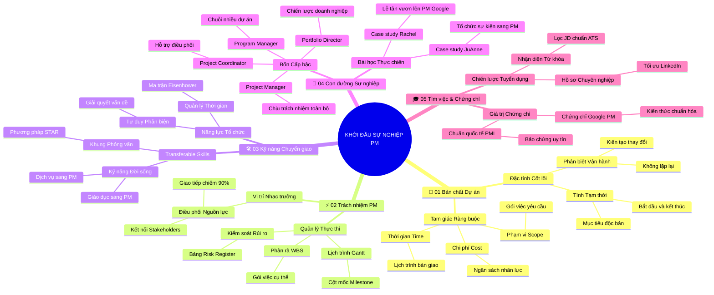

# 🧠 BẢN ĐỒ TƯ DUY TINH GỌN (5 TẦNG): Khởi Đầu Sự Nghiệp Quản Trị Dự Án (v2.4)

## 1. Sơ Đồ Tư Duy Trực Quan (Mermaid Mindmap Bám Sát 5 Phần Tài Liệu)

---

## 2. Cây Phân Cấp Tri Thức Gợi Nhớ Nhanh 5 Tầng (Active Recall Hierarchy)

- 📌 **[Phần I: Định Nghĩa & Bản Chất Cốt Lõi Của Dự Án]**
  - 🔹 *Bản chất Dự án:* ➔ *Tạm thời & Độc bản* ➔ *Phân biệt với Vận hành thường quy* ➔ *Kiến tạo sản phẩm mới*
  - 🔹 *Tam giác Ràng buộc:* ➔ *Scope (Phạm vi) - Time (Thời gian) - Cost (Chi phí)* ➔ *Bao bọc Chất lượng (Quality)* ➔ *Cân bằng động*
- 📌 **[Phần II: Vai Trò & Nhiệm Vụ Hàng Ngày Của PM]**
  - 🔹 *Nhạc trưởng Điều phối:* ➔ *Kết nối nguồn lực* ➔ *Giao tiếp 90% thời lượng* ➔ *Đồng bộ tiếng nói các bên liên quan*
  - 🔹 *Quản trị Thực thi:* ➔ *Phân rã WBS* ➔ *Thiết lập cột mốc Milestones trên Gantt* ➔ *Nhận diện sớm rủi ro qua Risk Register*
- 📌 **[Phần III: Bộ Kỹ Năng Quản Trị Có Thể Chuyển Đổi]**
  - 🔹 *Kỹ năng Cốt lõi:* ➔ *Kỹ năng tổ chức* ➔ *Quản lý thời gian theo Ma trận Eisenhower* ➔ *Tư duy phản biện giải quyết vấn đề*
  - 🔹 *Transferable Skills:* ➔ *Kinh nghiệm từ ngành nghề cũ* ➔ *Đóng gói năng lực quản trị* ➔ *Chứng minh qua phương pháp phỏng vấn STAR*
- 📌 **[Phần IV: Con Đường Sự Nghiệp & Bài Học Thực Tế]**
  - 🔹 *Bốn Nấc thang:* ➔ *Project Coordinator ➔ Project Manager ➔ Program Manager ➔ Portfolio Director*
  - 🔹 *Bài học Thực chiến:* ➔ *JuAnne (từ sự kiện sang PM)* ➔ *Rachel (từ lễ tân lên PM Google)* ➔ *Minh chứng cho Tư duy phát triển (Growth Mindset)*
- 📌 **[Phần V: Chiến Lược Tìm Kiếm Việc Làm & Chứng Chỉ]**
  - 🔹 *Chiến lược Tuyển dụng:* ➔ *Đọc hiểu bản chất công việc trong JD* ➔ *Từ khóa chuẩn ATS* ➔ *Tối ưu thương hiệu cá nhân trên LinkedIn*
  - 🔹 *Giá trị Chứng chỉ:* ➔ *Chứng chỉ Google PM & PMI PMBOK* ➔ *Chuẩn hóa ngôn ngữ chuyên ngành* ➔ *Gia tăng vượt bậc lợi thế cạnh tranh*

---

## 3. Bảng Neo Trí Nhớ Từ Khóa Vàng (Memory Anchor Cheat Sheet)

| Từ Khóa Cốt Lõi | Phần Trong Tài Liệu | Bản Chất / Vai Trò (3-5 từ) | Tín Hiệu Gợi Nhớ (Memory Trigger) |
| :--- | :--- | :--- | :--- |
| **Project** | Phần I | Nỗ lực tạm thời tạo kết quả duy nhất | Chuyến du lịch gia đình có ngày đi và ngày về |
| **Operations** | Phần I | Hoạt động lặp lại duy trì vận hành | Việc quét dọn nấu cơm rửa bát hàng ngày |
| **Triple Constraints** | Phần I | Tam giác ràng buộc Phạm vi, Thời gian, Chi phí | Kiềng ba chân giữ nồi cơm luôn thăng bằng |
| **Conductor Role** | Phần II | Nhạc trưởng điều phối mọi nguồn lực | Nhạc trưởng vung đũa chỉ huy cả dàn nhạc giao hưởng |
| **WBS (Work Breakdown)** | Phần II | Cấu trúc phân rã mục tiêu thành gói việc | Chặt một tảng gỗ lớn thành từng thanh củi nhỏ vừa bếp |
| **Risk Register** | Phần II | Bảng theo dõi và phòng ngừa rủi ro | Chiếc lốp xe dự phòng để sẵn trong cốp xe ô tô |
| **Transferable Skills** | Phần III | Kỹ năng chuyển hóa linh hoạt giữa các ngành | Ống kính vạn hoa nhìn cùng một cảnh ra nhiều hình ảnh mới |
| **STAR Method** | Phần III | Cấu trúc phỏng vấn Tình huống - Nhiệm vụ - Hành động - Kết quả | Bốn ngôi sao sáng định hướng trên bầu trời đêm |
| **Career Ladder** | Phần IV | Lộ trình 4 bậc từ Coordinator đến Portfolio | Bốn nhịp cầu thang vững chãi dẫn lên tầng cao nhất |
| **Growth Mindset** | Phần IV | Tư duy phát triển tin vào khả năng học hỏi | Mầm cây xanh vươn mình xuyên qua lớp sỏi đá cứng |
| **Job Description (JD)** | Phần V | Bản mô tả chi tiết trách nhiệm công việc | Bản đồ kho báu chỉ rõ các điểm cần khám phá |
| **Professional Cert** | Phần V | Chứng chỉ chuẩn hóa năng lực quốc tế | Tấm hộ chiếu thông hành cho phép nhập cảnh mọi quốc gia |
