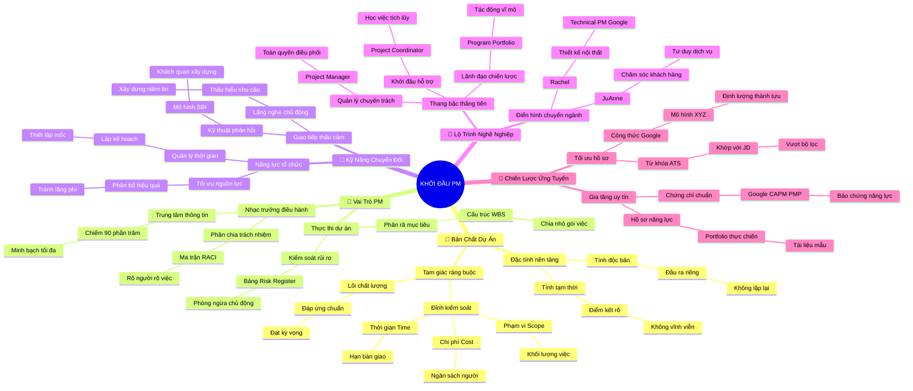

# 🧠 BẢN ĐỒ TƯ DUY TINH GỌN (4-5 TẦNG): HỌC PHẦN 1 - KHỞI ĐẦU SỰ NGHIỆP PM

## 1. Sơ Đồ Tư Duy Trực Quan (Mermaid Mindmap Tinh Gọn)

---

## 2. Cây Phân Cấp Tri Thức Gợi Nhớ Nhanh 4-5 Tầng (Active Recall Hierarchy)

- 📌 **[Phần I: Bản Chất & Định Nghĩa Cốt Lõi Của Dự Án]**
  - 🔹 *Tính tạm thời & Độc bản:* ➔ *Đặc tính dự án* ➔ *Có điểm kết thúc & Kết quả duy nhất* ➔ *Ví dụ: Tổ chức tiệc cưới vs. Nấu ăn thường ngày*
  - 🔹 *Tam giác ràng buộc:* ➔ *Scope - Time - Cost* ➔ *Bao bọc Chất lượng (Quality)* ➔ *Ví dụ: Sửa nhà đón Tết muốn đẩy nhanh hạn phải bù thêm tiền*

- 📌 **[Phần II: Vai Trò & Nhiệm Vụ Thường Nhật Của PM]**
  - 🔹 *Nhạc trưởng điều phối:* ➔ *Truyền thông 90% thời lượng* ➔ *Kết nối đa bên & Gỡ bỏ nút thắt* ➔ *Ví dụ: Chỉ huy dàn nhạc không kéo đàn nhưng giữ nhịp*
  - 🔹 *Quản lý tiến độ & Rủi ro:* ➔ *Phân rã cấu trúc WBS* ➔ *Bảng Risk Register & Mốc Milestone* ➔ *Ví dụ: Lên lịch ôn thi chia nhỏ từng chương và phòng cúp điện*

- 📌 **[Phần III: Bộ Kỹ Năng Quản Trị Chuyển Đổi Được]**
  - 🔹 *Năng lực tổ chức:* ➔ *Chuyển hỗn loạn thành trật tự* ➔ *Tối ưu lịch trình và ngân sách* ➔ *Ví dụ: Lên kế hoạch chuyến du lịch đại gia đình*
  - 🔹 *Giao tiếp thấu cảm:* ➔ *Lắng nghe chủ động* ➔ *Phản hồi theo mô hình SBI* ➔ *Ví dụ: Điều phối ban tổ chức hội đồng niên dung hòa sở thích*

- 📌 **[Phần IV: Lộ Trình Sự Nghiệp & Câu Chuyện Điển Hình]**
  - 🔹 *Thang bậc nghề nghiệp:* ➔ *Coordinator ➔ PM ➔ Program ➔ Portfolio* ➔ *Gia tăng phạm vi ảnh hưởng* ➔ *Ví dụ: Kỹ sư 1 tòa nhà ➔ Trưởng ban khu đô thị ➔ Giám đốc rót vốn*
  - 🔹 *Điển hình chuyển ngành:* ➔ *JuAnne & Rachel* ➔ *Khai phóng kỹ năng chuyển giao* ➔ *Ví dụ: Từ thiết kế nội thất vươn lên làm Tech PM tại Google*

- 📌 **[Phần V: Chiến Lược Ứng Tuyển & Chứng Chỉ Quốc Tế]**
  - 🔹 *Tối ưu CV & Bộ lọc ATS:* ➔ *Bóc tách từ khóa trong JD* ➔ *Viết CV định lượng theo công thức XYZ* ➔ *Ví dụ: Hoàn thành ERP trước 2 tuần tiết kiệm 15% chi phí*
  - 🔹 *Chứng chỉ & Portfolio:* ➔ *Google PM Certificate / CAPM / PMP* ➔ *Xây dựng bộ tài liệu dự án mẫu* ➔ *Ví dụ: Kiến trúc sư mang tập bản vẽ đi phỏng vấn*

---

## 3. Bảng Neo Trí Nhớ Từ Khóa Vàng (Memory Anchor Cheat Sheet)

| Từ Khóa Cốt Lõi | Phần Trong Tài Liệu | Bản Chất / Vai Trò (3-5 từ) | Tín Hiệu Gợi Nhớ (Memory Trigger) |
| :--- | :--- | :--- | :--- |
| **Temporary & Unique** | Phần I | Tạm thời và độc bản | Tiệc cưới có ngày tàn, khác việc nấu cơm mỗi ngày |
| **Triple Constraints** | Phần I | Tam giác ràng buộc vàng | Chiếc kiềng ba chân kéo một chân hai chân kia rung rinh |
| **Orchestra Conductor** | Phần II | Nhạc trưởng giữ nhịp chung | Người chỉ huy vung đũa không kéo vĩ cầm |
| **WBS (Phân rã việc)** | Phần II | Chia nhỏ việc thành lát | Cắt chiếc bánh pizza khổng lồ thành từng miếng vừa ăn |
| **Risk Register** | Phần II | Bảng dự báo rủi ro | Chiếc ô che mưa cất sẵn trong cốp xe máy |
| **Transferable Skills** | Phần III | Kỹ năng chuyển đổi linh hoạt | Bộ dao đa năng Thụy Sĩ dùng được trong mọi hoàn cảnh |
| **Active Listening** | Phần III | Lắng nghe chủ động thấu cảm | Đôi tai biết đặt mình vào tâm tư người nói |
| **PM Progression** | Phần IV | Thang bậc từ nhỏ đến lớn | Từ thuyền trưởng tàu nhỏ đến tư lệnh đại hạm đội |
| **JuAnne & Rachel** | Phần IV | Thành công từ trái ngành | Hạt mầm chuyển đổi nở hoa rực rỡ tại Google |
| **XYZ Formula** | Phần V | Công thức viết CV chuẩn | Thước đo thành tựu bằng con số biết nói |
| **Project Portfolio** | Phần V | Bộ hồ sơ năng lực thực | Tập bản vẽ thiết kế thuyết phục mọi nhà thầu |
